# Ratel Vault — 技术架构

> 🦡 **架构是港口，不是道路。Engine 定义 Port，Adapter 实现 Port，UI 形态是可换选项。**

本文档回答**怎么做、长什么样、怎么组织**。
产品形态（做什么、能用上什么）请见 [README.md](file:///Users/golddream/code/git-public/Ratel-CLI/README.md)。

---

## 1. 架构原则

### 1.1 核心公式

```
Agent = Model + Harness
```

Ratel Vault 是 Harness 的一种实例化 —— 专门为 **Obsidian vault** 这个领域而做。

### 1.2 六边形架构（Hexagonal / Ports & Adapters）

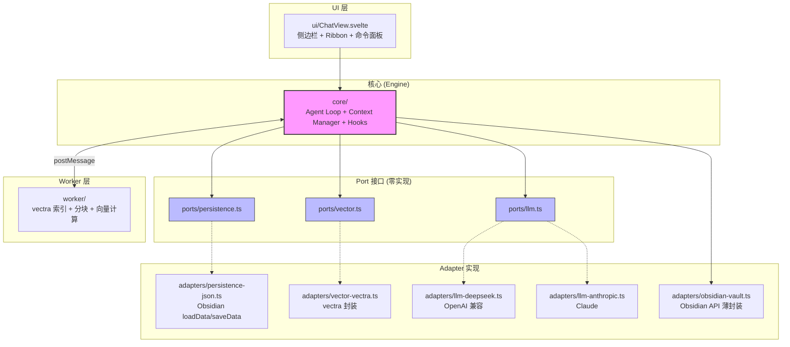

**规则**：
- **Engine（核心）**：定义 Port 接口，**不知道** Adapter 存在
- **Adapter（适配器）**：实现 Port，可替换
- **测试**永远针对 Engine 和 Port，不针对 Adapter

### 1.3 分层架构

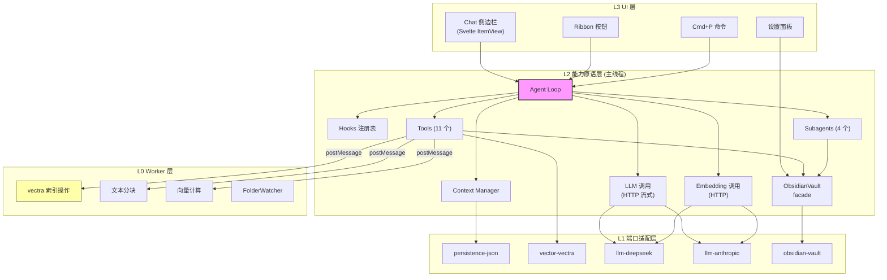

### 1.4 设计原则（5 条铁律）

1. **Engine 零外部依赖** — `core/` 不 import 任何 persistence / 模型 SDK / Obsidian API
2. **重活儿走 Worker** — 索引 / 分块 / 向量计算在 Worker Thread，**HTTP 请求留在主线程**
3. **Hooks 是治理层** — pre/post-write 是核心，不是装饰
4. **Subagent 是能力隔离** — Indexer / Librarian / Reviewer / Curator 互不污染
5. **测试 = Engine + Port** — 永远不针对 Adapter 写业务测试

---

## 2. 主线程 vs Worker 分工

### 2.1 分工总览

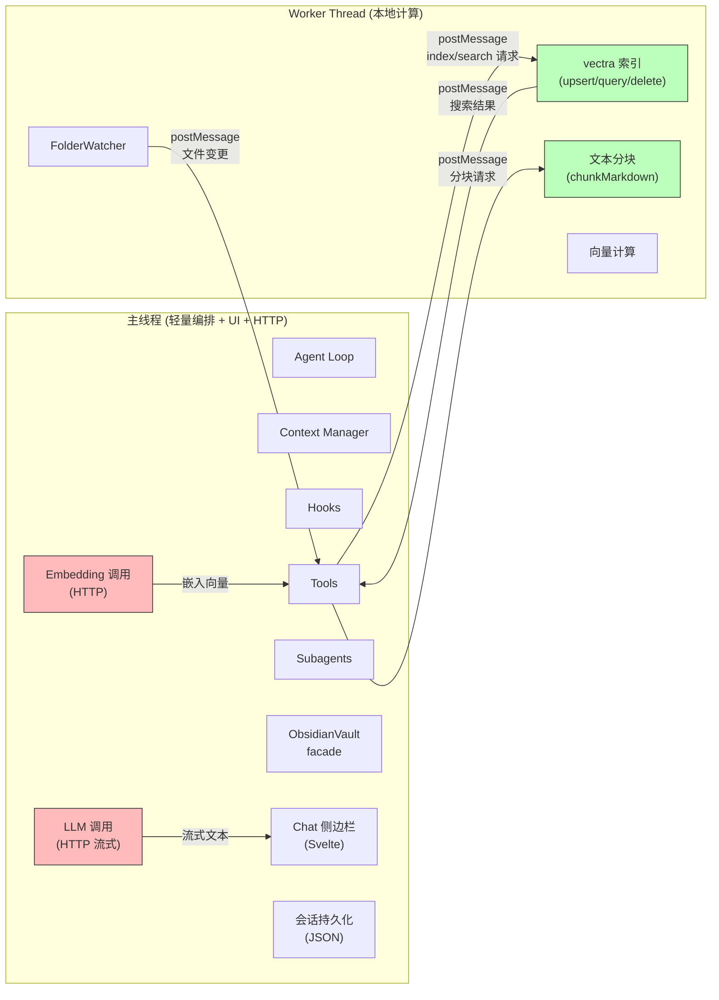

### 2.2 主线程职责

| 职责 | 说明 | 依赖 |
|---|---|---|
| Agent Loop | 编排 tool call、管理对话步数 | core/ |
| Context Manager | 组装 system prompt + 历史 + 检索结果 | core/ |
| Hooks 注册表 | pre/post/on- 钩子执行 | core/ |
| Tools 调度 | 转发到 Worker 或调 ObsidianVault | tools/ |
| Subagent 调度 | Indexer / Librarian / Reviewer / Curator | subagents/ |
| LLM 调用 | HTTP 流式请求（DeepSeek / Claude） | adapters/llm-* |
| Embedding 调用 | HTTP 请求（BGE-M3） | adapters/llm-* |
| ObsidianVault | Obsidian API 薄封装 | adapters/obsidian-vault.ts |
| Chat 侧边栏 | Svelte 渲染 + 流式输出 | ui/ |
| 会话持久化 | JSON via loadData/saveData | adapters/persistence-json.ts |

### 2.3 Worker Thread 职责

| 职责 | 说明 | 依赖 |
|---|---|---|
| vectra 索引操作 | upsert / query / delete | vectra |
| 文本分块 | Markdown → 500 token 块 | 自实现 |
| 向量计算 | 余弦相似度排序 | vectra |
| FolderWatcher | 监听 vault 文件变更 | vectra |

**关键约束**：Worker 内**不做 HTTP 请求**（没有 fetch），**不 import Obsidian API**。

### 2.4 通信协议（主线程 ⇄ Worker）

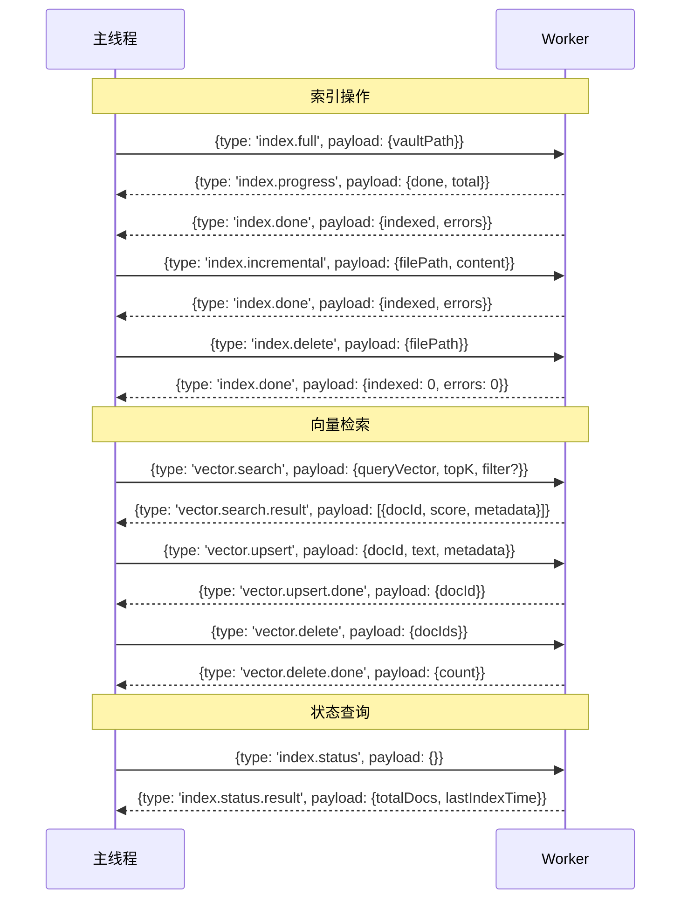

**TypeScript 类型定义**：

```typescript
// 主线程 → Worker
type WorkerRequest =
  | { type: 'index.full'; payload: { vaultPath: string } }
  | { type: 'index.incremental'; payload: { filePath: string; content: string } }
  | { type: 'index.delete'; payload: { filePath: string } }
  | { type: 'vector.search'; payload: { queryVector: number[]; topK: number; filter?: SearchFilter } }
  | { type: 'vector.upsert'; payload: { docId: string; text: string; metadata: Record<string, unknown> } }
  | { type: 'vector.delete'; payload: { docIds: string[] } }
  | { type: 'index.status'; payload: {} };

// Worker → 主线程
type WorkerResponse =
  | { type: 'index.progress'; payload: { done: number; total: number } }
  | { type: 'index.done'; payload: { indexed: number; errors: number } }
  | { type: 'vector.search.result'; payload: VectorSearchResult[] }
  | { type: 'vector.upsert.done'; payload: { docId: string } }
  | { type: 'vector.delete.done'; payload: { count: number } }
  | { type: 'index.status.result'; payload: { totalDocs: number; lastIndexTime: number } }
  | { type: 'error'; payload: { code: string; message: string } };

interface VectorSearchResult {
  docId: string;
  score: number;
  metadata: Record<string, unknown>;
}

interface SearchFilter {
  tags?: string[];
  pathPrefix?: string;
}
```

---

## 3. 目录结构

### 3.1 完整目录

```
src/
  main.ts                          # 插件入口 (RatelVaultPlugin 类)
  settings.ts                      # 设置面板 (RatelVaultSettings + SettingTab)
  types.ts                         # 全局类型定义

  core/                            # Engine 核心
    agent-loop.ts                  #   Agent Loop (编排 tool call)
    context-manager.ts             #   Context Manager (组装上下文)
    hooks.ts                       #   Hooks 注册表 + 执行

  ports/                           # Port 接口 (零实现, 只定义契约)
    persistence.ts                 #   Persistence 接口
    vector.ts                      #   VectorStore 接口
    llm.ts                         #   LLMClient 接口

  adapters/                        # Adapter 实现
    obsidian-vault.ts              #   Obsidian API 薄封装 (TS, ~8 方法)
    persistence-json.ts            #   Obsidian loadData/saveData
    vector-vectra.ts               #   vectra LocalDocumentIndex 封装
    llm-deepseek.ts                #   DeepSeek (OpenAI 兼容 SDK)
    llm-anthropic.ts               #   Claude (Anthropic SDK)

  tools/                           # Vault 工具集 (11 个)
    search-vault.ts                #   全文 + 向量搜索
    read-note.ts                   #   读取笔记 (frontmatter/链接/反链)
    follow-backlinks.ts            #   双向链接展开
    create-note.ts                 #   新建笔记 (带 frontmatter 模板)
    update-note.ts                 #   增量更新
    tag-note.ts                    #   打标签 / 自动标签
    suggest-links.ts               #   建议 3-5 个语义链接 (带置信度)
    summarize-note.ts              #   生成单篇摘要
    index-status.ts                #   索引健康报告
    find-orphans.ts                #   查找无入链笔记
    weekly-digest.ts               #   每周主题综述

  subagents/                       # 4 个 Subagent
    indexer.ts                     #   维护向量索引 (文件变更 + 定时重检)
    librarian.ts                   #   维护语义链接 (post-write hook)
    reviewer.ts                    #   发现孤儿/弱链 (每周/手动)
    curator.ts                     #   生成主题综述 (每周/手动)

  ui/                              # Svelte 视图
    ChatView.svelte                #   Chat 侧边栏组件
    ChatView.ts                    #   ItemView 注册 + Svelte mount/unmount

  worker/                          # Worker Thread
    index.ts                       #   Worker 入口 (消息分发)
    indexer.ts                     #   vectra 索引操作
    chunker.ts                     #   Markdown 分块 (500 token + 100 overlap)

  utils/                           # 工具函数
    hash.ts                        #   SHA-256 content hash
    debounce.ts                    #   防抖
```

### 3.2 依赖关系

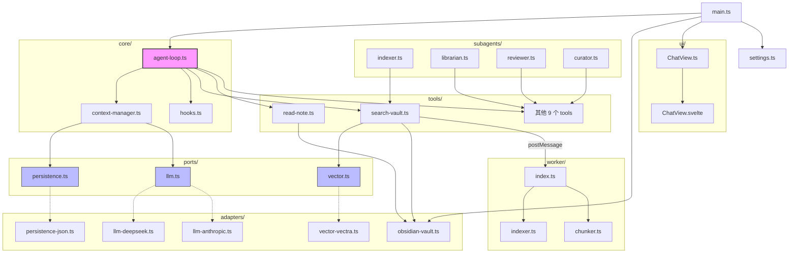

**核心铁律**：`core/` 永远是叶子，**任何模块都不反向依赖 core/**。

---

## 4. 端口接口契约（Port Contract）

### 4.1 Persistence Port

```typescript
// ports/persistence.ts
export interface Persistence {
  sessions: SessionRepository;
  notes: NoteMetaRepository;
  hooks: HookLogRepository;
}

export interface SessionRepository {
  get(id: string): Promise<Session | null>;
  upsert(session: Session): Promise<void>;
  list(limit?: number): Promise<Session[]>;
  delete(id: string): Promise<void>;
}

export interface NoteMetaRepository {
  get(path: string): Promise<NoteMeta | null>;
  upsert(meta: NoteMeta): Promise<void>;
  listByPath(prefix: string): Promise<NoteMeta[]>;
  delete(path: string): Promise<void>;
}

export interface HookLogRepository {
  append(log: HookLogEntry): Promise<void>;
  list(limit?: number): Promise<HookLogEntry[]>;
}

export interface Session {
  id: string;
  title: string;
  messages: ChatMessage[];
  createdAt: number;
  updatedAt: number;
}

export interface NoteMeta {
  path: string;
  hash: string;
  mtime: number;
  tags?: string[];
  links?: string[];
  backlinks?: string[];
  frontmatter?: Record<string, unknown>;
}

export interface HookLogEntry {
  phase: string;
  tool: string;
  timestamp: number;
  result: 'pass' | 'fail' | 'skip';
  message?: string;
}
```

### 4.2 Vector Port

```typescript
// ports/vector.ts
export interface VectorStore {
  upsert(docId: string, text: string, metadata?: Record<string, unknown>): Promise<void>;
  search(queryVector: number[], topK: number, filter?: SearchFilter): Promise<VectorSearchResult[]>;
  delete(docIds: string[]): Promise<number>;
  status(): Promise<IndexStatus>;
}

export interface VectorSearchResult {
  docId: string;
  score: number;
  metadata: Record<string, unknown>;
}

export interface SearchFilter {
  tags?: string[];
  pathPrefix?: string;
}

export interface IndexStatus {
  totalDocs: number;
  lastIndexTime: number;
  isIndexing: boolean;
}
```

### 4.3 LLM Port

```typescript
// ports/llm.ts
export interface LLMClient {
  chat(req: ChatRequest): AsyncIterable<ChatDelta>;
  embed(texts: string[]): Promise<number[][]>;
  countTokens(text: string): number;
}

export interface ChatRequest {
  messages: ChatMessage[];
  tools?: ToolDefinition[];
  maxSteps?: number;
}

export interface ChatMessage {
  role: 'system' | 'user' | 'assistant' | 'tool';
  content: string;
  toolCallId?: string;
  toolName?: string;
}

export interface ChatDelta {
  text: string;
  toolCall?: ToolCall;
}

export interface ToolCall {
  id: string;
  name: string;
  args: Record<string, unknown>;
}

export interface ToolDefinition {
  name: string;
  description: string;
  parameters: Record<string, unknown>;
}
```

---

## 5. ObsidianVault Facade

薄封装，只包我们实际调用的 ~8 个 Obsidian API。TypeScript 完整类型。

```typescript
// adapters/obsidian-vault.ts
import { App, CachedMetadata, TFile } from 'obsidian';

export class ObsidianVault {
  constructor(private app: App) {}

  /** 读取文件内容 */
  async readFile(path: string): Promise<string> {
    const file = this.app.vault.getAbstractFileByPath(path);
    if (!file || !(file instanceof TFile)) throw new Error(`File not found: ${path}`);
    return this.app.vault.read(file);
  }

  /** 写入文件（存在则修改，不存在则创建） */
  async writeFile(path: string, content: string): Promise<void> {
    const file = this.app.vault.getAbstractFileByPath(path);
    if (file instanceof TFile) {
      await this.app.vault.modify(file, content);
    } else {
      const dir = path.substring(0, path.lastIndexOf('/'));
      if (dir && !this.app.vault.getAbstractFileByPath(dir)) {
        await this.app.vault.createFolder(dir);
      }
      await this.app.vault.create(path, content);
    }
  }

  /** 获取反向链接 */
  getBacklinks(path: string): Map<string, unknown> {
    const file = this.app.vault.getAbstractFileByPath(path);
    if (!file) return new Map();
    return this.app.metadataCache.getBacklinksForFile(file as TFile)?.data ?? new Map();
  }

  /** 获取文件元数据（frontmatter / links / tags） */
  getMetadata(path: string): CachedMetadata | null {
    const file = this.app.vault.getAbstractFileByPath(path);
    if (!file) return null;
    return this.app.metadataCache.getFileCache(file as TFile);
  }

  /** 监听文件修改 */
  onFileModify(callback: (path: string) => void): () => void {
    const ref = this.app.vault.on('modify', (file) => callback(file.path));
    return () => this.app.vault.offref(ref);
  }

  /** 监听文件创建 */
  onFileCreate(callback: (path: string) => void): () => void {
    const ref = this.app.vault.on('create', (file) => callback(file.path));
    return () => this.app.vault.offref(ref);
  }

  /** 监听文件删除 */
  onFileDelete(callback: (path: string) => void): () => void {
    const ref = this.app.vault.on('delete', (file) => callback(file.path));
    return () => this.app.vault.offref(ref);
  }

  /** 监听文件重命名 */
  onFileRename(callback: (path: string, oldPath: string) => void): () => void {
    const ref = this.app.vault.on('rename', (file, oldPath) => callback(file.path, oldPath));
    return () => this.app.vault.offref(ref);
  }

  /** 列出所有 Markdown 文件路径 */
  listMarkdownFiles(): string[] {
    return this.app.vault.getMarkdownFiles().map((f) => f.path);
  }
}
```

**设计意图**：
- **可测试**：mock ObsidianVault 即可测试 Tools / Subagents，不用开 Obsidian
- **可追踪**：所有 Obsidian 调用走一个文件，API 变了只改一处
- **不过度**：不做成 Port 接口（不会有第二个 Obsidian），就是简单 facade

---

## 6. 数据流

### 6.1 一次完整问答

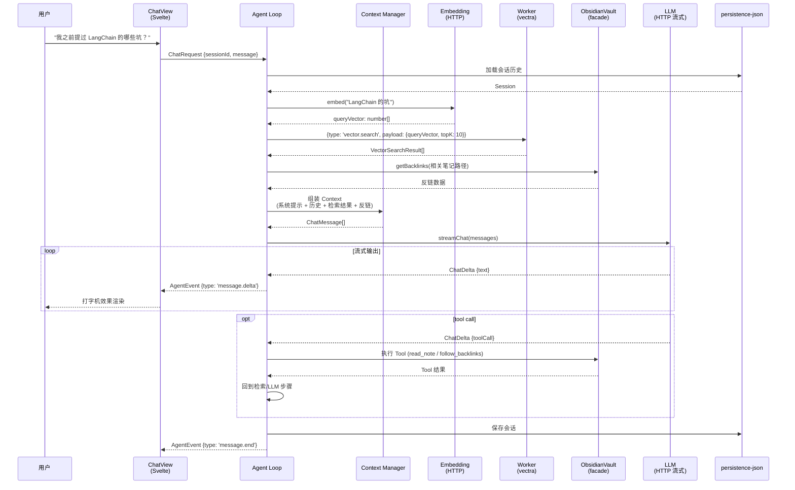

### 6.2 增量索引流程

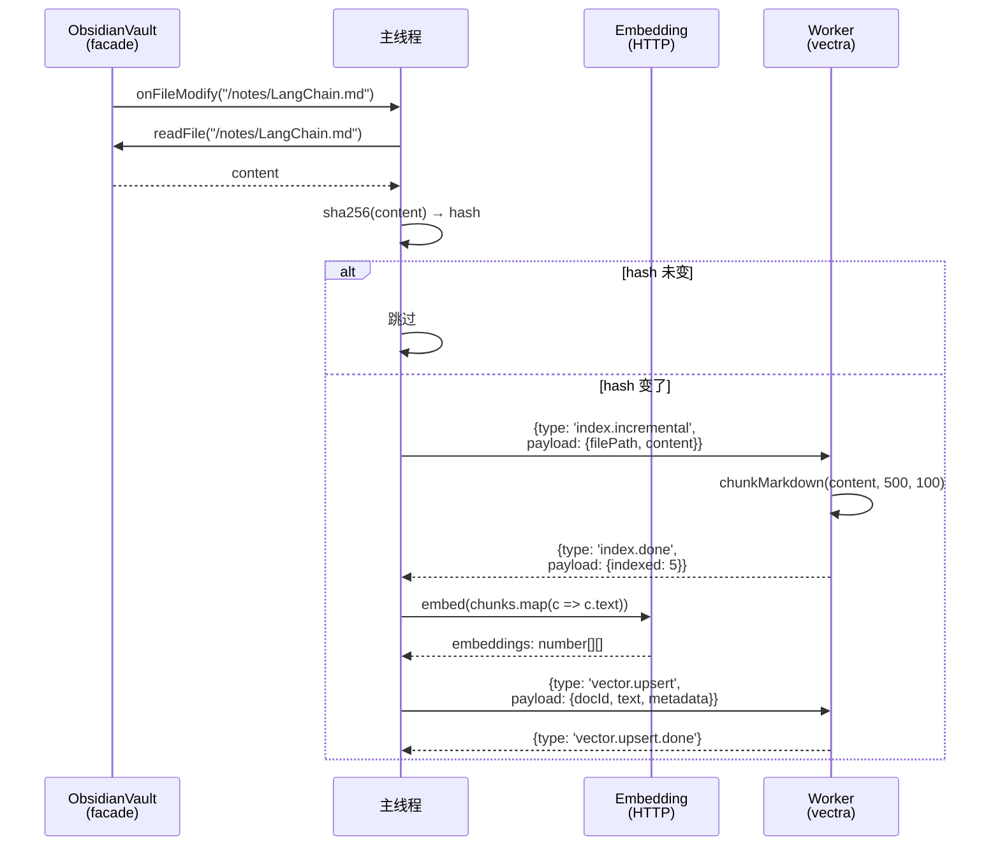

### 6.3 首扫索引流程

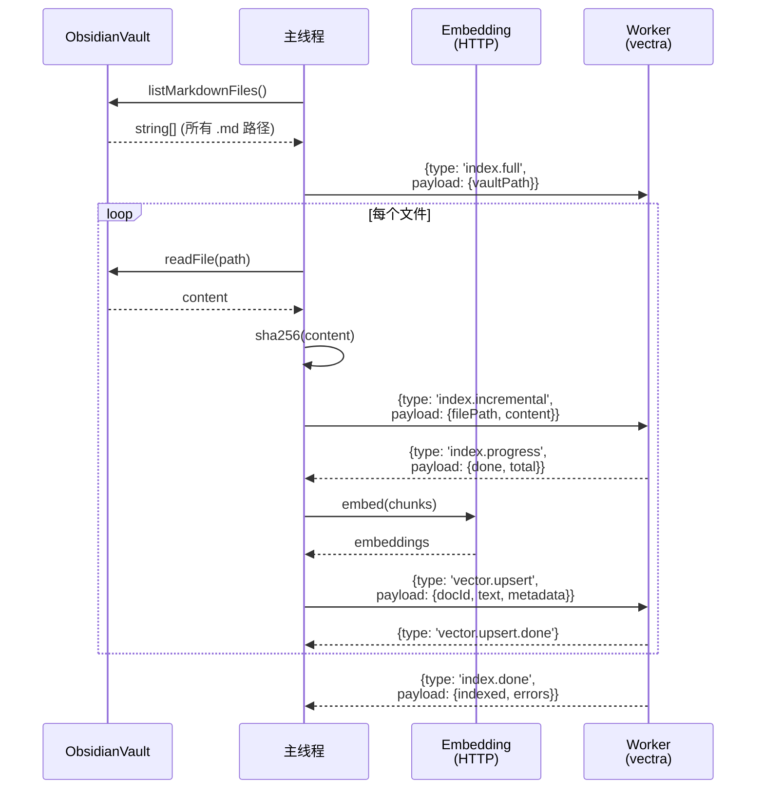

---

## 7. 存储设计

### 7.1 三层存储

| 层 | 内容 | 位置 | 实现 | 理由 |
|---|---|---|---|---|
| **FS** | Markdown 原文 | `vault/`（用户原 vault） | 不动 | **不能动用户数据** |
| **JSON** | 会话 / 设置 / 钩子日志 / 笔记元数据 | `data.json`（Obsidian `loadData/saveData`） | 零依赖 | 轻量 / Obsidian 原生 / 不用解决 WASM 加载 |
| **vectra** | 向量 + 文档索引 + 块级嵌入 | `.obsidian/plugins/ratel-vault/index/` | vectra 文件持久化 | 零 native / 内置持久化 / 增量友好 |

### 7.2 存储架构图

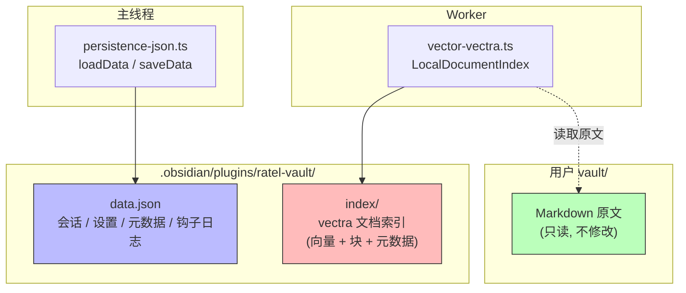

### 7.3 Content-Hash 双键策略

- **path**：人类可读 ID（`notes/LangChain.md`）
- **content hash**（SHA-256）：检测内容变更
- **两者组合** → vault 操作 100% 幂等

```typescript
// utils/hash.ts
export async function sha256(content: string): Promise<string> {
  const encoder = new TextEncoder();
  const data = encoder.encode(content);
  const hash = await crypto.subtle.digest('SHA-256', data);
  return Array.from(new Uint8Array(hash))
    .map((b) => b.toString(16).padStart(2, '0'))
    .join('');
}
```

---

## 8. Harness 内部组件

### 8.1 Agent Loop

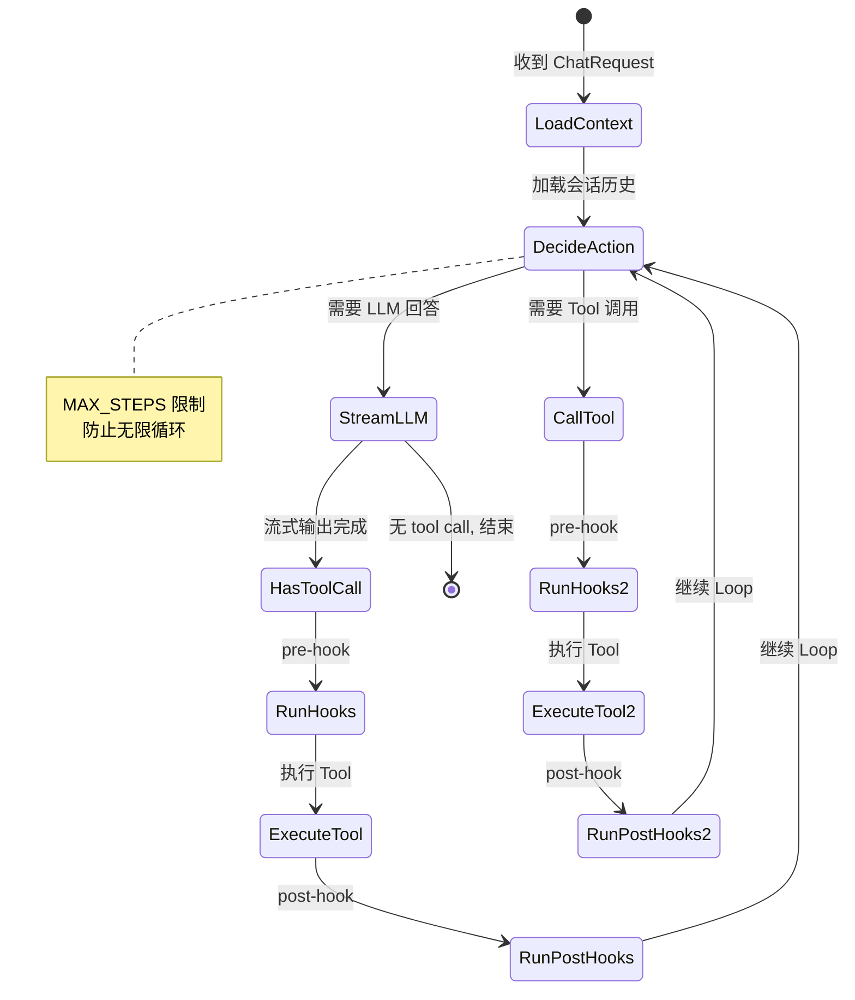

```typescript
// core/agent-loop.ts
const MAX_STEPS = 10;

async function* agentLoop(
  req: ChatRequest,
  ctx: ContextManager,
  llm: LLMClient,
  tools: ToolRegistry,
  hooks: HookRegistry,
): AsyncIterable<AgentEvent> {
  await ctx.load(req.sessionId);

  for (let step = 0; step < MAX_STEPS; step++) {
    yield { type: 'message.start', payload: { role: 'assistant' as const } };

    const stream = llm.chat({ messages: ctx.toMessages(), tools: tools.definitions() });
    let toolCall: ToolCall | null = null;

    for await (const delta of stream) {
      yield { type: 'message.delta', payload: { text: delta.text } };
      if (delta.toolCall) toolCall = delta.toolCall;
    }

    if (!toolCall) break;

    // Pre-hook
    await hooks.run('pre-write', toolCall);

    // Execute tool
    const result = await tools.execute(toolCall);
    yield { type: 'tool.result', payload: { name: toolCall.name, result } };

    // Post-hook
    await hooks.run('post-write', toolCall);

    ctx.addToolResult(toolCall, result);
  }

  yield { type: 'message.end', payload: { tokens: ctx.tokenCount() } };
  await ctx.save();
}
```

### 8.2 4 个 Subagent

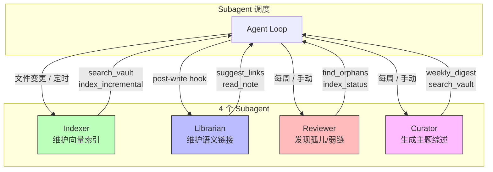

| Subagent | 入口 Tool | 调度方式 | 说明 |
|---|---|---|---|
| `Indexer` | `index_incremental` | vault 事件 + 定时重检 | 监听文件变更，触发增量嵌入 |
| `Librarian` | `suggest_links` | `post-write` hook + 手动 | 写完笔记后建议语义链接 |
| `Reviewer` | `find_orphans` | 每周定时 + 手动 | 扫描孤儿笔记和弱链 |
| `Curator` | `weekly_digest` | 每周定时 + 手动 | 生成主题综述报告 |

### 8.3 Hooks 注册表

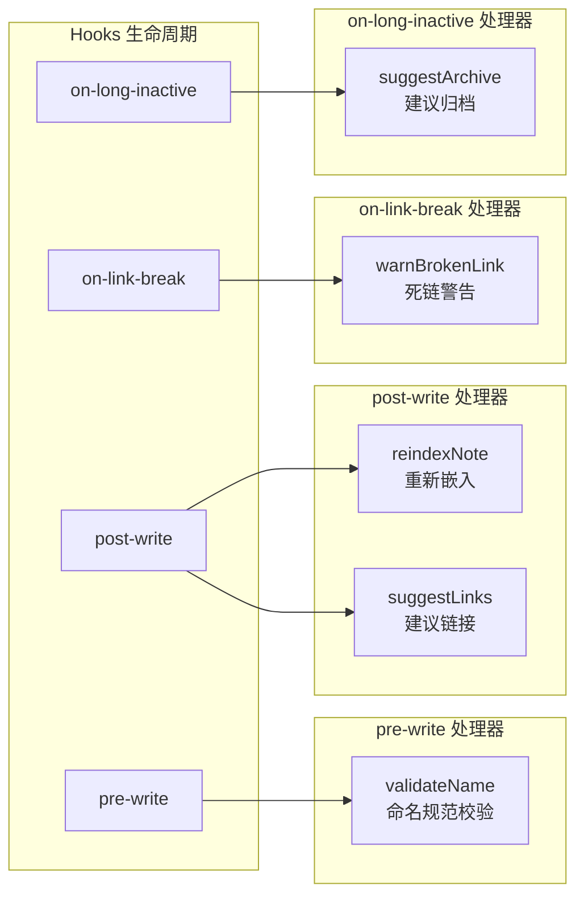

```typescript
// core/hooks.ts
export class HookRegistry {
  private handlers = new Map<string, Array<(toolCall: ToolCall) => Promise<void>>>();

  register(phase: string, handler: (toolCall: ToolCall) => Promise<void>): void {
    const list = this.handlers.get(phase) ?? [];
    list.push(handler);
    this.handlers.set(phase, list);
  }

  async run(phase: string, toolCall: ToolCall): Promise<void> {
    const list = this.handlers.get(phase) ?? [];
    for (const handler of list) {
      await handler(toolCall);
    }
  }
}
```

---

## 9. 关键技术决策

| 决策 | 选型 | 理由 |
|---|---|---|
| 形态 | 纯 Obsidian 插件 | 深度结合 Obsidian API，零额外部署 |
| 重活儿 | Worker Threads | 主线程零阻塞，Obsidian 不卡 |
| UI 框架 | Svelte 5 | 轻量、Obsidian 生态主流、官方推荐 |
| 向量库 | vectra | 零 native / Electron 支持 / 内置文档索引+分块+混合检索+FolderWatcher / 33k 周下载 |
| 元数据 | JSON (Obsidian loadData/saveData) | 零依赖 / 不用解决 Worker 里 WASM 加载问题 |
| 嵌入模型 | BGE-M3 | 中文好、免费、MTEB 强 |
| 聊天模型（默认） | DeepSeek-V3 | 便宜、中文好、可切 Claude |
| Worker HTTP | 主线程做 HTTP | Worker 里没有 fetch / XMLHttpRequest |
| 包结构 | 1 包 + 目录模块 | Obsidian 插件不需要独立发布 / 生态惯例 |
| Obsidian API | ObsidianVault facade (TS) | 可测试 / 可追踪 / 变了只改一处 |
| 文件监听 | Obsidian `app.vault.on()` | 比 chokidar 更准（Obsidian 内部事件） |
| 索引策略 | 增量 + SHA-256 hash | 1k 笔记首扫 5-10 分钟，增量毫秒级 |
| 块大小 | 500 token + 100 overlap | 召回粒度平衡 |
| 插件分发 | BRAT 自部署 | 绕开官方市场审核周期 |
| Worker 路径 | `path.join(__dirname, 'worker.js')` | CJS 环境下 __dirname 可用 |

---

## 10. 风险点与缓解

| 风险 | 严重度 | 缓解 |
|---|---|---|
| Obsidian 插件审核周期长 | 低 | 先 BRAT 自部署，成熟后再提交官方市场 |
| vectra 在 Worker 里跑 | 低 | 纯 JS 无问题；FolderWatcher 在主线程初始化后传给 Worker |
| 增量索引边界混乱 | 中 | path + content hash 双键 + 幂等保证 |
| LLM 过度链接 | 中 | 置信度阈值（>0.75）+ 用户确认 |
| vault > 10k 篇 | 中 | Worker 限速 + 后台队列 + 分批嵌入 |
| 首扫时间 | 低 | 1k 笔记 ≈ 5-10 分钟（含网络抖动），后台执行不阻塞 |
| data.json 膨胀 | 低 | 会话历史只保留最近 N 条 + 摘要压缩 |
| Obsidian API breaking change | 低 | ObsidianVault facade 隔离，变了只改一处 |

---

## 11. 不做什么（架构层面）

- ❌ 不做独立 Node 服务
- ❌ 不做 WebSocket / HTTP 传输层
- ❌ 不做 Web GUI
- ❌ 不用 native 模块（better-sqlite3 / LanceDB）
- ❌ 不在 Engine 内 import 任何 persistence / 模型 SDK / Obsidian API
- ❌ 不做完整 ReAct Planner（用裸 Loop）
- ❌ 不做分布式（单 Obsidian 实例单用户）
- ❌ 不做 npm scope 多包（用目录模块代替）
