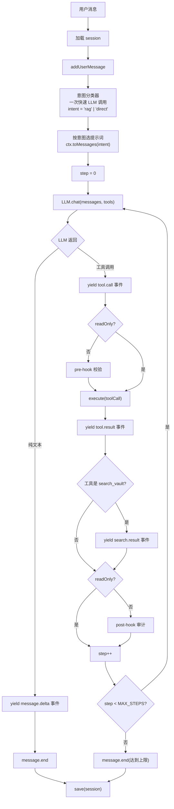
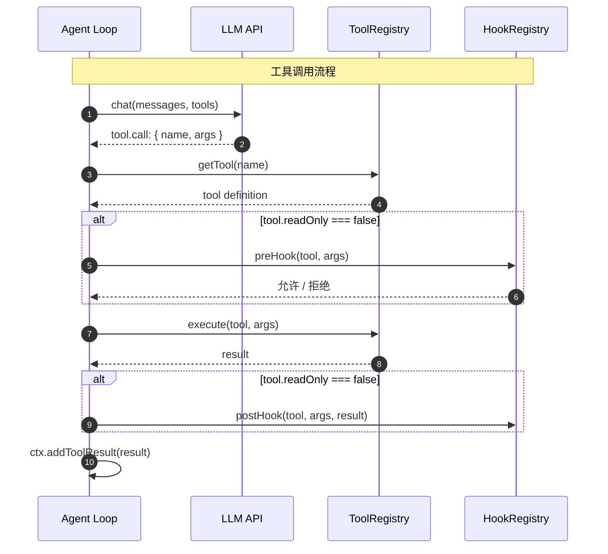
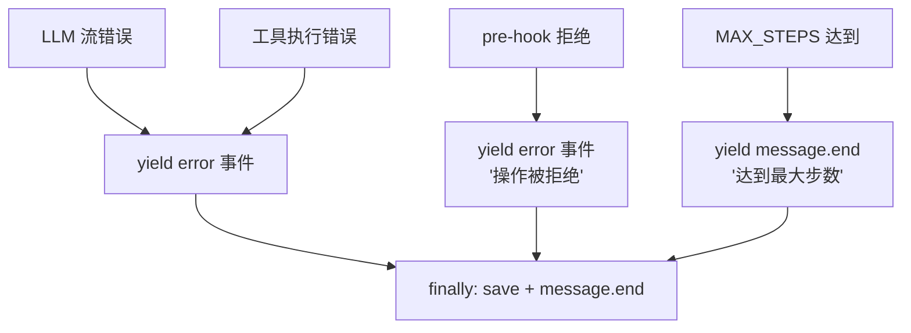

# Agent 主循环

> 领域:Agent | 思考 → 调工具 → 拿结果 → 生成回答

---

## 1. 职责

驱动一次完整的对话轮:接收用户消息,循环调用 LLM 和工具,直到生成最终回答。是 Chat 体验的引擎。

**不做的事**:
- 不负责 UI 渲染(属于 [chat](chat.md))
- 不负责上下文组织(属于 [context-manager](context-manager.md))
- 不负责工具注册(属于 [tools](tools.md))

---

## 2. 设计原则

### 2.1 单步循环,上限保护

**决策**:Agent Loop 是单步循环,每轮产生一段 assistant 回复 + (可选)一次工具调用,最多 MAX_STEPS 轮。

**原因**:
- 防止工具调用陷入死循环(LLM 反复调同一工具)
- MAX_STEPS=10 是经验上限,正常对话 1-3 轮即可完成

### 2.2 错误不逃逸,转事件

**决策**:LLM 流错误和工具执行错误一律转 `error` 事件,不向上抛。

**原因**:
- UI 需要展示错误,不是让整个对话崩溃
- session 保存和 `message.end` 事件必须始终执行(放在 `finally` 块)

### 2.3 写工具触发 Hook,读工具不触发

**决策**:工具调用只对"写工具"(`readOnly !== true`)触发 pre/post hook。

**原因**:
- 读操作(search_vault / read_note)无副作用,不需要治理
- 写操作(create_note / edit_note)有副作用,需要 pre-hook 校验 + post-hook 审计

---

## 3. 主循环流程



**意图分类器**(新增):在 `addUserMessage` 之后、`LLM.chat` 之前插入。用一次快速 LLM 调用(maxTokens=5)判断用户消息是否需要走 RAG 工作流,按结果选择系统提示词(`rag` → RAG 引导提示词,`direct` → 基础提示词)。详见 [context-manager.md §4](context-manager.md)。

**search.result 事件**(新增):`search_vault` 工具返回后发 `search.result` 事件,ChatView 渲染搜索结果卡片。详见 [chat.md](chat.md)。

---

## 4. 步骤详解

### 4.1 初始化

```
1. ctx.load(sessionId)          — 加载或创建 session
2. ctx.addUserMessage(msg)      — 用户消息压入上下文
3. classifyIntent(msg) → intent — 一次快速 LLM 调用,判断意图('rag' | 'direct')
4. ctx.toMessages(intent)       — 按意图选择系统提示词,组装 messages
```

### 4.2 单步循环

每轮:

```
1. yield message.start
2. LLM.chat(messages, tools) → 流式响应
3. 累积文本 + 检测工具调用
4. if 纯文本:
     yield message.delta 事件 → 结束
   if 工具调用:
     yield tool.call 事件
     执行工具 → yield tool.result 事件
     ctx.addToolResult(result)
     继续下一轮
```

### 4.3 终止条件

| 条件 | 行为 |
|---|---|
| LLM 返回纯文本(无工具调用) | 正常结束 |
| step >= MAX_STEPS | 强制结束,提示用户 |
| LLM 流错误 | yield error 事件,继续 finally |
| 工具执行错误 | yield error 事件,继续下一轮 |

---

## 5. 工具调用协议



**工具调用格式**(LLM function calling):

```typescript
interface ToolCall {
  id: string;                          // 调用唯一 ID
  name: string;                        // 工具名
  args: Record<string, unknown>;       // 参数对象(LLM 解析后传入)
}
```

---

## 6. 错误处理



**关键**:`try / finally` 确保 `save()` 和 `message.end` 始终执行,无论成功或失败。

---

## 7. 边界

| 与...的接口 | 方向 | 说明 |
|---|---|---|
| [chat](chat.md) | 被包含 | Chat 是门面,Agent Loop 是引擎 |
| [context-manager](context-manager.md) | 依赖 | 消息累积 + session 管理 + 动态提示词 |
| [tools](tools.md) | 依赖 | 工具发现 + 执行 |
| [llm/model-management](../llm/model-management.md) | 依赖 | LLMClient.chat() + 意图分类 LLM 调用 |
| [llm/streaming](../llm/streaming.md) | 依赖 | SSE 流式解析 |
