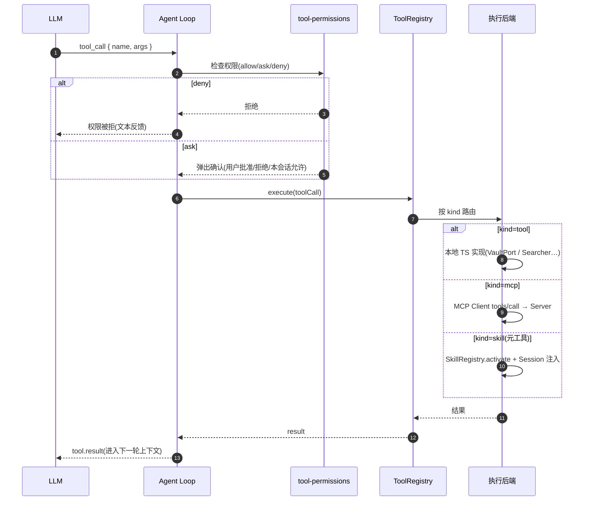

# Agent 能力面(Capability Surface)

> 领域:Agent | 能力池与工具生命周期
> 统一意图选择(能力池)→ 按 kind 路由执行链路 → 注册 / 发现 / 执行 / 变更 / 销毁全生命周期
>
> 决策依据:[ADR-015 能力池](../../adr/2026-08-03-capability-pool.md) · [ADR-014 MCP 平台](../../adr/2026-08-03-mcp-host-platform.md) · [ADR-012 Skill 激活](../../adr/2026-07-23-skill-activation-claude-aligned.md)

本文档回答:**Agent 的「能力」从哪来、模型怎么看见、怎么被选中执行、怎么变更与销毁。** 是所有工具类文档([tools](tools.md)、[skills 相关 ADR](../../adr/2026-07-06-skill-mechanism.md)、未来 MCP 文档)的公共入口。

---

## 0. 为什么这么做(能力池 + 单 Registry 的红利)

把「统一能力池 + 单一 ToolRegistry + 统一执行流水线」作为架构,换来的不只是「模型好选」,而是**新能力供给方接入时,治理机制零新增代码**:

| 红利 | 原理 |
|---|---|
| **授权一次写,处处生效** | 所有 `tool_call` 在 Agent Loop 过**同一个**权限门(trustMode / allow-ask-deny / 会话 grants / 确认 Modal)。MCP 工具进 Registry 后自动走这道门,**不用给 MCP 单写确认 UI**;前缀规则(`mcp__*` 默认 ask)复用现有 `toolPermissions` |
| **钩子统一** | `pre-tool-use` / `post-tool-use` / `post-tool-failure` 对内置、MCP、未来 Skill scripts 一视同仁(审计、日志、治理不用重搭) |
| **事件流统一** | `tool.call` / `tool.result` 直接进 UI 时间线,MCP 工具和内置工具**长一个样** |
| **错误降级统一** | `TOOL_ERROR` + try/catch 降级写一次,所有供给方共享 |
| **执行语义统一** | `Tool{definition, execute, readOnly}` 一个形状;`execute` 后端是本地 TS 还是 MCP `tools/call`,对 Agent Loop 透明 |

**一句话:** 能力池管「发现与选择」;ToolRegistry + Agent Loop 的统一执行流水线管「授权、钩子、事件、降级」。新增一类供给方(MCP、Skill scripts、别的)只需变成 `Tool` 注册进来,**治理面零增量**。

> 唯一有意保留的「执行旁路」是 **Skill 指令注入** — 它通过元工具改 Session,不产出「回模型的结果」(ADR-012)。这是设计选择,不是漏洞:统一执行器管**可执行面**,Skill 指令面仍是指令面;两者在池里统一被发现,执行上本就两回事。

---

## 1. 能力池(对模型的统一视图)

模型看到的「能用什么」是**一个能力池**,不是三套并存机制。

```
┌──────────────────────────────────────────────────────┐
│                  能力池(模型视角)                     │
│  ┌───────────┐  ┌───────────┐  ┌───────────────────┐ │
│  │内置工具    │  │ MCP 工具   │  │ 可用 Skill        │ │
│  │kind=tool │  │kind=mcp   │  │kind=skill         │ │
│  │27 个     │  │动态注册    │  │Discovery 清单     │ │
│  └─────┬─────┘  └─────┬─────┘  └─────────┬─────────┘ │
│        └──────────────┼──────────────────┘           │
│                       │ 统一元信息                     │
│              name + description + kind               │
└───────────────────────┼──────────────────────────────┘
                        ▼
              Function Calling(调用协议)
                        ▼
              ┌─────────────────┐
              │   Agent Loop     │ ← 权限拦截(tool-permissions)
              │  ToolRegistry    │ ← 唯一可执行工具面
              └────────┬────────┘
           ┌───────────┼────────────┐
           ▼           ▼            ▼
     ┌──────────┐ ┌─────────┐ ┌──────────────┐
     │ 本地实现  │ │MCP      │ │SkillRegistry │
     │ tools/*  │ │tools/call│ │→ Session 指令│
     └──────────┘ └─────────┘ └──────────────┘
      kind=tool    kind=mcp     kind=skill
```

**设计要点:**

- **池负责「发现与选择」,不负责「怎么执行」** — 模型按 `description` 选能力,`kind` 主要服务系统路由与少量 UX 标注
- **ToolRegistry 仍是唯一可执行工具面** — `kind=tool` 与 `kind=mcp` 都注册为同形 `Tool{definition, execute, readOnly}`;Skill **不**往 Registry 灌业务工具,只通过元工具触达
- **三条执行链路**(ADR-015):
  | kind | 链路 |
  |---|---|
  | `tool` | ToolRegistry.execute → 本地 TS 实现 |
  | `mcp` | ToolRegistry.execute → MCP Client `tools/call` |
  | `skill` | 元工具 `activate_skill` → SkillRegistry + Session 注入(ADR-012) |

---

## 2. 生命周期总览

```
注册          发现           选择           执行           变更/销毁
 │             │              │              │                │
 ▼             ▼              ▼              ▼                ▼
┌─────┐   ┌─────────┐   ┌──────────┐  ┌────────────┐  ┌──────────────┐
│供给方 │   │能力池    │   │模型按描述 │  │Agent Loop  │  │ 动态更新/移除  │
│入池   │──▶│统一元信息│──▶│意图选择   │─▶│权限+execute │─▶│              │
└─────┘   └─────────┘   └──────────┘  └────────────┘  └──────────────┘
```

### 2.1 注册(供给方 → 能力池)

能力进入池的时机与方式:

| 供给方 | 注册时机 | 机制 | 现状 |
|---|---|---|---|
| **内置工具** | 插件 `onload` | `main.ts` 依次 `tools.register(create*Tool(...))` | ✅ 现状(27 个) |
| **MCP 工具** | MCP Server 连接成功 + `tools/list` 完成 | 动态 `register`,命名 `mcp__<server>__<tool>` | 📋 ADR-014,待实现 |
| **Skill** | 三源扫描(builtin / global / vault) | **不进 ToolRegistry**;进 `SkillRegistry`,通过 Discovery 段暴露。内置 skill 在构建期经 `inlineBuiltinSkillsPlugin` 虚拟模块把 SKILL.md 内联进 `main.js`,启动幂等落盘 `pluginDir/skills/<name>/`(frontmatter 注入应用版本);三源合并 vault > global > builtin,用户可用同名 skill 覆盖内置 | ✅ 现状 |

**统一约束:**
- 内置与 MCP 工具共享同一 `Tool` 形状 — `execute` 后端不同(本地 vs `tools/call`),对 Registry 透明
- MCP 工具进池前必须经过 `initialize` 握手 + `tools/list` 发现(见 §3)
- Skill 只通过 `activate_skill` / `deactivate_skill` 两个元工具与 Registry 相交

### 2.2 发现(能力池 → 模型)

模型怎么看见池里有什么:

```
composeAgentSystem(overrides)
  ├── system prompt(agent.base + rag.workflow + rag.toolGuide)
  │     └── toolGuide 里 {{toolList}} = 内置工具 + MCP 工具描述
  ├── Skill Discovery 段(agent.skills)
  │     └── {{skillList}} = SkillRegistry 可用清单(name + description)
  └── Function Calling tools[]
        └── ToolRegistry.definitions() = 内置 + MCP 的 ToolDefinition
```

**Skill 注入分层(S-SR-LAYERING / [ADR-016](../../adr/2026-08-19-layered-injection.md)):**

- Discovery 按 tags / 描述与**当前提问**的相关性排序后截断 50(query 由调用方传入 `composeDiscovery`)
- `activate_skill` 注入单条 instructions 上限 8KB(超限尾部截断加尾注)
- 激活计数落 `pluginDir/usage-stats.json`(按 `manifest.name`),技能管理面板可见「使用 N 次」

**当前分裂点(ADR-015 要收敛的):**
- `tools[]`(FC)与「## 可用 Skills」清单是两套话术 — 模型要在两种描述格式间切换
- **目标态:** 池描述统一(name + description + kind),无论走 FC 还是 Skill Discovery,模型看到的能力描述出自同一装配层

### 2.3 选择(模型 → 意图)

模型按**场景与描述**选能力,不按实现类型选:

- 「库里查性能优化」→ `search_vault`(kind=tool)
- 「搜最新版文档」→ `mcp__tavily__search`(kind=mcp,若已挂)
- 「做代码审查流程」→ `activate_skill("code-review")`(kind=skill)
- kind 不暴露给模型做选择依据;它是系统路由标记 + UX 标注(如引用芯片「链接图」、工具名前缀)

### 2.4 执行(Agent Loop → 链路)



**权限拦截点**(在 execute 之前):
- `settings.toolPermissions[name]`:`allow` / `ask` / `deny`,默认 `ask`
- `trustMode` 全局开关
- 会话级授权 `ToolPermissionSessionGrants`(`/new` 或切会话清空)
- MCP 工具可用前缀规则(`mcp__*` 默认 `ask`)或逐工具配置

**这段就是「统一执行流水线」** — 授权 + 钩子 + 错误降级 + 事件流,在 Agent Loop 写一次,对所有供给方(内置 / MCP / 未来 Skill scripts)生效。红利详见 §0。

### 2.5 变更与销毁

| 事件 | 行为 | 现状 |
|---|---|---|
| **promptOverrides 变化** | `syncToolDefinitions()` 重新生成 definition,`updateDefinition` 热替换(不重建工具实例) | ✅ 现状 |
| **MCP Server 断开/移除** | 从 ToolRegistry `unregister` 该 Server 全部工具 + 关闭 MCP Client 连接(stdio kill / HTTP 关闭) | 📋 待实现 |
| **MCP tools/list 变更** | 重新 `tools/list`,增量 register/unregister | 📋 待实现 |
| **Skill 激活** | `activate_skill` 写指令进 Session(不新增工具) | ✅ 现状(ADR-012) |
| **Skill 反激活** | `deactivate_skill` 标记 supersede(不删消息) | ✅ 现状 |
| **会话切换/新建** | `ToolPermissionSessionGrants.clear()`;Skill 指令随 Session 隔离 | ✅ 现状 |
| **插件 `onunload`** | Worker destroy + 未来 MCP Client 全部断开 | ✅ Worker;MCP 待实现 |

---

## 3. MCP 工具入池链路(ADR-014 落地视角)

```
设置页配置 MCP Server(URL 或 command)
        │
        ▼
McpHost.createClient(config)
        │ transport: stdio(spawn) | streamable-http(requestUrl)
        ▼
client.initialize() ── 握手(协议版本 + capabilities)
        │
        ▼
client.listTools() ── tools/list → 工具清单
        │
        ▼
convertMcpToolToTool(mcpTool, serverName)
        │ 加前缀 mcp__<server>__<tool>
        │ 转 ToolDefinition(JSON Schema 透传)
        ▼
ToolRegistry.register({ definition, execute, readOnly? })
        │ execute = (args) => client.callTool(name, args)
        ▼
   ┌──── 能力池新增条目 ────┐
   │ 模型 FC 可见           │
   │ 权限模型统一生效        │
   │ tool.result 事件流正常  │
   └────────────────────────┘
```

**销毁对称路径:** 设置页移除 Server 或连接断开 → unregister 全部前缀工具 → `client.close()`(stdio kill / HTTP session 关闭)。

---

## 4. Skill 与能力池的关系(不变量)

| 问题 | 答案 |
|---|---|
| Skill 包进 ToolRegistry 吗? | **不进** — 不产生 `mcp__*` / `search_vault` 式的业务工具 |
| 模型怎么知道有 Skill? | Discovery 段(能力池的一部分,kind=skill) |
| 激活后多出工具吗? | **不多出** — 只往 Session 写指令(ADR-012);后续工具调用仍走 Registry |
| Skill 和 MCP 冲突吗? | 不冲突 — Skill 是指令面,MCP 是工具供给;可在同一池中共存 |
| 远期 Skill scripts? | 若做,scripts 产出的可执行面**也要**进 ToolRegistry(kind=tool 或新 kind),不走 SkillRegistry 旁路 |

---

## 5. 边界

| 与...的接口 | 方向 | 协议 |
|---|---|---|
| [agent/tools](tools.md) | 细化 | 内置工具清单、schema、权限默认值 |
| [agent/agent-loop](agent-loop.md) | 消费 | Loop 只调 ToolRegistry,不关心 kind |
| [agent/context-manager](context-manager.md) | 协作 | Skill 指令 / Discovery 段注入上下文 |
| [host/settings](../host/settings.md) | 配置 | MCP Server 列表、toolPermissions、trustMode |
| MCP(未来 `host/mcp.md`) | 供给 | Client 生命周期、transport、tools/list→register |
| [ADR-015](../../adr/2026-08-03-capability-pool.md) | 决策 | 池 + 三链路的 Accepted 决策 |
| [ADR-014](../../adr/2026-08-03-mcp-host-platform.md) | 决策 | MCP 平台、双 transport、隐私边界 |

---

## 6. 非目标(本文档不做)

- MCP 报文级协议细节(JSON-RPC 字段、SSE 分帧)— 留给 `host/mcp.md`
- Skill 加载器内部(三源扫描、frontmatter 解析)— 留给 ADR-009 / 未来 `agent/skills.md`
- 单个内置工具的参数 schema — 已在 [tools.md](tools.md) §4
- 权限 Modal UI 细节 — 已在 [host/settings.md](../host/settings.md)
