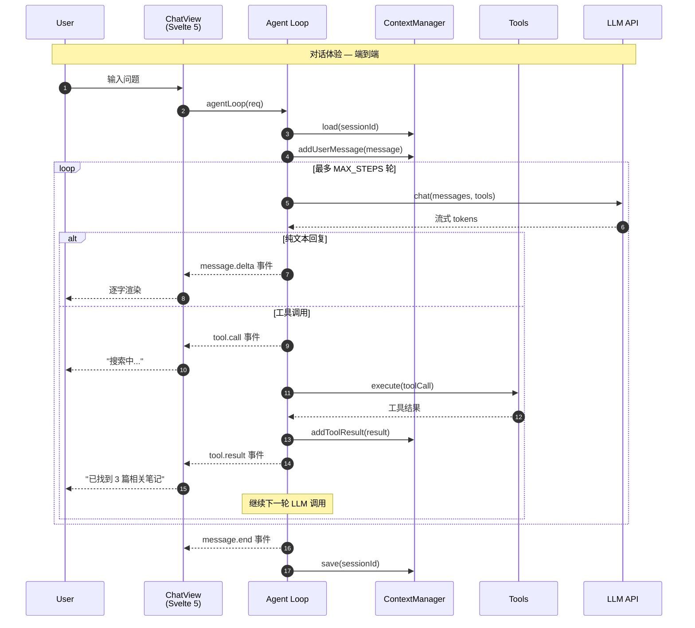
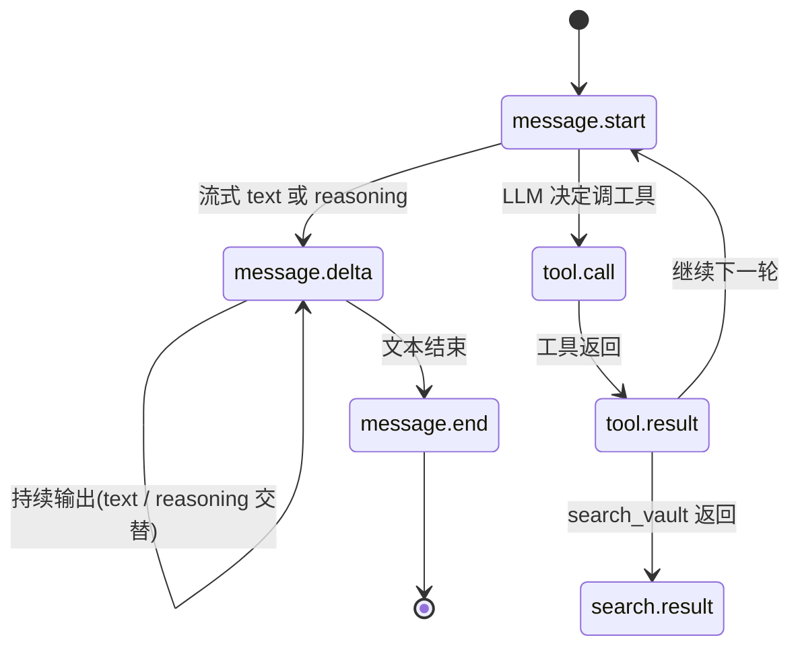
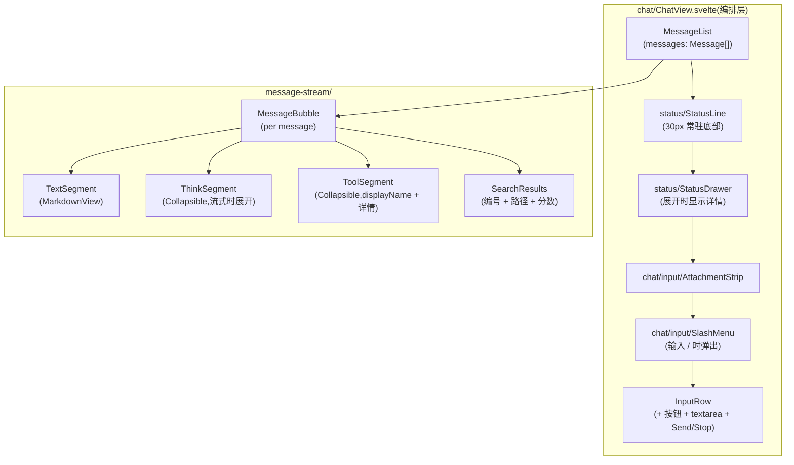
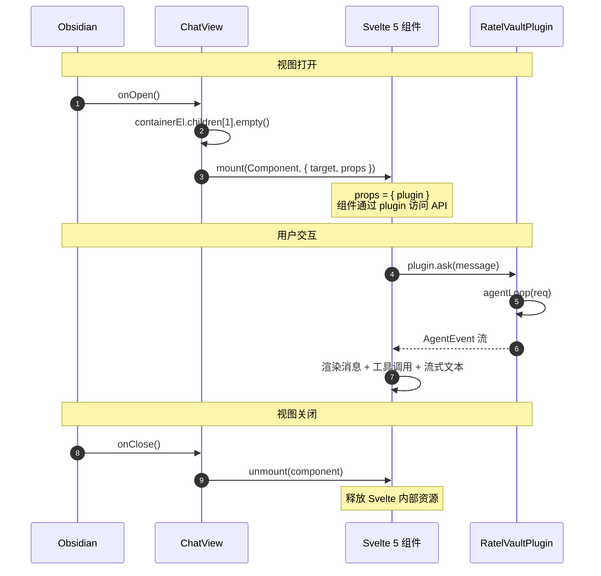
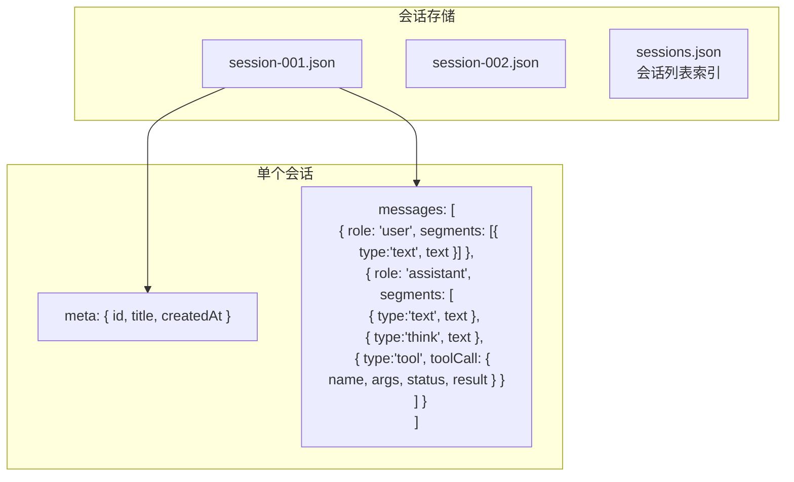
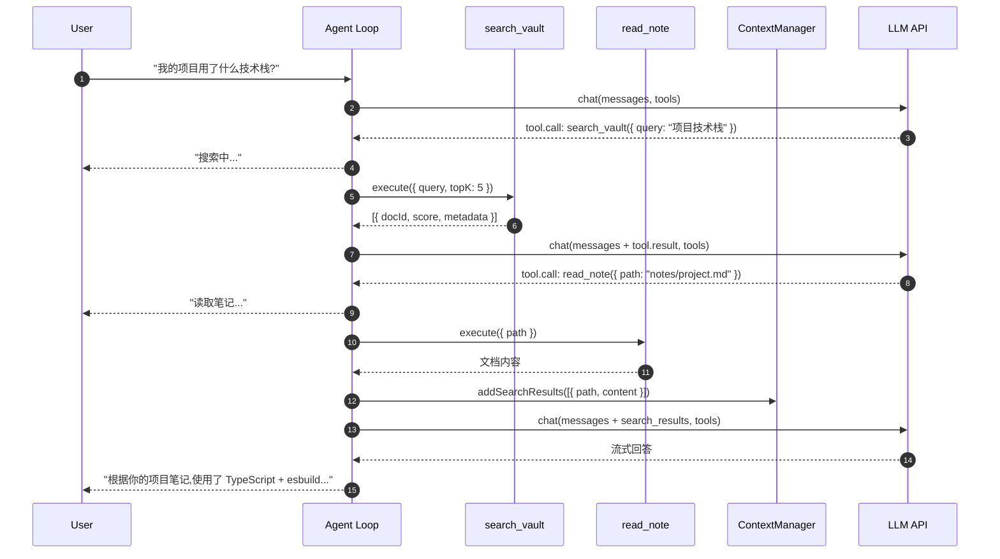

# 对话体验

> 领域:Agent | 端到端:用户输入 → Agent Loop → 流式渲染

---

## 1. 职责

从用户在侧栏输入问题,到看到流式回答的端到端体验。是 Agent 领域的「门面」— agent-loop / context-manager / tools 都是它的内部实现。

**不做的事**:
- 不负责检索(检索属于 [rag/retriever](../rag/retriever.md))
- 不负责模型管理(模型属于 [llm/model-management](../llm/model-management.md))
- 不负责 Obsidian API 细节(属于 [host/obsidian-integration](../host/obsidian-integration.md))

---

## 2. 设计原则

### 2.1 流式优先

**决策**:从 LLM 到 UI 全链路流式,用户看到的是逐字输出,不是等完再显示。

**原因**:
- LLM 响应延迟 1-5 秒,流式可感知延迟 < 200ms
- Obsidian 侧栏空间有限,流式避免"长时间空白"

### 2.2 工具调用对用户可见

**决策**:工具调用过程(搜索中... / 读取笔记... / 分析中...)在 UI 中显示。

**原因**:
- 用户知道 Agent 在做什么,减少焦虑
- 调试时能看到工具调用链路
- 类似 ChatGPT 的 "Searching the web..." 体验

### 2.3 会话持久化

**决策**:每个对话(session)自动保存,重新打开可恢复。

**原因**:
- 用户关闭侧栏不应丢失对话
- 跨 Obsidian 重启保持上下文

---

## 3. 端到端流程



---

## 4. 事件协议

Agent Loop 通过 `AsyncIterable<AgentEvent>` 向 UI 推送事件:



| 事件类型 | payload 关键字段 | UI 行为 |
|---|---|---|
| `message.start` | `role` | 显示"思考中..." |
| `message.delta` | `text` / `reasoning?` | `text` 逐字渲染到 TextSegment;`reasoning` 追加到 ThinkSegment(可折叠) |
| `tool.call` | `name` / `args` | 渲染 ToolSegment 折叠条(`✓ list_files Formatting/`) |
| `tool.result` | `name` / `result` | 回填 ToolSegment 状态为 done,展示结果摘要 |
| `search.result` | `results[]` / `reranked` | 渲染 SearchResults 卡片(编号 + 路径 + 分数 + rerank 标记) |
| `error` | `code` / `message` | `TOOL_ERROR` / `TOOL_DENIED` 附到最近 ToolSegment;其余显示 chatError 块 |
| `message.end` | `tokens` / `promptTokens?` / `completionTokens?` | 保存会话;API 真值校准 StatusLine token 统计 |

**关键路径:**
- `message.delta` 同时承载 `text` 与 `reasoning`,UI 按 segments 顺序追加(见第 5 节),保留事件时序,实现"文本 → 工具 → 文本 → 工具"完全交替。
- `message.end` 的 `promptTokens` / `completionTokens` 由 LLM 适配器从 API 响应解析,缺失时降级为本地估算。
- DeepSeek `reasoning_content` 与 Claude thinking content block 在适配器层统一归一为 `ChatDelta.reasoning`。

---

## 5. Chat UI 布局

### 5.1 目录归拢

UI 子系统按职责拆分为 `chat / status / tokens / components / diagnostics` 五块,告别扁平目录:

```
src/ui/
├── chat/                       # 聊天主子系统
│   ├── ChatView.svelte         # 编排层(~200 行)
│   ├── message-stream/         # 消息流渲染(segments 模型)
│   ├── input/                  # SlashMenu / AttachmentStrip
│   └── chat-send-gate.ts / chat-error.ts / format-tool-display.ts
├── status/                     # StatusLine / StatusDrawer
├── tokens/                     # token-estimator / probe-model
├── components/                 # Collapsible / MarkdownView / confirm-modal
└── diagnostics/                # 诊断页(LLM / Embedding / Rerank 测试)
```

### 5.2 组件树



### 5.3 segments 消息模型

一次助手消息由有序 `MessageSegment` 组成,保留事件时序,告别 `content + toolCalls` 双数组:

```typescript
type MessageSegment =
  | { type: 'text'; text: string }
  | { type: 'think'; text: string }
  | { type: 'tool'; toolCall: ToolCallEntry }
  | { type: 'image'; mimeType: string; base64: string }   // 预留
  | { type: 'citation'; docId: string; path: string; snippet: string };  // 预留
```

**段追加策略**(`segment-appender.ts`):
- `text` / `think` 段:相邻同类型自动合并(流式 delta 场景)。
- `tool` 段:始终 push 新段(每次 tool.call 是独立调用)。
- `attachToolResult`:回填到最近一个 `status='calling'` 的同名工具段。
- `markToolFailed`:`TOOL_ERROR` / `TOOL_DENIED` 标记失败态。

### 5.4 组件职责

| 组件 | 职责 | 数据源 |
|------|------|--------|
| ChatView(编排层) | 状态持有 + 事件循环分发到 segment-appender + 子组件 props 编排 | `plugin` |
| MessageList | 渲染 `Message[]`,滚动管理 | `messages` prop |
| MessageBubble | 单条消息:用户消息(text + 附件)/ 助手消息(segments 顺序渲染) | `message` prop |
| TextSegment | Markdown 渲染(MarkdownView) | segment.text |
| ThinkSegment | 思考过程可折叠(流式中展开,结束后折叠) | segment.text |
| ToolSegment | 工具调用可折叠(折叠态 displayName + 结果摘要,展开态 args + result JSON) | segment.toolCall |
| SearchResults | 搜索结果卡片(编号 + 路径 + 分数 + rerank 标记) | message.searchResults |
| status/StatusLine | 5 种状态(就绪/思考中/错误/未配置/索引中)+ ctx 进度条 + 百分比 | `statusBar$` + `contextUsage$` |
| status/StatusDrawer | 展开式详情 — 向量化/索引区 + 上下文区(含压缩按钮) | `statusBar$` + `contextUsage$` + `pendingAttachments$` |
| tokens/token-estimator | 中英混合权重估算(ASCII/CJK/符号三类权重) | 纯函数 |
| tokens/probe-model | 测试连接推断模型 context length(API 响应 + 内置映射表回退) | LLM 配置 |
| components/Collapsible | 通用可折叠容器(think / tool 段共用) | `expanded` prop |

### 5.5 Token 三层校准

`contextUsage$` 复用现有 store,加可选 `source` 字段标记数据来源:

| 层级 | 触发时机 | 数据来源 | source |
|------|----------|----------|--------|
| 第 1 层 | send 前 | `context-manager.getUsage()` 调 `estimateTokens`(中英混合权重) | `estimate` |
| 第 2 层 | 流式中 | ChatView 累计 `message.delta.text` 的 `estimateTokens` 增量 | `streaming` |
| 第 3 层 | `message.end` | API 真值 `promptTokens + completionTokens` 覆盖 | `api` |

**估算权重:** ASCII Latin ~4 字符/token,CJK 中文 ~1.5 字符/token,符号 ~3 字符/token。不引入第三方 tokenizer(`js-tiktoken` 对 DeepSeek/Claude 不准;`transformers.js` 包体积 ~2MB)。

### 5.6 模型 context length 探测

`settings.chatModelMaxTokens` 默认值 `0`(未探测)。`RatelVaultSettingTab` 加"测试连接"按钮:
- 调 `probeModelContextLength` 发极短请求(max_tokens=1),从响应推断。
- 推断失败查内置映射表(DeepSeek / Claude / Ollama / OpenAI 常见模型)。
- 仍未命中返回 undefined,UI 提示手动填写。

`StatusLine` 在 `chatModelMaxTokens === 0` 时显示"未配置"而非百分比,引导用户去设置面板探测。

### 5.7 Notice 迁移与 CSS 约束

| Notice 类型 | 迁移后 |
|------|--------|
| 模型下载进度 | `StatusLine` 状态文字 + `toastProgress` |
| 索引进度 | `StatusLine` 状态文字 + `StatusDrawer` 进度条 |
| 严重错误 | 保留 `toastError` + `StatusLine` 红点 |
| 降级警告 | `StatusDrawer` 降级区(不弹 toast) |

**CSS 变量约束:** 全部颜色复用 Obsidian CSS 变量(`--background-secondary` / `--text-success` / `--text-warning` / `--text-error` 等),禁止硬编码 hex,禁止 box-shadow,圆角 4-8px。淡色背景用 `color-mix(in srgb, var(--text-success) 12%, transparent)` 适配亮/暗主题。

---

## 6. ChatView 生命周期



**Svelte 5 mount 注意事项**:
- 必须用 `mount(Component, { target, props })` 双参形式
- 不能用 Svelte 4 的 `new Component({ target, props })` 单参形式
- esbuild 必须加 `conditions: ['browser']`,否则 Svelte 5 解析到 server runtime,`mount` 不可用

**编排层职责边界:**

ChatView.svelte 瘦身到 ~200 行,只承担:
1. **状态持有:** `messages` / `input` / `isRunning` / `sessionId` / `drawerExpanded` / `keyTick`
2. **派生状态:** `gate` / `slashVisible` / `showThinking` / `modelName` / `hasKey`
3. **事件循环:** `sendMessage()` 内的 `for await (const event of events)` 调 segment-appender
4. **子组件编排:** `<MessageList>` + `<StatusLine>` + `<StatusDrawer>` + `<SlashMenu>` + `<AttachmentStrip>`
5. **生命周期:** `onMount` / `onDestroy` / abortController 管理

不承担:消息渲染细节(下沉到 MessageBubble / 各 Segment)、工具 displayName 格式化(在 `format-tool-display.ts`)、token 估算(在 `tokens/token-estimator.ts`)、斜杠命令执行细节(在 `input/slash-commands.ts`)。

---

## 7. 会话管理



**关键路径:** 持久化结构跟 UI 模型对齐 — 助手消息直接序列化 `segments` 数组,重启后恢复可还原"文本 → 工具 → 文本"时序。`tool` 段的 `toolCall` 包含 `name / args / status / result`,不再单独存 `role: 'tool'` 消息。

| 操作 | 说明 |
|---|---|
| 新建会话 | 用户点击"新对话"或首次打开侧栏 |
| 恢复会话 | 侧栏显示历史会话列表,点击恢复 |
| 自动保存 | 每次 `message.end` 后自动保存 |
| 删除会话 | 用户主动删除,从索引和文件中移除 |

---

## 8. RAG 对话模式

当用户问题涉及 vault 内容时,Chat 的完整流程:



**关键**:Agent Loop 自主决定检索 → 读取 → 回答的节奏,用户只看到中间状态提示。

---

## 9. 边界

| 与...的接口 | 方向 | 说明 |
|---|---|---|
| [agent-loop](agent-loop.md) | 包含 | Chat 是门面,agent-loop 是引擎。agent-loop 保留循环核心,`search-result-mapper.ts` 移出为独立模块做 search_vault 结果扁平化 |
| [context-manager](context-manager.md) | 包含 | 上下文管理是 Chat 的内部机制。`getUsage()` 调 `tokens/token-estimator` 做中英混合估算 |
| [tools](tools.md) | 包含 | 工具是 Chat 的能力扩展 |
| [rag/retriever](../rag/retriever.md) | 依赖 | search_vault 工具调用检索器(混合搜索) |
| [llm/streaming](../llm/streaming.md) | 依赖 | LLM 流式协议。适配器解析 DeepSeek `reasoning_content` / Claude thinking block 为 `ChatDelta.reasoning`,解析 `usage` 为 `ChatDelta.usage` |
| [llm/model-management](../llm/model-management.md) | 依赖 | `tokens/probe-model.ts` 测试连接推断 context length,填充 `settings.chatModelMaxTokens` |
| [host/obsidian-integration](../host/obsidian-integration.md) | 依赖 | ItemView + Svelte mount |
