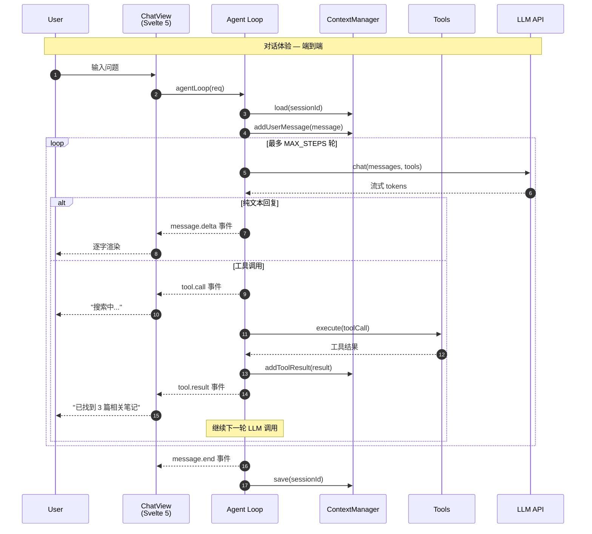
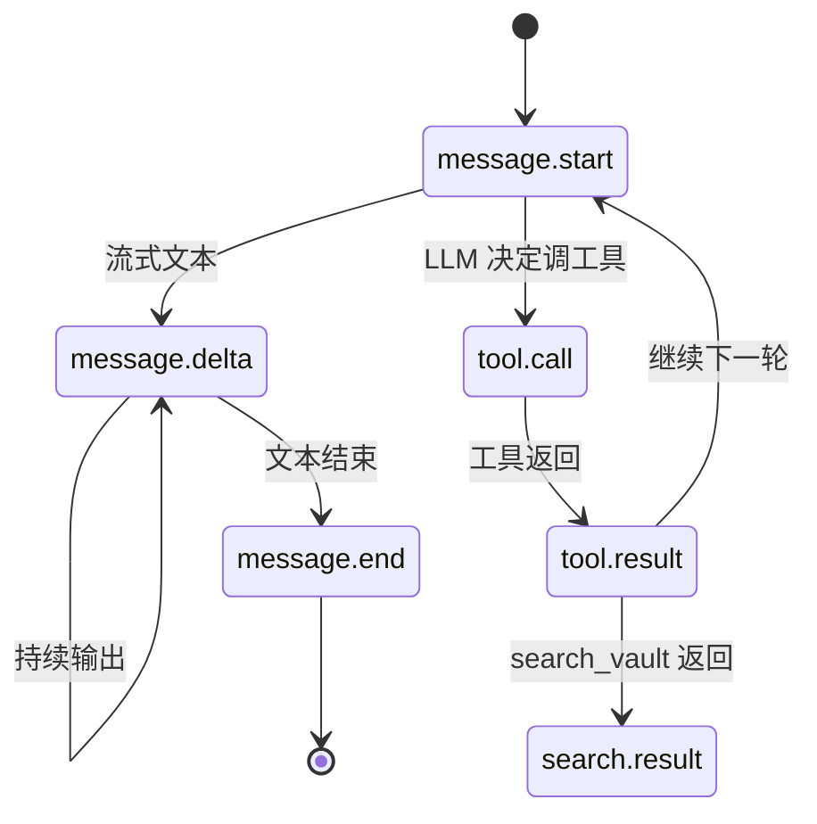
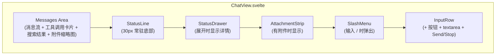
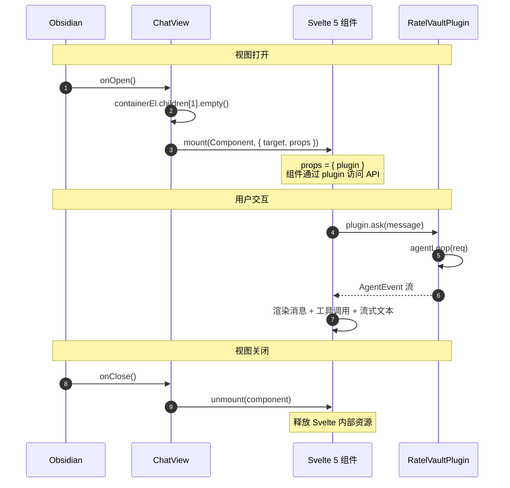
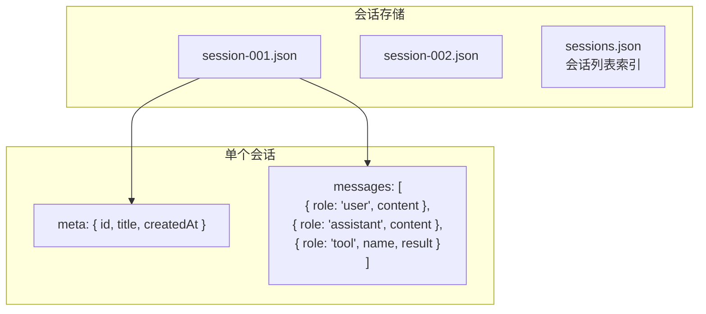
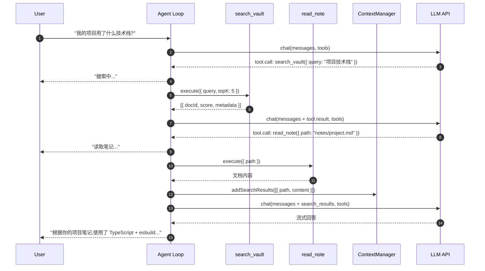

# 对话体验

> 领域:Agent | 端到端:用户输入 → Agent Loop → 流式渲染

---

## 1. 职责

从用户在侧栏输入问题,到看到流式回答的端到端体验。是 Agent 领域的「门面」— agent-loop / context-manager / tools 都是它的内部实现。

**不做的事**:
- 不负责检索(检索属于 [rag/retriever](../rag/retriever.md))
- 不负责模型管理(模型属于 [llm/model-management](../llm/model-management.md))
- 不负责 Obsidian API 细节(属于 [host/obsidian-integration](../host/obsidian-integration.md))

---

## 2. 设计原则

### 2.1 流式优先

**决策**:从 LLM 到 UI 全链路流式,用户看到的是逐字输出,不是等完再显示。

**原因**:
- LLM 响应延迟 1-5 秒,流式可感知延迟 < 200ms
- Obsidian 侧栏空间有限,流式避免"长时间空白"

### 2.2 工具调用对用户可见

**决策**:工具调用过程(搜索中... / 读取笔记... / 分析中...)在 UI 中显示。

**原因**:
- 用户知道 Agent 在做什么,减少焦虑
- 调试时能看到工具调用链路
- 类似 ChatGPT 的 "Searching the web..." 体验

### 2.3 会话持久化

**决策**:每个对话(session)自动保存,重新打开可恢复。

**原因**:
- 用户关闭侧栏不应丢失对话
- 跨 Obsidian 重启保持上下文

---

## 3. 端到端流程

---

## 4. 事件协议

Agent Loop 通过 `AsyncIterable<AgentEvent>` 向 UI 推送事件:

| 事件类型 | 含义 | UI 行为 |
|---|---|---|
| `message.start` | 新一轮 LLM 回复开始 | 显示"思考中..." |
| `message.delta` | 流式文本片段 | 逐字渲染到消息气泡 |
| `tool.call` | LLM 请求调用工具 | 显示工具名 + 参数摘要 |
| `tool.result` | 工具执行结果 | 显示结果摘要 |
| `search.result` | search_vault 返回带编号结果 | 渲染搜索结果卡片(编号 + 路径 + 分数) |
| `error` | 错误 | 显示错误提示 |
| `message.end` | 整个对话轮结束 | 保存会话,显示 token 统计 |

---

## 5. Chat UI 布局

**组件职责:**

| 组件 | 职责 | 数据源 |
|------|------|--------|
| StatusLine | 单行展示 5 种状态(就绪/思考中/错误/未配置/索引中)+ ctx 进度条 + 百分比 | `userStatus.statusBar$` + `contextUsage$` |
| StatusDrawer | 展开式详情 — 向量化/索引区 + 上下文区(含压缩按钮) | `statusBar$` + `contextUsage$` + `pendingAttachments$` |
| SlashMenu | 输入 / 弹出命令菜单(`/new` `/compact` `/model` `/reindex`) | `filterCommands(input)` 纯函数 |
| AttachmentStrip | 图片附件预览条(56×56 缩略图 + × 删除) | `pendingAttachments$` |

**Notice 迁移策略:**

| 类型 | 迁移后 |
|------|--------|
| 模型下载进度 | `StatusLine` 状态文字 + `toastProgress`(长驻进度条保留) |
| 索引进度 | `StatusLine` 状态文字 + `StatusDrawer` 进度条 |
| 严重错误 | 保留 `toastError` + `StatusLine` 红点 |
| 降级警告 | `StatusDrawer` 降级区(不弹 toast) |

**CSS 变量约束:** 全部颜色复用 Obsidian CSS 变量(`--background-secondary` / `--text-success` / `--text-warning` / `--text-error` 等),禁止硬编码 hex,禁止 box-shadow,圆角 4-8px。

---

## 6. ChatView 生命周期

**Svelte 5 mount 注意事项**:
- 必须用 `mount(Component, { target, props })` 双参形式
- 不能用 Svelte 4 的 `new Component({ target, props })` 单参形式
- esbuild 必须加 `conditions: ['browser']`,否则 Svelte 5 解析到 server runtime,`mount` 不可用

---

## 7. 会话管理

| 操作 | 说明 |
|---|---|
| 新建会话 | 用户点击"新对话"或首次打开侧栏 |
| 恢复会话 | 侧栏显示历史会话列表,点击恢复 |
| 自动保存 | 每次 `message.end` 后自动保存 |
| 删除会话 | 用户主动删除,从索引和文件中移除 |

---

## 8. RAG 对话模式

当用户问题涉及 vault 内容时,Chat 的完整流程:

**关键**:Agent Loop 自主决定检索 → 读取 → 回答的节奏,用户只看到中间状态提示。

---

## 9. 边界

| 与...的接口 | 方向 | 说明 |
|---|---|---|
| [agent-loop](agent-loop.md) | 包含 | Chat 是门面,agent-loop 是引擎 |
| [context-manager](context-manager.md) | 包含 | 上下文管理是 Chat 的内部机制 |
| [tools](tools.md) | 包含 | 工具是 Chat 的能力扩展 |
| [rag/retriever](../rag/retriever.md) | 依赖 | search_vault 工具调用检索器(混合搜索) |
| [llm/streaming](../llm/streaming.md) | 依赖 | LLM 流式协议 |
| [host/obsidian-integration](../host/obsidian-integration.md) | 依赖 | ItemView + Svelte mount |
