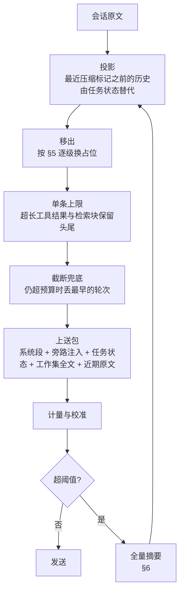

# 上下文压缩

> 领域:Agent | 预算 / 移出 / 摘要 / 恢复
>
> 上送包的整体组装顺序见 [context-manager](context-manager.md)。本文只讲压缩的设计理念与逻辑。
> 实施进度、阈值取值依据与分阶段计划见 [S-COMPACT-V3](../../superpowers/specs/2026-10-01-compact-v3-design.md)。

---

## 1. 职责与术语

**职责**:模型窗口有限,长任务的历史会不断增长。压缩决定每次请求带上哪些历史、以什么形式带上,并保证压缩之后任务能接着做。

**不做的事**:
- 不删、不改聊天记录(界面上的消息一条不少)
- 不负责系统提示与旁路注入(属于 [prompt-management](prompt-management.md))
- 不负责会话落盘细节(属于 [host/persistence](../host/persistence.md))

**术语**:

| 术语 | 含义 |
|---|---|
| 会话原文 | `session.messages`,含 user / assistant / tool、工具参数、思考过程。完整、只追加 |
| 上送包 | 某一次模型请求实际发出的消息列表,每次请求现算,不落盘 |
| 占用 | 上送包的 token 数 |
| 移出 | 在上送包里把一段内容换成短占位,原文仍在会话或库里 |
| 全量摘要 | 调一次模型,把较早的历史整理成任务状态,写入压缩标记 |
| 任务状态 | 结构化的「做到哪了」:目标、约束、已完成、决策、失败尝试、下一步等 |
| 工作集 | 当前任务正在写或依赖的少数几篇笔记 |
| 压缩标记 | `CompactMarker`,记录摘要覆盖到哪条消息、任务状态与工作集 |

---

## 2. 设计理念

### 2.1 原文、状态、上送分开

| 数据 | 内容 | 存放 | 更新方式 |
|---|---|---|---|
| 会话原文 | 全部消息与工具调用 | `session.messages` | 只追加,压缩不改 |
| 任务状态 | 目标、约束、用户纠正、已完成、决策、失败尝试、未决、下一步、工作集 | 最近一条压缩标记 | 每次全量摘要增量合并 |
| 上送包 | 系统段 + 旁路注入 + 任务状态 + 工作集全文 + 近期原文 | 内存 | 每次请求按预算现算 |

摘要必然丢细节。原文留在会话里,摘要漏掉的内容仍能按位置取回;笔记以库里的当前版本为准,按路径取回。

### 2.2 量的就是发的

占用必须按适配器实际序列化的内容计算:消息正文、工具调用参数、回传的思考过程、图片、工具定义。只数正文会严重低估,写长文时工具参数里的整篇正文和每步的思考过程往往比正文还多。估算值用最近一次接口返回的 `prompt_tokens` 校准。

### 2.3 先移出,后摘要

能取回的内容先换占位,不调模型;只有已经没有可移出的内容、占用仍然过高时,才做全量摘要。移出是确定的、可逆的;摘要有损,而且多一次模型调用。

### 2.4 旧历史尽量不动

供应商普遍按请求前缀缓存。每改写一次旧历史,改写点之后的缓存全部失效,费用和延迟随之上升。因此:

- 移出边界只向前推进。一段内容一旦移出,后续请求保持移出,不因占用回落而恢复。
- 移出成批进行。单次移出量低于下限时不动,避免每次请求都改写一点。
- 同一内容的占位文本固定,不随请求变化。

### 2.5 连续性优先于压缩率

压缩是否成功,看压缩后模型能否接着原目标做,而不是文本缩短了多少。压缩后必须保留:

- 最近的原文轮次(含完整的工具调用组)
- 用户纠正的原话
- 否定结论与失败原因,防止重试已排除的方案
- 明确的下一步与证据位置,防止重新扫描
- 工作集笔记的当前全文

### 2.6 不变量

| 规则 | 含义 |
|---|---|
| 原文只追加 | 压缩只写压缩标记,不删不改 `session.messages` |
| 工具调用组不拆 | assistant 的 `tool_call` 与对应 `role:tool` 结果同在或同不在;切分点只落在 user 消息上 |
| 当前问题不丢 | 最后一条 user 消息任何层都不移出、不裁剪 |
| 错误轨迹保留 | `Error:` 开头的工具结果不移出、不裁剪 |
| 生成中途不摘要 | 全量摘要只在发送前或整轮结束后执行;轮内只做移出 |
| 失败不破坏会话 | 摘要失败不写标记;无论压缩成败,请求都能以截断兜底发出 |
| 不写进用户的库 | 移出的内容不另存为笔记;笔记按库内路径取回,其余按会话位置取回 |
| 占位面向模型 | 占位与压缩提示词不走 i18n;用户可见提示走 i18n |

---

## 3. 预算

设模型窗口 `W`,输出预留 `outputReserve(W)`。

```
预算 B = W − outputReserve(W)
```

占用按实际上送计算。写长文时,思考过程与已落库的写入参数先移出,占用因此落在预算之内,而不是靠再设一个上限。

| 线 | 比例 | 用途 |
|---|---|---|
| 软阈值 | `0.70 × B` | 整轮结束后检查。超过时先移出工作集外的旧笔记全文;仍超且已无可移出内容,才做全量摘要 |
| 硬阈值 | `0.90 × B` | 发送前检查。超过时必须先压缩;压缩失败则截断兜底后照常发出 |
| 目标线 | `0.40 × B` | 全量摘要选择覆盖范围,使压缩后占用不高于此 |

**滞回**:全量摘要后记下压后占用。下一次检查时,若占用相比压后增长不足 `0.15 × B`,不再做全量摘要,只做移出。避免压完仍偏高、下一轮又压。

状态条的百分比按占用与窗口 `W` 的比值显示,与用户在设置里看到的窗口一致。

---

## 4. 组装管线

每次请求按以下顺序现算上送包,全部只作用于副本。



截断兜底只在移出和摘要都不足时生效,保证请求总能发出;被截掉的内容不进任务状态,所以它是最后手段。

---

## 5. 移出

按代价从低到高排列。前三级每次组装都执行;第四级只在超过软阈值时执行。

| 级 | 对象 | 处理 | 取回方式 |
|---|---|---|---|
| 旧思考过程 | 最后一条 user 之前的 assistant 思考过程 | 不再回传 | 会话位置 |
| 已落库的写入参数 | 写笔记类工具调用中的正文字段,除本轮最近一次写入外 | 删掉正文字段,只留路径;工具结果注明用 read_note 取回,不要把占位标记写入 content | 按路径读笔记当前版本 |
| 旧发现类结果 | `search_vault` / `grep` / `glob` / `list_files` / `search_memory`,除最近 5 条外 | 换成 `[compacted] {name} path=… chars=…` | 重新检索 |
| 工作集外旧笔记全文 | 最后一条 user 之前、不在工作集内的 `read_note` 结果 | 换成 `[offloaded] read_note path=… chars=… title=…` | 按路径重读 |

**理由与约束**:

- **思考过程**:同一用户轮内、含工具调用的 assistant 需要回传思考过程(部分供应商强制要求),所以只移出更早轮次的。某供应商要求全部回传时,对它关闭这一级。
- **写入参数**:写入成功后正文已在库里,旧版本参数留在上下文里只会误导。只保留本轮最近一次写入,是因为一轮里可能连写多章,参数在单轮内也会堆满。哪些参数字段是「正文」,在工具定义处集中登记。
- **发现类结果**:可重跑,体量大,保留最近几条维持节奏。
- **笔记全文**:默认不折。折掉而模型不知道它已不在上下文里,会反复读同一篇;所以只在超预算时折工作集之外的,并依赖 §7 的可见性账本让重读得到正文。
- **不折的工具**:图切片(`get_links` / `search_by_tag` / `search_by_property` / `get_vault_structure`)体量小,折掉会逼模型重查再连带重读;`remember` 与写工具的结果本身很短。
- **单条上限**:任何非错误工具结果与检索块超过 32k 码点时保留头尾,与移出独立。

---

## 6. 全量摘要

### 6.1 覆盖范围

从末尾往前保留最近 2 个用户轮次的原文(一轮 = 该 user 消息及其后全部 assistant / tool,直到下一个 user),保留部分不超过 `0.25 × B`;超出时只保留最后 1 轮,并对它执行移出。切分点落在 user 消息上。更早的部分由任务状态替代。

### 6.2 增量更新

摘要输入 = 上一份任务状态 + 新覆盖范围的原文(已经过移出)。不把上一份摘要文本当成历史重新总结,否则每压一次就丢一层细节。

新覆盖范围过长、单次请求可能超窗时,按用户轮次分块,逐块更新状态。

### 6.3 任务状态

```ts
interface CompactState {
  goal: string;                     // 当前总目标;Goal 模式下引用目标 id,不重复其正文
  constraints: StateItem[];         // 必须遵守的约束
  userCorrections: StateItem[];     // 用户纠正,原话
  completed: Array<{ item: string; evidence: string[] }>; // evidence:笔记路径或 msg:<位置>
  decisions: Array<StateItem & { reason: string }>;
  failedAttempts: Array<{ approach: string; reason: string }>;
  openItems: string[];
  nextStep: string;
  workingSet: Array<{ path: string; role: 'editing' | 'reference' | 'outline' }>;
}

interface StateItem {
  text: string;
  source?: string;                  // msg:<位置>
  supersededBy?: string;            // 被哪条取代;取代后不再渲染给模型
}
```

模型输出 JSON,解析失败视为摘要失败,不写标记。

### 6.4 合并规则

合并由程序执行,不依赖模型自觉:

| 字段 | 规则 |
|---|---|
| 用户纠正 | 模型挑出候选;程序核对它是某条 user 消息的原文片段,核对不过的丢弃 |
| 约束、决策、失败尝试 | 旧条目不会因模型漏写而消失;只能被显式标记为 `supersededBy` |
| 已完成的写入事实 | 由程序从成功的写工具结果生成(路径 + 消息位置),模型只写描述 |
| 渲染 | 只渲染未被取代的条目;总长不超过 `0.08 × B`,超出时最早的已完成项合并为一句 |

---

## 7. 恢复

### 7.1 工作集

工作集按优先级取前 6 篇:任务状态里的工作集;保留轮次内写过的笔记;保留轮次内读过的笔记;被覆盖范围里最后写过的笔记。

压缩后按优先级读取当前全文放进上送包,总量不超过 `0.15 × B`;放不下的只列路径,并注明「未在上下文」。

### 7.2 可见性账本

「库里有这篇」与「这次请求里有这篇的全文」是两件事。每次组装上送包时重算一份账本,记录哪些笔记的全文在上送包里,以及读取时的修改时间。`read_note` 据此决定返回什么:

| 情况 | 返回 |
|---|---|
| 全文在本次上送包里,文件未改 | 短提示「全文已在上下文中」;显式要求时仍返回全文 |
| 不在上送包里(已移出或被摘要覆盖) | 全文 |
| 文件已改 | 最新全文,并提示已更新 |

没有账本时,「读过就别再读」的提示会把模型挡在已经移出的原文之外。

### 7.3 按位置取回

任务状态里的证据记录为笔记路径或 `msg:<位置>`。会话原文只追加,位置稳定;只读工具 `read_history` 按位置范围返回原文,用于核对摘要里只剩结论的细节。

---

## 8. 触发与失败处理

| 时机 | 动作 |
|---|---|
| 整轮结束后 | 软阈值检查:移出 → 全量摘要(受滞回约束) |
| 发送前 | 硬阈值检查:必须压缩;失败则截断兜底后发出 |
| 首步请求报上下文过长、本轮未执行工具 | 压缩后重试本轮 1 次;已执行过工具则不重试,避免重复写入 |
| 手动 `/compact` | 立即全量摘要,不受阈值与滞回约束 |

- 同一会话连续 3 次摘要失败后暂停自动摘要,手动仍可;一次成功即恢复。
- 自动压缩可在设置「上下文」分组关闭;关闭后仍做移出与截断兜底,只是不自动摘要。
- 压缩只在用户不可见处发生;对话流里以一条系统分隔标出摘要覆盖到哪里。

---

## 9. 数据模型

```ts
interface CompactMarker {
  afterIndex: number;          // messages[0..=afterIndex] 已被任务状态覆盖
  keepFrom: number;            // 上送原文起点,落在 user 消息上
  state: CompactState;
  summary: string;             // state 的渲染文本,供界面与诊断查看
  workingSet: string[];        // 压缩时确定的工作集路径
  tokensBefore: number;
  tokensAfter: number;
  at: number;
}

interface Session {
  // ...
  compactMarkers?: CompactMarker[]; // 只有最近一条进上送,更早的只给界面画分隔
  offloadedThrough?: number;        // 工作集外笔记全文的移出水位,只前进
}
```

---

## 10. 可观测与验证

**诊断记录**:每次检查与压缩写一条 breadcrumb。

| 事件 | 内容 |
|---|---|
| 压缩决策 | 占用、预算、来源(接口真值或估算)、校准系数、动作(无 / 移出 / 摘要) |
| 压缩结果 | 成功 / 跳过 / 失败及原因,压前压后占用,覆盖范围,分块数 |

开发者日志另记占用分项:正文、工具参数、思考过程、图片、工具定义。

**验证方式**:用同一批长会话分别从完整上下文和压缩后上下文继续执行,检查:

- 是否接着原目标做,没有重问目标、没有把未完成说成已完成
- 是否遵守用户纠正与约束,没有重试已排除的方案
- 被摘要掉的具体事实,需要时能否按位置找回
- 被移出的写入,能否按路径读回当前版本
- 连续多次压缩后,任务成功率、总 token 与延迟的变化

---

## 11. 模块边界

| 模块 | 职责 |
|---|---|
| `src/core/compact-project.ts` | 投影、移出、覆盖范围选择、状态合并(纯函数) |
| `src/core/context-budget.ts` | 输出预留、预算与各阈值 |
| `src/core/context-manager.ts` | `toMessages` 串起管线;计量;`appendCompactMarker` |
| `src/core/compact-overflow-retry.ts` | 撑爆后是否压缩重试 |
| `src/ui/chat/compact-session.ts` | 调模型更新任务状态并写标记 |
| `src/ui/chat/compact-auto.ts` | 发送前 / 轮后触发判断 |
| `src/ui/chat/ChatView.svelte` | 触发时机、界面分隔、占用回写 |
| `src/tools/` 中的 `read_note` | 查可见性账本 |
| `src/ports/persistence.ts` | `CompactMarker` / `Session` 类型 |

---

## 12. 参考

- [S-COMPACT-V3](../../superpowers/specs/2026-10-01-compact-v3-design.md):实测数据、阈值依据、分阶段实施
- [Anthropic:Effective context engineering for AI agents](https://www.anthropic.com/engineering/effective-context-engineering-for-ai-agents)、[Context editing](https://platform.claude.com/docs/en/build-with-claude/context-editing)
- [Google ADK:Context compaction](https://adk.dev/context/compaction/)
- [Microsoft Agent Framework:Compaction pipeline](https://github.com/microsoft/agent-framework/blob/main/dotnet/samples/02-agents/Agents/Agent_Step18_CompactionPipeline/README.md)
- [AWS Strands:Conversation management](https://strandsagents.com/docs/user-guide/sdk/agents/conversation-management/)
- [AgentScope:Memory compression](https://doc.agentscope.io/tutorial/task_agent.html)
- [LangChain:Context management for Deep Agents](https://www.langchain.com/blog/context-management-for-deepagents)
