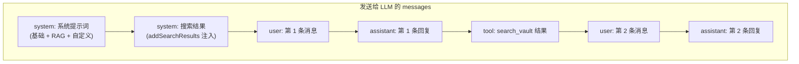
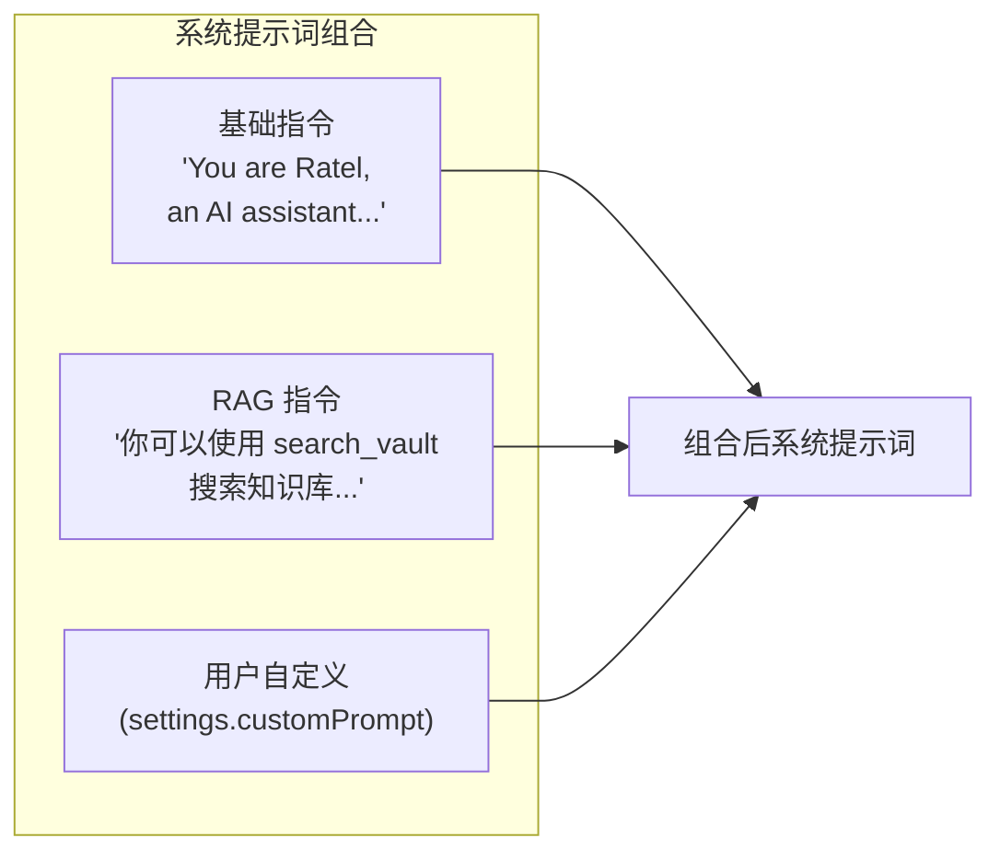
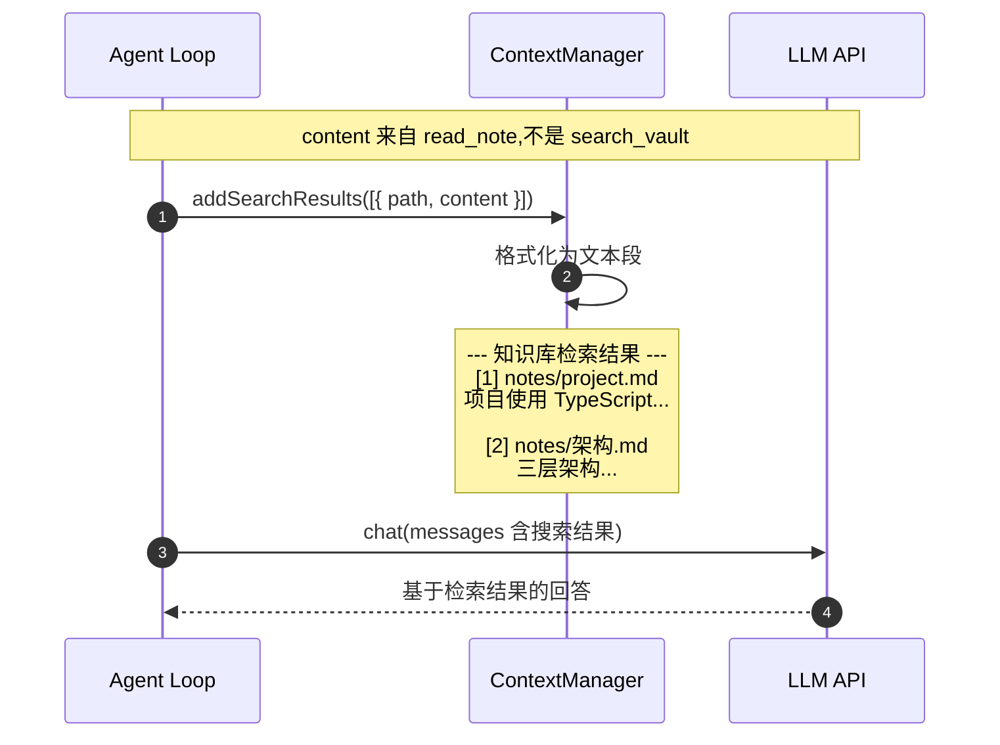
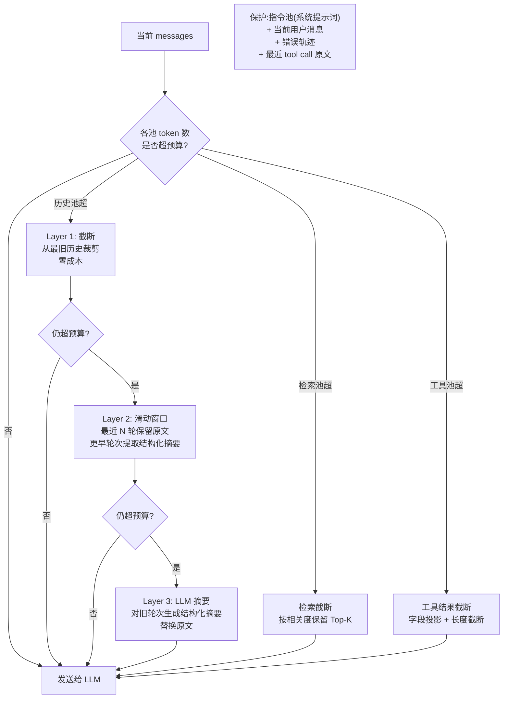

# 上下文管理

> 领域:Agent | 消息历史 / 系统提示词 / 搜索结果注入

---

## 1. 职责

管理一次对话的完整上下文:消息历史、系统提示词、搜索结果注入、session 持久化。决定 LLM 看到什么信息。

**不做的事**:
- 不负责对话循环(属于 [agent-loop](agent-loop.md))
- 不负责检索(属于 [rag/retriever](../rag/retriever.md))
- 不负责存储细节(属于 [host/persistence](../host/persistence.md))

---

## 2. 设计原则

### 2.1 上下文窗口有限,必须裁剪

**决策**:上下文有 token 上限,超出时按策略裁剪,优先保留系统提示词和最近消息。

**原因**:
- LLM 上下文窗口有限(4K-128K tokens)
- 长对话 + 多次工具调用会快速膨胀
- 裁剪策略直接影响回答质量

### 2.2 搜索结果注入位置固定

**决策**:搜索结果注入在系统提示词之后、用户消息之前,格式统一。

**原因**:
- LLM 对上下文开头的信息权重更高
- 固定位置便于测试和调试
- 统一格式便于 LLM 理解

### 2.3 系统提示词可组合

**决策**:系统提示词由基础指令 + RAG 指令 + 用户自定义指令组合而成。

**原因**:
- 不同场景需要不同的系统提示词(有 RAG / 无 RAG)
- 用户可能想自定义人格或行为
- 组合而非拼接,避免冲突

### 2.4 上下文窗口是有限预算,必须系统管理

**决策**:上下文窗口是固定预算,按池分配、按策略压缩。不是"等满了再裁",而是从第一轮就按预算运营。

**原因**:
- LLM 上下文窗口有限(4K-128K tokens),且上下文越长模型 precision 越低("lost-in-the-middle"问题)
- 一次 RAG 对话可能产生:系统提示词(~500 tokens) + 搜索结果(~2000 tokens) + 3 轮历史(~3000 tokens) = ~5500 tokens;5 轮后可达 15K-20K
- 不做预算管理,关键信息会被噪声挤掉,模型推理质量下降

**Token 预算分配(四池 + 输出预留)**:

设总窗口 W tokens,先预留输出 O tokens(否则模型容易溢出),输入预算 I = W - O 切四池:

| 池 | 比例 | 内容 | 溢出策略 |
|---|---|---|---|
| 指令池 | 10-20% | 系统提示词(基础 + RAG + 自定义) | 绝不裁剪 |
| 检索池 | 20-40% | 搜索结果(RAG chunks) | 按相关度截断,保留 Top-K |
| 历史池 | 20-40% | 对话历史(user/assistant/tool) | 三层压缩(见下) |
| 工具池 | 10-30% | 工具调用结果 | 字段投影 + 长度截断 |

**示例**:W=32K,预留 O=4K 输出。输入 I=28K:指令 4K + 检索 10K + 历史 8K + 工具 6K。

**三层压缩策略**(优先级从高到低,先低成本再高成本):

| 层 | 手段 | 成本 | 适用场景 | 保留 |
|---|---|---|---|---|
| 1 截断 | 从最旧历史开始裁剪 user/assistant 对 | 零(无 LLM 调用) | 远端历史不重要(闲聊/已解决) | 系统提示词 + 搜索结果 + 当前消息 |
| 2 滑动窗口 | 最近 N 轮全保留,更早轮次提取结构化摘要 | 低(可异步) | 远端历史"可能还有用" | 摘要(键值对) + 最近 N 轮原文 |
| 3 LLM 摘要 | 用 LLM 对旧轮次生成结构化摘要,替换原文 | 高(额外 LLM 调用) | 远端含因果链/约束条件 | 关键实体 + 约束 + 未决问题 |

**关键设计约束**:
- **截断优先**:先截断、再滑窗、最后才用 LLM 摘要——低成本手段先用尽
- **摘要必须结构化**:键值对格式,不是自由文本;关键实体(order_id、path 等)必须显式出现
- **错误轨迹不压缩**:tool call 失败时的 error + stack trace 保留原文,帮助模型避免重复错误
- **最近 tool call 保留原文**:不压缩最近一次工具调用的原始输出,保持模型的"节奏"
- **摘要可异步预计算**:在对话间隙生成,不阻塞当前轮次

---

## 3. 上下文结构



**层级**(对应四池预算):

| 层级 | 池 | 内容 | 预算占比 | 溢出策略 |
|---|---|---|---|---|
| 1 系统提示词 | 指令池 | 基础指令 + RAG 指令 + 自定义 | 10-20% | 绝不裁剪 |
| 2 搜索结果 | 检索池 | addSearchResults 注入 | 20-40% | 按相关度截断 |
| 3 历史消息 | 历史池 | user / assistant / tool 交替 | 20-40% | 三层压缩 |
| 4 工具结果 | 工具池 | tool call 返回值 | 10-30% | 字段投影 + 截断 |
| 5 当前消息 | — | 用户最新问题 | — | 绝不裁剪 |

---

## 4. 系统提示词组合



**RAG 指令**(S-RAG-LOOP 新增):

```
你可以使用 search_vault 工具搜索用户知识库中的笔记。
当用户的问题可能涉及 vault 中的内容时,先搜索再回答。
搜索返回文档路径和相关性分数,你需要用 read_note 读取感兴趣的文档内容。
基于文档内容回答时,请标注来源笔记路径。
如果搜索结果不足以回答问题,请如实说明。
```

---

## 5. 搜索结果注入

### 5.1 addSearchResults 方法

> **注意**:search_vault 只返回 docId + score + metadata(不含 chunk 原文)。Agent Loop 需先用 read_note 读取文档内容,再将 path + content 传给 addSearchResults。详见 [chat.md](chat.md) §7 RAG 对话模式。



### 5.2 格式化输出

```
--- 知识库检索结果 ---
[1] notes/project.md
项目使用 TypeScript + esbuild 构建...

[2] notes/架构.md
三层架构:主线程 / Worker / UI...
```

**设计决策**:
- 编号 `[1][2]` — LLM 回答时可引用,但不做正式引用标记系统(留给 P-W3)
- 每条结果包含路径 + 内容 — 路径用于标注来源,内容用于生成回答
- 幂等:多次调用追加,不覆盖

---

## 6. 上下文压缩

> 三层压缩管线:截断 → 滑动窗口 → LLM 摘要,低成本手段先用尽。



**各池溢出策略**:

| 池 | 溢出时 | 绝不裁 |
|---|---|---|
| 指令池 | — | 系统提示词 |
| 检索池 | 按相关度截断到 Top-K | 最相关的结果 |
| 历史池 | 三层压缩(截断 → 滑窗 → 摘要) | 当前用户消息 + 错误轨迹 + 最近 tool call |
| 工具池 | 字段投影(只保留决策必需字段) + 长度截断 | 状态码 + 关键标识符 |

**滑动窗口参数**:

| 参数 | 默认值 | 说明 |
|---|---|---|
| recentWindowSize | 5 轮 | 最近 N 轮保留原文 |
| summaryWindowSize | 10 轮 | 再往前 N 轮提取结构化摘要 |
| summaryTriggerThreshold | 85% | 历史池使用率超过 85% 时触发压缩 |

**LLM 摘要输出格式**(结构化键值对,非自由文本):

```
- 关键实体: path=notes/project.md, topic=技术栈
- 已确认事实: 项目使用 TypeScript + esbuild
- 约束条件: 用户要求不修改 config 文件
- 未决问题: 数据库选型未确定
```

---

## 7. Session 管理

| 方法 | 说明 |
|---|---|
| `load(sessionId)` | 加载已有 session 或创建新 session |
| `addUserMessage(msg)` | 添加用户消息 |
| `addAssistantMessage(msg)` | 添加助手回复 |
| `addToolResult(result)` | 添加工具调用结果 |
| `addSearchResults(results)` | 添加搜索结果(格式化注入) |
| `save()` | 持久化当前 session |

---

## 8. 边界

| 与...的接口 | 方向 | 说明 |
|---|---|---|
| [agent-loop](agent-loop.md) | 被依赖 | Agent Loop 调用 ContextManager 管理上下文 |
| [chat](chat.md) | 被依赖 | Chat 通过 Agent Loop 间接使用 |
| [rag/retriever](../rag/retriever.md) | 上游 | 检索结果经 read_note 后注入 |
| [host/persistence](../host/persistence.md) | 依赖 | session 持久化 |

---

## 9. 演进路径

| 阶段 | 能力 | 状态 |
|---|---|---|
| 当前 | 基础消息管理 + session 持久化 | ✅ 已实现 |
| S-RAG-LOOP | addSearchResults + RAG 系统提示词 + 截断(三层压缩 Layer 1) | 待实现 |
| P-W3-IMPL | 引用标记格式化 + 滑动窗口(三层压缩 Layer 2) | 待实现 |
| 远期 | LLM 摘要(三层压缩 Layer 3) + 工具结果字段投影 | 远期 |
