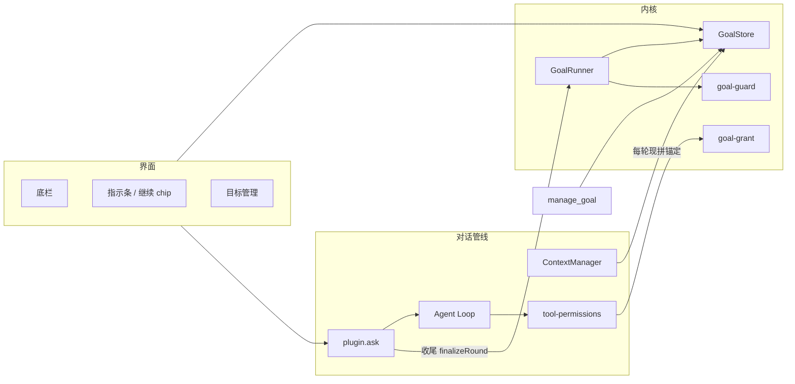
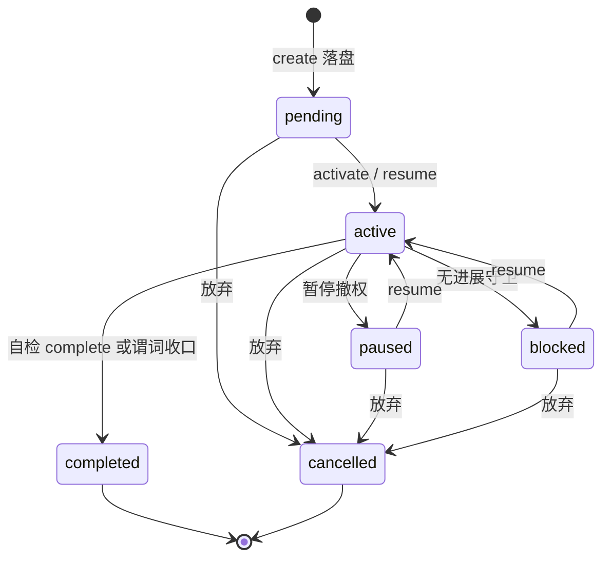
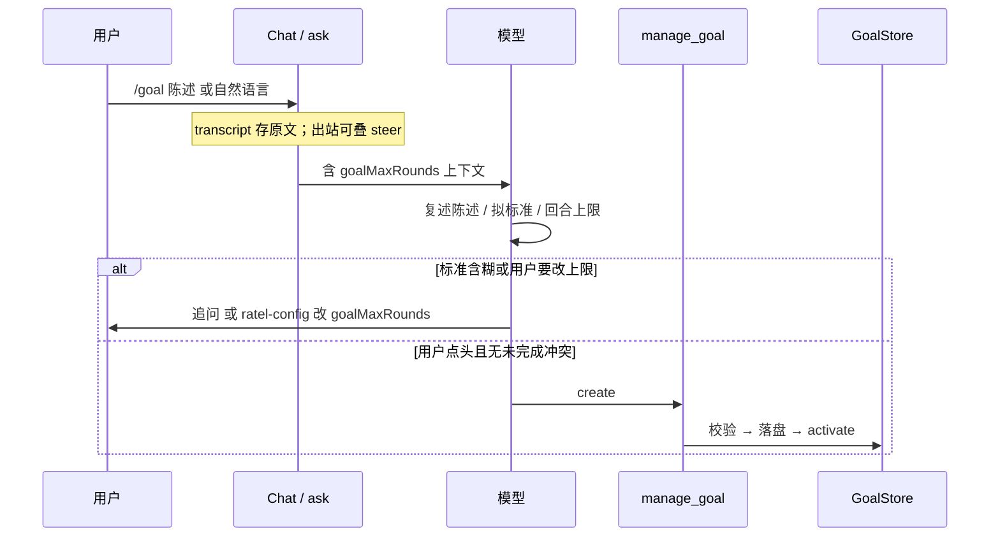

# Goal 模式

> 领域:Agent | 跨会话持久目标：意图 + 完成标准 + 预算，人在场推进
>
> 本文是 Goal 的**架构正文**。产品决策履历与未决任务仍见 [S-GOAL](../../superpowers/specs/2026-08-22-agent-goal-mode.md)。预算与完成两条回路以本文为准；S-GOAL 4.7 / 4.8 里「满轮问收尾 / 轮数用尽才判定」已废止。

---

## 0. 导读

Goal 让用户立一个跨对话仍在的目标。Agent 每个续跑回合从**库的真实状态**重推剩余工作，而不是勾一份预写死的步骤清单。

正文按运行过程展开：先边界与总结构，再对象与状态，再创建 / 续跑 / 打断，再把**预算**和**完成**拆成两条回路，最后落到权限、界面、模块与现网差距。

**不讲：** Heartbeat 后台自动续跑、多目标并行、目标 DAG、跨设备同步。这些是明确非目标。

---

## 1. 目标与边界

### 1.1 要解决什么

对话默认是一轮一答。整理一批笔记、按标准补属性、长篇共创，会跨很多回合、甚至换会话。若只靠聊天记录：

- compact 之后模型会忘「还在干什么」；
- 逐步确认会把批量写入拆碎；
- 预先写死的 `{text, done}` 步骤既不是模型真正的决策依据，也恢复不了工作现场。

笔记库本身就是持久状态。「哪些文件还缺属性」可以随时扫出来。Goal 因此只存三件套：**意图、完成标准、预算**；步骤不落盘。

### 1.2 设计目标

1. 自然语言立目标；确认完成标准后落盘；可跨会话恢复。
2. 能结构化的用代码谓词验收；不能的由模型对照标准自检，人点头后关闭。
3. 目标级路径授权（grant）覆盖批量写入，随时可撤。
4. 成本有界：回合内步数 / 可选 token 软顶 / 跨回合轮数。
5. 防漂移（每轮锚定）+ 防空转（无进展则 blocked）。

### 1.3 非目标

- 定时或后台自动续跑（v1 必须人在场点继续或说话）。
- 用户可见的目标队列；未完成目标全局至多一条。
- 用 Skill 冒充引擎（Skill 不能跨会话授权，也不能在 compact 后保住锚定）。
- 静默删除或静默搬进归档。
- 完成当下询问去留或代写总结笔记。

---

## 2. 总体设计

Goal 是 Harness 内置子系统，不是工具自己的账本。`manage_goal` 只是给模型的手柄；单活、授权、锚定、计轮、谓词收口都在内核。



### 2.1 模块职责

| 模块 | 职责 | 不做 |
|---|---|---|
| `GoalStore` | CRUD、原子落盘、单活仲裁、会话绑定、归档/损坏隔离 | 不调 LLM、不扫 frontmatter |
| `GoalRunner` | `ask` 尾部记账：usage、计轮、谓词收口、无进展、预算检查 | 不渲染 UI、不替代模型自检 |
| `goal-guard` | 无进展与三层预算纯函数 | 无 I/O |
| `goal-grant` | grant glob 校验；在场时白名单写入免逐笔确认 | 不覆盖 deny / 破坏性工具 |
| `manage_goal` | 模型侧 create / update / list / pause / resume / cancel / complete | 无 archive action |
| ContextManager `goal` 注入段 | 每轮 ephemeral 拼锚定 | 不写入 `session.messages` |
| 五面 UI | 提醒、续跑、列表、设置预算 | 不自己改完成标准语义 |

### 2.2 两条独立回路

这是整份设计的中轴，后面流程都按它裁。

| 回路 | 管什么 | 触达时问什么 |
|---|---|---|
| **预算** | 这段工作还烧不烧（`maxRounds` 等） | 加轮 / 先停 / 放弃。**不问完成** |
| **完成** | 标准满没满 | 自检型：模型随时可对照标准，问人后 `complete`；谓词型：计轮回合末代码关 |

`maxRounds` 是创建时写入**这条** goal 的消耗上限，是估计，不是验收日程。估少了就给这条加轮；估多了提前达标就关。全局设置 `goalMaxRounds` 只影响下一次 create，改它不会抬高已存在目标的上限。

日常回合在**绑定会话**里必须把完成标准带进锚定：这就是聚焦机制。同会话里聊别的，标准仍在——故意如此，不按「话题变了」自动摘掉。复杂度低的目标可以第 1、2 轮关闭；不要等「最后一轮」。

禁止：满轮把「完成」当成加轮的替代项；禁止每条用户消息都走一遍 `complete` 工具。

---

## 3. 核心对象与状态

### 3.1 落盘记录

路径：`.obsidian/plugins/ratel-vault/goals/<id>.json`（原子写）。`archive/` 与 `corrupt/` 不参与未完成扫描。

```typescript
interface AgentGoal {
  version: 1;
  id: string;
  objective: string;              // 创建后不可变；改意图 = cancel + 重建
  completionCriteria: {
    text: string;                 // 可检验的标准；空或与 objective 相同则拒建
    predicate?: {                 // 可选；v0 仅此一类
      kind: 'frontmatter-all';
      pathGlob: string;
      property: string;
    };
  };
  progressNote: string;           // 模型维护的游标；辅助。真相在库
  status: GoalStatus;
  blockedReason?: string;
  activeSessionId?: string;       // 续跑只发生在绑定会话
  roundsDone: number;
  maxRounds: number;              // 创建时取当时 settings.goalMaxRounds
  usage: { inputTokens: number; outputTokens: number };
  grant: string[] | null;         // vault 相对 glob；null = 无目标级授权
  birthSessionId: string;         // 仅溯源
  createdAt: string;
  updatedAt: string;
}
```

设置里与 Goal 相关、但是**全局默认**而非单条开小灶：`goalMaxRounds`、`goalRoundTokenSoftCap`（0=关）、`goalArchiveDays`。改上限走 `ratel-config` + `update_app_config`，不写进下一次 `create` 参数凑数。

### 3.2 状态机

未完成：`pending` | `active` | `paused` | `blocked`。全局至多一条。终态：`completed` | `cancelled`，永不自动删。



| 状态 | 含义 | grant | 占未完成坑 |
|---|---|---|---|
| `pending` | 落盘瞬间；用户路径上通常立刻 activate。遗留 pending 是脏数据 | 否 | 是 |
| `active` | 正在推进，全局至多一个 | 在场（本会话绑定）才有效 | 是 |
| `paused` | 人显式挂起 | 失效 | 是 |
| `blocked` | 无法推进，等人裁决 | 失效 | 是 |
| `completed` / `cancelled` | 终态 | 否 | 否 |

**会话占用：** activate / resume 写入 `activeSessionId`。其它会话看到「目标在另一场对话」。onload 或继续 chip 接管 = 绑定转移到当前会话。

切走 / `/new`：本回合 abort，goal 仍 `active`。**绑定字段仍指向原会话**（不是清空）：原会话再打开，锚定与 grant 按在场规则恢复；新会话不注入锚定、grant 因会话不匹配而失效。人在新会话仍能从底栏 / 指示条看见「有未完成目标」，那是提醒不是聚焦。要在新会话推进，必须显式接管。

想摘掉聚焦（同会话也不再带着标准）：**暂停**。换会话只是换房间，不停目标。

goal grant **不进入**会话级「本次不再询问」。后者 `/new` 即清；前者跟 goal 文件走。

---

## 4. 核心流程

### 4.1 创建：先对话确认，再落盘

入口：`/goal <陈述>`、自然语言「立个目标」、模型从批量意图提议。空 `/goal` 只提示用法。不弹创建表单。



硬约束：

- 本轮用户消息仍是 `/goal <非空陈述>` 时，`create` 必须拒绝（斜杠同一回合不许抢建）。
- 已有未完成目标：不落第二条；模型当面问放弃当前还是继续当前。
- `criteria.text` 为空或等于 `objective` → 本地拒绝。
- grant 默认空；用户在确认里主动给目录 glob 才带。
- `objective` 创建后不可变。

### 4.2 续跑：人在场推进

触发：底栏、继续 chip、对话里说继续 / 直接打字（本会话已绑定且 Strip 已是等待输入时）。

回合开始：ContextManager 注入锚定 → 模型扫库重推剩余工作 → 命中 grant 的写入免逐笔确认。

回合结束：`plugin.ask` 尾部 `GoalRunner.finalizeRound`。

**计轮：** 每次 `ask` 都累加 usage。仅当「显式续跑 `goalRound: true`」或「本回合至少一次 grant 范围成功写入」才 `roundsDone++`，并跑谓词、无进展、预算检查。普通插话零写入不计轮、不烧守卫。中止（Abort）只记已发生的 usage，不计轮、不改 status。

### 4.3 打断

对齐现网 `AbortSignal`：流中掐断，不等工具写完，已写入不回滚。不承诺「先写 progressNote 再停」。

| 触发 | 流 | status | grant |
|---|---|---|---|
| 停止钮 / 插话 | 立即 abort | 仍 `active` | 在场则仍有效 |
| 切会话 / `/new` | 随会话终止 | 仍 `active`，绑定仍指原会话 | 新会话失效；回到原会话则仍有效 |
| 暂停 | 停止 + 撤权 | `paused`，清除绑定 | 失效 |

文案用「已停止，等待输入」，不用「挂起」（与 `paused` 混淆）。

---

## 5. 预算回路与完成回路

### 5.1 三层预算（只问还烧不烧）

| 层 | 上限 | 触达 |
|---|---|---|
| 回合内步数 | Agent Loop `maxSteps` | 硬顶，结束本回合 |
| 回合内 token | `goalRoundTokenSoftCap`，默认关 | **回合结束后**检查；触达则本回合收尾，不算 blocked；v1 不在 ask 中途截停 |
| 跨回合轮数 | 本条 `maxRounds` | **预算耗尽待裁决**，见下。不问完成 |

满轮不是 `blocked`。`blocked` 只表示卡住（无进展、缺密钥、重复失败）。

满轮三选一（完成不是选项）：

| 选择 | 效果 |
|---|---|
| **加轮** | 提高**本条** `maxRounds`（`manage_goal update`），然后才能再计轮续跑 / grant 推进。不要去改全局 `goalMaxRounds` 冒充加轮 |
| **先停** | 不改上限。挡住计轮续跑与 grant 免确认推进。目标仍 `active`，同会话锚定仍在（聚焦未解除） |
| **放弃** | `cancelled`，走放弃一框 |
| （另）**暂停** | 人主动离开聚焦：撤权 + 摘锚定。满轮对话框不必把暂停做成第四按钮，目标管理随时可暂停 |

满轮后同会话仍注入锚定——聚焦还在，只是保险丝熔了。挡的是「未加轮还当预算内干活」，不是把目标藏起来。闲聊可以；模型若仍去写 grant 范围，权限或 runner 应拒绝并提示先加轮或暂停。

回合内 `endRound`（步数硬顶 / token 软顶）：结束**这一回合**，不改变 goal status，也不等于满轮。下一轮用户仍可说话；不自动再开 `goalRound`。

`checkBudgets` 满轮动作的语义是「预算耗尽待裁决」，不是「问收尾」。不得按「加轮或完成」接到 UI。

### 5.2 完成（只问标准满没满）

| 类型 | 谁判 | 何时关 |
|---|---|---|
| 自检型（仅 `criteria.text`） | 模型对照锚定里的标准；人点头 | `manage_goal complete`。引擎**从不**给这段文字打分 |
| 谓词型 `frontmatter-all` | `GoalRunner` 扫 metadataCache（写入路径缓存滞后则读文件兜底） | 计轮回合末剩余集合为 0 → `completed`。模型禁止再 `complete` |

自检型关闭时机（任意一轮都可以，与 `roundsDone` 无关）：

- 模型对照标准认为已满足，先简述证据再问人；
- 用户说收工或问完没完，本轮必须表态（已满足 / 还差什么）。

未满足：继续推进，必要时 `update` `progressNote`。不要每轮调用 `complete`。不要因为快满轮或已满轮就改口完成。

完成即关掉：status → `completed`，JSON 留在列表。不问归档、不去留弹窗。归档只在目标管理里人手点。

### 5.3 锚定与提示词两层

**静态层（写死的教法）：** `agent.rag.toolGuide` / `manage_goal` description 说明怎么立目标、怎么 complete。不含某条目标的陈述或标准。有无目标都会带（只要拼了工具指引）。可用设置里的 prompt 覆盖改文案。

**动态层（这条目标的聚焦）：** `toMessages()` 现拼 system 段，不入库。内容：`objective` + `completionCriteria.text` + `progressNote`，自限约 2048 字节。compact / trim / 消息配对都吃不到它。每次投影都现拼，不必另做「每 8 步伪造消息」。

注入条件：当前 `ask` 的 session === `activeSessionId` 且 `status === 'active'`。否则 `null`。

这就是聚焦：绑定会话里每一条用户消息都带着标准，不论这句话像不像在推进目标。短期去干别的、仍留在这场对话里，标准继续在——合理，因为 Goal 的职责就是把这场对话钉在目标上。要暂时不当目标会话：暂停，或去新会话（新会话不注入，直到接管）。

模型随时能对照标准判定完成；简单目标可以早关。不要每轮调用 `complete` 工具。

### 5.4 无进展守卫

仅在**计轮**回合之间比较。比较用的上一轮快照在 runner 内存里，插件重载后失去上一轮，不会误触发（等于守卫从下一对计轮回合重新开始）。

- 有谓词：剩余集合大小连续两轮不降 → `blocked`。
- 无谓词：grant 成功写入连续两轮为 0 → `blocked`。
- `progressNote` 文本不参与判定，只附在原因里。

点继续 chip 即使零写入也计轮。连续两次空转继续会触发无谓词守卫——这是防空转，不是 bug。校验未过但还能推进，不算 blocked。

---

## 6. 权限模型

优先级：`deny` > 破坏性逐次确认 > **goal grant** > 会话 grant > 档位。deny 全链最高。

grant 白名单仅 `write_note` / `edit_note` / `append_note`（将来才可能加 `update_frontmatter`）。路径须命中 glob 且通过 `validateVaultPath`。

永不覆盖：`delete_note`、`forget_memory`、`update_app_config`、一切 `mcp__*`、`run_skill_script`、`open_settings`、configDir。

glob 必须有具体目录前缀（如 `projects/**`）。拒绝裸 `**`、vault 根、空、绝对路径、`..`。

生效：`status === 'active'` **且** 当前会话 === `activeSessionId`。切走或 `paused` 即失效，无需另清字段。

停止 ≠ 暂停。撤权：目标管理暂停，或对话 `manage_goal pause`。底栏与 Strip 不做暂停钮。

---

## 7. 界面分工（五面）

用户可见文案走 i18n，不用 emoji。

| 面 | 作用 |
|---|---|
| 底栏 `StatusBarItem` | 全局短提醒（受阻 / 进行中 / 暂停 / 待归档）。零目标不显示。待归档点击打开目标管理 |
| Chat 指示条 | 未完成目标跨会话常显：回合数字、等待输入、绑在其他会话、暂停、受阻。条在提醒人「目标还在」；**不**等于新会话已注入锚定 |
| 继续 chip | 只在需要「接管 / 捡起脏 pending」时出现；本会话已绑定等待输入则不显示（直接打字即推进）。输入非空或正在跑则隐藏 |
| 动作确认 | create 无表单；resume 小确认；complete 无弹窗；cancel 一框（留列表 / 归档 / 取消关窗不改 status）；pause 无 Modal |
| 目标管理 + 设置 | 列表与行内暂停/恢复/放弃/归档在独立 Modal。设置页只留回合上限、token 软顶、待归档天数 |

动效：进行中输入壳可慢扫 Border Beam；思考球只在消息流、且仅真在跑。Strip 不叠第二颗球。尊重 `prefers-reduced-motion` 与聊天动效开关。

`UserStatus` 只喂诊断抽屉，不塞 goal 字段。Strip 整行点击仍开抽屉。

---

## 8. 工具面

`manage_goal` 单工具多 action：

| action | 权限意向 | 说明 |
|---|---|---|
| create | allow（对话已确认） | 斜杠同回合硬拒；本地校验标准 |
| update | allow | 进度游标；加轮时改本条 `maxRounds`（不得拿全局设置顶替） |
| list | allow | 含状态明细 |
| pause | allow | 撤权 |
| resume | ask | 人在场落锤 |
| cancel | ask | 放弃一框 |
| complete | ask（仅自检型） | 对话点头后关闭；谓词型禁调 |

没有 archive。模型不能代归档。

---

## 9. 技术实现映射

| 职责 | 位置 |
|---|---|
| 存储 | `src/core/goal-store.ts` |
| 收口 / 锚定文本 | `src/core/goal-runner.ts` |
| 守卫 / 预算纯函数 | `src/core/goal-guard.ts` |
| grant | `src/core/goal-grant.ts`；钩入 `src/core/tool-permissions.ts` |
| 工具 | `src/tools/manage-goal.ts` |
| 斜杠 / 硬闸 / steer | `src/main.ts` `ask()`；`src/ui/chat/` 发送路径 |
| 锚定注入 | `src/core/context-manager.ts` PromptInjector `id: 'goal'` |
| 底栏 | `src/ui/goal/goal-status-bar.ts` |
| chip / 行操作 | `src/ui/goal/pick-*.ts` |
| 目标管理 | `src/ui/goal/GoalManageModal.ts` |
| 设置预算 | `src/ui/settings/goal-setting-page.ts` |
| 提示词 | `src/prompts/defaults/zh.ts`（toolGuide + `manage_goal` description） |

`GoalCreateModal` 不在创建路径上，文件可留作历史。

---

## 10. 运行保障

- **损坏：** 解析失败移入 `goals/corrupt/` 并 Notice，不静默丢。
- **归档：** 终态超过 `goalArchiveDays` 只标待归档，不在 onload/心跳里批量 move。全部归档必须确认且写明条数。
- **单活：** store `activate` 拒绝双活。
- **成果沉淀 v1：** 若用户要写总结，用现有 `write_note` 对话确认；不绑未立项的 `append_to_daily`。

---

## 11. 与当前实现的差距

对照 §5 的实现缺口已在本轮收口:`update.maxRounds`、满轮停 grant/计轮、锚定与提示词不再把完成绑到轮数。切会话仍保留原会话绑定(有意为之)。

`endRound`(步数/token 软顶)仍只结束 Agent 本回合,不改 goal status,没有单独 UI——与「不自动续轮」一致,不另接线。

---

## 12. 为何不是 Skill

Skill 教得了「怎么开口立目标」。做不到：跨会话还在、grant 免确认、compact 后锚定仍在、底栏与 chip、单活仲裁、`frontmatter-all` 扫库。这些必须是 store + 权限钩子 + runner 挂 `ask` 尾部 + 五面 UI。

---

## 13. 参考

- 产品规格：[S-GOAL](../../superpowers/specs/2026-08-22-agent-goal-mode.md)
- 实施计划：[P-GOAL-1](../../superpowers/plans/2026-08-22-agent-goal-mode.md)、[P-GOAL-CONFIRM](../../superpowers/plans/2026-09-07-goal-create-confirm.md)
- 相邻：[agent-loop](agent-loop.md)、[context-manager](context-manager.md)、[tools](tools.md)、[host/persistence](../host/persistence.md)
- 被取代的步骤账本：[S-TASK](../../superpowers/archive/S-TASK/2026-08-19-agent-task-store.md)
- 行业参照：DeepSeek Harness goal 工具；Manus recitation；Copilot coding agent 把状态外置到 repo；AutoGPT 无界循环反面教材
