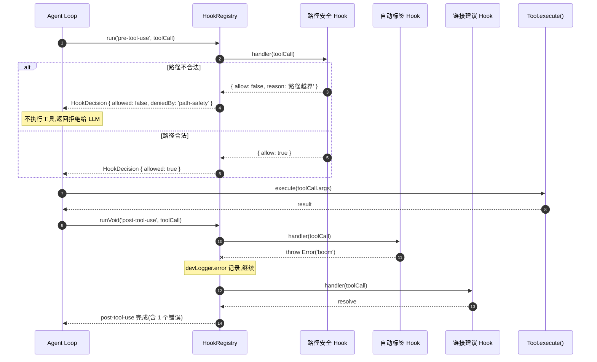

# 钩子系统

> 领域:Agent | 知识治理与安全钩子注册中心,按阶段组织工具的 pre/post 钩子,支持阻断式决策

---

## 1. 职责

提供工具执行前后扩展点,让安全校验(路径安全、权限门控)与知识治理逻辑(自动标签、链接建议、索引刷新)可以独立注册,不侵入工具主流程。

**不做的事**:
- 不负责工具执行(属于 [tools](tools.md))
- 不负责工具结果格式化(属于 [agent-loop](agent-loop.md))
- 不负责 Hook 日志持久化(属于 [persistence](../host/persistence.md) 的 `hookLog` 仓库)
- 不负责权限配置存储(属于 [settings](../host/settings.md) 的 `toolPermissions` / `trustMode`)

---

## 2. 设计原则

### 2.1 阶段化分组

**决策**:钩子按"阶段字符串"分组,对齐 Claude Code 的 `pre-tool-use` / `post-tool-use` / `post-tool-failure` 三阶段模型。

| 阶段 | 触发时机 | 可阻断 | 典型用途 |
|---|---|---|---|
| `pre-tool-use` | **所有**工具执行前 | ✅ 是 | 路径安全校验、权限门控、参数校验 |
| `post-tool-use` | 写工具执行成功后 | ❌ 否 | 自动标签、链接建议、索引刷新 |
| `post-tool-failure` | 工具执行失败后 | ❌ 否 | 错误日志、降级通知 |

**原因**:
- 阶段语义清晰,与 Claude Code 命名对齐便于团队认知迁移
- `pre-tool-use` 对所有工具生效(含只读)— 路径安全校验对 `read_note` / `grep` 同样必要
- 字符串 key 而非枚举:第三方扩展可自定义阶段,无需改核心代码
- 预留 `pre-read` / `post-read` 不再需要 — `pre-tool-use` 已覆盖读工具

### 2.2 可阻断 + 错误隔离

**决策**:
- `pre-tool-use` 钩子返回 `HookResult = { allow: boolean; reason?: string } | void`,首个 `allow: false` 立即短路,拒绝工具执行
- `post-tool-use` / `post-tool-failure` 钩子返回 `void`,不可阻断,单个抛错被 `try/catch` 吞掉只记 `devLogger.error`,不阻断后续钩子

**原因**:
- 安全钩子(路径校验)必须能阻断 — 这是 S-VAULT-TOOLS 三层防御的第二层
- 治理钩子(自动标签)是"尽力而为",不应阻塞用户的核心写作流程
- 一个坏钩子(如调用外部 API 超时)不应影响其他钩子

### 2.3 双 API:run / runVoid

**决策**:

```typescript
/** 可阻断 — 用于 pre-tool-use,返回决策结果 */
async run(phase: string, toolCall: ToolCall): Promise<HookDecision>;

/** 不可阻断 — 用于 post-tool-use / post-tool-failure,仅执行副作用 */
async runVoid(phase: string, toolCall: ToolCall): Promise<void>;
```

**原因**:
- `run` 返回 `HookDecision { allowed, deniedBy?, reason? }`,Agent Loop 据此决定是否执行工具
- `runVoid` 向后兼容旧 `run` 签名(返回 `void`),用于无阻断需求的 post 阶段
- 类型层面区分可阻断与不可阻断,避免在 post 阶段误用阻断逻辑

### 2.4 异步接口

**决策**:钩子函数签名强制 `async`,返回 `Promise<HookResult | void>`。

**原因**:
- 钩子可能需要调 LLM(如自动生成标签)、读索引(如链接建议)、写文件(如元数据)
- 统一异步接口避免"同步钩子"和"异步钩子"两套调用逻辑
- `await` 串行执行天然提供顺序保证

---

## 3. 核心接口

### 3.1 ToolCall

钩子接收的 `ToolCall` 类型(来自 `ports/llm`):

```typescript
interface ToolCall {
    name: string;                          // 工具名,如 'write_note'
    args: Record<string, unknown>;         // 工具参数
}
```

### 3.2 HookResult 与 HookDecision

```typescript
/** 钩子返回值 — pre-tool-use 可阻断 */
interface HookResult {
    allow: boolean;                        // false 则拒绝工具执行
    reason?: string;                       // 拒绝原因,回传给 LLM
}

/** HookRegistry.run() 返回的最终决策 */
interface HookDecision {
    allowed: boolean;                      // 是否放行
    deniedBy?: string;                     // 拒绝的钩子名(便于排查)
    reason?: string;                       // 拒绝原因
}
```

### 3.3 HookRegistry API

```typescript
class HookRegistry {
    /** 注册钩子到指定阶段,同阶段允许多个,按注册顺序串行执行 */
    register(phase: string, handler: HookHandler): void;

    /** 可阻断执行 — 用于 pre-tool-use,首个 allow:false 短路 */
    async run(phase: string, toolCall: ToolCall): Promise<HookDecision>;

    /** 不可阻断执行 — 用于 post 阶段,单个抛错被吞掉并记录 */
    async runVoid(phase: string, toolCall: ToolCall): Promise<void>;
}

type HookHandler = (toolCall: ToolCall) => Promise<HookResult | void>;
```

---

## 4. 执行流程



**关键路径**:
- `run` 内部对每个 handler 检查返回值,首个 `{ allow: false }` 立即短路并返回 `HookDecision`
- `runVoid` 内部对每个 handler 用 `try/catch` 包裹,catch 块只 `devLogger.error`,不 re-throw

---

## 5. 阶段定义

| 阶段 | 触发时机 | 可阻断 | 适用工具 | 典型用途 |
|---|---|---|---|---|
| `pre-tool-use` | 所有工具执行前 | ✅ | 全部 9 个 | 路径安全校验、权限门控、参数校验 |
| `post-tool-use` | 写工具执行成功后 | ❌ | write/append/edit/delete | 自动标签、链接建议、索引刷新 |
| `post-tool-failure` | 工具执行失败后 | ❌ | 全部 | 错误日志、降级通知 |

---

## 6. 注册示例

```typescript
const hooks = new HookRegistry();

// pre-tool-use: 路径安全校验(不可省略,所有工具生效)
hooks.register('pre-tool-use', async (tc) => {
    const path = tc.args.path as string | undefined;
    if (!path) return { allow: true };
    const error = validateVaultPath(path);
    if (error) {
        return { allow: false, reason: `路径不合法: ${error}` };
    }
    return { allow: true };
});

// pre-tool-use: 参数校验
hooks.register('pre-tool-use', async (tc) => {
    if (tc.name === 'write_note' && !tc.args.path) {
        return { allow: false, reason: 'write_note 缺少 path 参数' };
    }
    return { allow: true };
});

// post-tool-use: 自动生成标签(调 LLM)
hooks.register('post-tool-use', async (tc) => {
    if (tc.name !== 'write_note') return;
    const content = tc.args.content as string;
    const tags = await llm.chat([{ role: 'user', content: `为以下内容生成 3 个标签:${content}` }]);
    // 写入笔记 frontmatter...
});

// post-tool-use: 链接建议(查索引)
hooks.register('post-tool-use', async (tc) => {
    if (tc.name !== 'write_note') return;
    if (!settings.autoSuggestLinks) return;
    const similar = await vectorIndex.search(embed(tc.args.content), 5);
    const filtered = similar.filter(s => s.score >= settings.linkConfidenceThreshold);
    // 推送到 UI...
});
```

---

## 7. 边界

| 与...的接口 | 方向 | 说明 |
|---|---|---|
| [agent-loop](agent-loop.md) | 被调用 | Agent Loop 在工具执行前调 `hooks.run('pre-tool-use')`,成功后调 `hooks.runVoid('post-tool-use')` |
| [tools](tools.md) | 间接 | 钩子接收的 `ToolCall` 与工具注册的 `name` / `args` 对齐;所有工具均走 pre-tool-use |
| [settings](../host/settings.md) | 依赖 | 权限门控读取 `toolPermissions` / `trustMode` 配置 |
| [persistence](../host/persistence.md) | 依赖(可选) | post-tool-use 钩子可写 `hookLog` 仓库记录执行日志 |

---

## 8. 安全设计(三层防御)

钩子系统是 S-VAULT-TOOLS 三层防御的第二层。完整链路:

```
LLM 工具调用
  │
  ├─ 第 1 层:权限门控(allow/ask/deny + trustMode)
  │     └─ settings.toolPermissions[name] → 拒绝 / 放行
  │
  ├─ 第 2 层:pre-tool-use Hook(本模块)
  │     └─ 路径安全 hook: validateVaultPath() → 拒绝 / 放行
  │
  ├─ 第 3 层:Adapter 路径沙箱(硬性约束)
  │     └─ ObsidianVault 内 validateVaultPath() 兜底校验
  │
  └─ 工具 execute()
```

**第 2 层与第 3 层的区分**:
- 第 2 层(pre-tool-use hook)是**可配置、可扩展**的 — 用户可注册自定义钩子
- 第 3 层(Adapter 沙箱)是**硬性约束、不可关闭**的 — 即使 hook 被绕过,Adapter 仍兜底

详见 [S-VAULT-TOOLS spec](../../superpowers/specs/2026-06-26-vault-file-tools-design.md) §8 安全设计。

---

## 9. 演进路径

| 阶段 | 能力 | 状态 |
|---|---|---|
| 当前 | pre-tool-use(可阻断) + post-tool-use / post-tool-failure(不可阻断) | ✅ 已实现 |
| 后续 | 钩子优先级 + 超时控制 | 待规划 |
| 远期 | 并行执行(仅 post 阶段) | 远期 |
