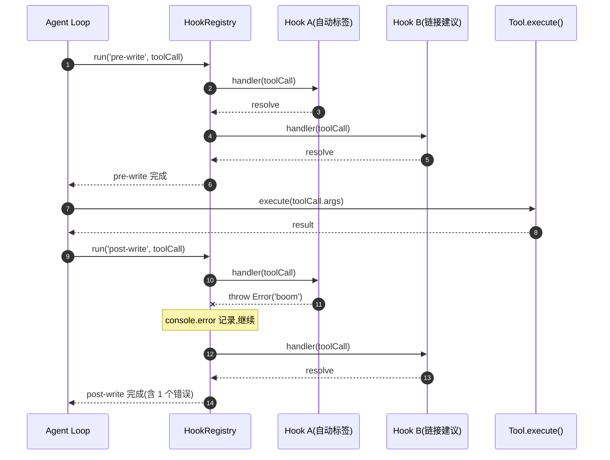

# 钩子系统

> 领域:Agent | 知识治理钩子注册中心,按阶段组织写工具的 pre/post 钩子

---

## 1. 职责

提供写工具(create_note / update_note 等)执行前后的扩展点,让知识治理逻辑(自动标签、链接建议、元数据校验等)可以独立注册,不侵入工具主流程。

**不做的事**:
- 不负责工具执行(属于 [tools](tools.md))
- 不负责工具结果格式化(属于 [agent-loop](agent-loop.md))
- 不负责 Hook 日志持久化(属于 [persistence](../host/persistence.md) 的 `hookLog` 仓库)

---

## 2. 设计原则

### 2.1 阶段化分组

**决策**:钩子按"阶段字符串"分组,目前只用 `pre-write` / `post-write`。

**原因**:
- 阶段语义清晰:`pre-write` 在工具执行前,`post-write` 在工具执行后
- 预留扩展点:`pre-read` / `post-read` 可后续添加,不改接口
- 字符串 key 而非枚举:第三方扩展可自定义阶段,无需改核心代码

### 2.2 串行执行 + 错误隔离

**决策**:同阶段多个钩子按注册顺序串行执行,单个钩子抛错被 `try/catch` 吞掉,只打 `console.error`,不阻断后续钩子或主流程。

**原因**:
- 知识治理钩子是"尽力而为",不应阻塞用户的核心写作流程
- 一个坏钩子(如调用外部 API 超时)不应影响其他钩子
- 错误被记录便于排查,但用户无感知

### 2.3 异步接口

**决策**:钩子函数签名是 `(toolCall: ToolCall) => Promise<void>`,强制异步。

**原因**:
- 钩子可能需要调 LLM(如自动生成标签)、读索引(如链接建议)、写文件(如元数据)
- 统一异步接口避免"同步钩子"和"异步钩子"两套调用逻辑
- `await` 串行执行天然提供顺序保证

---

## 3. 核心接口

### 3.1 ToolCall

钩子接收的 `ToolCall` 类型(来自 `ports/llm`):

```typescript
interface ToolCall {
    name: string;                          // 工具名,如 'create_note'
    args: Record<string, unknown>;         // 工具参数
}
```

### 3.2 HookRegistry API

```typescript
class HookRegistry {
    /** 注册钩子到指定阶段,同阶段允许多个,按注册顺序串行执行 */
    register(phase: string, handler: (toolCall: ToolCall) => Promise<void>): void;

    /** 串行执行指定阶段的所有钩子,任一抛错被吞掉并记录 */
    async run(phase: string, toolCall: ToolCall): Promise<void>;
}
```

---

## 4. 执行流程



**关键路径**:`run` 内部对每个 handler 用 `try/catch` 包裹,catch 块只 `console.error`,不 re-throw。

---

## 5. 阶段定义

| 阶段 | 触发时机 | 典型用途 |
|---|---|---|
| `pre-write` | 写工具执行前 | 参数校验、权限检查、自动补全字段 |
| `post-write` | 写工具执行后 | 自动标签、链接建议、索引刷新、Hook 日志记录 |
| `pre-read`(预留) | 读工具执行前 | 访问日志、权限检查 |
| `post-read`(预留) | 读工具执行后 | 读后分析、推荐触发 |

---

## 6. 注册示例

```typescript
const hooks = new HookRegistry();

// pre-write: 参数校验
hooks.register('pre-write', async (tc) => {
    if (tc.name === 'create_note' && !tc.args.path) {
        throw new Error('create_note 缺少 path 参数');
    }
});

// post-write: 自动生成标签(调 LLM)
hooks.register('post-write', async (tc) => {
    if (tc.name !== 'create_note') return;
    const content = tc.args.content as string;
    const tags = await llm.chat([{ role: 'user', content: `为以下内容生成 3 个标签:${content}` }]);
    // 写入笔记 frontmatter...
});

// post-write: 链接建议(查索引)
hooks.register('post-write', async (tc) => {
    if (tc.name !== 'create_note') return;
    if (!settings.autoSuggestLinks) return;
    const similar = await vectorIndex.search(embed(tc.args.content), 5);
    const filtered = similar.filter(s => s.score >= settings.linkConfidenceThreshold);
    // 推送到 UI...
});
```

---

## 7. 边界

| 与...的接口 | 方向 | 说明 |
|---|---|---|
| [agent-loop](agent-loop.md) | 被调用 | Agent Loop 在工具执行前后调 `hooks.run()` |
| [tools](tools.md) | 间接 | 钩子接收的 `ToolCall` 与工具注册的 `name` / `args` 对齐 |
| [persistence](../host/persistence.md) | 依赖(可选) | post-write 钩子可写 `hookLog` 仓库记录执行日志 |

---

## 8. 演进路径

| 阶段 | 能力 | 状态 |
|---|---|---|
| 当前 | pre-write / post-write + 串行 + 错误隔离 | ✅ 已实现 |
| 后续 | pre-read / post-read 阶段 | 待规划 |
| 远期 | 钩子优先级 + 并行执行 + 超时控制 | 远期 |
