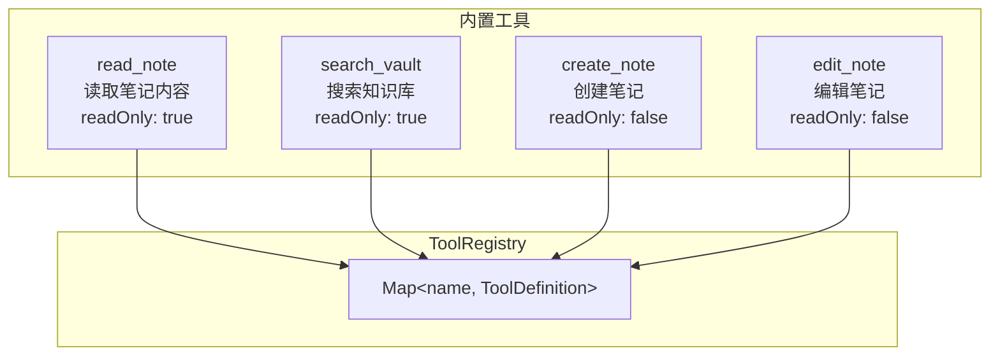
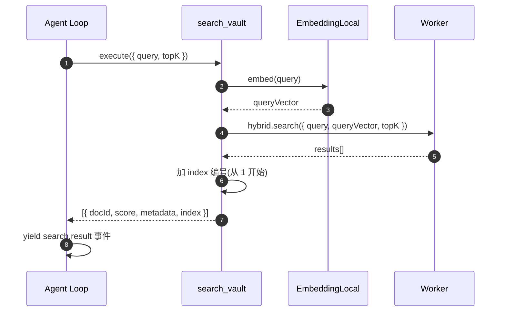
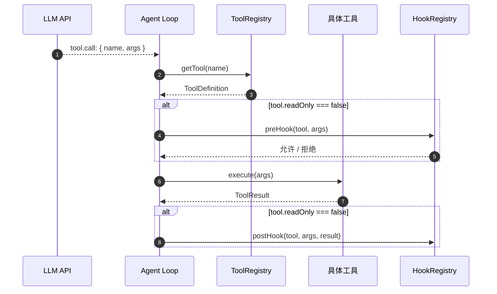

# 工具系统

> 领域:Agent | 注册、发现、调用、返回格式

---

## 1. 职责

管理 Agent 可用的工具:注册、发现、调用、返回格式。工具是 Agent 的能力扩展 — 没有工具,Agent 只能闲聊;有了工具,Agent 能检索知识库、读取笔记、创建内容。

**不做的事**:
- 不负责何时调工具(属于 [agent-loop](agent-loop.md))
- 不负责上下文注入(属于 [context-manager](context-manager.md))
- 不负责具体工具实现(每个工具是独立模块)

---

## 2. 设计原则

### 2.1 职责单一,一个工具做一件事

**决策**:每个工具只做一件事。search_vault 只搜索不返回原文,read_note 只读取不做检索。

**原因**:
- 避免给模型造成困惑(工具职责模糊时模型不知该调哪个)
- 便于独立测试和独立优化
- 模型自主组合工具(先搜后读),比一个大而全的工具更灵活

### 2.2 工具 schema 遵循 JSON Schema

**决策**:工具参数定义用 JSON Schema,与 LLM function calling 协议一致。

**原因**:
- OpenAI / DeepSeek / Anthropic 都用 JSON Schema 描述工具参数
- 无需额外转换层
- LLM 原生理解

### 2.3 只读工具不触发 Hook

**决策**:工具标记 `readOnly: true`,Agent Loop 只对写工具触发 pre/post hook。

**原因**:
- 读操作无副作用,不需要治理
- 写操作有副作用,需要校验和审计

---

### 2.4 工具描述来自提示词 registry(目标)

**决策(待 P-PROMPTS 落地):** `ToolDefinition.description` 与参数 `description` 由 `composeToolDefinitions()` 从 `tool.<name>.*` section 生成,不在 `src/tools/*.ts` 硬编码。

**原因:**
- 与 RAG system 内 `{{toolList}}` 同源,避免指引与 schema 漂移
- 全中文、集中管理

详见 [prompt-management §8.7](prompt-management.md#87-工具-schema-样例tools-参数)。

---

## 3. 工具注册表



**ToolDefinition**:

```typescript
interface ToolDefinition {
  name: string;           // 工具名(唯一)
  description: string;    // 工具描述(LLM 看到)
  parameters: JSONSchema; // 参数 schema
  readOnly: boolean;      // 是否只读
  execute: (args) => Promise<ToolResult>;
}
```

---

## 4. 内置工具

### 4.1 read_note

| 属性 | 值 |
|---|---|
| name | `read_note` |
| description | 读取指定笔记的完整内容 |
| readOnly | true |
| 参数 | `path: string`(vault 路径) |
| 返回 | 笔记全文(Markdown) |

### 4.2 search_vault

| 属性 | 值 |
|---|---|
| name | `search_vault` |
| description | 在知识库中搜索与查询相关的文档。使用向量 + BM25 混合检索,返回带引用编号的结果,用 read_note 读取内容。 |
| readOnly | true |
| 参数 | `query: string`, `topK: number`(默认 5) |
| 返回 | `[{ docId, score, metadata, index }]` |

**调用路径**:



### 4.3 create_note(未来)

| 属性 | 值 |
|---|---|
| name | `create_note` |
| description | 在 vault 中创建新笔记 |
| readOnly | false |
| 参数 | `path: string`, `content: string` |
| 返回 | 创建确认 |

### 4.4 edit_note(未来)

| 属性 | 值 |
|---|---|
| name | `edit_note` |
| description | 编辑已有笔记的内容 |
| readOnly | false |
| 参数 | `path: string`, `oldText: string`, `newText: string` |
| 返回 | 编辑确认 |

---

## 5. 工具调用流程



---

## 6. 工具分类

| 分类 | 工具 | readOnly | 触发 Hook |
|---|---|---|---|
| **检索类** | search_vault | ✅ | ❌ |
| **读取类** | read_note | ✅ | ❌ |
| **写入类** | create_note, edit_note | ❌ | ✅ |
| **管理类** | list_notes, move_note | ❌ | ✅ |

---

## 7. 边界

| 与...的接口 | 方向 | 说明 |
|---|---|---|
| [agent-loop](agent-loop.md) | 被调用 | Agent Loop 决定何时调哪个工具 |
| [rag/retriever](../rag/retriever.md) | 依赖 | search_vault 调用检索器;多查询时触发 query 改写(见 prompt-management §8.4) |
| [host/obsidian-integration](../host/obsidian-integration.md) | 依赖 | read_note / create_note 调用 Vault API |
