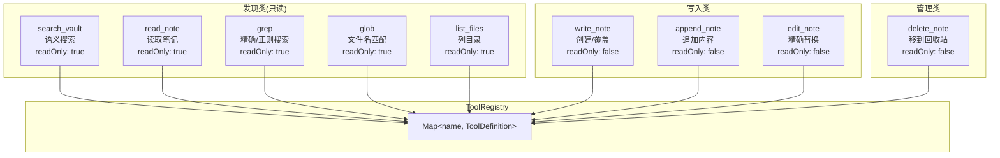
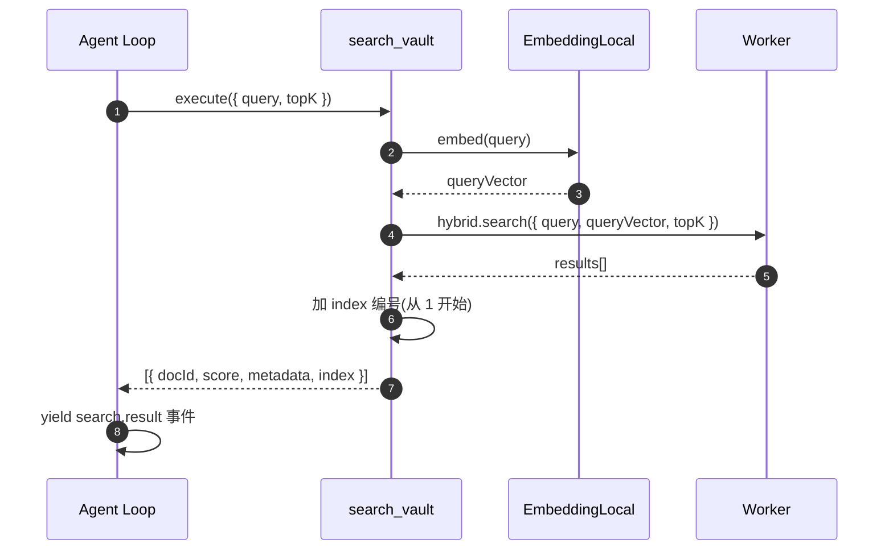
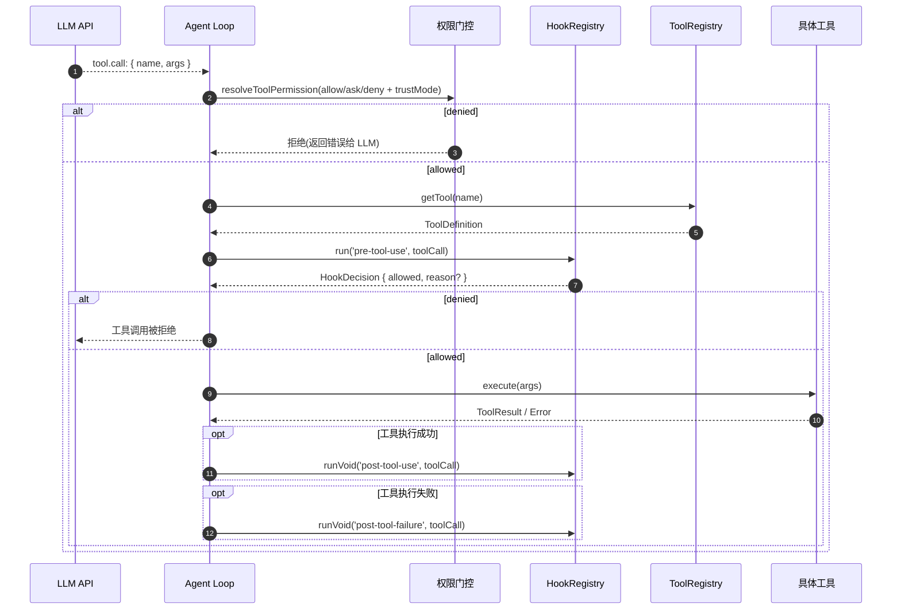

# 工具系统

> 领域:Agent | 注册、发现、调用、返回格式

---

## 1. 职责

管理 Agent 可用的工具:注册、发现、调用、返回格式。工具是 Agent 的能力扩展 — 没有工具,Agent 只能闲聊;有了工具,Agent 能检索知识库、读取笔记、创建内容。

**不做的事**:
- 不负责何时调工具(属于 [agent-loop](agent-loop.md))
- 不负责上下文注入(属于 [context-manager](context-manager.md))
- 不负责具体工具实现(每个工具是独立模块)

---

## 2. 设计原则

### 2.1 职责单一,一个工具做一件事

**决策**:每个工具只做一件事。search_vault 只搜索不返回原文,read_note 只读取不做检索。

**原因**:
- 避免给模型造成困惑(工具职责模糊时模型不知该调哪个)
- 便于独立测试和独立优化
- 模型自主组合工具(先搜后读),比一个大而全的工具更灵活

### 2.2 工具 schema 遵循 JSON Schema

**决策**:工具参数定义用 JSON Schema,与 LLM function calling 协议一致。

**原因**:
- OpenAI / DeepSeek / Anthropic 都用 JSON Schema 描述工具参数
- 无需额外转换层
- LLM 原生理解

### 2.3 所有工具走 pre-tool-use Hook

**决策**:工具标记 `readOnly: true` / `false`,Agent Loop 在**所有**工具执行前调 `pre-tool-use` hook(含权限门控 + 路径校验),写工具执行后额外调 `post-tool-use`。

**原因**:
- 路径安全校验(`validateVaultPath`)对读工具同样必要 — 防止 LLM 构造 `../` 路径读取 vault 外文件
- 权限门控(allow/ask/deny)对所有工具生效 — 用户可禁用任意工具
- 只读工具的 `pre-tool-use` hook 只做校验,不触发知识治理(标签/链接建议等)
- 写工具的 `post-tool-use` hook 触发知识治理(自动标签、链接建议、索引刷新)

详见 [hooks §2.1](hooks.md#21-阶段化分组)。

---

### 2.4 工具描述来自提示词 registry(目标)

**决策(待 P-PROMPTS 落地):** `ToolDefinition.description` 与参数 `description` 由 `composeToolDefinitions()` 从 `tool.<name>.*` section 生成,不在 `src/tools/*.ts` 硬编码。

**原因:**
- 与 RAG system 内 `{{toolList}}` 同源,避免指引与 schema 漂移
- 全中文、集中管理

详见 [prompt-management §8.7](prompt-management.md#87-工具-schema-样例tools-参数)。

---

## 3. 工具注册表



**ToolDefinition**:

```typescript
interface ToolDefinition {
  name: string;           // 工具名(唯一)
  description: string;    // 工具描述(LLM 看到)
  parameters: JSONSchema; // 参数 schema
  readOnly: boolean;      // 是否只读
  execute: (args) => Promise<ToolResult>;
}
```

---

## 4. 内置工具

### 4.1 search_vault

| 属性 | 值 |
|---|---|
| name | `search_vault` |
| description | 在知识库中搜索与查询相关的笔记。使用向量 + BM25 混合检索,返回带引用编号的结果,用 read_note 读取内容。 |
| readOnly | true |
| 参数 | `query: string`, `topK: number`(默认 5) |
| 返回 | `[{ docId, score, metadata, index }]` |

**调用路径**:



### 4.2 read_note

| 属性 | 值 |
|---|---|
| name | `read_note` |
| description | 读取指定笔记的完整内容、元数据与反向链接 |
| readOnly | true |
| 参数 | `path: string`(vault 路径) |
| 返回 | 笔记全文(Markdown) |

### 4.3 grep

| 属性 | 值 |
|---|---|
| name | `grep` |
| description | 全文精确/正则搜索,适用于查找特定汉字、代码片段、固定字符串 |
| readOnly | true |
| 参数 | `pattern: string`, `is_regex?: boolean`, `include?: string`, `path?: string`, `ignore_case?: boolean`, `context_lines?: number`, `max_results?: number` |
| 返回 | `Array<{ file, line, column, match, before[], after[] }>` |

**设计要点**:使用 `vault.cachedRead` 利用 Obsidian 缓存;始终排除 `.obsidian/` 和 `.trash/`;`max_results` 默认 50 提供早退机制。

### 4.4 glob

| 属性 | 值 |
|---|---|
| name | `glob` |
| description | 按文件名 glob 模式查找 Markdown 笔记 |
| readOnly | true |
| 参数 | `pattern: string`, `path?: string` |
| 返回 | `string[]`(匹配的文件路径) |

### 4.5 list_files

| 属性 | 值 |
|---|---|
| name | `list_files` |
| description | 列出 vault 某目录下的文件与子文件夹(非递归) |
| readOnly | true |
| 参数 | `path?: string`(默认根目录) |
| 返回 | `{ path, files[], folders[] }` |

### 4.6 write_note

| 属性 | 值 |
|---|---|
| name | `write_note` |
| description | 创建新笔记或覆盖已有笔记全文 |
| readOnly | false |
| 参数 | `path: string`, `content: string` |
| 返回 | `{ path, created: boolean }` |

### 4.7 append_note

| 属性 | 值 |
|---|---|
| name | `append_note` |
| description | 在笔记末尾追加内容(文件不存在则创建) |
| readOnly | false |
| 参数 | `path: string`, `content: string` |
| 返回 | `{ path, created: boolean }` |

### 4.8 edit_note

| 属性 | 值 |
|---|---|
| name | `edit_note` |
| description | 在笔记中精确替换一段文本。old_string 必须与文件内容完全一致(含缩进),且在文件中唯一 |
| readOnly | false |
| 参数 | `path: string`, `old_string: string`, `new_string: string` |
| 返回 | `{ path, replaced: boolean }` |

**安全设计**:`old_string` 必须唯一匹配(参考 Claude Code Edit 工具)。多次匹配返回错误,要求 LLM 提供更多上下文。使用 `vault.process()` 原子操作避免读写竞态。

### 4.9 delete_note

| 属性 | 值 |
|---|---|
| name | `delete_note` |
| description | 将笔记移到回收站(可恢复) |
| readOnly | false |
| 参数 | `path: string` |
| 返回 | `{ path, trashed: true }` |

**安全设计**:使用 `vault.trash()` 而非 `vault.delete()`,优先系统回收站,失败降级到 Obsidian `.trash` 目录。

---

## 5. 工具调用流程



**三层安全链路**(详见 [hooks](hooks.md) §8 安全设计):
1. 权限门控(allow/ask/deny + trustMode)
2. pre-tool-use hook(路径安全 hook + 可扩展治理)
3. Adapter 路径沙箱(`validateVaultPath` 硬性约束)

---

## 6. 工具分类

| 分类 | 工具 | readOnly | pre-tool-use | post-tool-use |
|---|---|---|---|---|
| **检索类** | search_vault | ✅ | ✅(权限 + 路径) | ❌ |
| **读取类** | read_note | ✅ | ✅(权限 + 路径) | ❌ |
| **发现类** | grep, glob, list_files | ✅ | ✅(权限 + 路径) | ❌ |
| **写入类** | write_note, append_note, edit_note | ❌ | ✅(权限 + 路径 + 治理) | ✅(自动标签、索引刷新) |
| **管理类** | delete_note | ❌ | ✅(权限 + 路径 + 治理) | ✅(索引刷新) |

---

## 7. 边界

| 与...的接口 | 方向 | 说明 |
|---|---|---|
| [agent-loop](agent-loop.md) | 被调用 | Agent Loop 决定何时调哪个工具 |
| [rag/retriever](../rag/retriever.md) | 依赖 | search_vault 调用检索器;多查询时触发 query 改写(见 prompt-management §8.4) |
| [host/obsidian-integration](../host/obsidian-integration.md) | 依赖 | read_note / create_note 调用 Vault API |
