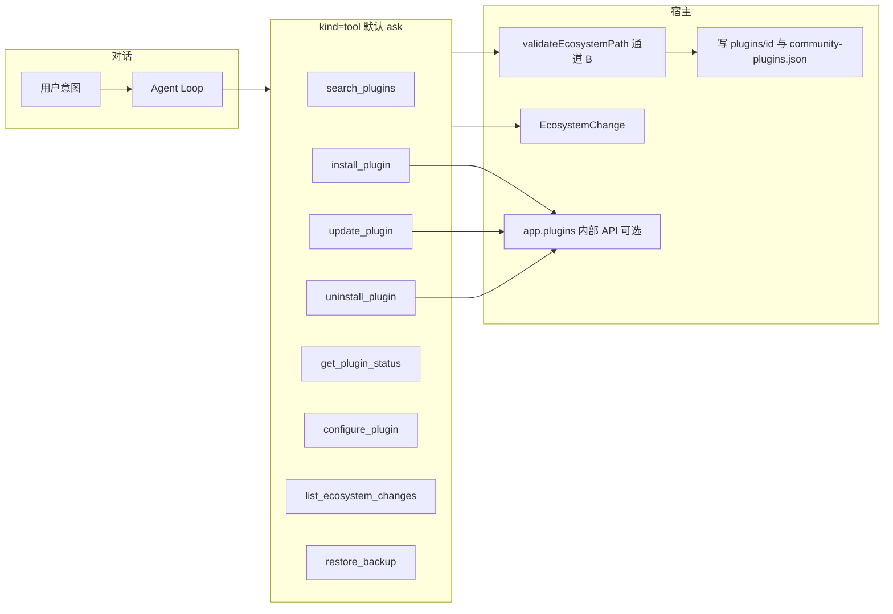

# 社区插件生态（执行层）

> 领域:Host | 对话发现、安装、升级、卸载其他社区插件；确认、备份、回滚
>
> 本文是支柱 C **执行层**的架构正文。配置档案（规范 / 创建 / 对话按 preset 配）见 [plugin-profile](plugin-profile.md)。产品阶段与需求编号见 [prd/ecosystem.md](../../prd/ecosystem.md)、[prd/requirements.md](../../prd/requirements.md)、[S-ECOSYSTEM](../../superpowers/specs/2026-08-20-ecosystem-management-design.md)。

---

## 0. 导读

用户在对话里找插件、装上、升级、卸掉。Ratel **不是** Obsidian 官方的插件管理器，也没有一张「允许管理其他插件」的授权。

本子系统在**桌面端**用配置目录写盘 +（若存在）未文档化的 `app.plugins.*`，把商店清单里的插件装进当前库。入口是对话，不复制官方商店 UI。

**不讲：** 主题与 CSS、商店外 URL、代改核心设置、管理 `ratel-vault` 自己。

---

## 1. 宿主能力（没有官方权限）

Obsidian 公开 Plugin API **没有** install / uninstall。社区插件不能向系统申请这类权限。

| 层 | 事实 |
|---|---|
| 用户环境 | 受限模式必须已关（否则 Ratel 自己也跑不了）；仅桌面（`isDesktopOnly`） |
| 文件 | vault adapter / Node `fs` 可写 `.obsidian/plugins/<id>/` 与 `community-plugins.json` |
| 运行时启用 | 依赖未文档接口：`loadManifests`、`enablePlugin` / `enablePluginAndSave`、部分版本还有 `installPlugin` / `uninstallPlugin` |
| 商店审核 | 先例（BRAT 等）存在；不保证过审。发进社区商店前必须单独过审核口径；README 写出站 |

**产品表述禁止：** 「Obsidian 授权我们安装插件」。应写成：在你确认后，Ratel 在本机为当前库下载商店插件并尝试启用。

内部 API 缺失或抛错时的降级（必须实现）：

1. 仍只写商店三件套 + 启用清单（升级跳过 `data.json`）。
2. 热启用失败 → 告知用户 **Reload app without saving** 或到官方社区插件页启用；不得假装已启用。
3. 不得为热启用去 hook 私有字段到崩溃。

出站：社区清单与 GitHub release；仅用户发起的生态工具触发。域名与失败降级见待立 **ADR-018**。

---

## 2. 与档案层的分工

| 用户阶段 | 子系统 |
|---|---|
| 配置规范、创建配置 skill、对话按档案配置 | [plugin-profile](plugin-profile.md) |
| 寻找、安装、升级、卸载 | **本文** |
| 点名改 `data.json`、备份、回滚 | 本文工具；档案只提供合法 key 列表 |

无档案时，寻找/装卸仍可用。有档案时，装完再把 preset 交给 `configure_plugin`。

---

## 3. 总体设计

通道 A（现有 `validateVaultPath`）继续把整个 `configDir` 对笔记工具挡住。只有生态 adapter 走通道 B：

- 允许：`<configDir>/plugins/<清单或已装校验过的 id>/…`（`id ≠ ratel-vault`）
- 允许：`<configDir>/community-plugins.json`
- 其余配置文件一律拒绝

---

## 4. 对话机制

全部变更类工具默认 **ask**：弹窗含动作、`pluginId`、名称、作者、下载量（能拿到时）、将改路径摘要。用户拒绝则零写盘。

### 4.1 寻找 `search_plugins`

- 数据：官方 `community-plugins.json`（缓存于 pluginDir，默认 7 天）。
- 本地过滤排序，只把 top N 给模型（id、名称、描述、作者、下载量、是否已装）。
- 不把 2MB+ 清单塞进上下文。

### 4.2 安装 `install_plugin`

1. `pluginId` 必须在商店清单中。
2. 确认 → 备份将占用的目录（若已有残缺目录则先记再清）。
3. 下载该插件 GitHub release 的 `main.js` / `manifest.json` / 可选 `styles.css`。
4. 校验 `manifest.id === pluginId`。
5. 写入 `plugins/<id>/`，更新启用清单。
6. 尝试 `loadManifests` + 启用；失败走 §1 降级。
7. 记 `EcosystemChange`。半成品目录必须清掉或明确告诉残留路径。

### 4.3 升级 `update_plugin`

与安装相同拉最新 release，**只覆盖三件套**，禁止覆盖目标 `data.json`。备份含升级前目录快照。

### 4.4 卸载 `uninstall_plugin`

确认列将删除的目录 → 禁用（内部 API 或只改启用清单）→ 目录级备份 → 删除目录。可用 `restore_backup` 恢复。

### 4.5 状态 `get_plugin_status`

已装 id / 名称 / 版本 / 启用态 / 是否落后于商店 latest（latest 查失败则标未知，不阻断卸载与配置）。

### 4.6 配置与回滚

`configure_plugin`、`list_ecosystem_changes`、`restore_backup` 语义仍以 S-ECOSYSTEM 为准：点名 key、前后值、append-only 日志。档案 preset 展开后走同一 `configure_plugin`，不另开写盘通道。

改他人 `data.json` 后，对方插件未必热重载设置；架构允许「已写入，需重载或打开该插件设置页才看见」。不得声称所有插件都会立刻生效。

---

## 5. 端口与落点

建议 `EcosystemPort`（零实现）：`search` / `install` / `update` / `uninstall` / `status` / `readPluginData` / `writePluginDataKeys` / `listChanges` / `restore`。

Adapter：`validateEcosystemPath`、清单缓存、GitHub 下载、可选内部 `app.plugins`。Engine 不 `import 'obsidian'`。

工具进 ToolRegistry，过同一权限门与钩子。禁止 `run_skill_script` 写 `configDir`。

---

## 6. 分期

| 期 | 内容 |
|---|---|
| 审核闸 | ADR-018；社区商店口径确认（未过审则本能力可只在自用/BRAT，或降级为「只推荐 + 打开官方安装页」） |
| 寻找 | 清单缓存 + `search_plugins` |
| 装卸 | 写盘 + 确认 + 备份；热启用尽力而为 |
| 配置/回滚 | `configure_plugin` + 日志；与档案层合流 |

现网：上述工具均未实现。

---

## 7. 参考

- [S-ECOSYSTEM](../../superpowers/specs/2026-08-20-ecosystem-management-design.md)
- [plugin-profile](plugin-profile.md)
- [capability-surface](../agent/capability-surface.md)
- ADR-018（待立）
