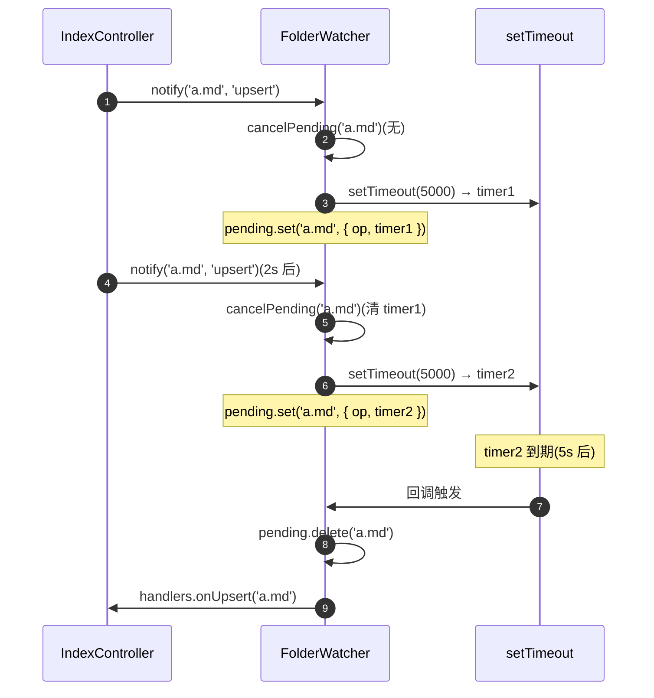
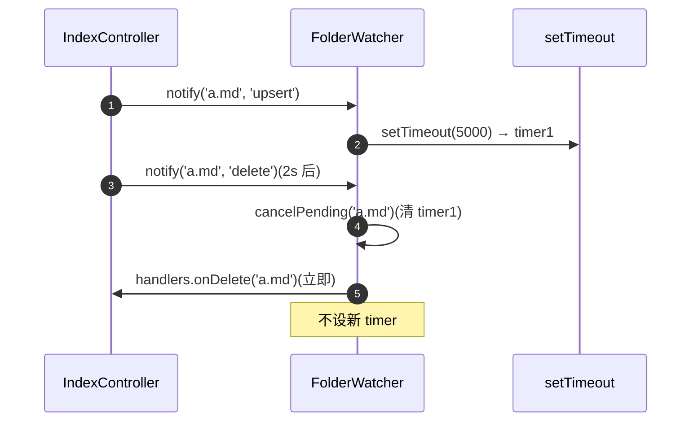
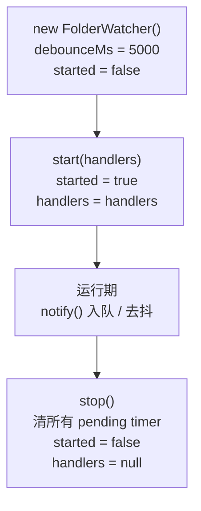

# 文件监听器

> 领域:Host | Vault 文件事件去抖,单文件 5s 计时

---

## 1. 职责

对 Vault 文件变更事件做单文件去抖,把高频的 `create` / `modify` 事件合并为一次 `onUpsert` 回调,降低索引压力。

**不做的事**:
- 不负责事件订阅(属于 [index-controller](index-controller.md) / [obsidian-integration](obsidian-integration.md))
- 不负责 `.ratelignore` 过滤(属于 `IndexController`,在 `notify` 之前完成)
- 不负责文件内容读取(属于 `IndexController.onUpsert` 回调)
- 不负责队列管理(属于 `IndexManager`)

---

## 2. 设计原则

### 2.1 单文件去抖

**决策**:每个 path 独立计时器,同 path 多次 `notify` 只保留最后一次,5s 后真触发。

**原因**:
- Obsidian 保存文件可能触发多次 `modify` 事件(编辑器自动保存 + 手动保存)
- 短时间内多次索引同一文件浪费 Worker 算力
- 单文件去抖比全局去抖更细粒度,不同文件可并行触发

### 2.2 delete 不去抖

**决策**:`delete` 事件立即触发,同时清掉该 path 的 pending upsert 计时器。

**原因**:
- 用户删了文件,希望索引立刻反映(否则 5s 内搜索还会命中已删文件)
- 若有 pending upsert,清掉避免"先 delete 再 upsert"的错乱顺序

### 2.3 主动清理

**决策**:`stop()` 主动清掉所有 pending timer,避免插件卸载后悬挂回调。

**原因**:
- setTimeout 回调在插件卸载后仍会执行,可能访问已销毁的资源
- `stop()` 把 `started` 置 false,即使有漏网 timer,`notify` 内的 `handlers?.onUpsert` 也会因 `handlers = null` 而 no-op

---

## 3. 核心接口

```typescript
interface WatcherHandlers {
    onUpsert: (path: string) => void;   // create/modify 去抖后触发
    onDelete: (path: string) => void;   // delete 立即触发
}

interface FolderWatcherOptions {
    debounceMs?: number;                // 默认 5000
}

class FolderWatcher {
    start(handlers: WatcherHandlers): void;
    notify(path: string, op: 'upsert' | 'delete'): void;
    stop(): void;
}
```

---

## 4. 去抖逻辑



**关键路径**:`cancelPending` 在 `notify` 开头调用,保证"后写覆盖先写"。同 path 的多次 notify 只会有一个活跃 timer。

---

## 5. delete 立即触发



**关键路径**:delete 分支先 `cancelPending` 再回调,避免"先 delete 再 upsert"的错乱(若 upsert timer 未清,5s 后会触发 onUpsert,把已删文件重新入队)。

---

## 6. 状态管理

| 状态字段 | 类型 | 说明 |
|---|---|---|
| `started` | boolean | `start()` 置 true,`stop()` 置 false;`notify` 在 false 时直接 return |
| `handlers` | `WatcherHandlers \| null` | `start()` 设置,`stop()` 清空;回调内用 `handlers?.onUpsert` 防空指针 |
| `pending` | `Map<string, PendingEntry>` | path → { op, timer };`notify` 写入,回调内删除,`stop` 全清 |

**PendingEntry 结构**:

```typescript
interface PendingEntry {
    op: 'upsert' | 'delete';              // 目前只存 'upsert'(delete 立即触发不入 pending)
    timer: ReturnType<typeof setTimeout>; // setTimeout 句柄
}
```

---

## 7. 生命周期



**关键路径**:`stop` 后即使有漏网回调,`handlers?.onUpsert` 因 `handlers = null` 而 no-op,不会触发外部逻辑。

---

## 8. 边界

| 与...的接口 | 方向 | 说明 |
|---|---|---|
| [index-controller](index-controller.md) | 被组合 | `IndexController` 内部持有 `FolderWatcher` 实例 |
| [obsidian-integration](obsidian-integration.md) | 无直接关系 | Vault 事件由 `IndexController` 订阅后转发给 `FolderWatcher` |

---

## 9. 演进路径

| 阶段 | 能力 | 状态 |
|---|---|---|
| 当前 | 单文件 5s 去抖 + delete 立即触发 + 主动清理 | ✅ 已实现 |
| 后续 | 可配置 debounceMs(从 settings 读) | 待规划 |
| 远期 | 自适应去抖(按文件大小 / 修改频率) | 远期 |
