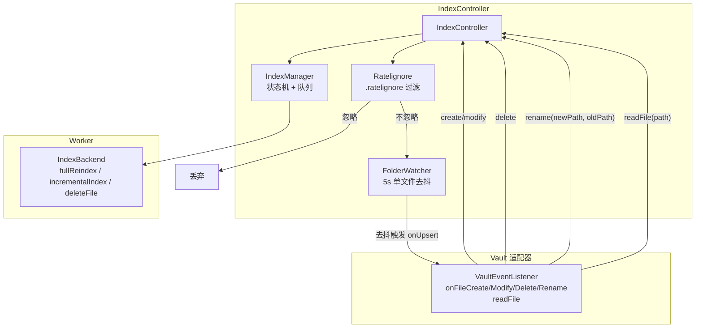
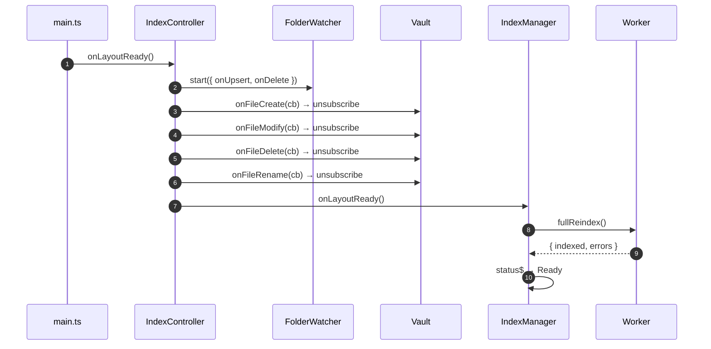
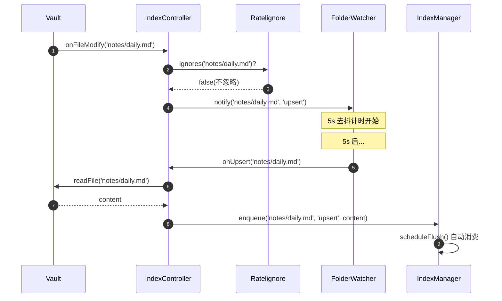
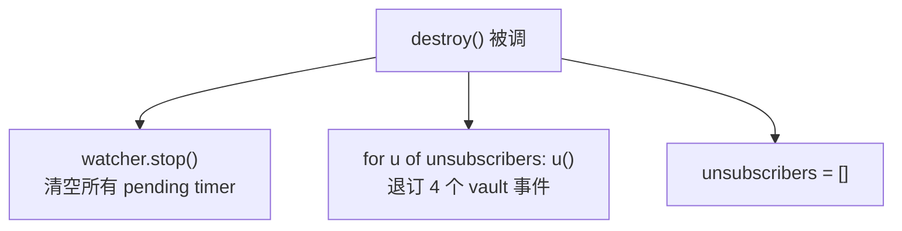

# 索引控制器

> 领域:Host | 聚合 IndexManager + FolderWatcher + Vault 事件 + .ratelignore

---

## 1. 职责

作为索引子系统的"门面控制器",把 Obsidian Vault 事件、文件去抖、`.ratelignore` 过滤、IndexManager 队列消费四个环节粘合起来,对外暴露 `pause` / `resume` / `reindex` 三个操作。

**不做的事**:
- 不负责状态机与队列逻辑(属于 `IndexManager`)
- 不负责去抖计时(属于 [folder-watcher](folder-watcher.md))
- 不负责索引后端调用(属于 Worker,见 [worker-protocol](worker-protocol.md))
- 不负责 `.ratelignore` 语法解析(属于 `utils/ratelignore-parser`)

---

## 2. 设计原则

### 2.1 单一入口

**决策**:`main.ts` 只持有 `IndexController` 一个引用,不直接接触 `IndexManager` / `FolderWatcher`。

**原因**:
- 隐藏内部协作细节,`main.ts` 代码精简
- 状态机(`indexManager.status$`)通过 `controller.indexManager.status$` 暴露,UI 直接订阅
- 卸载时只需 `controller.destroy()`,内部自动清理 watcher + 退订事件

### 2.2 事件 → 去抖 → 过滤 → 入队

**决策**:Vault 事件先过 `.ratelignore`,再进 FolderWatcher 去抖,去抖触发后读文件内容,最后入队。

**原因**:
- `.ratelignore` 过滤在最前:被排除的文件不占用 watcher 的 pending Map
- 去抖在过滤后:避免短时间内多次 modify 触发多次 readFile
- 读文件在去抖后:文件可能在去抖期间被删,readFile 失败时静默跳过
- 入队带 content:Worker 处理时无需再读文件,减少跨线程通信

### 2.3 rename 拆为 delete + create

**决策**:`onFileRename(newPath, oldPath)` 拆为 `delete(oldPath)` + `upsert(newPath)` 两个独立事件。

**原因**:
- 向量索引不支持"改名"原语,只能 delete + insert
- 拆分后逻辑简单,复用现有 delete / upsert 路径
- `newPath` 仍需过 `.ratelignore`(可能 rename 到被排除目录)

---

## 3. 组件协作



---

## 4. 生命周期

### 4.1 启动期(`onLayoutReady`)



**关键路径**:4 个 vault 事件订阅的 unsubscribe 函数存入 `unsubscribers` 数组,`destroy()` 时统一退订。

### 4.2 运行期(增量事件)



**关键路径**:`onUpsert` 回调内 `void this.vault.readFile(p).then(...)`,非阻塞,失败时静默跳过(文件可能在去抖期间被删)。

### 4.3 卸载期(`destroy`)



**关键路径**:`destroy` 不调 `indexManager` 的任何方法,Worker 的清理由 `main.ts` 单独处理。

---

## 5. VaultEventListener 接口

`IndexController` 不直接依赖完整 `VaultPort`,只依赖 `VaultEventListener` 子接口:

```typescript
interface VaultEventListener {
    onFileCreate(cb: (path: string) => void): () => void;
    onFileModify(cb: (path: string) => void): () => void;
    onFileDelete(cb: (path: string) => void): () => void;
    onFileRename(cb: (newPath: string, oldPath: string) => void): () => void;
    readFile(path: string): Promise<string>;
}
```

**原因**:接口隔离原则,`IndexController` 只需要事件订阅 + 读文件,不需要写文件 / 列目录 / 读元数据等。

---

## 6. 对外操作

| 方法 | 透传到 | 说明 |
|---|---|---|
| `pause()` | `indexManager.pause()` | 队列继续累积,不消费 |
| `resume()` | `indexManager.resume()` | 追平累积的队列 |
| `reindex()` | `indexManager.reindex()` | 清队列 + 全量重索引 |
| `destroy()` | `watcher.stop()` + 退订 | 卸载清理 |
| `indexManager.status$` | 直接暴露 | UI 订阅状态机 |

---

## 7. .ratelignore 过滤

`Ratelignore` 在构造时读取 vault 根目录的 `.ratelignore` 文件,gitignore 兼容语法。

**默认规则**(即使无 `.ratelignore` 文件也生效):

```gitignore
.obsidian/
.trash/
.augmented-canvas/
.obsidian-canvas/
.obsidian-snippets/
```

**降级策略**:文件不存在用默认规则;语法错时回退到默认规则 + `console.warn`,不抛错。

**过滤时机**:仅在 `onFileCreate` / `onFileModify` / `onFileRename(newPath)` 时过滤;`onFileDelete` 不过滤(被忽略的文件若被删,仍需通知索引清理)。

---

## 8. 边界

| 与...的接口 | 方向 | 说明 |
|---|---|---|
| [obsidian-integration](obsidian-integration.md) | 依赖 | `VaultEventListener` 由 `ObsidianVault` 实现 |
| [folder-watcher](folder-watcher.md) | 组合 | 内部持有 `FolderWatcher` 实例 |
| [worker-protocol](worker-protocol.md) | 间接 | `IndexBackend` 由 `WorkerManager` 适配 |
| [persistence](persistence.md) | 无 | 索引数据由 vectra 直接写文件系统 |

---

## 9. 演进路径

| 阶段 | 能力 | 状态 |
|---|---|---|
| 当前 | 4 事件订阅 + 去抖 + 过滤 + 自动消费 | ✅ 已实现 |
| 后续 | 批量入队(同目录多文件合并处理) | 待规划 |
| 远期 | 智能过滤(按文件大小 / 修改频率) | 远期 |
