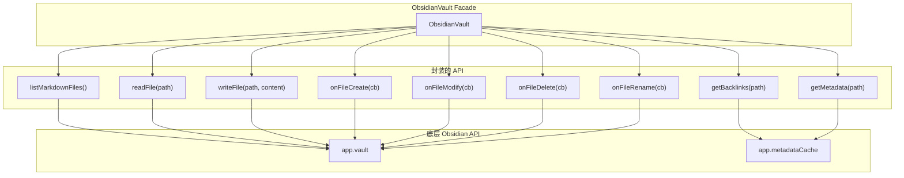
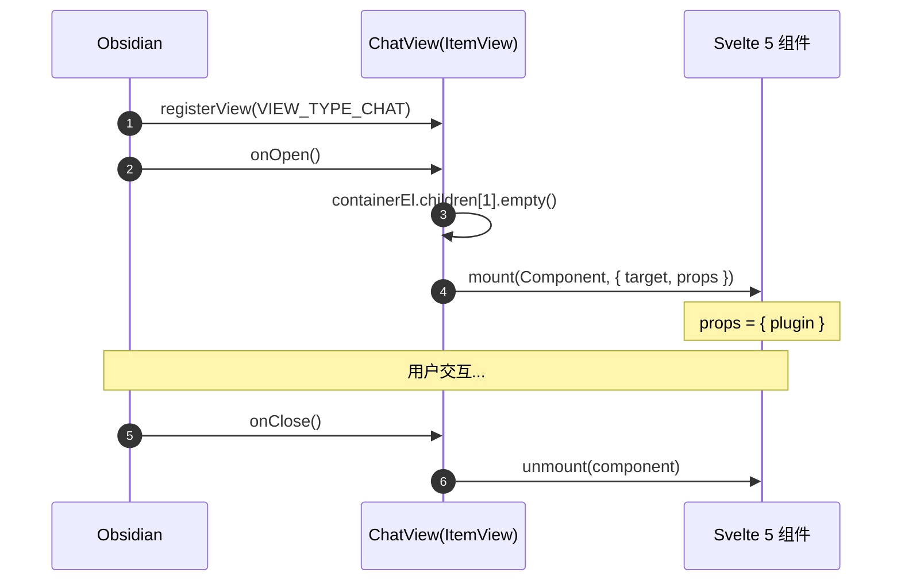
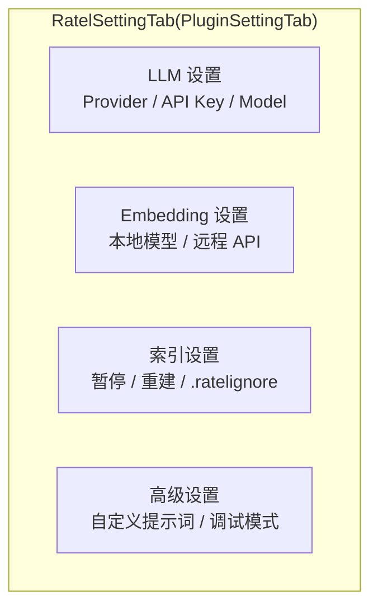

# Obsidian 宿主集成

> 领域:Host | API 封装、UI 挂载、设置、命令

---

## 1. 职责

封装 Obsidian API,隔离宿主依赖。其他子系统通过本层访问 Vault 文件、UI 视图、设置面板、命令系统,不直接导入 `obsidian` 模块。

**不做的事**:
- 不负责业务逻辑(属于 RAG / Agent / LLM 领域)
- 不负责持久化细节(属于 [persistence](persistence.md))

---

## 2. 设计原则

### 2.1 Facade 模式隔离 Obsidian API

**决策**:所有 Obsidian API 访问必须走 `ObsidianVault` facade,不直接调 `app.vault.*`。

**原因**:
- Obsidian API 版本可能变化,facade 集中适配
- 测试时 mock facade 即可,不需要 mock 整个 Obsidian
- 明确哪些 API 被使用,哪些是禁区

### 2.2 Worker 严禁导入 obsidian

**决策**:Worker 代码不能 `import 'obsidian'`。

**原因**:
- Worker 是 Node.js 环境,没有 Obsidian 运行时
- 违反会直接 crash
- Worker 只通过 `postMessage` 与主线程通信

### 2.3 Svelte 5 mount 必须用双参形式

**决策**:Svelte 组件挂载用 `mount(Component, { target, props })`,不用 Svelte 4 的 `new Component()`。

**原因**:
- Svelte 5 编译后的组件函数签名是 `(target, props)` 双参
- 旧的单参调用会让第二个参数变 undefined,内部 effect 链对 undefined 用 `in` 算符找 `Symbol($state)` 直接抛错
- esbuild 必须加 `conditions: ['browser']`,否则 Svelte 5 解析到 server runtime,`mount` 不可用

---

## 3. ObsidianVault Facade

**关键**:`getBacklinks` / `getMetadata` 走 `metadataCache`(同步),其余走 `app.vault`。`writeFile` 自动处理"文件存在则 modify,不存在则 create + 自动建父目录"。

---

## 4. UI 挂载

### 4.1 ChatView 生命周期

### 4.2 esbuild 条件

| 配置 | 值 | 原因 |
|---|---|---|
| `platform` | `'node'` | vectra 用 `node:fs` / `node:path` |
| `conditions` | `['browser']` | Svelte 5 按 condition 导出 client/server runtime |
| `external` | `['onnxruntime-node', '@huggingface/transformers']` | 含 native `.node` 模块,留 runtime require |

**不加 `conditions: ['browser']` 的后果**:Svelte 5 解析到 `index-server.js`,`mount` 函数抛 "is not available on the server"。

---

## 5. 设置面板

**设置持久化**:通过 `plugin.loadData()` / `plugin.saveData()` 存入 `data.json`。

---

## 6. 命令注册

| 命令 ID | 命令名 | 行为 |
|---|---|---|
| `ask-vault` | Ask vault | 打开聊天侧栏 |
| `index-status` | Show index status | 通过 Worker 拉取索引统计,Notice 提示 |

**Ribbon 图标**:点击 brain 图标同样打开聊天侧栏。

---

## 7. 边界

| 与...的接口 | 方向 | 说明 |
|---|---|---|
| [rag/vector-index](../rag/vector-index.md) | 提供 | Vault 文件列表 + 读取 + 事件 |
| [agent/chat](../agent/chat.md) | 提供 | ItemView + Svelte mount |
| [host/persistence](persistence.md) | 提供 | loadData / saveData |
| [llm/model-management](../llm/model-management.md) | 提供 | requestUrl |

---

## 8. 演进路径

| 阶段 | 能力 | 状态 |
|---|---|---|
| 当前 | 基础 Facade + ChatView + 设置面板 + Ribbon | ✅ 已实现 |
| S-RAG-LOOP | esbuild conditions 修复 + RAG 接入 | ✅ 已实现(已归档) |
| 远期 | IndexBanner 真正工作 + 设置面板模型选择 | 远期 |
