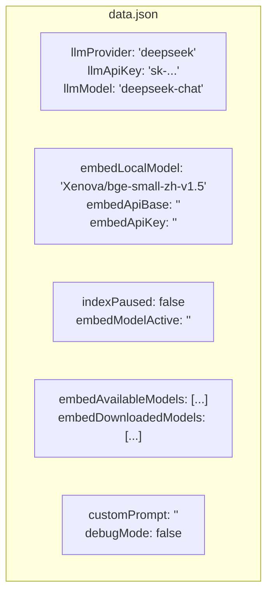
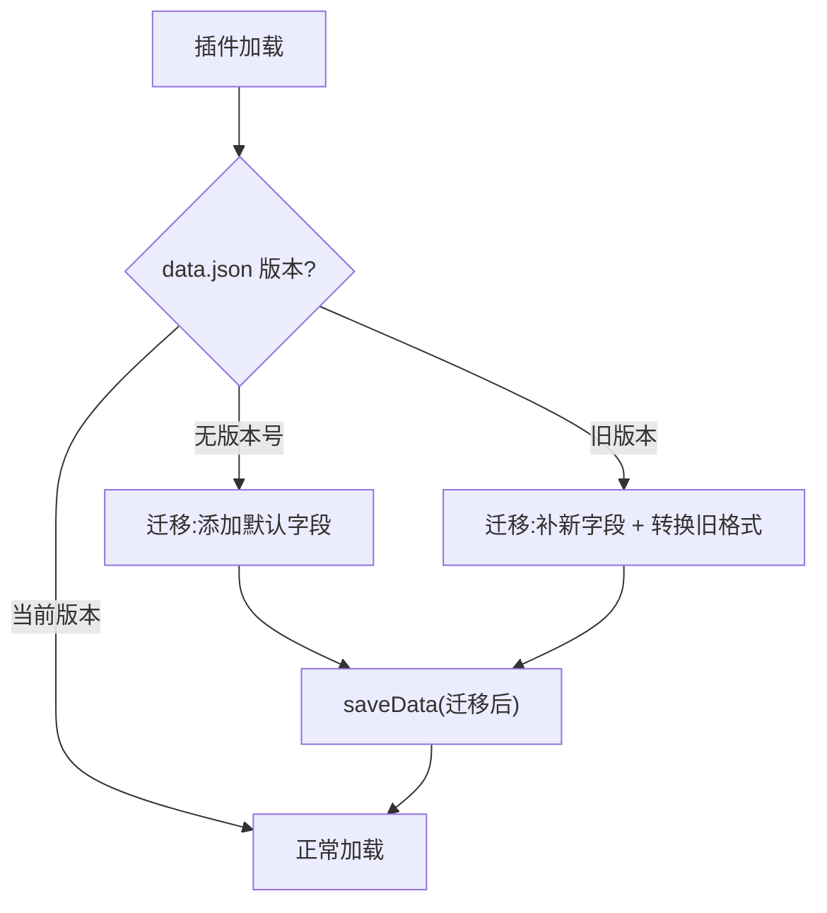

# 持久化

> 领域:Host | 设置存储、索引目录、数据迁移

---

## 1. 职责

管理 Ratel Vault 的所有持久化数据:设置、会话、索引、模型缓存。确保数据安全、可迁移、可恢复。

**不做的事**:
- 不负责 Obsidian API 封装(属于 [obsidian-integration](obsidian-integration.md))
- 不负责索引逻辑(属于 [rag/vector-index](../rag/vector-index.md))
- 不负责模型下载(属于 [llm/model-management](../llm/model-management.md))

---

## 2. 设计原则

### 2.1 数据不出 vault

**决策**:所有持久化数据存于 `.obsidian/plugins/ratel-vault/` 内。

**原因**:
- 随 vault 移动(用户拷贝 vault 时数据跟着走)
- 不污染 vault 根目录
- 符合 Obsidian 插件规范

### 2.2 Obsidian loadData/saveData 为主

**决策**:设置和会话用 `plugin.loadData()` / `plugin.saveData()` 存入 `data.json`。

**原因**:
- Obsidian 官方推荐的持久化方式
- 自动处理路径和权限
- 跨平台兼容

### 2.3 索引数据用文件系统

**决策**:向量索引(vectra)直接用 Node.js `fs` 读写 `.obsidian/plugins/ratel-vault/index/`。

**原因**:
- vectra 的 `LocalDocumentIndex` 自己管理文件结构
- 数据量大(数百 MB),不适合塞进 `data.json`
- Worker 线程可直接访问文件系统

---

## 3. 目录结构

```
.obsidian/plugins/ratel-vault/
├── main.js                    ← 插件主入口
├── worker.js                  ← Worker 入口
├── manifest.json              ← 插件元数据
├── styles.css                 ← 样式(可选)
├── data.json                  ← 设置 + 会话索引
├── .gitignore                 ← 自动生成(排除索引/缓存)
├── index/                     ← vectra 向量索引
│   ├── index.json             ← 文档元数据
│   └── items/                 ← 向量 + 文本
│       ├── doc1.json
│       └── ...
└── sessions/                  ← 对话历史
    ├── session-001.json
    └── session-002.json
```

**模型缓存**(不在插件目录):

```
~/.cache/huggingface/hub/
└── models--Xenova--bge-small-zh-v1.5/
    └── snapshots/<hash>/
        ├── config.json
        ├── tokenizer.json
        └── model.onnx
```

---

## 4. data.json 结构



---

## 5. .gitignore 管理

**自动生成**:插件 `onload` 时调用 `ensurePluginGitignore()`,幂等写入:

```gitignore
# Ratel Vault 自动生成 — 索引和缓存数据,不应纳入版本控制
index/
sessions/
*.tmp
```

**原则**:
- 索引和会话是派生数据,可重建,不应 git 跟踪
- 设置(`data.json`)应跟踪(包含用户配置)
- 幂等:已有行不重复添加

---

## 6. 数据迁移



| 迁移场景 | 处理 |
|---|---|
| 首次安装 | 写入默认设置 |
| 新增字段 | 补默认值,保留旧值 |
| 字段重命名 | 旧字段值迁移到新字段 |
| 字段删除 | 忽略旧字段 |
| 索引格式变化 | 标记需要重建索引 |

---

## 7. 边界

| 与...的接口 | 方向 | 说明 |
|---|---|---|
| [obsidian-integration](obsidian-integration.md) | 依赖 | loadData / saveData |
| [rag/vector-index](../rag/vector-index.md) | 提供 | 索引目录 + .gitignore |
| [llm/model-management](../llm/model-management.md) | 提供 | 模型缓存路径 |
| [agent/chat](../agent/chat.md) | 提供 | 会话存储路径 |

---

## 8. 演进路径

| 阶段 | 能力 | 状态 |
|---|---|---|
| 当前 | data.json + 索引目录 + .gitignore | ✅ 已实现 |
| 后续 | 数据迁移框架 + 版本号 | 待实现 |
| 远期 | 增量备份 + 索引校验 | 远期 |
