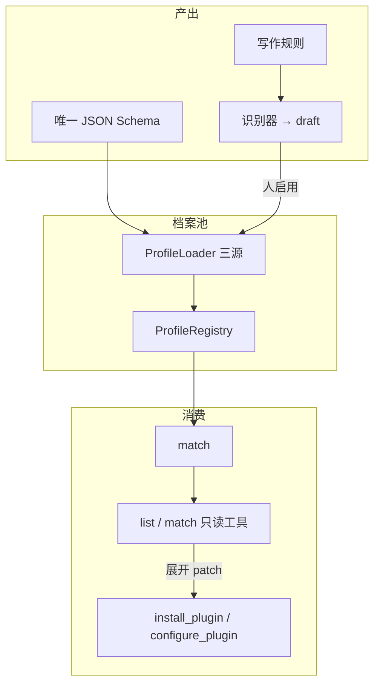
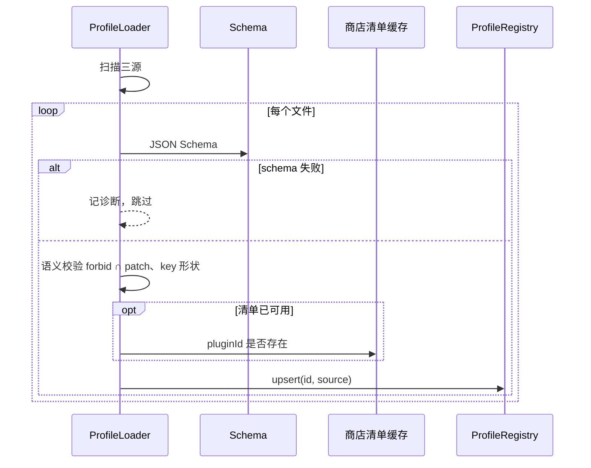
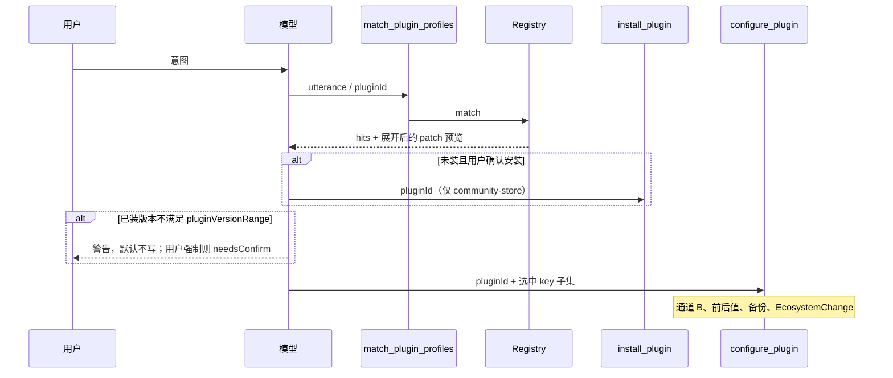

# 插件档案（Plugin Profile）

> 领域:Host | 社区插件配置契约：一份 schema、多份档案、Ratel 只消费契约
>
> 本文是插件档案的**架构正文**（用户阶段 1～2，以及阶段 4 的 preset 展开）。产品阶段总表见 [prd/ecosystem.md](../../prd/ecosystem.md)。对话寻找 / 安装 / 升级 / 卸载见 [ecosystem](ecosystem.md)；本文不替代通道 B、未文档 `app.plugins` 降级与 `EcosystemChange`。

---

## 0. 导读

社区插件的设置在各自 `data.json` 里，没有统一 API。若让模型对着未知 JSON 现编整文件，无法审计、无法回滚语义、也无法开源复用。

本子系统把「这个开源插件该怎么配」做成**可校验的档案**，与「怎么装、怎么写盘」拆开：

- **知识层（本文）**：一份格式契约 + 多份档案实例 + 识别草稿 + 匹配。
- **执行层（[ecosystem](ecosystem.md)）**：对话寻找、安装、升级、卸载；点名写入、确认、备份。执行层**没有** Obsidian 官方安装授权，见该文 §1。

Skill 仍只做 SOP（教模型何时调哪套 preset）。真读写永远走工具。

正文按运行过程展开：边界 → 模块 → 对象与 schema → 加载校验 → 识别 → 匹配 → 消费 → 端口落点 → 失败与分期。

**不讲：** 50 个热门插件清单、主题/CSS、商店外安装、代改 Obsidian 核心配置。

---

## 1. 目标与边界

### 1.1 要解决什么

用户说「装个日历并按周一开始」。Ratel 需要：

1. 知道这对应商店里哪个 `pluginId`；
2. 知道该改 `data.json` 的哪些 key，而不是猜整份文件；
3. 同一套规则能长出 Calendar、Dataview、Tasks……的档案，而不是每个插件一套语法。

### 1.2 设计目标

1. **全库唯一 schema。** 插件变多只增加档案文件。
2. **档案绑定商店 id。** `pluginId` 对不上 `community-plugins.json` 则整份作废，不能据此安装。
3. **规则可产出。** 人或模型按写作规则生成能过 schema 的 YAML/JSON。
4. **识别可草稿。** 从已装插件扫 `manifest` + `data.json` 生成 draft，默认不生效。
5. **消费可按需。** 匹配 →（未装则商店安装）→ 只应用选中 preset 或 key 子集。
6. **不绕闸。** 禁止 `run_skill_script` 写他人 `data.json`。

### 1.3 非目标

- 每个插件维护一份不同的 schema。
- 运行时直接读目标插件源码生成并写入。
- 新开能力 `kind`（档案不是 tool/mcp/skill 之外的执行面）。
- 整文件覆盖 `data.json`、自动写入 `forbid` 中的密钥类 key。
- 替代 S-ECOSYSTEM 的路径白名单与变更日志。

---

## 2. 总体设计



### 2.1 模块职责

| 模块 | 职责 | 不做 |
|---|---|---|
| JSON Schema 文件 | 格式唯一事实源 | 不包含某个插件的业务 key |
| `ProfileLoader` | 三源扫描、解析 YAML/JSON、schema 校验 | 不写 `configDir`、不调 LLM |
| `ProfileRegistry` | 合并覆盖、enabled 池、按 id 查询 | 不安装插件 |
| `ProfileMatcher` | 按 utterance / pluginId / tags 打分排序 | 不写盘 |
| `ProfileRecognizer` | 已装插件 → draft 文件 | 不调用 `configure_plugin` |
| 只读工具 | 把摘要暴露给模型 | 不执行 patch |
| 生态工具 | 安装与最小 diff | 不解析档案格式（只收展开后的 key/value） |
| 可选 `sopSkill` | 激活后注入 SOP | 不直接写盘 |

### 2.2 一份 schema 与多份实例

```
schemas/obsidian-plugin-profile.schema.json     ← 唯一契约
plugin-profiles/calendar-week-start.yaml        ← 实例
plugin-profiles/dataview-minimal.yaml           ← 实例
```

实例里的 `presets[].patch` 才是「这个插件有哪些可写 key」。那是档案内容，不是第二份总 schema。

### 2.3 与 Skill / 能力池

| | Skill | Plugin Profile |
|---|---|---|
| 是什么 | 给模型的 SOP 文本 | 可校验的配置契约 |
| 激活 | `activate_skill` → Session | 匹配后把 preset 交给生态工具 |
| 写设置 | 只许教模型去调工具 | 自身不写；展开为点名 key |
| 能力 `kind` | `skill` | 无；经只读工具被发现 |

`ratel-config` 模式可复用：**SOP + 专用工具**。档案相当于「他人插件版的白名单表」，白名单来自该档案的允许 key 减去 `forbid`。

---

## 3. 核心对象

落地类型建议集中在 `src/profiles/types.ts`（名称可微调，语义不许漂）。

```typescript
type ProfileKind = 'obsidian-plugin-profile';

/** patch / forbid 的 key：点号路径，禁止 '..'、禁止以 '.' 开头或结尾 */
type SettingKey = string;

interface PluginProfile {
  kind: ProfileKind;
  id: string;                     // ^[a-z][a-z0-9-]{0,63}$
  pluginId: string;               // 商店 id
  pluginName: string;
  pluginVersionRange: string;     // semver range，如 ">=1.0.0"
  enabled?: boolean;              // 默认 true；draft 必须 false
  tags?: string[];
  sopSkill?: string;              // 可选 Skill 名
  install: { source: 'community-store' };
  forbid: SettingKey[];
  presets: ProfilePreset[];
}

interface ProfilePreset {
  id: string;
  when: string;                   // 给人/模型看的匹配说明，必填
  patch: Record<SettingKey, unknown>;  // 值必须 JSON 可序列化
}

interface ProfileMatchQuery {
  utterance?: string;
  pluginId?: string;
  tags?: string[];
}

interface ProfileMatchHit {
  profileId: string;
  pluginId: string;
  presetId: string;
  score: number;
  reasons: string[];
}
```

仓库内 JSON Schema 与上表字段一一对应。解析后先过 schema，再跑 **语义校验**（§4.3）。两道都过才进 Registry。

### 3.1 存放路径

与 Skill 三源对齐，后者覆盖前者**同 `id`**（vault > global > builtin）：

| 源 | 路径 | 说明 |
|---|---|---|
| builtin | `<pluginDir>/plugin-profiles/<id>.yaml` | 构建期可内联，启动幂等写出 |
| global | `~/.ratel/plugin-profiles/<id>.yaml` | 本机作者/识别草稿常用 |
| vault | `<vaultRoot>/.ratel/plugin-profiles/<id>.yaml` | 跟随库 |

也接受 `.yml` / `.json`。文件名建议等于 `id`，不一致时以文件内 `id` 为准并记诊断。

草稿：同目录 `<id>.draft.yaml`，或正文 `enabled: false`。两种任一即**不进匹配池**。

---

## 4. 加载与校验

启动与「重载档案」命令走同一条流水线。单文件失败不得拖垮其它档案。



### 4.1 覆盖规则

同 `id`：vault 覆盖 global 覆盖 builtin。同 id 且同源出现两份 → 后扫描者丢弃并诊断（目录内按文件名排序，确定性）。

### 4.2 商店清单

`pluginId` 必须能在社区清单里查到。清单未就绪（生态未落地或缓存过期失败）时：

- **仍加载**通过 schema 的档案，状态标 `unverifiedStoreId`；
- **匹配可返回**，但消费安装必须等清单校验通过，否则拒绝安装。

清单就绪后，对不上的档案从匹配池移除（文件可留在磁盘，诊断为 `unknownPluginId`）。

### 4.3 语义校验（schema 不够时）

| 条件 | 结果 |
|---|---|
| `kind` 不是 `obsidian-plugin-profile` | 拒绝 |
| `install.source` 不是 `community-store` | 拒绝 |
| `presets` 为空 | 拒绝 |
| 任一 `patch` key 与 `forbid` 相交 | 拒绝整份档案 |
| key 含 `..`、`/`、空白、控制字符 | 拒绝 |
| `patch` 值为 `undefined` 或不可 JSON 序列化 | 拒绝 |
| `pluginId` 为 `ratel-vault` | 拒绝（禁区，与生态通道 B 一致） |

`patch` 未出现在「该插件当前 data.json 已有 key」里：校验阶段**不拒绝**（未装时没有 data.json）。消费写入时标 `needsConfirm`，弹窗展示「将新增 key」，不得 silent 写入。

---

## 5. 创建与识别

### 5.1 规则模式（作者路径）

写作规则与 schema 一起版本化（建议 `plugin-profiles/AUTHORING.md`，实现时再落文件）。硬规则：

1. 只写用户常改的 5～15 个 key，不要把整个 `data.json` 抄进 preset。
2. 密钥、token、webhook、cookie 进 `forbid`，不要进 `patch`。
3. `when` 写用户场景（「周一开始」「日记联动」），不写模块名。
4. 一个插件多场景 = 多 preset 或多档案，不要把互斥配置塞进同一 patch。
5. 产出必须通过 schema + §4.3。

人或模型都可以当作者；Ratel 不在运行时「自由发挥」补 key。

### 5.2 识别器（机器路径）

输入：已装 `plugins/<pluginId>/manifest.json` 与 `data.json`（**只读**，走生态路径校验，未落地前用只读 fs 且不得写入该目录）。

输出：draft 档案：

- `pluginId` / `pluginName` / 从 manifest 推断的 `pluginVersionRange`（如 `>=` 当前版本）；
- `forbid` 用启发式：key 名匹配 `/token|secret|password|apiKey|webhook|cookie/i`；
- `presets` 先给一条空壳 `id: default`、`when: 待作者填写`、`patch: {}`，或把非 forbid 的现有值列为「当前快照」注释——**快照不得当作已启用 preset**，避免把用户现网配置当成推荐模板外发。

识别器可以是：

- 仓库脚本（开发者在 Ratel 仓库跑）；
- Ratel 工具 `draft_plugin_profile`（默认 ask）：只写 `~/.ratel/plugin-profiles/` 或 vault `.ratel/plugin-profiles/` 的 draft。

识别器**禁止**调用 `configure_plugin` / `install_plugin`。

---

## 6. 匹配

`ProfileMatcher.match(query)` 只在 **enabled 且非 draft 且非 unknownPluginId** 的池上跑。

打分（可加权重，实现时用常量，禁止魔法无注释）：

| 信号 | 权重建议 |
|---|---|
| `query.pluginId` 精确等于档案 `pluginId` | +100 |
| `query.tags` 与档案 `tags` 交集 | 每个 +20 |
| `utterance` 子串命中 `pluginName` / `pluginId` / `when` / `tags`（大小写不敏感） | 每命中字段 +10 |
| 无任何命中 | 不进入结果 |

返回按 `score` 降序，默认最多 5 条。同分按 `profileId` 字母序。每条 hit 带 `presetId`：若 utterance 命中某个 preset 的 `when` 则用该 preset，否则用档案内第一个 preset。

无命中：工具返回空列表。模型应退回 `search_plugins` / 点名 `configure_plugin`，**不得**声称已按档案配好。

---

## 7. 消费顺序

只读阶段（生态工具未落地）停在步骤 3：向用户展示将应用的 patch，不写盘。



### 7.1 展开 patch

消费时把 preset `patch` 变成 `configure_plugin` 的点名 map：

1. 去掉用户没选的 key；
2. 去掉 `forbid`（防御性再减一次）；
3. 已装 `data.json` 中不存在的 key 标 `needsConfirm`；
4. 嵌套对象按点号路径展开为叶子写入，不整枝覆盖未点名的兄弟 key。

生态工具可以不认识 Profile 类型，只收 `{ pluginId, keys: Record<string, unknown> }`。

### 7.2 版本

已装 `manifest.version` 不满足 `pluginVersionRange`：默认拒绝写入，诊断 `versionMismatch`。用户明确确认后允许写，并记入 `EcosystemChange` 摘要。

### 7.3 可选 SOP

若档案含 `sopSkill` 且该 Skill 存在：在展示预览之后、写盘之前 `activate_skill`。Skill 只能补充说明，不能开辟第二条写盘路径。

---

## 8. 端口、文件与工具

### 8.1 端口

`src/ports/plugin-profile.ts`（零实现）：

```typescript
interface PluginProfilePort {
  loadAll(): Promise<LoadReport>;
  get(id: string): PluginProfile | undefined;
  match(query: ProfileMatchQuery): ProfileMatchHit[];
  validate(raw: unknown): { ok: true; profile: PluginProfile } | { ok: false; errors: string[] };
}
```

识别写 draft 走单独方法或独立 Port，避免只读消费误写。Adapter 读三源文件；Engine 不 `import 'obsidian'`、不直接写 `configDir`。

### 8.2 建议源码落点

```
src/profiles/          # 解析、校验、注册、匹配、识别（纯逻辑）
src/adapters/plugin-profile-fs.ts
src/tools/list-plugin-profiles.ts
src/tools/match-plugin-profiles.ts
src/tools/draft-plugin-profile.ts
schemas/obsidian-plugin-profile.schema.json
plugin-profiles/       # builtin 示例 + AUTHORING.md（实现期）
```

`profiles/` 内禁止 `import 'obsidian'`。清单与插件目录 IO 在 adapter。

### 8.3 工具权限

| 工具 | 权限 | 说明 |
|---|---|---|
| `list_plugin_profiles` | 只读 | 池摘要：id、pluginId、preset id、when |
| `match_plugin_profiles` | 只读 | 查询 → hits + patch 预览 |
| `draft_plugin_profile` | ask | 只写 draft |
| `install_plugin` / `configure_plugin` | ask（S-ECOSYSTEM） | 本子系统不实现 |

只读工具进 ToolRegistry，形状与现有工具相同，过同一权限门。

---

## 9. 失败与诊断

诊断对象建议：`{ profileId?, path, code, message }`，进现有诊断/debug 日志，不进遥测。

| code | 何时 |
|---|---|
| `schemaInvalid` | JSON Schema 失败 |
| `semanticInvalid` | §4.3 |
| `unknownPluginId` | 清单中无此 id |
| `unverifiedStoreId` | 清单不可用，暂未核商店 |
| `versionMismatch` | 已装版本不在 range |
| `draftSkipped` | 匹配时忽略 draft |
| `idCollision` | 同源同 id 两文件 |
| `forbidOverlap` | patch 碰到 forbid |

用户可见文案走 i18n；开发者日志用中文 `code + path`。

---

## 10. 分期与现网差距

现网：无 `src/profiles/`、无 schema 文件、无生态工具。与 Goal 不同，本子系统允许**知识层先于执行层**落地。

| 期 | 必须真的存在 | 仍可缺 |
|---|---|---|
| 底座 | schema、校验纯函数、AUTHORING 规则、识别草稿、**一份**商店插件示例档案、单测 | 不装不写 |
| 只读消费 | Loader / Registry / Matcher、两个只读工具、对话能展示 patch 预览 | `configure_plugin` |
| 合流 | 预览确认后调用生态安装/写入 | — |

第一期不交插件全集。合流前 README 不得把「自动配好热门插件」写成已发能力。

---

## 11. 参考

- [S-PLUGIN-PROFILE](../../superpowers/specs/2026-09-10-plugin-profile-design.md)
- [S-ECOSYSTEM](../../superpowers/specs/2026-08-20-ecosystem-management-design.md)
- [ADR-009 Skill](../../adr/2026-07-06-skill-mechanism.md) · [ADR-012 激活](../../adr/2026-07-23-skill-activation-claude-aligned.md)
- [capability-surface](../agent/capability-surface.md)
- [overview](../overview.md) Host `plugin-profile`
