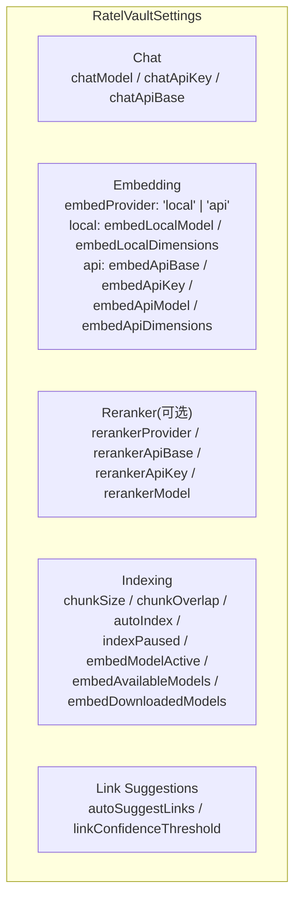
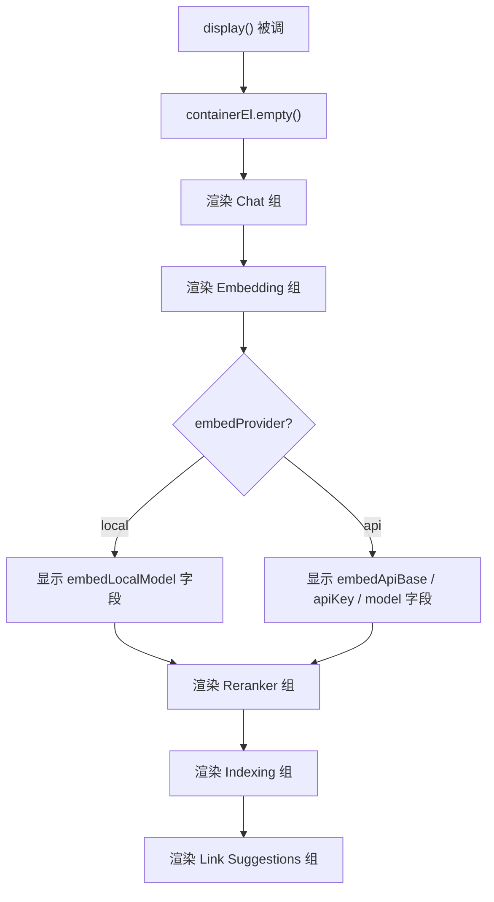
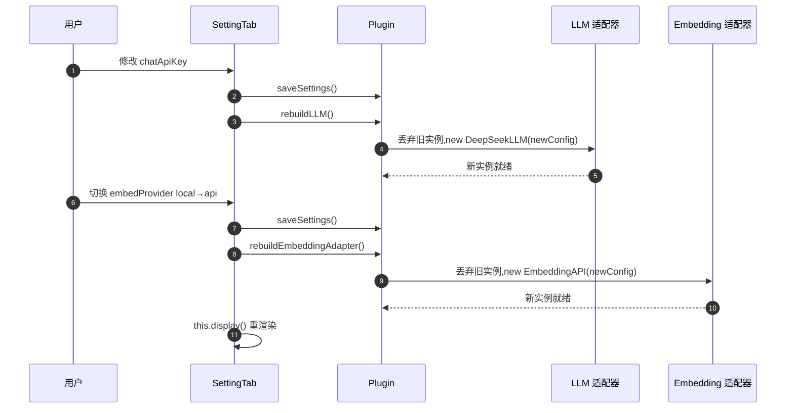

# 设置系统

> 领域:Host | 用户可配置项、设置面板、配置热重载

---

## 1. 职责

定义 Ratel Vault 的全部用户可配置项,渲染 Obsidian 设置面板,并在配置变更时触发热重载(重建 LLM / Embedding 适配器)。

**不做的事**:
- 不负责持久化读写(属于 [persistence](persistence.md),通过 `plugin.saveSettings()` 调用)
- 不负责 LLM / Embedding 适配器构造(属于 [llm/model-management](../llm/model-management.md),通过 `plugin.rebuildLLM()` / `plugin.rebuildEmbeddingAdapter()` 触发)

---

## 2. 设计原则

### 2.1 零配置可用

**决策**:默认配置开箱即用,本地 Embedding + DeepSeek 端点占位。

**原因**:
- 本地 Embedding(`Xenova/bge-small-zh-v1.5`,~90MB)无需 API Key
- `embedApiBase` 默认 `http://localhost:11434/v1` 适配本地 Ollama
- 用户只需填 Chat API Key 即可跑通端到端检索

### 2.2 立即写盘

**决策**:`onChange` 回调立即调 `saveSettings()`,无"保存"按钮。

**原因**:
- Obsidian Setting 组件原生支持 `onChange` 异步回调
- 避免用户忘记点保存导致配置丢失
- 配置变更频率低,写盘开销可忽略

### 2.3 配置热重载

**决策**:涉及适配器构造的配置变更,立即重建对应适配器。

**原因**:
- LLM 的 `Authorization` header、`apiBase` 在构造时定型,改配置后必须重建
- Embedding 的 `provider` 切换会换实现类(local / api 是不同类),必须重建
- 重建是幂等的:旧实例被丢弃,新实例按新配置构造

### 2.4 Reranker 可选

**决策**:Reranker 的 `apiKey` 留空即视为关闭,不强制配置。

**原因**:
- Reranker 是检索增强,不是必需
- 用户可能只用向量检索就够用
- 留空时 Retriever 跳过 rerank 步骤

---

## 3. 配置项分组

### 3.1 Chat

| 字段 | 类型 | 默认值 | 说明 |
|---|---|---|---|
| `chatModel` | string | `deepseek-chat` | 模型标识 |
| `chatApiKey` | string | `''` | API Key,password 输入 |
| `chatApiBase` | string | `https://api.deepseek.com` | API base URL |

**热重载**:三个字段任一变更都调 `plugin.rebuildLLM()`。

### 3.2 Embedding

| 字段 | 类型 | 默认值 | 说明 |
|---|---|---|---|
| `embedProvider` | `'local' \| 'api'` | `'local'` | Provider 切换 |
| `embedLocalModel` | string | `Xenova/bge-small-zh-v1.5` | 本地 ONNX 模型 id |
| `embedLocalDimensions` | number | `512` | 本地模型向量维度 |
| `embedApiBase` | string | `http://localhost:11434/v1` | API base URL(Ollama 默认) |
| `embedApiKey` | string | `''` | API Key(Ollama 可留空) |
| `embedApiModel` | string | `bge-m3` | API 模型标识 |
| `embedApiDimensions` | number | `1024` | API 模型向量维度 |

**热重载**:任一字段变更调 `plugin.rebuildEmbeddingAdapter()`。Provider 切换还会触发 `this.display()` 整体重渲染,显示对应字段组。

### 3.3 Reranker(可选)

| 字段 | 类型 | 默认值 | 说明 |
|---|---|---|---|
| `rerankerProvider` | `'cohere' \| 'jina' \| 'siliconflow' \| 'custom'` | `'cohere'` | Provider |
| `rerankerApiBase` | string | `https://api.cohere.ai/v1` | API base URL |
| `rerankerApiKey` | string | `''` | API Key,留空关闭 rerank |
| `rerankerModel` | string | `rerank-v3.5` | 模型标识 |

**Provider 切换自动填 base**:切到 `cohere` / `jina` / `siliconflow` 时自动填入官方默认 base,降低用户输入成本。`custom` 不填,用户自填。

### 3.4 Indexing

| 字段 | 类型 | 默认值 | 说明 |
|---|---|---|---|
| `chunkSize` | number | `500` | 分块大小(tokens),滑块 100-1000 |
| `chunkOverlap` | number | `100` | 分块重叠(tokens),滑块 0-200 |
| `autoIndex` | boolean | `true` | 文件变更时自动重索引 |
| `indexPaused` | boolean | `false` | 索引暂停开关,用户在设置面板切换 |
| `embedModelActive` | string | `Xenova/bge-small-zh-v1.5` | 当前激活的本地 Embedding 模型 id |
| `embedAvailableModels` | Array | 5 个候选 | 可下载的模型列表(尺寸/维度/推荐位) |
| `embedDownloadedModels` | string[] | `[]` | 已下载到本地的模型 id |

**`embedAvailableModels` 默认列表**:

| id | sizeBytes | dimensions | recommended |
|---|---|---|---|
| `Xenova/bge-small-zh-v1.5` | ~90MB | 512 | ✅ |
| `Xenova/bge-base-zh-v1.5` | ~210MB | 768 | |
| `Xenova/bge-large-zh-v1.5` | ~650MB | 1024 | |
| `BAAI/bge-m3` | ~600MB | 1024 | |
| `Xenova/all-MiniLM-L6-v2` | ~25MB | 384 | |

### 3.5 Link Suggestions

| 字段 | 类型 | 默认值 | 说明 |
|---|---|---|---|
| `autoSuggestLinks` | boolean | `true` | 写笔记后是否自动建议链接 |
| `linkConfidenceThreshold` | number | `0.75` | 最小相似度阈值,滑块 0.5-1.0 |

---

## 4. 设置面板渲染

`RatelVaultSettingTab extends PluginSettingTab`,渲染逻辑在 `display()`:

**关键路径**:Provider 切换时 `onChange` 内调 `this.display()` 整体重渲染,保证 local / api 字段组互斥显示。

---

## 5. 配置热重载链路

**哪些字段触发重建**:

| 字段组 | 触发 rebuild |
|---|---|
| Chat 三字段 | `rebuildLLM()` |
| Embedding 所有字段 | `rebuildEmbeddingAdapter()` |
| Reranker 字段 | 无 rebuild(运行时读 settings) |
| Indexing 字段 | 无 rebuild(Worker 启动时读) |
| Link Suggestions | 无 rebuild(运行时读) |

---

## 6. 边界

| 与...的接口 | 方向 | 说明 |
|---|---|---|
| [persistence](persistence.md) | 依赖 | `plugin.saveSettings()` 写入 data.json 设置层 |
| [llm/model-management](../llm/model-management.md) | 触发 | `rebuildLLM()` / `rebuildEmbeddingAdapter()` |
| [obsidian-integration](obsidian-integration.md) | 依赖 | `PluginSettingTab` 注册到 Obsidian |

---

## 7. 演进路径

| 阶段 | 能力 | 状态 |
|---|---|---|
| 当前 | 5 组配置 + 热重载 + 立即写盘 | ✅ 已实现 |
| 后续 | 配置版本号 + 迁移函数 | 待实现(与 persistence 协同) |
| 远期 | 配置导入导出 + 多 profile | 远期 |
