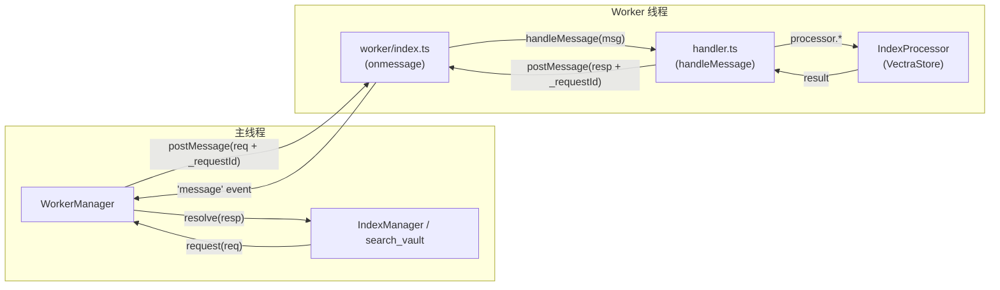
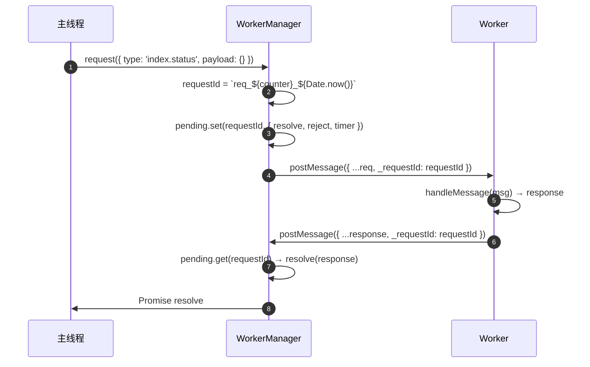
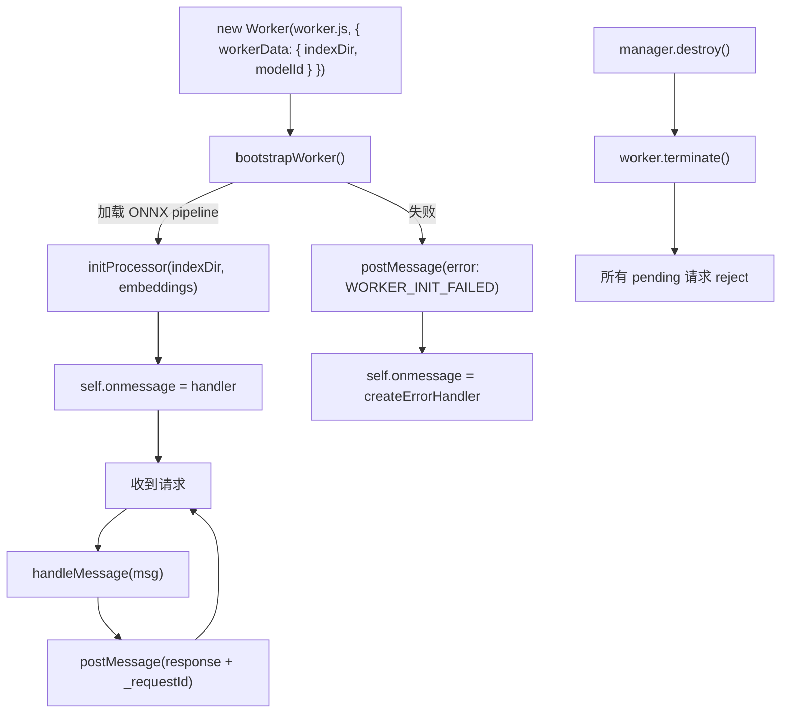

# Worker 通信协议

> 领域:Host | 主线程 ↔ Worker 线程的 postMessage 协议、请求/响应关联、超时控制

---

## 1. 职责

定义主线程与 Worker 线程之间的通信契约:消息类型、请求/响应关联、超时与错误处理。Worker 承担 CPU 密集型任务(分块、索引、向量搜索),主线程负责 HTTP 调用与 Obsidian API。

**不做的事**:
- 不负责索引逻辑(属于 [rag/vector-index](../rag/vector-index.md))
- 不负责模型加载(属于 [llm/model-management](../llm/model-management.md))
- 不负责 Obsidian API 封装(属于 [obsidian-integration](obsidian-integration.md))

---

## 2. 设计原则

### 2.1 Worker 严禁导入 obsidian / 严禁 HTTP

**决策**:Worker 线程不 `import 'obsidian'`,不发 HTTP 请求。

**原因**:
- Worker 是 Node.js 环境,没有 Obsidian 运行时
- Embedding / LLM 的 HTTP 调用都在主线程(主线程有 `requestUrl`)
- Worker 只做 CPU 密集型计算 + 文件系统 IO(vectra 索引)

### 2.2 判别联合 + _requestId 关联

**决策**:请求和响应用 TypeScript 判别联合(`type` 字段区分),用 `_requestId` 字符串做请求/响应配对。

**原因**:
- 判别联合让 Worker 端 `switch (msg.type)` 时 TypeScript 自动收窄
- `_requestId` 由 WorkerManager 注入(主线程侧),Worker 原样回传
- 异步 postMessage 天然无序,必须用 ID 关联

### 2.3 超时即 terminate

**决策**:请求超时(默认 30s)后直接 `worker.terminate()`,不尝试恢复。

**原因**:
- Worker 假死通常是 ONNX / vectra 内部死锁,不可恢复
- terminate 后 WorkerManager 不再可用,需重建
- 30s 足够全量索引(千级文件);单文件增量通常 <1s

---

## 3. 协议结构



### 3.1 WorkerRequest(主线程 → Worker)

```typescript
type WorkerRequest =
  | { type: 'index.full'; payload: { files: Array<{ path: string; content: string }> } }
  | { type: 'index.incremental'; payload: { file: { path: string; content: string } } }
  | { type: 'index.delete'; payload: { filePath: string } }
  | { type: 'vector.search'; payload: { queryVector: number[]; topK: number; filter?: SearchFilter } }
  | { type: 'vector.upsert'; payload: { docId: string; text: string; metadata: Record<string, unknown> } }
  | { type: 'vector.delete'; payload: { docIds: string[] } }
  | { type: 'index.status'; payload: Record<string, never> };
```

### 3.2 WorkerResponse(Worker → 主线程)

```typescript
type WorkerResponse =
  | { type: 'index.progress'; payload: { done: number; total: number } }
  | { type: 'index.done'; payload: { indexed: number; errors: number } }
  | { type: 'vector.search.result'; payload: VectorSearchResult[] }
  | { type: 'vector.upsert.done'; payload: { docId: string } }
  | { type: 'vector.delete.done'; payload: { count: number } }
  | { type: 'index.status.result'; payload: { totalDocs: number; lastIndexTime: number } }
  | { type: 'error'; payload: { code: string; message: string } };
```

---

## 4. 消息类型一览

| 请求类型 | 用途 | 响应类型 | 说明 |
|---|---|---|---|
| `index.full` | 全量索引 | `index.done` | 主线程已读取+分块,Worker 只做向量化+存储 |
| `index.incremental` | 增量索引单文件 | `index.done` | 同上,单文件粒度 |
| `index.delete` | 删除文件索引 | `vector.delete.done` | 按 filePath 删除 |
| `vector.search` | 向量搜索 | `vector.search.result` | 主线程已向量化 query,Worker 只做余弦相似度 |
| `vector.upsert` | 直接 upsert | `vector.upsert.done` | 跳过分块,直接写向量(内部用) |
| `vector.delete` | 按 docId 批量删 | `vector.delete.done` | |
| `index.status` | 查询索引状态 | `index.status.result` | totalDocs + lastIndexTime |

**错误码**:

| code | 含义 | 触发方 |
|---|---|---|
| `NULL_PROCESSOR` | Worker 未初始化 | handler.ts |
| `UNKNOWN_REQUEST` | 未知请求类型 | handler.ts |
| `WORKER_INIT_FAILED` | bootstrap 失败(模型加载/索引打开) | worker/index.ts |
| `WORKER_ERROR` | handleMessage 未捕获异常 | worker/index.ts |

---

## 5. 请求/响应关联



**关键**:
- `_requestId` 格式:`req_{自增计数器}_{时间戳}`,保证唯一
- Worker 不解析 `_requestId`,只原样回传
- `WorkerManager` 收到响应后从 `pending` Map 移除并 `clearTimeout`

---

## 6. Worker 生命周期



**bootstrap 关键路径**:
- `workerData` 传入 `indexDir` + `modelId`,Worker 自行加载 ONNX pipeline
- embeddings 对象不可跨线程序列化,必须在 Worker 内部构造
- bootstrap 失败时注册 `createErrorHandler`,对所有后续请求返回 `WORKER_INIT_FAILED`

---

## 7. 错误处理

| 场景 | 行为 |
|---|---|
| 请求超时(30s) | `clearTimeout` + `pending.delete` + `worker.terminate()` + `reject` |
| Worker 崩溃(`'error'` 事件) | 所有 pending 请求 `reject('Worker error: ...')` |
| Worker 退出(`'exit'` 事件) | 所有 pending 请求 `reject('Worker exited with code N')` |
| `handleMessage` 抛异常 | 捕获 → `postMessage(error: WORKER_ERROR)` → 主线程 reject |
| bootstrap 失败 | `postMessage(error: WORKER_INIT_FAILED)` + 注册 error handler |
| `manager.destroy()` | `terminate()` + 所有 pending `reject('Worker destroyed')` |

**关键**:无论成功还是失败,`_requestId` 始终回传,确保 `WorkerManager` 能正确关联并清理 pending Map。

---

## 8. 边界

| 与...的接口 | 方向 | 说明 |
|---|---|---|
| [rag/vector-index](../rag/vector-index.md) | 被依赖 | IndexManager 通过 WorkerManager 发索引请求 |
| [rag/retriever](../rag/retriever.md) | 被依赖 | search_vault 通过 WorkerManager 发搜索请求 |
| [llm/model-management](../llm/model-management.md) | 依赖 | Worker bootstrap 加载 ONNX pipeline |
| [host/persistence](persistence.md) | 依赖 | 索引目录路径由 persistence 提供 |

---

## 9. 演进路径

| 阶段 | 能力 | 状态 |
|---|---|---|
| 当前 | 7 种请求 + _requestId 关联 + 30s 超时 + terminate | ✅ 已实现 |
| 后续 | 可配置超时(按请求类型区分) | 待实现 |
| 远期 | Worker 池(多 Worker 并行索引) | 远期 |
