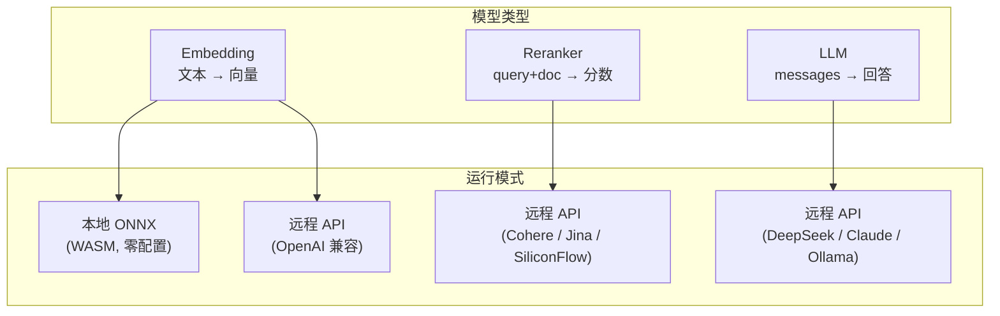
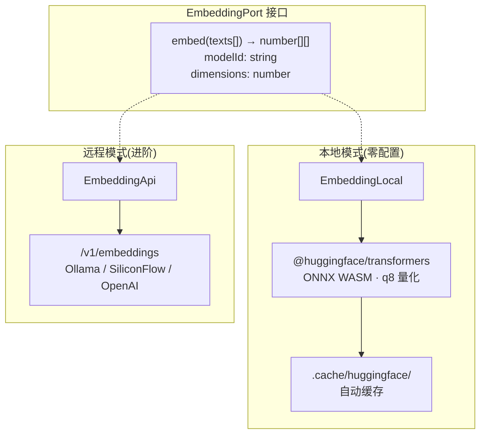
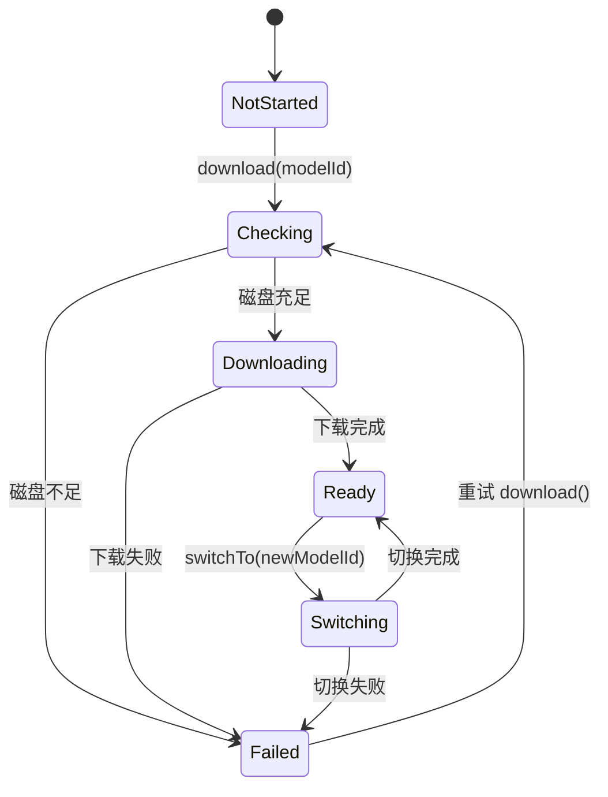
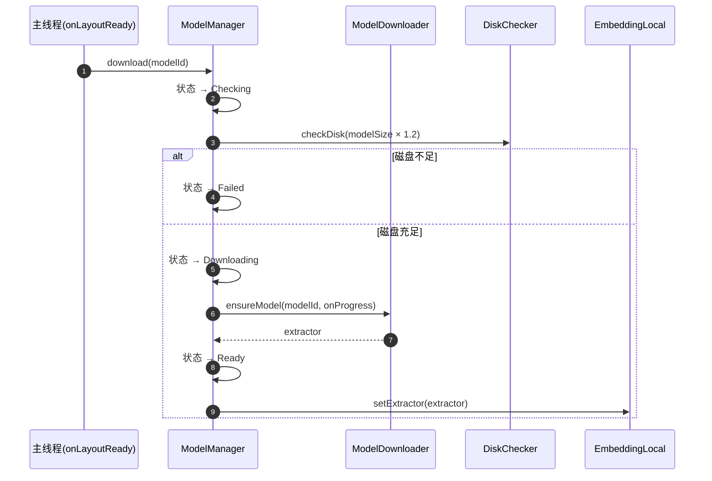
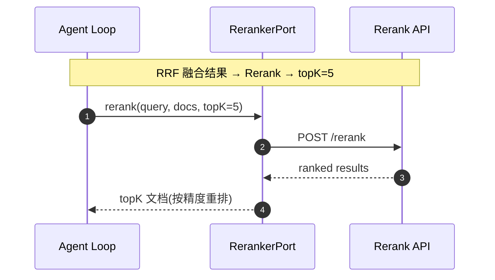
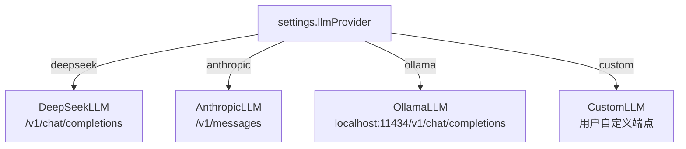

# 模型管理

> 领域:LLM | Embedding + Reranker + LLM 的接口级统一管理

---

## 1. 职责

统一管理 Ratel 使用的三类模型:嵌入模型(Embedding)、重排模型(Reranker)、大语言模型(LLM)。覆盖模型选择、连接配置、状态管理、切换机制。

**不做的事**:
- 不负责检索 workflow(检索属于 [rag/retriever](../rag/retriever.md))
- 不负责流式协议(流式属于 [streaming](streaming.md))
- 不负责索引构建(索引属于 [rag/vector-index](../rag/vector-index.md))

---

## 2. 设计原则

### 2.1 Port 接口统一抽象,Adapter 可替换

**决策**:每类模型定义 Port 接口(零实现),Adapter 实现具体连接逻辑。

**原因**:
- Engine 不知道 Adapter 存在,测试永远针对 Port
- 用户可切换 Provider(DeepSeek ↔ Claude ↔ Ollama)无需改核心逻辑
- 新增 Provider 只需新增 Adapter

### 2.2 本地优先,远程可选

**决策**:Embedding 默认本地 ONNX(零配置),Reranker 和 LLM 仅远程 API。

**原因**:
- Embedding 本地可行(~90MB ONNX 模型),用户期望开箱即用
- Reranker 本地太重(~420MB + 500-800MB 内存),不适合 Obsidian 插件
- LLM 本地推理(Ollama)属于远程 API 的特例(localhost 端点)

### 2.3 模型切换触发索引重建

**决策**:切换 Embedding 模型(维度变化)时,必须重建向量索引。

**原因**:不同维度向量无法计算相似度。切换 LLM/Reranker 不影响索引。

### 2.4 API Key 非空即启用

**决策**:Reranker 和远程 Embedding/LLM 不需要单独开关,配了 API Key 就能用。

**原因**:减少设置项,降低用户认知负担。

---

## 3. 三类模型总览

| 模型 | Port 接口 | 本地模式 | 远程模式 | 状态管理 | 切换影响 |
|---|---|---|---|---|---|
| Embedding | EmbeddingPort | ✅ ONNX q8 | ✅ OpenAI /v1/embeddings | ModelManager 6 态 | 维度变化 → 重建索引 |
| Reranker | RerankerPort | ❌ 太重 | ✅ Cohere / Jina / SiliconFlow | API Key 非空即启用 | 无影响 |
| LLM | LLMClient | ❌ | ✅ DeepSeek / Claude / Ollama | Provider + model 选择 | 无影响 |

---

## 4. Embedding 模型

### 4.1 双模式架构

| 模式 | 默认模型 | 维度 | 首次延迟 | 后续延迟 | 网络需求 |
|---|---|---|---|---|---|
| 本地 | Xenova/bge-small-zh-v1.5 | 512 | ~90MB 下载 + ~5s 初始化 | ~100ms/chunk | 仅首次下载 |
| 远程 | bge-m3 | 1024 | 即时 | ~50-100ms/chunk | 每次调用 |

### 4.2 ModelManager 状态机

### 4.3 下载流程

### 4.4 Embed 执行位置

| 场景 | 执行位置 | 原因 |
|---|---|---|
| 索引时(批量) | Worker 内 | vectra 内部调 createEmbeddings,批量 CPU 密集 |
| 查询时(单条) | 主线程 | ms 级,不卡 UI |

**一致性保证**:索引和查询使用同一个 EmbeddingsModel 实例(主线程构造 → 注入 Worker)。

### 4.5 多模型并存

- 可下载多个模型,缓存在 `.cache/huggingface/`
- `switchTo(newModelId)` 切换活跃模型
- `cleanup(modelIds)` 删除指定模型缓存(不能删当前活跃模型)
- 切换后维度变化 → 触发索引重建

---

## 5. Reranker 模型

### 5.1 仅远程 API

**不做本地 Rerank 的原因**:
- bge-reranker ONNX ~420MB,运行时内存 500-800MB
- 对 Obsidian 用户太重,Rerank 本身是可选增强
- 外部 API 按需调用,不占本地资源

### 5.2 支持的 Provider

| Provider | API Base | 模型 |
|---|---|---|
| Cohere | `https://api.cohere.ai/v1` | `rerank-v3.5` |
| Jina | `https://api.jina.ai/v1` | `jina-reranker-v2` |
| SiliconFlow | `https://api.siliconflow.cn/v1` | `BAAI/bge-reranker-v2-m3` |
| Custom | 用户自定义 | 用户自定义 |

### 5.3 调用流程

**触发条件**:`settings.rerankerApiKey` 非空即启用,无需额外开关。

---

## 6. LLM 模型

### 6.1 仅远程 API

LLM 推理不在本地做(模型太大、推理太慢),全部走远程 API。Ollama 作为 localhost 端点归入远程模式。

### 6.2 支持的 Provider

| Provider | 协议 | 模型 |
|---|---|---|
| DeepSeek | OpenAI 兼容 | deepseek-chat / deepseek-reasoner |
| Anthropic | Claude 协议 | claude-sonnet-4 / claude-haiku-4 |
| Ollama | OpenAI 兼容(localhost) | 用户自定义 |
| Custom | OpenAI 兼容 | 用户自定义 |

### 6.3 Provider 选择流程

### 6.4 LLM 能力矩阵

| 能力 | DeepSeek | Anthropic | Ollama |
|---|---|---|---|
| 流式输出 | ✅ SSE | ✅ SSE | ✅ SSE |
| 工具调用(function calling) | ✅ | ✅ | ⚠️ 视模型 |
| Token 计数 | ✅ 估算 | ✅ 估算 | ✅ 估算 |
| CORS 处理 | requestUrl | requestUrl | fetch(localhost) |

---

## 7. 模型配置矩阵

| 配置 | Embedding | Reranker | LLM |
|---|---|---|---|
| 本地模式 | ✅ 默认 | ❌ | ❌ |
| 远程模式 | ✅ 可选 | ✅ 唯一 | ✅ 唯一 |
| API Key | 远程时需要 | 必需 | 必需 |
| API Base | 远程时需要 | 必需 | 必需 |
| 模型选择 | 本地:5 个预设 / 远程:自定义 | 4 个 Provider | 4 个 Provider |
| 状态管理 | ModelManager 6 态 | API Key 非空即启用 | Provider + model |
| 切换影响 | 维度变化 → 重建索引 | 无 | 无 |
| 磁盘检查 | 本地模式需要 | 不需要 | 不需要 |

---

## 8. 边界

| 与...的接口 | 方向 | 说明 |
|---|---|---|
| [rag/vector-index](../rag/vector-index.md) | 提供 | EmbeddingsModel 注入 Worker |
| [rag/retriever](../rag/retriever.md) | 提供 | EmbeddingPort.embed() 查询向量化 + RerankerPort.rerank() 精排(可选,钥匙串有 key 时启用) |
| [agent/agent-loop](../agent/agent-loop.md) | 提供 | LLMClient.chat() + 意图分类 LLM 调用 |
| [streaming](streaming.md) | 依赖 | LLM 流式协议 |
| [host/persistence](../host/persistence.md) | 依赖 | settings + 模型缓存 |
