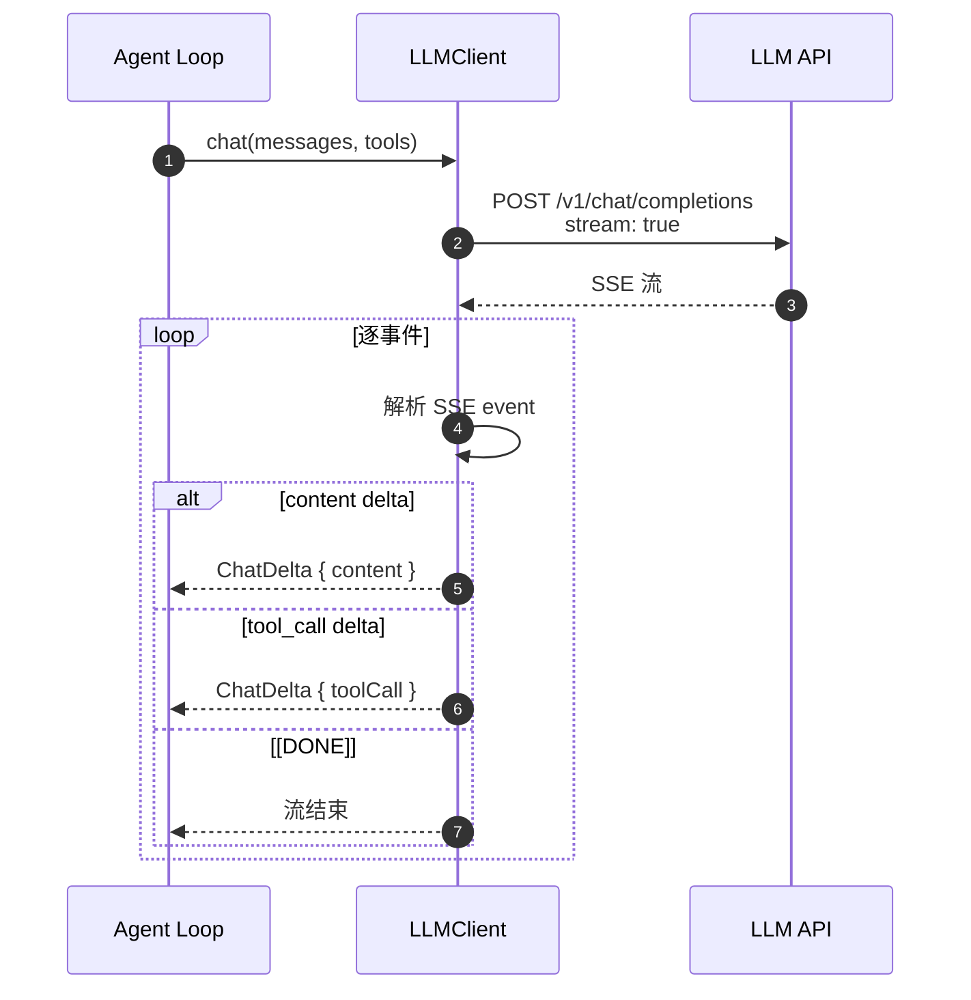
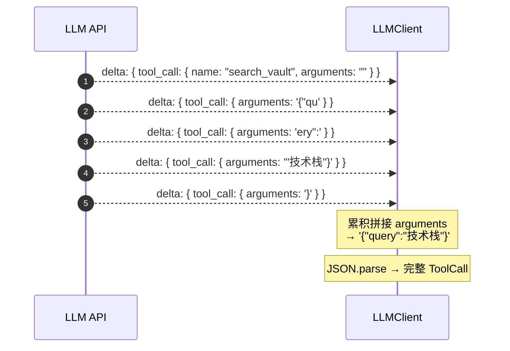
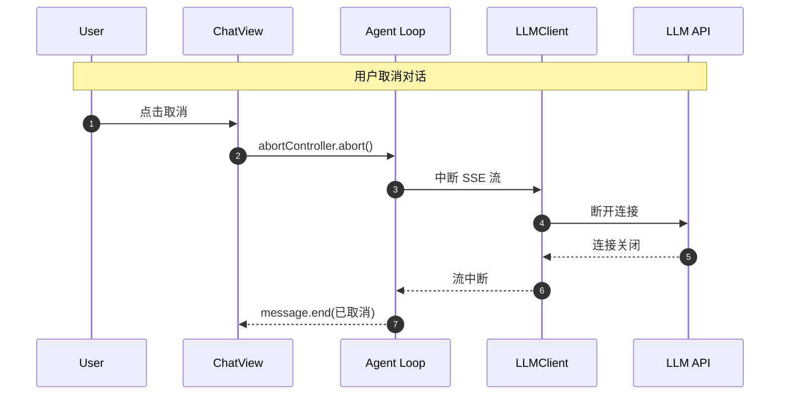
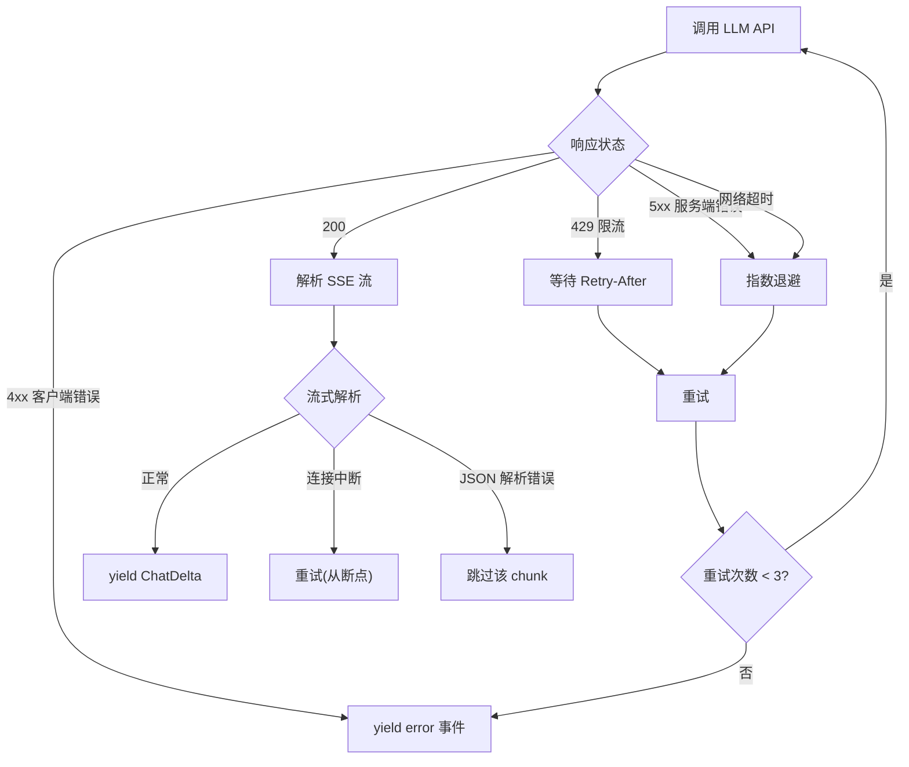
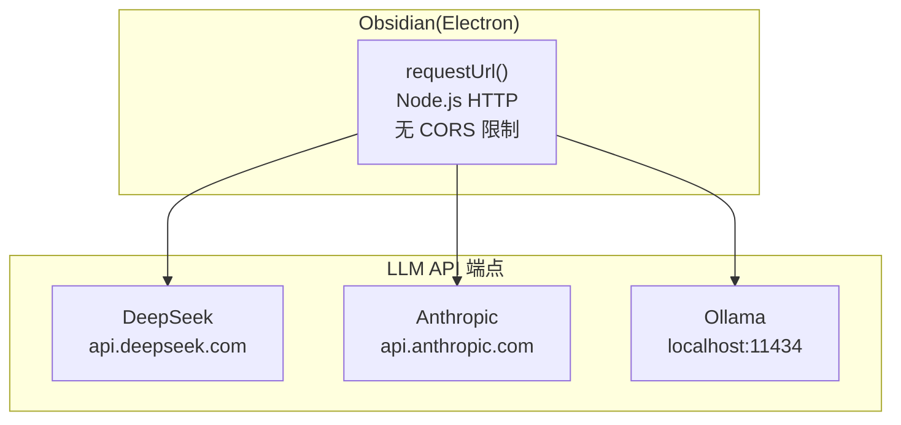

# 流式协议

> 领域:LLM | SSE 解析、取消、重试、CORS 策略

---

## 1. 职责

处理 LLM API 的流式响应:解析 SSE 事件、支持取消、错误重试、CORS 跨域。是 LLM 调用的传输层。

**不做的事**:
- 不负责模型选择(属于 [model-management](model-management.md))
- 不负责对话逻辑(属于 [agent-loop](../agent/agent-loop.md))
- 不负责 UI 渲染(属于 [chat](../agent/chat.md))

---

## 2. 设计原则

### 2.1 SSE(Server-Sent Events)标准

**决策**:LLM 流式响应统一用 SSE 协议解析。

**原因**:
- OpenAI / DeepSeek / Ollama 都用 SSE
- Anthropic 也用 SSE(格式略有不同)
- SSE 是单向流,适合 LLM 场景(服务端推送,客户端只读)

### 2.2 取消即中断

**决策**:用户取消对话时,立即中断 SSE 流,不等待当前 chunk 完成。

**原因**:
- 用户取消意味着"不想等了",继续读浪费资源
- 中断后 LLM 端也会停止生成(连接断开)

### 2.3 CORS 用 Obsidian requestUrl 绕过

**决策**:LLM API 调用用 Obsidian 的 `requestUrl` 而非浏览器 `fetch`,绕过 CORS 限制。

**原因**:
- Obsidian 是 Electron 应用,`requestUrl` 走 Node.js HTTP,无 CORS
- 浏览器 `fetch` 受 CORS 限制,大部分 LLM API 不支持浏览器直接调用
- Ollama localhost 例外:可用 `fetch`,但统一用 `requestUrl` 更简单

---

## 3. SSE 解析

### 3.1 流程



### 3.2 SSE 事件格式

**OpenAI / DeepSeek 格式**:

```
data: {"choices":[{"delta":{"content":"你"},"index":0}]}
data: {"choices":[{"delta":{"content":"好"},"index":0}]}
data: [DONE]
```

**Anthropic 格式**(略有不同):

```
event: content_block_delta
data: {"type":"content_block_delta","delta":{"type":"text_delta","text":"你"}}

event: content_block_delta
data: {"type":"content_block_delta","delta":{"type":"text_delta","text":"好"}}

event: message_stop
data: {"type":"message_stop"}
```

### 3.3 工具调用的流式解析

LLM 工具调用的参数是流式分片到达的,需要累积拼接:



---

## 4. 取消机制



**实现**:用 `AbortController` + `AbortSignal`,传入 `requestUrl` 的 `signal` 参数。

---

## 5. 错误处理与重试



| 错误类型 | 处理策略 |
|---|---|
| 429 限流 | 等待 `Retry-After` 头,最多重试 3 次 |
| 5xx 服务端 | 指数退避(1s / 2s / 4s),最多重试 3 次 |
| 网络超时 | 指数退避重试 |
| 4xx 客户端 | 不重试,yield error 事件 |
| SSE 解析错误 | 跳过该 chunk,继续读 |
| 连接中断 | 重试(如果支持断点续传) |

---

## 6. CORS 策略



| 端点 | 协议 | CORS | 方式 |
|---|---|---|---|
| DeepSeek | HTTPS | 不允许浏览器 | requestUrl(Node.js) |
| Anthropic | HTTPS | 不允许浏览器 | requestUrl(Node.js) |
| Ollama | HTTP | localhost 无限制 | requestUrl(统一) |

**决策**:所有端点统一用 `requestUrl`,即使 Ollama localhost 可用 `fetch`。减少分支逻辑。

---

## 7. 边界

| 与...的接口 | 方向 | 说明 |
|---|---|---|
| [model-management](model-management.md) | 被依赖 | LLMClient 使用流式协议 |
| [agent-loop](../agent/agent-loop.md) | 被依赖 | Agent Loop 消费 ChatDelta 流 |
| [host/obsidian-integration](../host/obsidian-integration.md) | 依赖 | requestUrl 由 Obsidian 提供 |

---

## 8. 演进路径

| 阶段 | 能力 | 状态 |
|---|---|---|
| 当前 | SSE 解析 + requestUrl + 基础错误处理 | ✅ 已实现 |
| 后续 | 取消(AbortController) + 重试(指数退避) | 待增强 |
| 远期 | 断点续传 + 流式工具结果 | 远期 |
