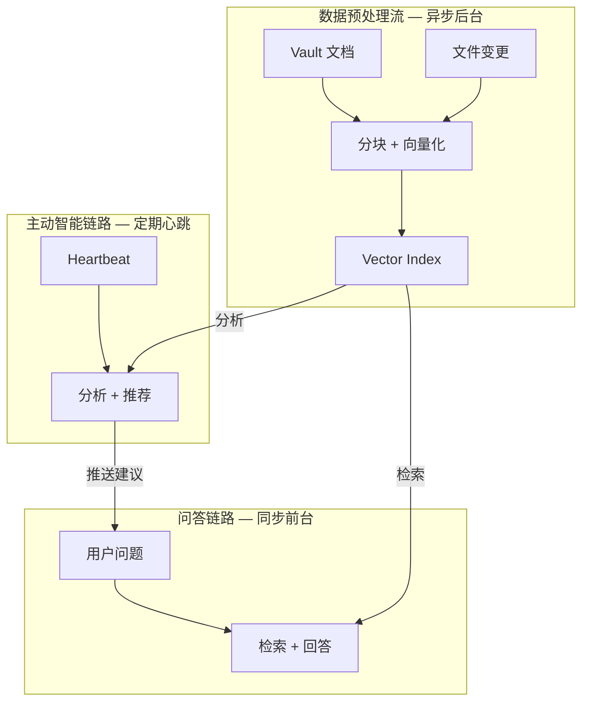
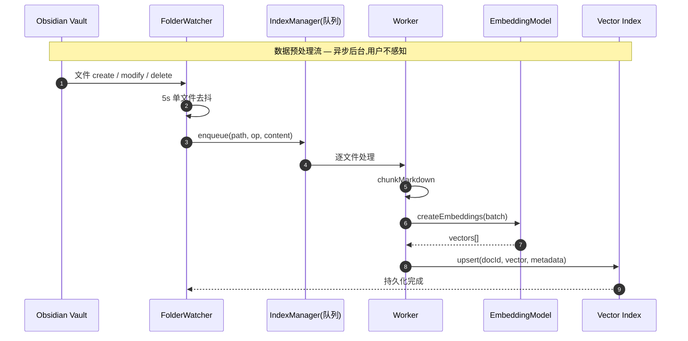
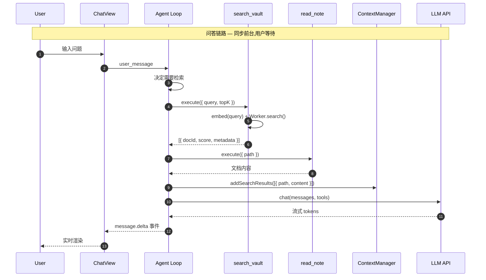
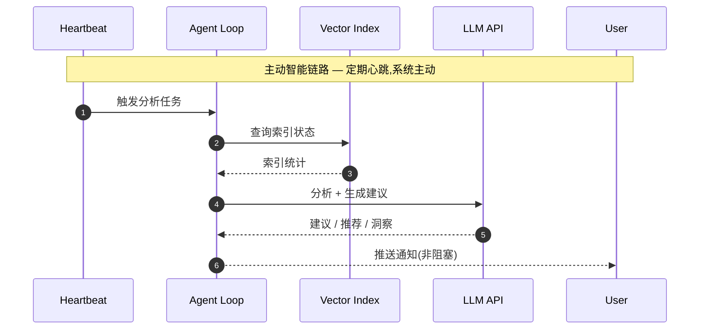
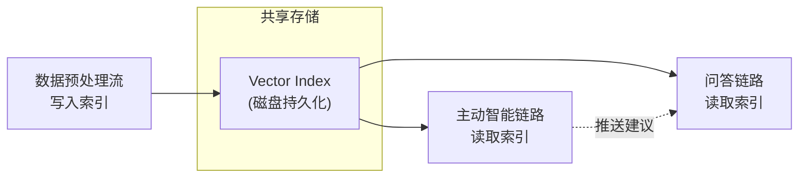
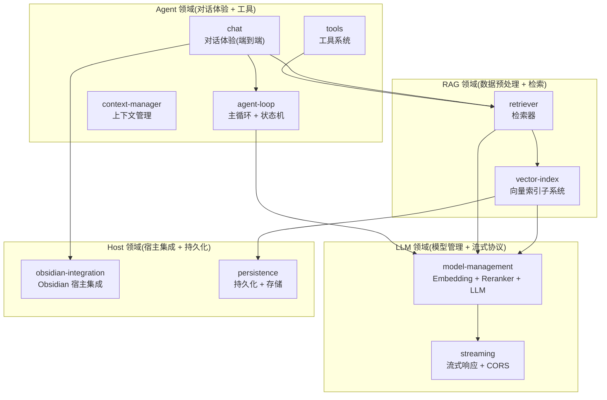
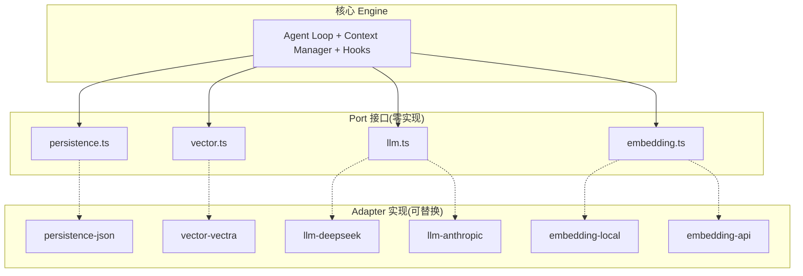
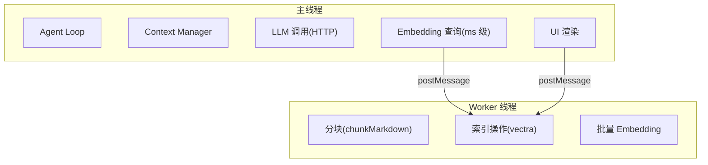

# Ratel Vault — 架构总览

> 本文档是 Ratel Vault 技术架构的入口。5 分钟看懂系统由哪几块组成、它们怎么协作。
> 各子系统的详细设计见 `docs/architecture/` 下的领域文档。

---

## 1. 核心公式

```
Agent = Model + Harness
```

Ratel Vault 是 Harness 的一种实例化 — 专门为 **Obsidian vault** 这个领域而做。

- **Model**: LLM(DeepSeek / Claude / Ollama) + Embedding(本地 ONNX / 远程 API)
- **Harness**: Agent Loop + Context Manager + Tools + Hooks + Subagents + UI

---

## 2. 三条数据流

Ratel 的所有功能可以归纳为三条数据流,它们通过 **Vector Index**(共享存储)解耦:



### 2.1 数据预处理流(生产者)

**触发**:首次打开 vault / 文件变更

**节奏**:异步,可慢,用户不感知

**方向**:被动(响应变更)



**关键性质**:
- 可重试:失败可入队重试
- 可暂停:用户主动暂停后,新事件可缓存
- 可观察:状态机(Idle / Scanning / Queueing / Processing / Ready / Paused / Failed)对外暴露

### 2.2 问答链路(消费者)

**触发**:用户输入问题

**节奏**:同步,要快,用户等待

**方向**:被动(响应问题)



**关键性质**:
- 可中断:用户可随时取消
- 流式:边生成边展示
- 可降级:检索失败时 LLM 仍可基于通用知识回答

### 2.3 主动智能链路(观察者)

**触发**:Heartbeat / 定时器 / 空闲检测

**节奏**:定期,可慢,不打扰用户

**方向**:主动(系统发起)



**典型场景**:
- 检测到用户最近在写某主题 → 推荐相关笔记
- 索引完成后 → 主动总结 vault 知识图谱
- 检测到笔记间矛盾 → 提示用户
- 定期重索引 → 保证索引新鲜度

**当前状态**:尚未实现,属于远期增强。

### 2.4 三流解耦



| 流 | 对 Index 的操作 | 失败影响 |
|---|---|---|
| 数据预处理 | 写入(upsert / delete) | 索引部分更新,问答仍可用旧数据 |
| 问答链路 | 只读(search) | 用户重试,预处理不受影响 |
| 主动智能 | 只读(search + status) | 不影响其他两条流 |

---

## 3. 领域划分



| 领域 | 子系统 | 职责 | 详细文档 |
|---|---|---|---|
| **RAG** | vector-index | 数据预处理:文档发现 → 分块 → 向量化 → 存储 → 增量同步 | [rag/vector-index.md](rag/vector-index.md) |
| **RAG** | retriever | 检索器:查询向量化 → 向量检索 → BM25 → RRF → 重排 | [rag/retriever.md](rag/retriever.md) |
| **Agent** | chat | 对话体验(端到端):用户输入 → Agent Loop → 流式渲染 | [agent/chat.md](agent/chat.md) |
| **Agent** | agent-loop | 主循环:思考 → 调工具 → 拿结果 → 生成回答 | [agent/agent-loop.md](agent/agent-loop.md) |
| **Agent** | context-manager | 上下文管理:消息历史 / 系统提示词 / 搜索结果注入 / 上下文压缩 | [agent/context-manager.md](agent/context-manager.md) |
| **Agent** | tools | 工具系统:注册、发现、调用、返回格式 | [agent/tools.md](agent/tools.md) |
| **LLM** | model-management | 模型管理:Embedding + Reranker + LLM 的接口级统一管理 | [llm/model-management.md](llm/model-management.md) |
| **LLM** | streaming | 流式协议:SSE 解析、取消、重试、CORS 策略 | [llm/streaming.md](llm/streaming.md) |
| **Host** | obsidian-integration | Obsidian 集成:API 封装、UI 挂载、设置、命令 | [host/obsidian-integration.md](host/obsidian-integration.md) |
| **Host** | persistence | 持久化:设置存储、索引目录、数据迁移 | [host/persistence.md](host/persistence.md) |

---

## 4. 设计原则

### 4.1 六边形架构(Ports & Adapters)



**规则**:
- Engine 定义 Port 接口,**不知道** Adapter 存在
- Adapter 实现 Port,可替换
- 测试永远针对 Engine 和 Port,不针对 Adapter

### 4.2 Worker 隔离



**规则**:
- Worker 不做 HTTP、不导入 obsidian、不访问 DOM
- 主线程与 Worker 通过 `postMessage` 通信,类型化协议
- 批量 CPU 密集任务(分块、索引、批量 embed)在 Worker
- 轻量任务(单条查询 embed、LLM 调用)在主线程

### 4.3 其他原则

| 原则 | 说明 |
|---|---|
| 零原生模块 | 纯 JS + WASM,不违反 Obsidian 插件约束 |
| 零配置可用 | 本地 Embedding 开箱即用,无需 API Key |
| 渐进增强 | 每个增强步骤都是可选的,不配就不走 |
| 数据不出 vault | 索引数据存于 `.obsidian/plugins/ratel-vault/` |
| 无遥测 | 不收集数据,模型 API 是唯一网络调用 |

---

## 5. 逻辑执行边界

> 记录 RAG 链路各步骤的实现状态和归属,避免重复设计或遗漏。

| # | 步骤 | 实现状态 | 归属 spec/plan | 说明 |
|---|------|----------|----------------|------|
| 1 | 模型自动下载 | ✅ 已实现 | S-RAG-LOOP(已归档) | ModelManager + ModelDownloader,main.ts onLayoutReady 接入 |
| 2 | 索引自动构建 | ✅ 已实现 | S-RAG-LOOP(已归档) | IndexManager + IndexController + FolderWatcher,main.ts 接入 |
| 3 | Embedding 注入 | ✅ 已实现 | S-RAG-LOOP(已归档) | EmbeddingLocal.setExtractor(),main.ts onLayoutReady 注入 |
| 4 | Worker 初始化 | ✅ 已实现 | S-RAG-LOOP(已归档) | WorkerManager + handler,main.ts 启动;Worker 自初始化 embeddings |
| 5 | 文档分块 | ✅ 已实现 | S-INIT-INDEX(已归档) | chunker.ts 三级回退 |
| 6 | 向量存储 | ✅ 已实现 | S-INIT-INDEX(已归档) | VectraStore upsert/search/delete |
| 7 | search_vault 工具 | ✅ 已实现 | S-RAG-LOOP(已归档) | src/tools/search-vault.ts,返回 docId+score+metadata |
| 8 | 查询向量化 | ✅ 已实现 | S-RAG-LOOP(已归档) | search_vault 调用 embedding.embed() 主线程执行 |
| 9 | BM25 检索 | ❌ 未实现 | P-W3-IMPL | Worker handler 无 bm25.search case |
| 10 | RRF 融合 | ❌ 未实现 | P-W3-IMPL | src/core/rrf.ts 不存在 |
| 11 | 上下文注入 | ✅ 已实现 | S-RAG-LOOP(已归档) | ContextManager.addSearchResults() |
| 12 | RAG 系统提示词 | ❌ 未实现 | 待规划 | SYSTEM_PROMPT 不含 RAG 指令 |
| 13 | 引用标记 | ❌ 未实现 | P-W3-IMPL | |
| 14 | LLM 调用 | ✅ 已实现 | — | DeepSeekLLM + agentLoop,requestUrl 绕过 CORS |
| 15 | 流式输出 | ⚠️ 部分实现 | — | requestUrl 返回完整 text 后解析 SSE,非真流式;ChatView 仅处理 message.delta |
| 16 | 主动智能 | ❌ 未实现 | 远期 | Heartbeat + 分析 + 推荐 |
| 17 | 增量索引消费 | ✅ 已实现 | 质量修复 | enqueue 自动触发 scheduleFlush |
| 18 | 上下文压缩 | ❌ 未实现 | 待规划 | 四池预算 + 三层压缩均未实现 |
| 19 | 工具调用 UI 可见 | ✅ 已实现 | 质量修复 | ChatView 处理 tool.call/tool.result 事件,显示工具名+结果摘要 |
| 20 | 取消机制 | ❌ 未实现 | 待规划 | 无 AbortController |

### 执行优先级

```
已完成                      P-W3-IMPL (后续)         待规划
──────────                  ────────────────         ──────────
#1-4 main.ts 接入层         #9 BM25 检索              #12 RAG 提示词
#7-8 search_vault           #10 RRF 融合              #18 上下文压缩
#11 上下文注入              #13 引用标记               #20 取消机制
#17 增量索引消费
#19 工具调用 UI 可见
质量修复(fetch→requestUrl,
增量队列消费,事件名统一)
```

---

## 6. 参考文档

| 文档 | 位置 | 说明 |
|---|---|---|
| ADR-001 CORS | `docs/adr/2026-06-14-ratel-cors-strategy.md` | LLM 端点 CORS 处理策略 |
| STATUS.md | `docs/superpowers/STATUS.md` | spec / plan 状态追踪 |
| 归档 | `docs/superpowers/archive/` | 已完成的 spec/plan 历史档案 |
