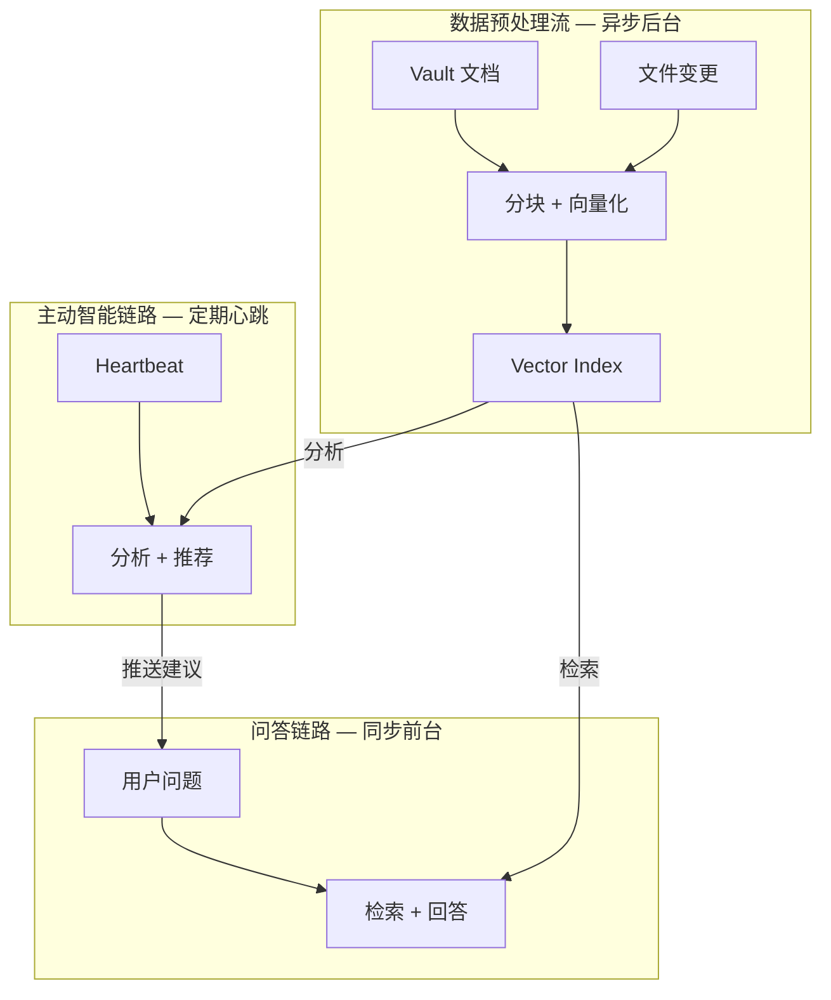
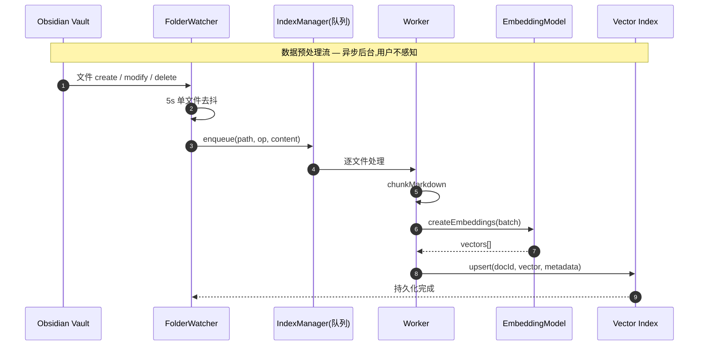
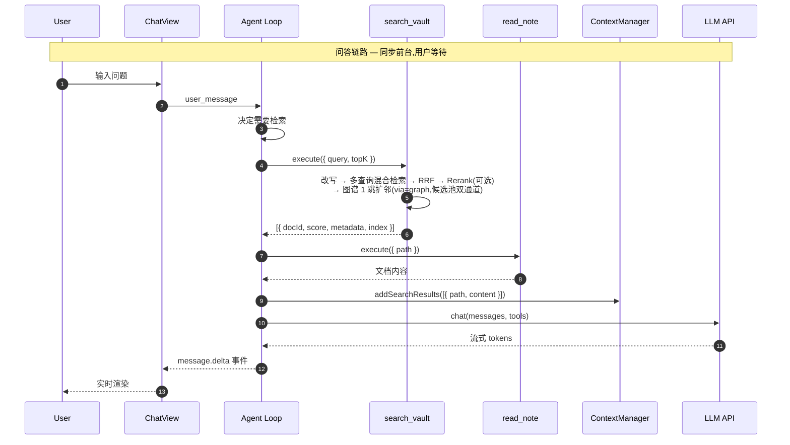
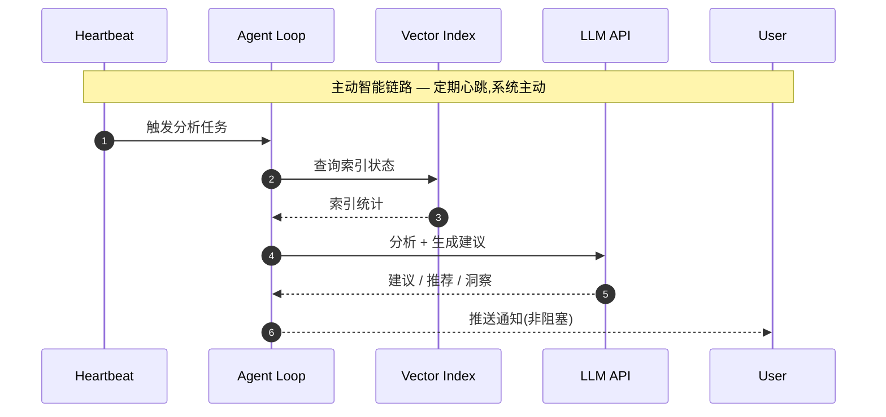
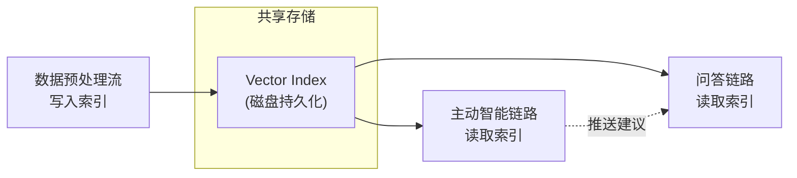
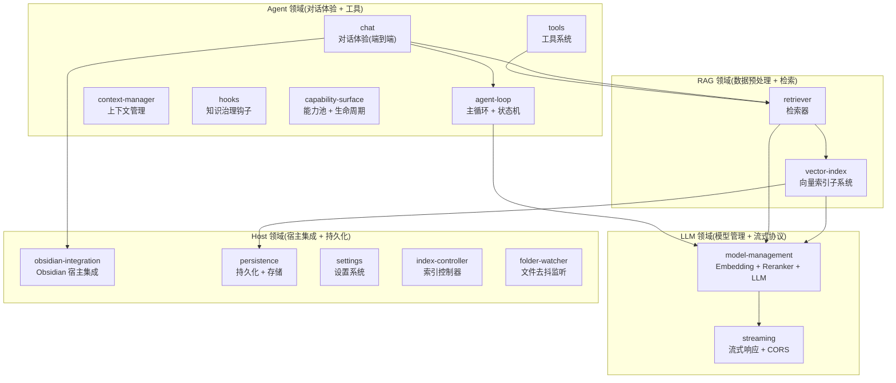
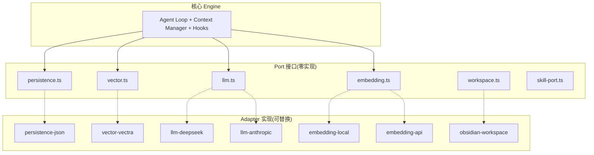
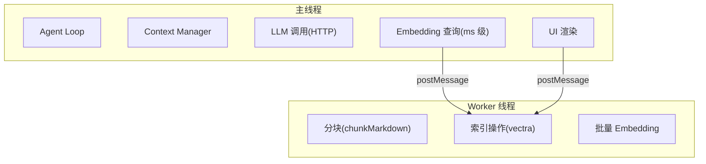
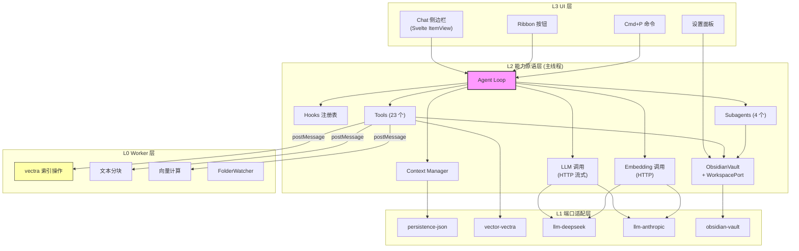

# Ratel Vault — 架构总览

> 本文档是 Ratel Vault 技术架构的**唯一总入口**。5 分钟看懂系统由哪几块组成、它们怎么协作。
> 各子系统的详细设计见 `docs/architecture/` 下的领域文档;非显然的技术选型见 `docs/adr/`。

---

## 1. 核心公式

```
Agent = Model + Harness
```

Ratel Vault 是 Harness 的一种实例化 — 专门为 **Obsidian vault** 这个领域而做。

- **Model**: LLM(DeepSeek / Claude / Ollama) + Embedding(本地 ONNX / 远程 API)
- **Harness**: Agent Loop + Context Manager + Tools + Hooks + Subagents + UI

---

## 2. 三条数据流

Ratel 的所有功能可以归纳为三条数据流,它们通过 **Vector Index**(共享存储)解耦:


```mermaid
graph TB
    subgraph "数据预处理流 — 异步后台"
        P1["Vault 文档"] --> P2["分块 + 向量化"]
        P2 --> P3["Vector Index"]
        P3b["文件变更"] --> P2
    end

    subgraph "问答链路 — 同步前台"
        Q1["用户问题"] --> Q2["检索 + 回答"]
    end

    subgraph "主动智能链路 — 定期心跳"
        H1["Heartbeat"] --> H2["分析 + 推荐"]
    end

    P3 -->|"检索"| Q2
    P3 -->|"分析"| H2
    H2 -->|"推送建议"| Q1
```

### 2.1 数据预处理流(生产者)

**触发**:首次打开 vault / 文件变更

**节奏**:异步,可慢,用户不感知

**方向**:被动(响应变更)


```mermaid
sequenceDiagram
    autonumber
    participant V as Obsidian Vault
    participant W as FolderWatcher
    participant Q as IndexManager(队列)
    participant WP as Worker
    participant E as EmbeddingModel
    participant IDX as Vector Index

    Note over V,IDX: 数据预处理流 — 异步后台,用户不感知

    V->>W: 文件 create / modify / delete
    W->>W: 5s 单文件去抖
    W->>Q: enqueue(path, op, content)
    Q->>WP: 逐文件处理
    WP->>WP: chunkMarkdown
    WP->>E: createEmbeddings(batch)
    E-->>WP: vectors[]
    WP->>IDX: upsert(docId, vector, metadata)
    IDX-->>W: 持久化完成
```

**关键性质**:
- 可重试:失败可入队重试
- 可暂停:用户主动暂停后,新事件可缓存
- 可观察:状态机(Idle / Scanning / Queueing / Processing / Ready / Paused / Failed)对外暴露

### 2.2 问答链路(消费者)

**触发**:用户输入问题

**节奏**:同步,要快,用户等待

**方向**:被动(响应问题)


```mermaid
sequenceDiagram
    autonumber
    participant U as User
    participant CV as ChatView
    participant AL as Agent Loop
    participant SV as search_vault
    participant RN as read_note
    participant CTX as ContextManager
    participant LLM as LLM API

    Note over U,LLM: 问答链路 — 同步前台,用户等待

    U->>CV: 输入问题
    CV->>AL: user_message
    AL->>AL: 决定需要检索
    AL->>SV: execute({ query, topK })
    SV->>SV: 改写 → 多查询混合检索 → RRF → Rerank(可选)<br/>→ 图谱 1 跳扩邻(via=graph,候选池双通道)
    SV-->>AL: [{ docId, score, metadata, index }]
    AL->>RN: execute({ path })
    RN-->>AL: 文档内容
    AL->>CTX: addSearchResults([{ path, content }])
    AL->>LLM: chat(messages, tools)
    LLM-->>AL: 流式 tokens
    AL-->>CV: message.delta 事件
    CV-->>U: 实时渲染
```

> 检索管线(多查询 / RRF / Rerank / 图谱扩邻三道过滤)的完整设计见 [rag/retriever.md](rag/retriever.md)。

**关键性质**:
- 可中断:用户可随时取消
- 流式:边生成边展示
- 可降级:检索失败时 LLM 仍可基于通用知识回答

### 2.3 主动智能链路(观察者)

**触发**:Heartbeat / 定时器 / 空闲检测

**节奏**:定期,可慢,不打扰用户

**方向**:主动(系统发起)


```mermaid
sequenceDiagram
    autonumber
    participant HB as Heartbeat
    participant AL as Agent Loop
    participant IDX as Vector Index
    participant LLM as LLM API
    participant U as User

    Note over HB,U: 主动智能链路 — 定期心跳,系统主动

    HB->>AL: 触发分析任务
    AL->>IDX: 查询索引状态
    IDX-->>AL: 索引统计
    AL->>LLM: 分析 + 生成建议
    LLM-->>AL: 建议 / 推荐 / 洞察
    AL-->>U: 推送通知(非阻塞)
```

**典型场景**:
- 检测到用户最近在写某主题 → 推荐相关笔记
- 索引完成后 → 主动总结 vault 知识图谱
- 检测到笔记间矛盾 → 提示用户
- 定期重索引 → 保证索引新鲜度

**当前状态**:尚未实现,属于远期增强。

### 2.4 三流解耦


```mermaid
graph LR
    subgraph "共享存储"
        IDX["Vector Index<br/>(磁盘持久化)"]
    end

    PP["数据预处理流<br/>写入索引"] --> IDX
    IDX --> QQ["问答链路<br/>读取索引"]
    IDX --> HH["主动智能链路<br/>读取索引"]
    HH -.->|"推送建议"| QQ
```

| 流 | 对 Index 的操作 | 失败影响 |
|---|---|---|
| 数据预处理 | 写入(upsert / delete) | 索引部分更新,问答仍可用旧数据 |
| 问答链路 | 只读(search) | 用户重试,预处理不受影响 |
| 主动智能 | 只读(search + status) | 不影响其他两条流 |

---

## 3. 领域划分


```mermaid
graph TB
    subgraph "RAG 领域(数据预处理 + 检索)"
        R1["vector-index<br/>向量索引子系统"]
        R2["retriever<br/>检索器"]
    end

    subgraph "Agent 领域(对话体验 + 工具)"
        A0["chat<br/>对话体验(端到端)"]
        A1["agent-loop<br/>主循环 + 状态机"]
        A2["context-manager<br/>上下文管理"]
        A3["tools<br/>工具系统"]
        A4["hooks<br/>知识治理钩子"]
        A5["capability-surface<br/>能力池 + 生命周期"]
    end

    subgraph "LLM 领域(模型管理 + 流式协议)"
        L1["model-management<br/>Embedding + Reranker + LLM"]
        L2["streaming<br/>流式响应 + CORS"]
    end

    subgraph "Host 领域(宿主集成 + 持久化)"
        H1["obsidian-integration<br/>Obsidian 宿主集成"]
        H2["persistence<br/>持久化 + 存储"]
        H3["settings<br/>设置系统"]
        H4["index-controller<br/>索引控制器"]
        H5["folder-watcher<br/>文件去抖监听"]
    end

    R2 --> R1
    R1 --> L1
    R2 --> L1
    A0 --> A1
    A0 --> R2
    A1 --> L1
    A3 --> R2
    L1 --> L2
    A0 --> H1
    R1 --> H2
```

| 领域 | 子系统 | 职责 | 详细文档 |
|---|---|---|---|
| **RAG** | vector-index | 数据预处理:文档发现 → 分块 → 向量化 → 存储 → 增量同步 | [rag/vector-index.md](rag/vector-index.md) |
| **RAG** | retriever | 检索器:查询向量化 → 向量检索 → BM25 → RRF → 重排 → 图谱 1 跳扩邻 | [rag/retriever.md](rag/retriever.md) |
| **Agent** | chat | 对话体验(端到端):用户输入 → Agent Loop → 流式渲染 | [agent/chat.md](agent/chat.md) |
| **Agent** | capability-surface | 能力池:统一意图选择 + 按 kind 路由执行 + 工具生命周期(注册→发现→执行→销毁) | [agent/capability-surface.md](agent/capability-surface.md) |
| **Agent** | agent-loop | 主循环:思考 → 调工具 → 拿结果 → 生成回答 | [agent/agent-loop.md](agent/agent-loop.md) |
| **Agent** | context-manager | 上下文管理:消息历史 / 搜索结果注入 / 上下文压缩(系统提示词见 prompt-management) | [agent/context-manager.md](agent/context-manager.md) |
| **Agent** | prompt-management | 提示词 registry + Composer:中文模板 / 动态注入 / section 覆盖 | [agent/prompt-management.md](agent/prompt-management.md) |
| **Agent** | tools | 工具系统:注册、发现、调用、返回格式(含环境感知只读工具) | [agent/tools.md](agent/tools.md) |
| **Agent** | hooks | 知识治理钩子:pre-write / post-write 阶段化扩展点 | [agent/hooks.md](agent/hooks.md) |
| **LLM** | model-management | 模型管理:Embedding + Reranker + LLM 的接口级统一管理 | [llm/model-management.md](llm/model-management.md) |
| **LLM** | streaming | 流式协议:SSE 解析、取消、重试、CORS 策略 | [llm/streaming.md](llm/streaming.md) |
| **Host** | obsidian-integration | Obsidian 集成:API 封装、UI 挂载、设置、命令 | [host/obsidian-integration.md](host/obsidian-integration.md) |
| **Host** | persistence | 持久化:设置存储、索引目录、数据迁移 | [host/persistence.md](host/persistence.md) |
| **Host** | settings | 设置系统:5 组配置项、设置面板、配置热重载 | [host/settings.md](host/settings.md) |
| **Host** | index-controller | 索引控制器:聚合 Vault 事件 + 去抖 + 过滤 + 队列 | [host/index-controller.md](host/index-controller.md) |
| **Host** | folder-watcher | 文件去抖:单文件 5s 计时,delete 立即触发 | [host/folder-watcher.md](host/folder-watcher.md) |
| **Host** | worker-protocol | Worker 通信:postMessage 协议、请求/响应关联、超时控制 | [host/worker-protocol.md](host/worker-protocol.md) |
| **Host** | mcp | MCP Host:多 Server 编排、双 transport、工具入册与权限 | [host/mcp.md](host/mcp.md) |

---

## 4. 设计原则

### 4.1 六边形架构(Ports & Adapters)


```mermaid
graph TB
    subgraph "核心 Engine"
        Core["Agent Loop + Context Manager + Hooks"]
    end

    subgraph "Port 接口(零实现)"
        PP["persistence.ts"]
        PV["vector.ts"]
        PL["llm.ts"]
        PE["embedding.ts"]
        PW["workspace.ts"]
        PS["skill-port.ts"]
    end

    subgraph "Adapter 实现(可替换)"
        APJ["persistence-json"]
        AVV["vector-vectra"]
        ALD["llm-deepseek"]
        ALA["llm-anthropic"]
        AEL["embedding-local"]
        AEA["embedding-api"]
        AOW["obsidian-workspace"]
    end

    Core --> PP
    Core --> PV
    Core --> PL
    Core --> PE

    PP -.-> APJ
    PV -.-> AVV
    PL -.-> ALD
    PL -.-> ALA
    PE -.-> AEL
    PE -.-> AEA
    PW -.-> AOW
```

**规则**:
- Engine 定义 Port 接口,**不知道** Adapter 存在
- Adapter 实现 Port,可替换
- 测试永远针对 Engine 和 Port,不针对 Adapter

### 4.2 Worker 隔离


```mermaid
graph TB
    subgraph "主线程"
        MT1["Agent Loop"]
        MT2["Context Manager"]
        MT3["LLM 调用(HTTP)"]
        MT4["Embedding 查询(ms 级)"]
        MT5["UI 渲染"]
    end

    subgraph "Worker 线程"
        WT1["分块(chunkMarkdown)"]
        WT2["索引操作(vectra)"]
        WT3["批量 Embedding"]
    end

    MT4 -->|"postMessage"| WT2
    MT5 -->|"postMessage"| WT2
```

**规则**:
- Worker 不做 HTTP、不导入 obsidian、不访问 DOM
- 主线程与 Worker 通过 `postMessage` 通信,类型化协议
- 批量 CPU 密集任务(分块、索引、批量 embed)在 Worker
- 轻量任务(单条查询 embed、LLM 调用)在主线程

### 4.3 分层视图


```mermaid
graph TB
    subgraph "L3 UI 层"
        L3A["Chat 侧边栏<br/>(Svelte ItemView)"]
        L3B["Ribbon 按钮"]
        L3C["Cmd+P 命令"]
        L3D["设置面板"]
    end

    subgraph "L2 能力原语层 (主线程)"
        L2A["Agent Loop"]
        L2B["Context Manager"]
        L2C["Hooks 注册表"]
        L2D["Tools (23 个)"]
        L2E["Subagents (4 个)"]
        L2F["LLM 调用<br/>(HTTP 流式)"]
        L2G["Embedding 调用<br/>(HTTP)"]
        L2H["ObsidianVault<br/>+ WorkspacePort"]
    end

    subgraph "L1 端口适配层"
        L1A["persistence-json"]
        L1B["vector-vectra"]
        L1C["llm-deepseek"]
        L1D["llm-anthropic"]
        L1E["obsidian-vault"]
    end

    subgraph "L0 Worker 层"
        L0A["vectra 索引操作"]
        L0B["文本分块"]
        L0C["向量计算"]
        L0D["FolderWatcher"]
    end

    L3A --> L2A
    L3B --> L2A
    L3C --> L2A
    L3D --> L2H

    L2A --> L2B
    L2A --> L2C
    L2A --> L2D
    L2A --> L2E
    L2A --> L2F
    L2A --> L2G
    L2D --> L2H
    L2E --> L2H

    L2F --> L1C
    L2F --> L1D
    L2G --> L1C
    L2G --> L1D
    L2H --> L1E
    L2B --> L1A
    L2D --> L1B

    L2D -->|"postMessage"| L0A
    L2D -->|"postMessage"| L0B
    L2D -->|"postMessage"| L0C

    style L2A fill:#f9f,stroke:#333,stroke-width:2px
    style L0A fill:#ffa,stroke:#333
```

### 4.4 其他原则

| 原则 | 说明 |
|---|---|
| Engine 零外部依赖 | `core/` 不 import 任何 persistence / 模型 SDK / Obsidian API |
| Hooks 是治理层 | pre/post-write 是核心,不是装饰 |
| Subagent 是能力隔离 | Indexer / Librarian / Reviewer / Curator 互不污染 |
| 测试 = Engine + Port | 永远不针对 Adapter 写业务测试 |
| 零原生模块 | 纯 JS + WASM,不违反 Obsidian 插件约束 |
| 零配置可用 | 本地 Embedding 开箱即用,无需 API Key |
| 渐进增强 | 每个增强步骤都是可选的,不配就不走 |
| 数据不出 vault | 索引数据存于 `.obsidian/plugins/ratel-vault/` |
| 无遥测 | 不收集数据,模型 API 是唯一网络调用 |

---

## 5. 目录结构

```
src/
  main.ts                          # 插件入口 (RatelVaultPlugin 类)
  settings.ts                      # 设置面板 (RatelVaultSettings + SettingTab)
  types.ts                         # 全局类型定义

  core/                            # Engine 核心
    agent-loop.ts                  #   Agent Loop (编排 tool call)
    context-manager.ts             #   Context Manager (组装上下文)
    hooks.ts                       #   Hooks 注册表 + 执行
    memory-store.ts                #   MemoryStore (用户记忆读写 + 向量索引 upsert)
    multi-query-searcher.ts        #   多查询混合检索编排 (searchWithPool 暴露候选池)
    graph-expander.ts              #   图谱 1 跳扩邻 (双通道确认 + hub 双向挡, ADR-013)

  i18n/                            # 国际化 (自建 svelte/store 方案)
    types.ts                       #   12 个 namespace 接口 + Strings 合并
    zh.ts                          #   中文翻译表
    en.ts                          #   英文翻译表 (编译期键集校验)
    index.ts                       #   langStore + t(derived) + tNow(sync) + detectLang/applyLangPreference

  ports/                           # Port 接口 (零实现, 只定义契约)
    persistence.ts                 #   Persistence 接口
    vector.ts                      #   VectorStore 接口
    llm.ts                         #   LLMClient 接口
    embedding.ts                   #   EmbeddingPort 接口
    workspace.ts                   #   WorkspacePort(活动文件 / 选区)
    skill-port.ts                  #   SkillPort 接口 (三源抽象, skill-fs/skill-vault 实现)
    vault.ts                       #   VaultPort(+ VaultMetadata.headings)

  adapters/                        # Adapter 实现
    obsidian-vault.ts              #   Obsidian Vault API 薄封装
    obsidian-workspace.ts          #   Obsidian Workspace(活动文件 / 选区)
    persistence-json.ts            #   Obsidian loadData/saveData
    vector-vectra.ts               #   vectra LocalDocumentIndex 封装
    llm-deepseek.ts                #   DeepSeek (OpenAI 兼容 SDK)
    llm-anthropic.ts               #   Claude (Anthropic SDK)
    skill-fs.ts                    #   SkillFsAdapter (node:fs 读 builtin/global skills)
    skill-vault.ts                 #   SkillVaultAdapter (走 VaultPort 读 vault 内 skills)

  skills/                          # Skill 机制核心层 (P-SKILL-1-CORE)
    types.ts                       #   Skill/SkillManifest/SkillSource/SkillActivation
    skill-loader.ts                #   三源扫描 + gray-matter frontmatter 解析 + 合并
    skill-registry.ts              #   enabled/disabled/active 三态管理 (会话级 active)
    skill-activator.ts             #   产出 Discovery 段 (相关性排序 + 截断 50, S-SR-LAYERING)

  tools/                           # Vault 工具集 (23 个)
    read-note.ts                   #   读取笔记全文 + metadata + backlinks
    search-vault.ts                #   向量+BM25 混合检索 + 图谱 1 跳扩邻 (via=graph)
    grep.ts                        #   正则搜索
    glob.ts                        #   文件名匹配
    list-files.ts                  #   列出文件
    write-note.ts                  #   创建/覆盖笔记
    append-note.ts                 #   追加内容
    edit-note.ts                   #   精确替换
    delete-note.ts                 #   删除笔记
    search-memory.ts               #   搜索用户记忆 (向量检索 topics/)
    remember.ts                    #   写入记忆 (global 或 topic)
    forget-memory.ts               #   删除记忆条目
    activate-skill.ts              #   激活指定 skill (LLM 工具)
    deactivate-skill.ts            #   反激活指定 skill (LLM 工具)
    get-datetime.ts                #   本地时间 / 相对加减日
    get-active-note.ts             #   活动笔记路径 / 选区 / frontmatter
    get-daily-note.ts              #   日记路径探测(不创建)
    list-recent-notes.ts           #   按 mtime 列最近笔记
    get-note-outline.ts            #   metadataCache.headings 大纲
    get-links.ts                   #   出链 / 反链 / 未解析链接
    search-by-tag.ts               #   嵌套标签前缀过滤
    search-by-property.ts          #   frontmatter 属性过滤
    get-vault-structure.ts         #   目录 / 标签 / 孤儿笔记概览

  subagents/                       # 4 个 Subagent
    indexer.ts                     #   维护向量索引 (文件变更 + 定时重检)
    librarian.ts                   #   维护语义链接 (post-write hook)
    reviewer.ts                    #   发现孤儿/弱链 (每周/手动)
    curator.ts                     #   生成主题综述 (每周/手动)

  ui/                              # Svelte 视图 (chat / memory-panel / status / settings)

  worker/                          # Worker Thread
    index.ts                       #   InlineWorker 入口 (索引调度)
    handler.ts                     #   Worker 消息分发
    index-processor.ts             #   索引批处理 (分块 → 批量 embed → upsert)
    chunker.ts                     #   Markdown 分块 (500 token + 100 overlap)
    inline-worker.ts               #   InlineWorker 实现 (主线程 Worker 模拟)
    embedding-worker.ts            #   Embedding Web Worker 入口 (ONNX 推理)
    manager.ts                     #   WorkerManager (协议 / 超时)

  prompts/                         # Prompt Registry(单一装配入口)
    types.ts                       #   PromptSectionId 类型 + OverrideMap
    sections.ts                    #   28 个 section 元数据注册表 (含 agent.skills + 4 个 skill 工具 section)
    defaults/zh.ts                 #   中文默认值(常量,不可变)
    interpolate.ts                 #   {{var}} 占位符引擎 + 校验
    tool-schemas.ts                #   工具 JSON schema 骨架(23 个)
    composer.ts                    #   Composer 装配 API(5 个出口函数,含 composeMemorySystemPrompt)
    injection/                     #   动态注入管理器 (S-SR-LAYERING / ADR-016)
      ids.ts                       #     INJECTION_SOURCE_IDS(as const 元组)— env/memory/skills
      injector.ts                  #     PromptInjector(buildSections 组装 + ownBudgetBytes 兜底)
    index.ts                       #   模块 re-export 入口

  utils/                           # 工具函数
    hash.ts                        #   SHA-256 content hash
    debounce.ts                    #   防抖
    local-datetime.ts              #   本地时间格式化(环境注入 + get_datetime 共用)
    path-safety.ts                 #   vault 路径沙箱
```

**核心铁律**:`core/` 永远是叶子,**任何模块都不反向依赖 core/**。

---

## 6. RAG 链路步骤

> RAG 对话从用户消息到生成回答的完整链路。图中节点编号与下表 # 一一对应;各步骤的所属模块详见对应架构文档。


```mermaid
graph LR
    U["用户问题"] --> intent["7 意图分类"]
    intent --> prompt["8 动态提示词"]
    prompt --> hybrid["9 混合检索"]
    hybrid --> fuse["10 多查询融合"]
    fuse --> rerank["11 重排(可选)"]
    rerank --> expandA

    subgraph expand["12 图谱扩邻 ★ 相关链接笔记的查询与融合"]
        expandA["沿命中正文出链<br/>查相关链接笔记"] --> expandB["双通道过滤<br/>候选池 + hub 挡"] --> expandC["融合为 via=graph 候选<br/>index 续编号 / ≤5 条"]
    end

    expandC --> inject["13 上下文注入"]
    inject --> cite["14 引用标记 [n]"]
    cite --> llm["15 LLM 调用"]
    llm --> stream["16 流式输出"]
    llm --> chips["17 搜索结果卡片"]
    llm --> toolui["19 工具调用 UI"]
    stream --> ans["回答(带 [n] 引用)"]

    subgraph prep["① 索引准备(异步后台)"]
        model["1 模型管理"] --> embed["3 Embedding 注入"]
        build["2 索引构建"] --> chunk["5 文档分块"] --> embed
        embed --> worker["4 Worker 通信"] --> store["6 向量存储"]
    end

    store ==>|"向量索引 + 候选池"| hybrid
    store -.->|"候选池"| expandB

    %% 隐形锚点:把「索引准备」压到主链下方(从检索段下方开始),避免被误读为流程起点
    intent ~~~ model
    intent ~~~ build

    compact["18 上下文压缩"] -.-> inject
    cancel["20 取消机制"] -.-> llm
    proactive["21 主动智能(远期)"] -.-> U

    style expand fill:#eaf7ea,stroke:#2a2,stroke-width:2px
    style expandA fill:#dfd,stroke:#2a2
    style expandB fill:#dfd,stroke:#2a2
    style expandC fill:#dfd,stroke:#2a2
```

| # | 步骤 | 模块 | 说明 |
|---|------|------|------|
| 1 | 模型管理 | [llm/model-management](llm/model-management.md) | ModelManager + 自动下载,main.ts onLayoutReady 接入 |
| 2 | 索引构建 | [rag/vector-index](rag/vector-index.md) | IndexManager + IndexController + FolderWatcher,全量 + 增量 |
| 3 | Embedding 注入 | [llm/model-management](llm/model-management.md) | EmbeddingLocal.setExtractor(),主线程 + Worker 共用 |
| 4 | Worker 通信 | [host/worker-protocol](host/worker-protocol.md) | WorkerManager + handler,优先 Node Worker Threads,降级 InlineWorker |
| 5 | 文档分块 | [rag/vector-index](rag/vector-index.md) | chunker.ts 三级回退(标题→段落→句子) |
| 6 | 向量存储 | [rag/vector-index](rag/vector-index.md) | VectraStore upsert / hybridSearch / delete |
| 7 | 意图分类 | [agent/agent-loop](agent/agent-loop.md) | 一次快速 LLM 调用,判断 'rag' \| 'direct' |
| 8 | 动态提示词 | [agent/prompt-management](agent/prompt-management.md) | Composer 按意图组装中文 system;工具列表与 schema 同源 |
| 9 | 混合检索 | [rag/retriever](rag/retriever.md) | search_vault 调 vectra isBm25 混合搜索,返回带 index 编号 |
| 10 | 多查询融合 | [rag/retriever](rag/retriever.md) | Query Rewrite 生成变体 + RRF 融合多份结果 |
| 11 | 重排 | [rag/retriever](rag/retriever.md) | Reranker 百炼 API 精排(可选,钥匙串有 key 时启用) |
| 12 | 图谱扩邻 | [rag/retriever](rag/retriever.md) | GraphExpander 1 跳邻居(候选池双通道 + hub 双向挡,via=graph;ADR-013) |
| 13 | 上下文注入 | [agent/context-manager](agent/context-manager.md) | addSearchResults 注入 read_note 读取的内容 |
| 14 | 引用标记 | [agent/context-manager](agent/context-manager.md) | LLM 用 [1][2] 引用 search_vault 返回的 index |
| 15 | LLM 调用 | [agent/agent-loop](agent/agent-loop.md) | LLMClient.chat + requestUrl 绕过 CORS |
| 16 | 流式输出 | [llm/streaming](llm/streaming.md) | SSE 解析,ChatView 逐字渲染 |
| 17 | 搜索结果卡片 | [agent/chat](agent/chat.md) | search.result 事件 → ChatView 渲染编号+路径+分数 |
| 18 | 上下文压缩 | [agent/context-manager](agent/context-manager.md) | 三层:截断 → 滑动窗口 → LLM 摘要 |
| 19 | 工具调用 UI | [agent/chat](agent/chat.md) | tool.call / tool.result 事件,显示工具名+结果摘要 |
| 20 | 取消机制 | [agent/agent-loop](agent/agent-loop.md) | AbortSignal,3 个检查点 |
| 21 | 主动智能 | 远期 | Heartbeat + 分析 + 推荐 |

---

## 7. 存储总览

| 层 | 内容 | 位置 | 实现 | 理由 |
|---|---|---|---|---|
| **FS** | Markdown 原文 | `vault/`(用户原 vault) | 不动 | **不能动用户数据** |
| **JSON** | 会话 / 设置 / 钩子日志 / 笔记元数据 | `data.json`(Obsidian `loadData/saveData`) | 零依赖 | 轻量 / Obsidian 原生 / 不用解决 WASM 加载 |
| **vectra** | 向量 + 文档索引 + 块级嵌入 | `.obsidian/plugins/ratel-vault/index/` | vectra 文件持久化 | 零 native / 内置持久化 / 增量友好 |

**Content-Hash 双键**:`path`(人类可读 ID)+ SHA-256 content hash(检测变更)→ vault 操作 100% 幂等。详见 [host/persistence.md](host/persistence.md)。

---

## 8. 关键技术决策

| 决策 | 选型 | 理由 |
|---|---|---|
| 形态 | 纯 Obsidian 插件 | 深度结合 Obsidian API，零额外部署 |
| 重活儿 | Worker Threads | 主线程零阻塞，Obsidian 不卡 |
| UI 框架 | Svelte 5 | 轻量、Obsidian 生态主流、官方推荐 |
| 向量库 | vectra | 零 native / Electron 支持 / 内置文档索引+分块+混合检索+FolderWatcher / 33k 周下载 |
| 元数据 | JSON (Obsidian loadData/saveData) | 零依赖 / 不用解决 Worker 里 WASM 加载问题 |
| 嵌入模型 | BGE-M3 | 中文好、免费、MTEB 强 |
| 聊天模型（默认） | DeepSeek-V3 | 便宜、中文好、可切 Claude |
| Worker HTTP | 主线程做 HTTP | Worker 里没有 fetch / XMLHttpRequest |
| 包结构 | 1 包 + 目录模块 | Obsidian 插件不需要独立发布 / 生态惯例 |
| Obsidian API | ObsidianVault facade (TS) | 可测试 / 可追踪 / 变了只改一处 |
| 文件监听 | Obsidian `app.vault.on()` | 比 chokidar 更准（Obsidian 内部事件） |
| 索引策略 | 增量 + SHA-256 hash | 1k 笔记首扫 5-10 分钟，增量毫秒级 |
| 块大小 | 500 token + 100 overlap | 召回粒度平衡 |
| 插件分发 | 社区商店 + GitHub Release | 用户以商店搜索为主;开发者可读 release 资产 |
| Worker 路径 | `path.join(__dirname, 'worker.js')` | CJS 环境下 __dirname 可用 |
| 环境感知 | WorkspacePort + system 时间注入 | 活动文件不塞 VaultPort;「今天」零工具成本 |

---

## 9. 风险点与缓解

| 风险 | 严重度 | 缓解 |
|---|---|---|
| Obsidian 插件审核周期长 | 低 | 商店已上架;GitHub Release 作备份渠道 |
| vectra 在 Worker 里跑 | 低 | 纯 JS 无问题；FolderWatcher 在主线程初始化后传给 Worker |
| 增量索引边界混乱 | 中 | path + content hash 双键 + 幂等保证 |
| LLM 过度链接 | 中 | 置信度阈值（>0.75）+ 用户确认 |
| vault > 10k 篇 | 中 | Worker 限速 + 后台队列 + 分批嵌入 |
| 首扫时间 | 低 | 1k 笔记 ≈ 5-10 分钟（含网络抖动），后台执行不阻塞 |
| data.json 膨胀 | 低 | 会话历史只保留最近 N 条 + 摘要压缩 |
| Obsidian API breaking change | 低 | ObsidianVault facade 隔离，变了只改一处 |

---

## 10. 不做什么(架构层面)

- ❌ 不做独立 Node 服务
- ❌ 不做 WebSocket / HTTP 传输层
- ❌ 不做 Web GUI
- ❌ 不用 native 模块(better-sqlite3 / LanceDB)
- ❌ 不在 Engine 内 import 任何 persistence / 模型 SDK / Obsidian API
- ❌ 不做完整 ReAct Planner(用裸 Loop)
- ❌ 不做分布式(单 Obsidian 实例单用户)
- ❌ 不做 npm scope 多包(用目录模块代替)

---

## 11. 参考文档

| 文档 | 位置 | 说明 |
|---|---|---|
| ADR-001 CORS | `docs/adr/2026-06-14-ratel-cors-strategy.md` | LLM 端点 CORS 处理策略 |
| ADR-006 发版资产 | `docs/adr/2026-06-28-release-asset-distribution.md` | Worker 内联 + WASM 懒下载(商店三文件约束) |
| ADR-007 Context Window | `docs/adr/2026-06-28-model-context-window-registry.md` | LiteLLM 映射表 + 预设下拉(128k/200k/256k/1M/自定义) |
| ADR-009 Skill | `docs/adr/2026-07-06-skill-mechanism.md` | Skill 三源加载与端口 |
| ADR-010 Skill 边界 | `docs/adr/2026-07-21-skill-vs-builtin-capability.md` | Skill vs 内置工具/workflow 的产品边界 |
| ADR-011 混合检索 | `docs/adr/2026-07-23-hybrid-retrieval-graph-routing.md` | 语义+结构混合;按问题用图,不硬上图 |
| ADR-012 Skill 激活 | `docs/adr/2026-07-23-skill-activation-claude-aligned.md` | 激活写入会话消息;废除 Active 段/全局 Set 注入 |
| ADR-013 图谱检索 | `docs/adr/2026-08-03-graph-retrieval-minimize-human-curation.md` | 少靠人管理:向量保底 + 机会性用边 + 双通道确认 |
| ADR-014 MCP 平台 | `docs/adr/2026-08-03-mcp-host-platform.md` | 平台级 MCP Host,不自建 websearch;双 transport |
| ADR-015 能力池 | `docs/adr/2026-08-03-capability-pool.md` | 统一意图选择(能力池),按 kind 路由执行链路 |
| S-BASIC-ENV | `docs/superpowers/archive/S-BASIC-ENV/` | 环境感知:时间注入 + WorkspacePort + daily/recent/outline(已归档,0.1.5) |
| STATUS.md | `docs/superpowers/STATUS.md` | spec / plan 状态追踪 |
| 归档 | `docs/superpowers/archive/` | 已完成的 spec/plan 历史档案 |
