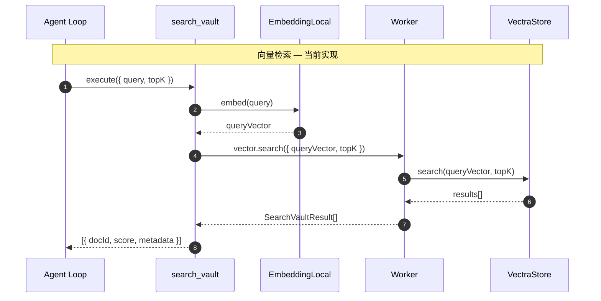
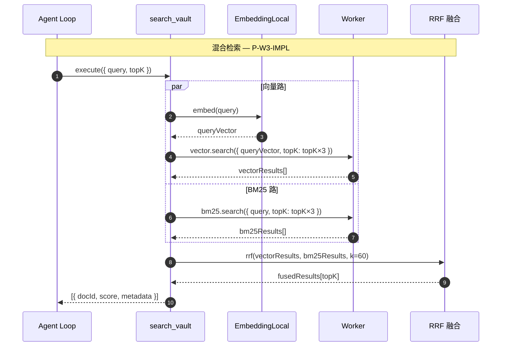
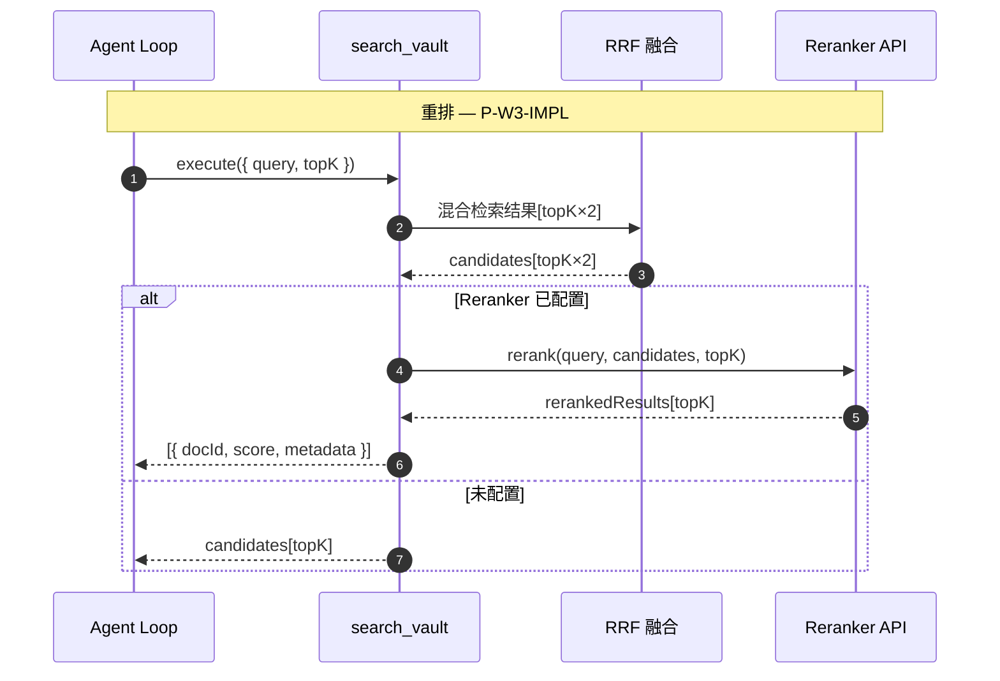
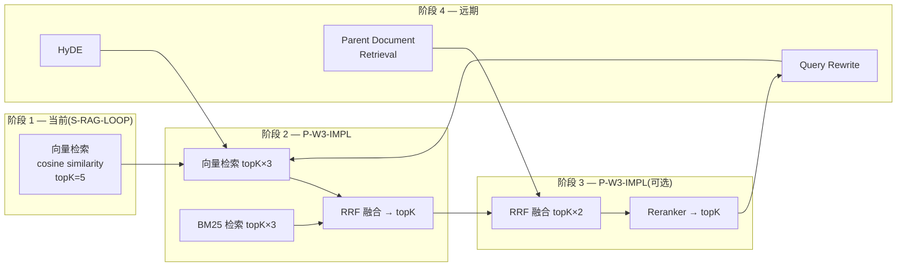

# 检索器

> 领域:RAG | 问答链路(同步前台)
> 查询向量化 → 向量检索 → BM25 → RRF → 重排

---

## 1. 职责

接收用户查询,从 Vector Index 中召回相关文档片段,经过融合和重排后返回最相关的结果。

**不做的事**:
- 不负责索引构建(索引属于 [vector-index](vector-index.md))
- 不负责模型管理(模型属于 [model-management](../llm/model-management.md))
- 不负责上下文注入(上下文属于 [context-manager](../agent/context-manager.md))
- 不负责生成回答(Generation 就是调 LLM,无需复杂设计)

---

## 2. 设计原则

### 2.1 检索与生成分离

**决策**:Retriever 只负责召回文档,不负责生成回答。Agent Loop 决定何时检索、如何用检索结果。

**原因**:
- 检索是确定性的(给定 query 返回固定结果),生成是概率性的
- 分离后检索可独立测试、独立优化
- Agent 可根据场景决定是否检索(闲聊不需要检索)

### 2.2 检索与读取分离

**决策**:search_vault 只返回 docId + score + metadata,不返回 chunk 原文。模型自主决定用 read_note 读取哪些。

**原因**:
- 工具职责单一:search 负责召回,read 负责取内容
- 避免 chunk 原文过长污染上下文窗口
- 模型自主判断哪些相关,减少无关信息

### 2.3 渐进增强:向量 → 混合 → 重排

**决策**:检索能力分三阶段递进,每阶段独立可用。

**原因**:
- 向量检索即可满足基本需求,不依赖 BM25/RRF/Reranker
- 混合检索(BM25 + 向量)提升召回率约 17%
- Reranker 进一步提升精度,但需要额外 API

---

## 3. 检索流程

### 3.1 当前:向量检索(单路)



**返回格式**:

```typescript
interface SearchVaultResult {
  docId: string;     // "notes/project.md#chunk-0"
  score: number;     // cosine similarity 0~1
  metadata: {
    path: string;       // "notes/project.md"
    chunkIndex: number; // 0
  };
}
```

### 3.2 后续:混合检索(向量 + BM25)



**RRF(Reciprocal Rank Fusion)**:

```
score(d) = Σ 1/(k + rank_i(d))
```

- k = 60(经验值,降低高排名文档的权重差异)
- 两路各取 topK×3,融合后截取 topK

### 3.3 远期:重排



**Reranker 触发条件**:`settings.rerankerApiKey` 非空即启用。

---

## 4. 检索质量优化路径



| 阶段 | 能力 | 召回率提升 | 精度提升 | 依赖 |
|---|---|---|---|---|
| 1 向量检索 | 基线 | — | — | Embedding |
| 2 混合检索 | +BM25 +RRF | ~17% | — | BM25 索引 |
| 3 重排 | +Reranker | — | ~10-20% | Reranker API |
| 4 查询优化 | +Query Rewrite +HyDE | ~5-10% | ~5-10% | LLM 额外调用 |

---

## 5. search_vault 工具定义

**工具 schema**:

```typescript
{
  name: 'search_vault',
  description: '在知识库中搜索与查询相关的文档。返回文档路径和相关性分数,用 read_note 读取内容。',
  parameters: {
    query: {
      type: 'string',
      description: '搜索查询'
    },
    topK: {
      type: 'number',
      description: '返回结果数,默认 5',
      default: 5
    }
  }
}
```

**Agent Loop 使用模式**:

```
用户问题 → Agent Loop 判断需要检索
  → search_vault(query, topK=5)
  → 拿到 [docId, score, metadata] 列表
  → 模型判断哪些相关
  → read_note(path) 读取原文
  → ContextManager.addSearchResults()
  → LLM 生成回答
```

---

## 6. 边界

| 与...的接口 | 方向 | 协议 |
|---|---|---|
| [vector-index](vector-index.md) | 依赖 | VectraStore.search() 提供向量检索 |
| [model-management](../llm/model-management.md) | 依赖 | EmbeddingPort.embed() 查询向量化 + RerankerPort.rerank() 重排 |
| [agent/tools](../agent/tools.md) | 被调用 | search_vault 作为工具注册 |
| [agent/context-manager](../agent/context-manager.md) | 下游 | 检索结果经 read_note 后注入上下文 |

---

## 7. 演进路径

| 阶段 | 能力 | 状态 |
|---|---|---|
| S-RAG-LOOP | 向量检索 + search_vault 工具 | 待实现 |
| P-W3-IMPL | BM25 + RRF + Reranker | 待实现 |
| 远期 | Query Rewrite + HyDE + Parent Document Retrieval | 远期 |
