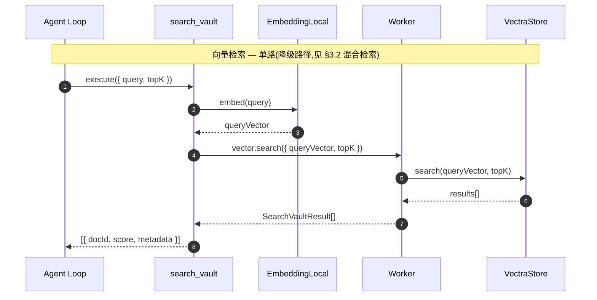
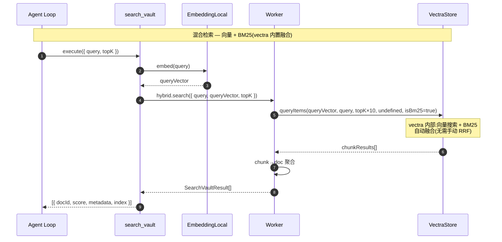
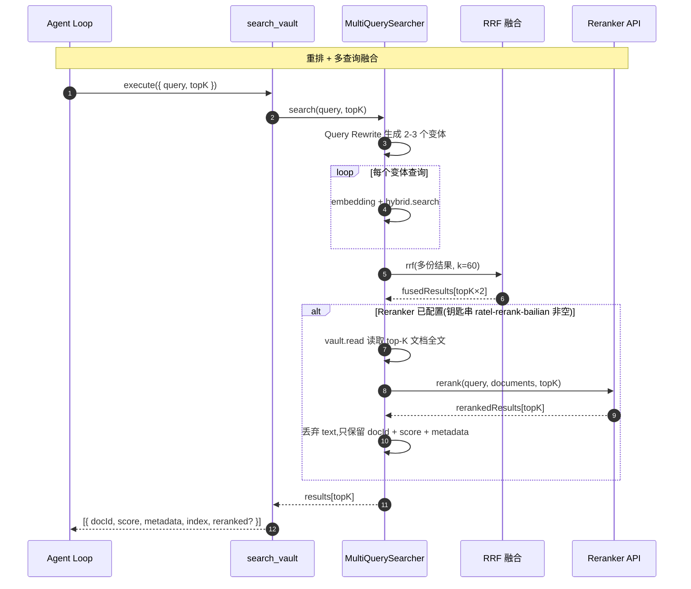
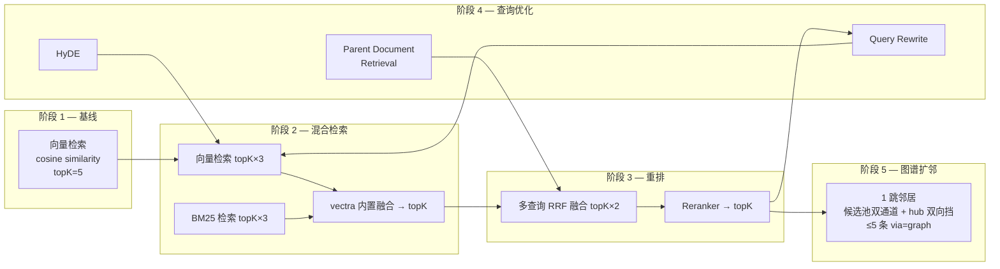

# 检索器

> 领域:RAG | 问答链路(同步前台)
> 查询向量化 → 向量检索 → BM25 → RRF → 重排 → 图谱 1 跳扩邻

---

## 1. 职责

接收用户查询,从 Vector Index 中召回相关文档片段,经过融合和重排后返回最相关的结果。

**不做的事**:
- 不负责索引构建(索引属于 [vector-index](vector-index.md))
- 不负责模型管理(模型属于 [model-management](../llm/model-management.md))
- 不负责上下文注入(上下文属于 [context-manager](../agent/context-manager.md))
- 不负责生成回答(Generation 就是调 LLM,无需复杂设计)

---

## 2. 设计原则

### 2.1 检索与生成分离

**决策**:Retriever 只负责召回文档,不负责生成回答。Agent Loop 决定何时检索、如何用检索结果。

**原因**:
- 检索是确定性的(给定 query 返回固定结果),生成是概率性的
- 分离后检索可独立测试、独立优化
- Agent 可根据场景决定是否检索(闲聊不需要检索)

### 2.2 检索与读取分离

**决策**:search_vault 只返回 docId + score + metadata,不返回 chunk 原文。模型自主决定用 read_note 读取哪些。

**原因**:
- 工具职责单一:search 负责召回,read 负责取内容
- 避免 chunk 原文过长污染上下文窗口
- 模型自主判断哪些相关,减少无关信息

### 2.3 渐进增强:向量 → 混合 → 重排

**决策**:检索能力分三阶段递进,每阶段独立可用。

**原因**:
- 向量检索即可满足基本需求,不依赖 BM25/RRF/Reranker
- 混合检索(BM25 + 向量)提升召回率约 17%
- Reranker 进一步提升精度,但需要额外 API

### 2.4 双通道确认:链接提议,向量裁决

**决策**:图谱扩邻的邻居必须同时 ① 被命中笔记的正文链接 ② 落在检索候选池(topK×2 过度抓取)内,才允许进入结果。

**原因**:
- 双链边的语义是「人(或工作流)声明的关联」,不等于「与当前查询相关」([ADR-013](../../adr/2026-08-03-graph-retrieval-minimize-human-curation.md))
- 候选池本来就是过度抓取的副产物,复用它做语义门槛**零额外成本**
- 不把「用户先整理好链接图」当使用前提;Daily / MOC 类 hub 另由阈值双向挡

---

## 3. 检索流程

### 3.1 向量检索(单路降级)


```mermaid
sequenceDiagram
    autonumber
    participant AL as Agent Loop
    participant SV as search_vault
    participant EL as EmbeddingLocal
    participant WP as Worker
    participant VS as VectraStore

    Note over AL,VS: 向量检索 — 单路(降级路径,见 §3.2 混合检索)

    AL->>SV: execute({ query, topK })
    SV->>EL: embed(query)
    EL-->>SV: queryVector
    SV->>WP: vector.search({ queryVector, topK })
    WP->>VS: search(queryVector, topK)
    VS-->>WP: results[]
    WP-->>SV: SearchVaultResult[]
    SV-->>AL: [{ docId, score, metadata }]
```

**返回格式**:

```typescript
interface SearchVaultResult {
  docId: string;     // "notes/project.md#chunk-0"
  score: number;     // cosine similarity 0~1
  metadata: {
    path: string;       // "notes/project.md"
    chunkIndex: number; // 0
  };
}
```

### 3.2 混合检索(向量 + BM25,现状基线)


```mermaid
sequenceDiagram
    autonumber
    participant AL as Agent Loop
    participant SV as search_vault
    participant EL as EmbeddingLocal
    participant WP as Worker
    participant VS as VectraStore

    Note over AL,VS: 混合检索 — 向量 + BM25(vectra 内置融合)

    AL->>SV: execute({ query, topK })
    SV->>EL: embed(query)
    EL-->>SV: queryVector
    SV->>WP: hybrid.search({ query, queryVector, topK })
    WP->>VS: queryItems(queryVector, query, topK×10, undefined, isBm25=true)
    Note over VS: vectra 内部:向量搜索 + BM25<br/>自动融合(无需手动 RRF)
    VS-->>WP: chunkResults[]
    WP->>WP: chunk→doc 聚合
    WP-->>SV: SearchVaultResult[]
    SV-->>AL: [{ docId, score, metadata, index }]
```

**vectra 内置混合搜索**:

```
LocalIndex.queryItems(vector, query, topK, filter?, isBm25?)
```

- 第 2 参数传 query 文本(原 search 传空串,BM25 未启用)
- 第 5 参数 `isBm25=true` 启用 BM25 追加结果
- vectra 内部基于 `wink-bm25-text-search` 库,自动融合向量 + 关键词结果
- 主线程无需手动两路搜索 + RRF,降低复杂度

**返回格式**(含引用编号,供 LLM 用 [1][2] 引用):

```typescript
interface SearchVaultResult {
  docId: string;       // "notes/project.md#chunk-0"
  score: number;       // 融合分数 0~1
  metadata: {
    path: string;        // "notes/project.md"
    chunkIndex: number;  // 0
  };
  index: number;        // 引用编号,从 1 开始
}
```

### 3.3 重排 + 多查询(现状)


```mermaid
sequenceDiagram
    autonumber
    participant AL as Agent Loop
    participant SV as search_vault
    participant MQS as MultiQuerySearcher
    participant RRF as RRF 融合
    participant RR as Reranker API

    Note over AL,RR: 重排 + 多查询融合

    AL->>SV: execute({ query, topK })
    SV->>MQS: search(query, topK)

    MQS->>MQS: Query Rewrite 生成 2-3 个变体
    loop 每个变体查询
        MQS->>MQS: embedding + hybrid.search
    end
    MQS->>RRF: rrf(多份结果, k=60)
    RRF-->>MQS: fusedResults[topK×2]

    alt Reranker 已配置(钥匙串 ratel-rerank-bailian 非空)
        MQS->>MQS: vault.read 读取 top-K 文档全文
        MQS->>RR: rerank(query, documents, topK)
        RR-->>MQS: rerankedResults[topK]
        MQS->>MQS: 丢弃 text,只保留 docId + score + metadata
    end

    MQS-->>SV: results[topK]
    SV-->>AL: [{ docId, score, metadata, index, reranked? }]
```

**Reranker 触发条件**:`hasRerankApiKey(app) === true`(钥匙串 `ratel-rerank-bailian` 非空)。无 key 时跳过 Rerank,降级为仅 RRF 融合。

### 3.4 图谱 1 跳扩邻(P-GRAPH-EXPAND)

```mermaid
sequenceDiagram
    autonumber
    participant AL as Agent Loop
    participant SV as search_vault
    participant MQS as MultiQuerySearcher
    participant GE as GraphExpander
    participant MC as metadataCache

    Note over AL,MC: 图谱 1 跳机会性扩邻(ADR-013)— 链接提议,向量裁决

    AL->>SV: execute({ query, topK })
    SV->>MQS: searchWithPool(query, topK)
    MQS-->>SV: { results[topK], candidatePaths: Set&lt;path&gt; }
    SV->>SV: enrich(实时补 tags / backlinkCount)
    SV->>GE: expand(hits, { allowedPaths: candidatePaths })
    GE->>MC: getLinks / getBacklinks(同步)
    MC-->>GE: 出链 / 反链
    Note over GE: 去重 → 候选池门槛 → hub 双向挡(出链&gt;50 / 反链&gt;100)
    GE-->>SV: neighbors[≤5]
    SV-->>AL: [...hits, ...via=graph 邻居(index 续编号, score=源×0.8)]
```

**三道过滤(成本从低到高)**:

1. **去重** — 已在命中集或已被带出的路径跳过
2. **候选池门槛(双通道确认)** — 邻居须落在 `searchWithPool` 返回的 `candidatePaths` 内,挡「链了但语义无关」的边
3. **hub 双向挡** — 源命中出链 > `HUB_MAX_OUTGOING`(50)整源跳过(Daily Plan 场景);邻居出链 > 50 或反链 > `HUB_MAX_BACKLINKS`(100)跳过

**邻居条目形状**:`{ docId: 'graph:<path>', score: 源×0.8, index: 续编号, metadata: { path, tags, backlinkCount, via: 'graph', graphFrom } }`,与检索命中共享同一 `[n]` 引用空间;UI 引用芯片加「链接图」徽标。

**降级**:扩邻任一步异常(`getLinks` 抛错 / expand 异常)→ 返回纯检索结果;无边库行为与旧版一致。`MultiQuerySearcher.search()` 旧签名保留为薄包装,`searchWithPool()` 才是完整出口。

---

## 4. 检索质量优化路径


```mermaid
graph LR
    subgraph "阶段 1 — 基线"
        V["向量检索<br/>cosine similarity<br/>topK=5"]
    end

    subgraph "阶段 2 — 混合检索"
        V2["向量检索 topK×3"]
        B["BM25 检索 topK×3"]
        R["vectra 内置融合 → topK"]
        V2 --> R
        B --> R
    end

    subgraph "阶段 3 — 重排"
        R2["多查询 RRF 融合 topK×2"]
        RR["Reranker → topK"]
        R2 --> RR
    end

    subgraph "阶段 4 — 查询优化"
        Q["Query Rewrite"]
        H["HyDE"]
        P["Parent Document<br/>Retrieval"]
        Q --> V2
        H --> V2
        P --> R2
    end

    subgraph "阶段 5 — 图谱扩邻"
        GE["1 跳邻居<br/>候选池双通道 + hub 双向挡<br/>≤5 条 via=graph"]
    end

    V --> V2
    R --> R2
    RR --> Q
    RR --> GE
```

| 阶段 | 能力 | 召回率提升 | 精度提升 | 依赖 |
|---|---|---|---|---|
| 1 向量检索 | 基线 | — | — | Embedding |
| 2 混合检索 | +BM25(vectra 内置) | ~17% | — | BM25 索引 |
| 3 重排 | +Reranker + 多查询 RRF | — | ~10-20% | Reranker API |
| 4 查询优化 | +Query Rewrite +HyDE | ~5-10% | ~5-10% | LLM 额外调用 |
| 5 图谱扩邻 | +1 跳邻居(via=graph) | 补「语义沾边但未被向量召回」的关联笔记 | 双通道门槛保精度 | metadataCache(零成本) |

---

## 5. search_vault 工具定义

**工具 schema**:

```typescript
{
  name: 'search_vault',
  description: '在知识库中搜索与查询相关的笔记。使用多查询混合检索(向量+BM25)与可选重排,并沿正文链接补充 1 跳邻居(metadata.via 为 graph);返回带 index 编号的结果;用 read_note 读取全文。回答时用返回的 index 写成 [n] 引用。',
  parameters: {
    query: {
      type: 'string',
      description: '搜索查询'
    },
    topK: {
      type: 'number',
      description: '返回结果数,默认 5',
      default: 5
    }
  }
}
```

**Agent Loop 使用模式**:

```
用户问题 → 意图分类器判断 intent='rag'
  → search_vault(query, topK=5)
  → 拿到 [docId, score, metadata, index] 列表(发 search.result 事件;
    尾部可能带 via=graph 图谱邻居,与命中共享同一 [n] 编号空间)
  → 模型用 [1][2] 引用编号,自主决定 read_note 哪些
  → read_note(path) 读取原文
  → ContextManager.addSearchResults()
  → LLM 生成回答(用 [1][2] 引用)
```

> UI 侧:引用芯片对 `via=graph` 条目加「链接图」徽标(`chat.cite.viaGraph`),让用户看见图在起作用。

---

## 6. 边界

| 与...的接口 | 方向 | 协议 |
|---|---|---|
| [vector-index](vector-index.md) | 依赖 | VectraStore.hybridSearch() 提供混合检索 |
| [model-management](../llm/model-management.md) | 依赖 | EmbeddingPort.embed() 查询向量化 + RerankerPort.rerank() 重排 |
| [agent/tools](../agent/tools.md) | 被调用 | search_vault 作为工具注册 |
| [agent/context-manager](../agent/context-manager.md) | 下游 | 检索结果经 read_note 后注入上下文 |
| 图谱扩邻([ADR-013](../../adr/2026-08-03-graph-retrieval-minimize-human-curation.md)) | 依赖 | core/graph-expander 经 VaultPort.getLinks/getBacklinks 读 metadataCache;候选池由 `MultiQuerySearcher.searchWithPool` 提供 |
