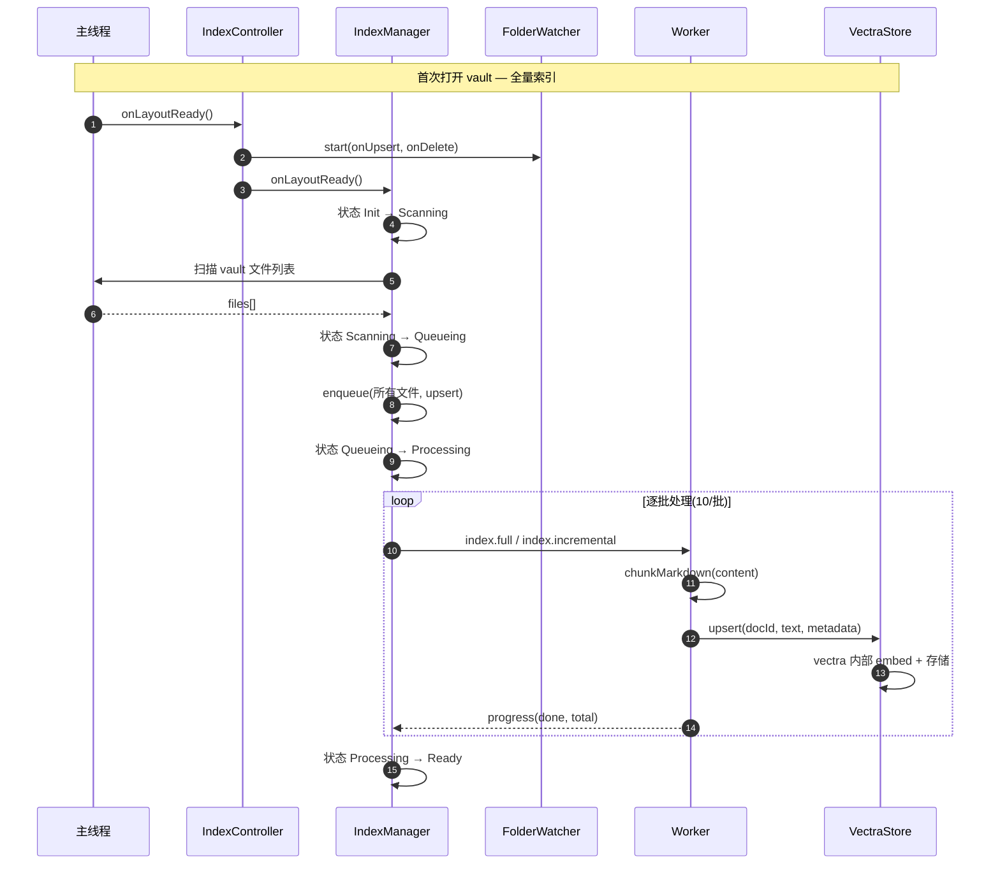
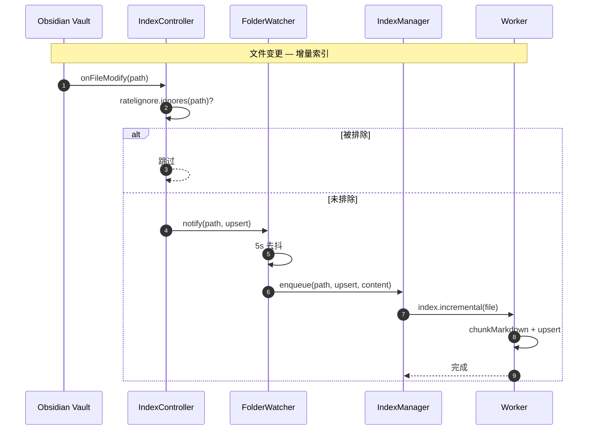
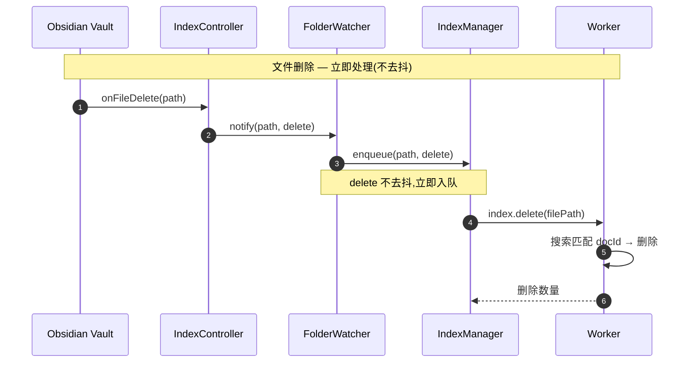
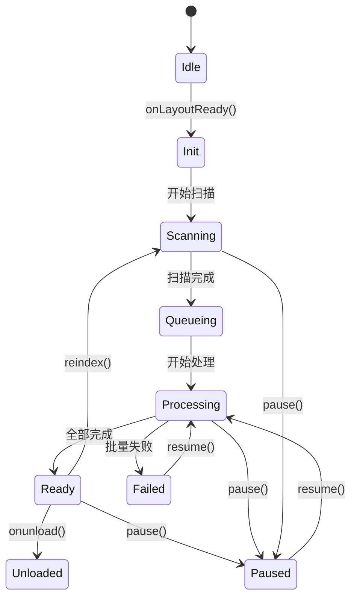
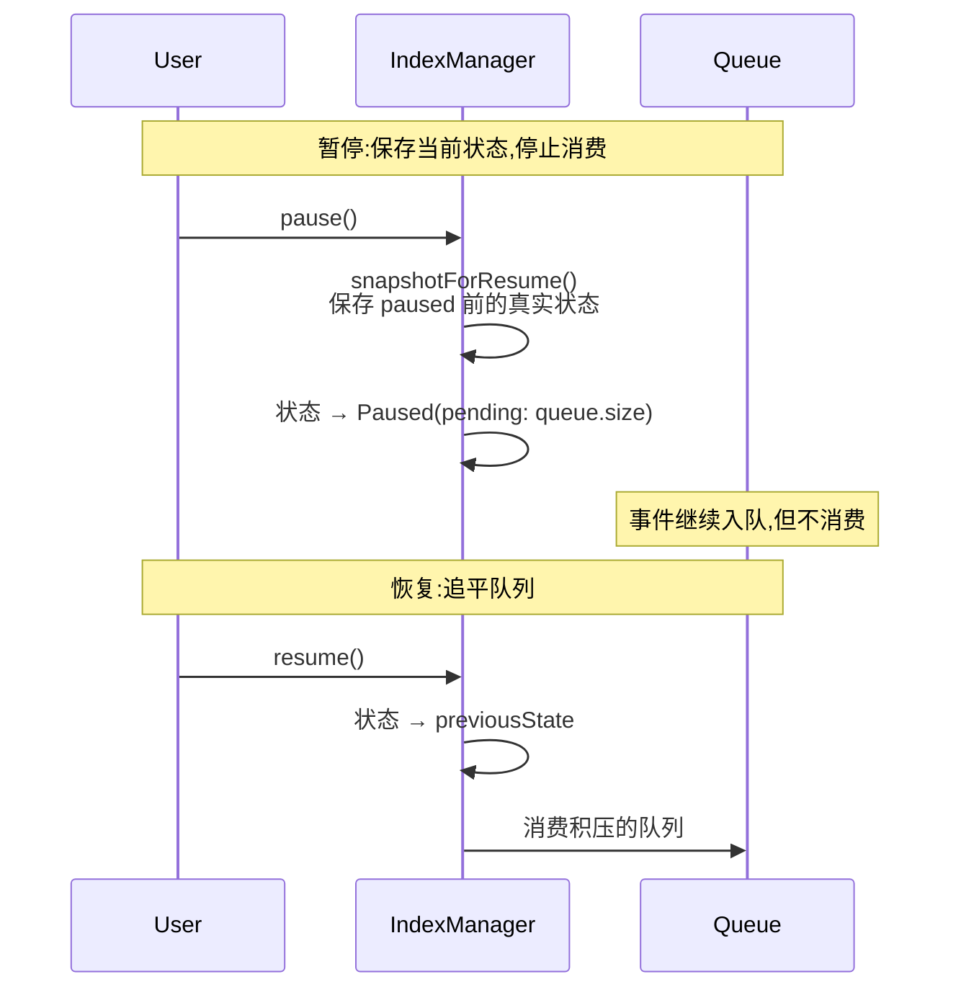
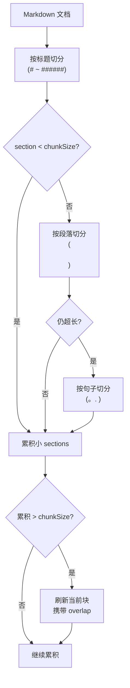
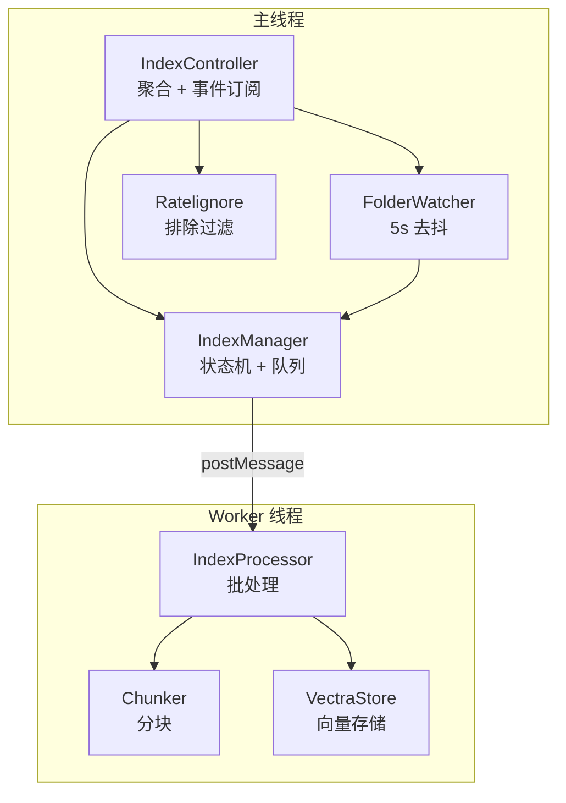

# 向量索引子系统

> 领域:RAG | 数据预处理流(生产者)
> 详细设计:文档发现 → 分块 → 向量化 → 存储 → 增量同步

---

## 1. 职责

将 Obsidian vault 中的 Markdown 文档转化为可检索的向量索引,并保持索引与文档的实时同步。

**不做的事**:
- 不负责查询(查询属于 [retriever](retriever.md))
- 不负责模型管理(模型属于 [model-management](../llm/model-management.md))
- 不负责 UI 展示(UI 属于 [obsidian-integration](../host/obsidian-integration.md))

---

## 2. 设计原则

### 2.1 Worker 内 embed,主线程不碰索引文件

**决策**:索引时 embed 在 Worker 内完成(vectra 内部调 `createEmbeddings`),而非主线程 embed 后传向量给 Worker。

**原因**:
- 批量 embed 是 CPU 密集任务,放 Worker 不卡 UI
- vectra 的 `LocalDocumentIndex` 构造时注入 `EmbeddingsModel`,内部 `addDocument()` 自动调 `createEmbeddings`,无需外部手动传向量
- 查询时主线程 embed 单条查询(ms 级),不卡 UI

**权衡**:索引和查询的 embed 位置不一致(索引在 Worker,查询在主线程),但同一 `EmbeddingsModel` 实例保证维度一致。

### 2.2 同 path 去重,单文件失败不挂整批

**决策**:队列用 `Map<path, QueueEntry>` 去重,同文件多次变更只保留最后一次操作。

**原因**:Obsidian 保存文件会连续触发 modify 事件,不去重会导致同一文件重复索引。

### 2.3 5s 单文件去抖,delete 不去抖

**决策**:FolderWatcher 对 create/modify 事件 5s 去抖,delete 立即处理。

**原因**:用户编辑时频繁保存,5s 内的多次变更合并为一次索引;文件删除是确定性操作,延迟处理会导致搜索到已删除的文档。

### 2.4 .ratelignore 排除,默认排除 .obsidian/

**决策**:用 `ignore` 包解析 `.ratelignore` 文件,默认排除 `.obsidian/`、`.git/`、`.trash/` 等。

**原因**:用户可能不想索引某些目录(如模板、归档),提供灵活的排除机制。

---

## 3. 核心流程

### 3.1 全量索引(首次打开 vault)



### 3.2 增量索引(文件变更)



### 3.3 文件删除



---

## 4. 状态机

### 4.1 IndexStatus(9 态)



| 状态 | 含义 | UI 表现 |
|---|---|---|
| Idle | 初始状态,未启动 | 不显示 |
| Init | 正在初始化 | Banner: "正在初始化..." |
| Scanning | 正在扫描 vault 文件 | Banner: "扫描中 23/100" |
| Queueing | 文件已入队,等待处理 | Banner: "排队中 15 个" |
| Processing | 正在处理索引 | Banner: "处理中 [file1, file2]" |
| Ready | 索引就绪 | 不显示(或徽章:已索引 234 篇) |
| Paused | 用户暂停 | Banner: "已暂停 15 个待处理" |
| Failed | 索引失败 | Banner: "索引失败: 原因" |
| Unloaded | 插件卸载 | 不显示 |

### 4.2 暂停/恢复机制



**关键**:暂停前必须用 `get(status$)` 读取真实状态,不能 hardcode(如 `{ state: 'Ready' }`),否则在 Scanning/Failed 状态暂停后恢复会丢失状态。

---

## 5. 分块策略

### 5.1 三级回退



### 5.2 参数

| 参数 | 默认值 | 说明 |
|---|---|---|
| chunkSize | 500 字符 | 目标分块大小 |
| overlap | 100 字符 | 分块间重叠,避免语义断裂 |

### 5.3 docId 命名

```
{filePath}#chunk-{index}
```

例如:`notes/LangChain.md#chunk-0`

同一文件的多个 chunk 共享 `metadata.path`,检索后按文档聚合。

---

## 6. 索引存储

### 6.1 目录结构

```
.obsidian/plugins/ratel-vault/
├── main.js
├── worker.js
├── manifest.json
├── data.json              ← settings(含 API Keys)
├── .gitignore             ← 自动生成,排除索引文件
└── index/                 ← vectra 索引目录
    ├── index.json         ← 文档元数据
    └── items/             ← 向量 + 文本
        ├── doc1.json
        └── ...
```

### 6.2 metadata 结构

```typescript
{
  path: string;        // 原始文件 vault 路径
  chunkIndex: number;  // 分块序号
  startOffset: number; // 原文起始偏移(UI 高亮定位)
}
```

### 6.3 索引新鲜度

- `_lastIndexTime`:记录最近一次写入时间戳,供 UI 展示
- 文件变更时增量更新,无需全量重建
- 模型切换时需全量重建(维度变化)

---

## 7. 组件协作



**组件职责**:

| 组件 | 职责 | 位置 |
|---|---|---|
| IndexController | 聚合 IndexManager + FolderWatcher + Vault 事件 + .ratelignore | 主线程 |
| IndexManager | 状态机 + 队列 + 暂停/恢复/重索引 | 主线程 |
| FolderWatcher | 5s 单文件去抖,delete 不去抖 | 主线程 |
| Ratelignore | 解析 .ratelignore,过滤排除文件 | 主线程 |
| IndexProcessor | 批量索引处理(分块 + upsert) | Worker |
| Chunker | Markdown 三级分块 | Worker |
| VectraStore | 向量存储(upsert/search/delete) | Worker |

---

## 8. 边界

| 与...的接口 | 方向 | 协议 |
|---|---|---|
| [model-management](../llm/model-management.md) | 依赖 | EmbeddingsModel 实例注入 Worker |
| [retriever](retriever.md) | 提供 | VectraStore.search() 供查询 |
| [obsidian-integration](../host/obsidian-integration.md) | 依赖 | Vault 事件 + 文件读取 |
| [persistence](../host/persistence.md) | 依赖 | 索引目录 + .gitignore |

---

## 9. 演进路径

| 阶段 | 能力 | 状态 |
|---|---|---|
| 当前 | 全量索引 + 增量索引 + 暂停/恢复 | ✅ 已实现 |
| S-RAG-LOOP | main.ts 接入 + 自动启动 | 待实现 |
| P-W3-IMPL | BM25 索引 + 混合检索 | 待实现 |
| 远期 | 语义分块 + 摘要索引 + 哈希校验增量 | 远期 |
