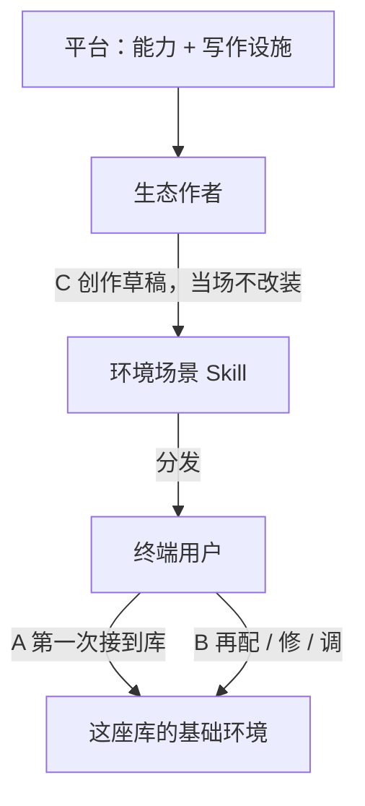
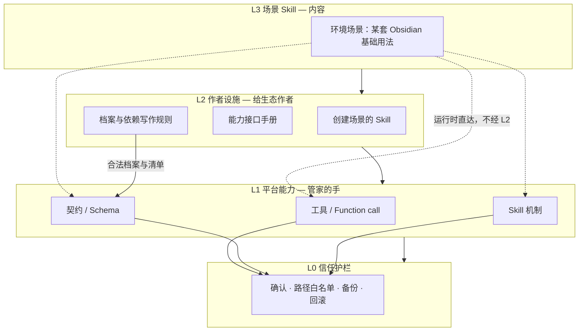
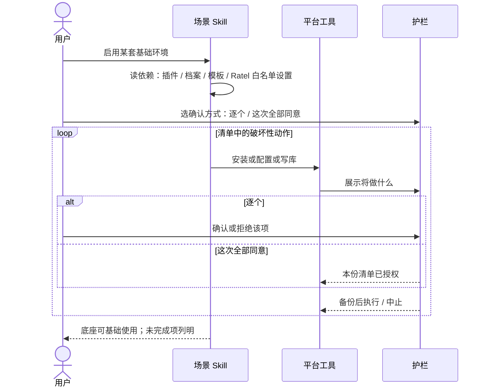

# 支柱 C — 场景生态

> 产品总纲入口：[overview.md](overview.md)。
>
> **用法约定以本文为准。** 架构与实现 spec 只写怎么做，不得反过来改这条用法。

Ratel 同时做两件事：**管知识库**，以及当 **Obsidian 管家**。

管家管的是基础环境：按场景把多个社区插件装好、配好、路径和模板对齐，底座坏了能调。不管商店浏览，也不代跑每日/月度总结那种要 heartbeat 和通知渠道的定时业务（定时业务另开场景，本支柱不写进去）。

场景是一份 **Skill**（管家的任务单），不是又一个 Obsidian 插件。社区插件仍是零件；场景声明要哪些零件、怎么配，平台动手。

实现细节见架构：[生态执行层](../architecture/host/ecosystem.md)、[插件档案](../architecture/host/plugin-profile.md)。实现 spec 必须服从本文，冲突时改 spec。

---

## 角色

| 角色 | 谁 | 干什么 |
|---|---|---|
| **平台** | 我们 | 管家的手、依赖契约、确认与回滚；以及让别人能**快速写出**场景的设施。可出样板证明走得通，自己不是长期场景作者 |
| **场景作者** | 生态其他人 | 写出一套可分发的 Obsidian **基础用法**（插件组合 + 配置 + 模板/路径） |
| **终端用户** | 用库的人 | 初始化、再配、调试；不写 Skill |

用户日常不进创作。没有作者生态，管家只有样板；没有初始化/维护，场景只是文档。

---

## 使用流程（A / B / C）

### C — 创作（生态作者）

作者用平台能力，尽快做出一套可分发的基础环境场景。

1. 只写底座：要哪些插件、怎么配、库里放什么。不写每日/月度总结、到点提醒。
2. 按平台契约写机器可读依赖；平台拦住非法写法（含私人绝对路径、把 Ratel 自己写进待装插件）。
3. 用创建设施出草稿（默认不启用），当场不改用户环境。
4. 人审阅后，终端用户拿这份场景走 A / B。

作者成功：不读源码、不猜 `data.json`，能交一份能过校验的场景。  
平台成功：别人能持续产场景，而不是只有我们会写。

### A — 初始化（终端用户第一次）

人带着「我要在这座库里用上某套基础用法」进来，不是带着「帮我装某个插件」。

1. 对话里说清要的用法，或点名已有场景。
2. 先看清单：要哪些插件、写哪些模板、改哪些 Ratel 设置；已有的标已有，缺的标缺。
3. **选确认方式**：逐个确认，或「这次全部同意」。全部同意只覆盖**这一次启用、这一份预览清单**。换场景、再启用、清单变了，重新预览再选。不是全局信任，也不放行以后别的写环境动作。
4. 做不到的如实说（商店没有、热启用失败、档案对不上），说明下一步，不说已经配好。
5. 结束：Obsidian 里这套组合能**基础使用**（例如新建有骨架、展示能算、路径一致）。此后人写笔记、看视图，是 Obsidian 与已配好插件自己的事。

### B — 维护（同一份场景）

底座坏了或要改：还是装、配、调。不是开始写每日总结。确认规则同 A。

Ratel 没有的手，场景不能装会：商店外安装、改 Obsidian 核心设置、Skill 脚本写他人配置。

---

## 产品分几层

上面是内容，下面是平台。作者设施不挡在用户的 A/B 路径上，但生态离开它长不起来。

图自上而下是 L3 → L2 → L1 → L0。`flowchart TB` 里 `A --> B` 表示 A 在上，不要画「元 Skill → 产出 → 场景」。

| 层 | 给谁 | 产品上是什么 | 不是什么 |
|---|---|---|---|
| L3 场景 Skill | 终端用户 | 一份可启用的**基础环境**：该装哪些插件、怎么配、库里放什么模板、路径如何对齐 | 不是定时总结；不是给单个插件做设置页 |
| L2 作者设施 | 生态作者 | 能做出合法场景的路径：元 Skill、手册、规则 | 不是我们自己当长期作者；不是让作者读源码或猜 `data.json` |
| L1 平台能力 | 场景与作者工具 | 手、契约、Skill 运行时 | 不是用户入口 |
| L0 护栏 | 所有写环境的动作 | 可预览、可选确认方式、可查、可撤 | 不是商店浏览 UI |

**宿主没有官方插件管理授权。** 公开 Plugin API 不提供 install。桌面端在用户确认后可写当前库的插件目录与启用清单，并尽力热启用；失败必须说明并引导重载或官方页，不得假装已启用。不装商店清单外的来源；不管理 Ratel 自己的插件目录。上架本能力前须过商店审核口径。

---

## 我们提供什么

### 给终端用户

- **启用场景**：对话里说清要的基础用法，或点名已有场景。
- **预览后选确认方式**：逐个，或这次全部同意（仅本份清单）。
- **缺依赖时说清楚**：不把「已配好」写进回复。
- **底座坏了用同一份场景调试**：再配、再装、再对齐。
- **改过的环境能查能撤**：安装、启用清单、插件配置、由场景写入的模板/约定，走同一套变更日志与回滚。

样板可以是「日记能建、月度台账能亮」这类**底座**（Templater 创建、Dataview 展示、路径对齐）。人写正文、看台账是基础使用，不是这个场景的日程任务；提取、每日/月度总结不写进这份场景。

### 给生态作者

技术接口不够。作者要能做出场景，并且知道允许调用什么。

| 交付物 | 作者拿来干什么 | 第一期要做到 |
|---|---|---|
| **创建场景的 Skill** | 从基础用法描述生成合法草稿：`SKILL.md`、依赖声明、需要的档案 preset、库内模板占位 | 内置元 Skill；产出默认不生效；生成当场不改装环境 |
| **能力接口手册** | 查阅可调工具、依赖写法、档案字段、确认/回滚、脚本禁区 | 独立成文、跟版本走；不把架构正文当作者手册 |
| **写作规则** | 写出能过 schema 的档案和场景依赖块 | 可被元 Skill 引用，也可人手写 |

手册至少覆盖：Skill 运行时；环境工具；库工具；Ratel 白名单；档案契约；禁止脚本写他人配置、商店外安装、代改核心设置。

### 给平台自己（用户不直接点）

| 能力 | 用户能感到的结果 | 说明 |
|---|---|---|
| 工具 / Function call | 装插件、改设置、写模板在对话里可见，过同一套权限 | 场景只教模型调这些手 |
| 契约 / Schema | 改哪些 key 可预览、可审计 | 一份 Profile schema，多份档案实例 |
| Skill 机制 | 三源 Skill，启用后按 A/B 干活 | 与现有 Discovery、`activate_skill` 同一条路 |

插件档案是契约，不是用户故事。

---

## 三类管理对象（未变）

| 域 | 对象 | 平台怎么做 |
|---|---|---|
| Ratel 自身 | 本插件设置、密钥、技能 | 读配置、白名单内代改、密钥只看状态、定位设置页（已有） |
| Obsidian 官方 | 核心设置（外观、快捷键、核心插件） | 只引导：定位设置页并指路，不代改 |
| 社区生态 | 其他社区插件 | 仅商店清单内：寻找、安装、升级、卸载、按档案或点名配置、回滚 |

---

## 平台步骤（场景在调用它们）

这些不是用户旅程的主轴，但是场景落地时必须发生。

**寻找与装卸**

- 寻找只在官方社区清单内；结果含作者、下载量、说明、是否已装；整份清单不进模型上下文。
- 安装：确认后下载该插件官方 GitHub release 三件套，写入 `.obsidian/plugins/<id>/`，写入启用清单，尝试运行时启用。
- 升级覆盖三件套，**保留** `data.json`。卸载先备份再移除并禁用。
- 每次装/升/卸都要人点头（或落在用户为本份清单选择的「这次全部同意」之内）。下载中断清理半成品。启用失败回滚或明确残留，不留「装了但不可用」却不说明的状态。

**配置**

- 有档案：展开为点名 key，展示前后值，最小 diff，确认后写。
- 无档案：读 `data.json`，解释结构，点名改；未知 key 先确认；不整文件重写、不猜测。
- 密钥类只引导打开该插件设置页。
- 对方插件未必热更新设置；允许提示重载。禁止用 Skill 脚本写他人 `data.json`。

**回滚**

每次环境变更追加 `EcosystemChange`（动作、目标、前后摘要、备份位置），日志在本地插件目录、append-only。「撤销刚才的改动」是一等能力。场景写入的库内模板若走了笔记工具，回滚语义与笔记写入权限一致，不得假装能一键撤回用户后来改过的正文。

---

## 第一期交什么

闭环以**一份可启用的环境场景**为准，而不是「恰好一份单插件档案」。

1. L0 + L1：生态工具、唯一 Profile schema、场景依赖能被工具执行。
2. L2：创建场景的 Skill（草稿）；能力接口手册初版（与本版工具清单一致）。
3. L3：一份**样板**环境场景（证明平台：例如日记能建、台账能亮所需的 Templater + Dataview 底座）。样板证明走得通，不是我们改行当场景作者。不追求热门插件全集。不把提取/每日总结写进样板。

从已装插件识别档案草稿、人手按规则写档案，作为作者路径的补充，默认不生效。

---

## 非目标

- 不做插件商店浏览 UI；入口是对话与场景，不复制官方商店。
- 不代改 Obsidian 核心配置。
- 不安装社区商店清单之外的来源。
- 不做主题与 CSS snippet 管理。
- 不把插件档案做成第四种能力 `kind`。
- 不在第一期做 50+ 官方场景或「深度调优」整盘覆盖他人 `data.json`。
- 创建场景的 Skill 不在生成当场安装插件。
- **本支柱场景不做定时业务**（每日总结、月度总结、到点提醒）。那是主动智能/通知渠道的事，等 heartbeat 与通知定了另开场景。

---

## 安全边界

- 路径白名单在 adapter 层：仅清单校验过的 `plugins/<id>/` 与 `community-plugins.json`；Ratel 自身目录与 Obsidian 核心配置不可达（Ratel 设置走已有白名单工具，不走生态路径）。
- 只装商店清单内插件；确认弹窗展示作者与下载量。
- 清单与 release 出站须 ADR-018，README 隐私说明同步。
- 网络出站仅发生在用户发起生态操作时；清单本地缓存，默认 7 天。
- 备份与变更日志存本地插件目录，不进 vault、不出网。
- 产品与文档不得声称 Obsidian 官方授权本插件安装其他插件。
- 本能力仅桌面；社区商店上架前须过审核口径。
