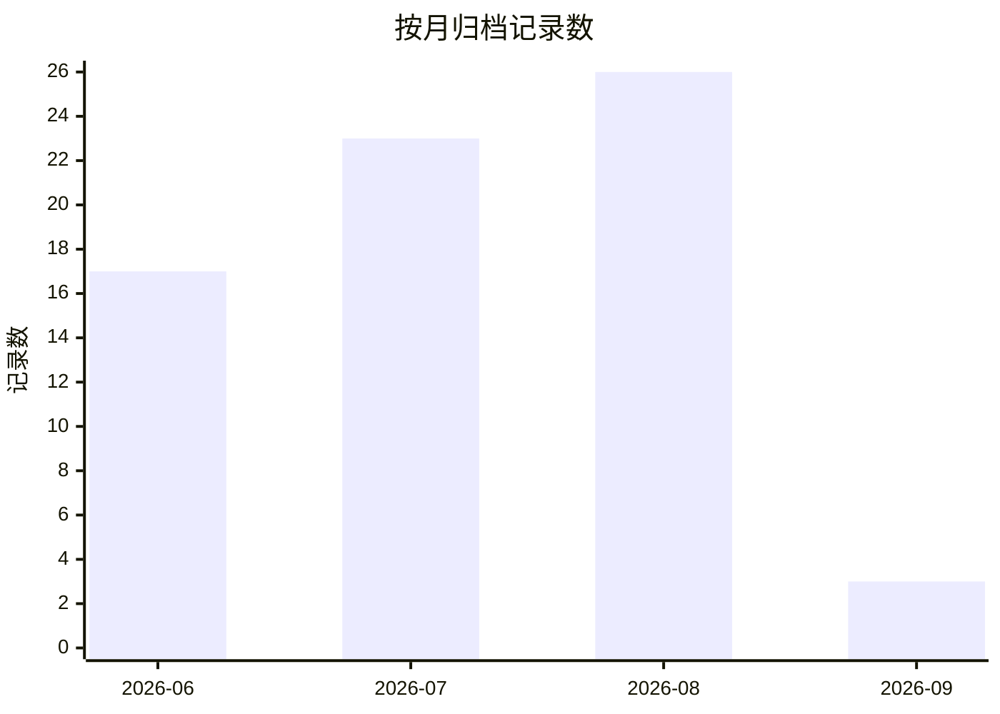
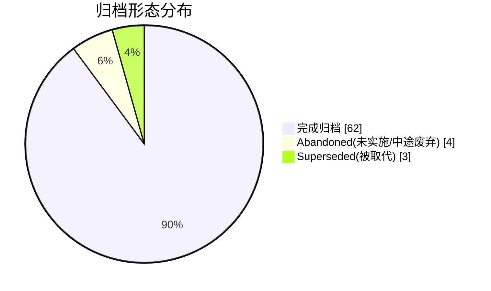

# 归档索引(ARCHIVE)

> 已实施完成 / 废弃的 spec / plan 索引。活跃项见 [STATUS.md](STATUS.md);归档流程见 AGENTS.md § 文档归档流程。
>
> - 归档目录:`archive/<id>/`,内含 spec / plan 原文件与 `execution-log.md`(完整执行历史:commit SHA / 测试数据 / plan 偏差)
> - 同一 spec 多个 plan 分多次归档的,记录分行列出(如 S-MEMORY、S-MCP-HOST、S-MD-PREVIEW)

---

## 统计

**按月归档记录数**(共 69 条,58 个目录)

**归档形态分布**

---

## 2026-09

| ID | 归档目录 | 日期 | 备注 |
|---|---|---|---|
| S-MASCOT-3 | [archive/S-MASCOT/](archive/S-MASCOT/) | 09-05 | 眼形+眼动;不读回复;plan 文件名为 `*.plan.md` |
| S-MASCOT-2 | [archive/S-MASCOT/](archive/S-MASCOT/) | 09-05 | 闲着连眨/单击轻弹/忙态;吸附无开关 8px |
| S-MASCOT | [archive/S-MASCOT/](archive/S-MASCOT/) | 09-05 | 可拖捣蛋鬼 v1(设置文案「捣蛋鬼」/ Imp);squash `14c6ee4` 合入 develop,随 0.6.0 发版 |

## 2026-08

| ID | 归档目录 | 日期 | 备注 |
|---|---|---|---|
| S-VISION | [archive/S-VISION/](archive/S-VISION/) | 08-30 | 贴图真正发给视觉模型;远端视觉开关+image_url;squash `99a2bce` 合入 develop,CHANGELOG 0.5.1 |
| S-TASK (spec) | [archive/S-TASK/](archive/S-TASK/) | 08-22 | **Superseded by [S-GOAL](../specs/2026-08-22-agent-goal-mode.md)**:静态步骤清单被动态工作流取代——goal 只存意图+完成标准+进度游标,每轮从库重推导;未实施即被替代,无代码产出,单活/GC/onload 提示等内核继承进 S-GOAL |
| S-SKILL (spec) | [archive/S-SKILL/](archive/S-SKILL/) | 08-20 | spec 使命完成归档:机制(P-SKILL-1)+执行层(P-SKILL-2)+超时(P-SKILL-2-TIMEOUT)三 plan 交付,UI 由 S-SKILL-UX 0.3.0 承接;执行层随 0.5.0 发版 |
| S-SKILL (P-SKILL-2-TIMEOUT) | [archive/S-SKILL/](archive/S-SKILL/) | 08-19 | ADR-017 v1.1 超时心跳分类:慢→LLM continueRun/killRun,死→自动杀,10min 上限;补设置控件;squash `377d842`;1288 tests |
| S-SKILL (P-SKILL-2-EXECUTION) | [archive/S-SKILL/](archive/S-SKILL/) | 08-19 | 技能脚本执行层:Worker+vm 沙箱/信任门/熔断/JS-only;8 Task 四波次;squash `fb871f5`;1269 tests |
| S-EVOLUTION (spec 终止) | [archive/S-EVOLUTION/](archive/S-EVOLUTION/) | 08-19 | **部分完成后终止**:Phase A 读侧 + open_note + 回收站已发版;task 摘出 S-TASK、子代理移出;写侧(update_frontmatter/Write Gate/append_to_daily)未实施,重启开新 spec |
| S-SKILL-UX (P-SKILL-UX-V2) | [archive/S-SKILL-UX/](archive/S-SKILL-UX/) | 08-19 | 装了就生效+抽屉管理+术语隐形化;squash `764411c` 随 0.3.0 发版;spec 使命完成同日归档 |
| S-SR-LAYERING | [archive/S-SR-LAYERING/](archive/S-SR-LAYERING/) | 08-19 | PromptInjector+记忆 pinned/topics+Skill 相关性+使用统计;squash `1942ece` 随 0.4.0 发版 |
| S-GRAPH-EXPAND | [archive/S-GRAPH-EXPAND/](archive/S-GRAPH-EXPAND/) | 08-19 | **Abandoned 未实施**;挂起一月无进展+与 S-EVOLUTION 方向重叠;ADR-013 结论仍有效 |
| S-MD-PREVIEW (P-MD-PREVIEW-2) | [archive/S-MD-PREVIEW/](archive/S-MD-PREVIEW/) | 08-19 | v1 富块已发版;overlay/灯箱 plan **Abandoned**(旧管线作废,S-CHAT-PERF 已重构);spec 同日归档 |
| S-MCP-HOST | [archive/S-MCP-HOST/](archive/S-MCP-HOST/) | 08-19 | Core+UI+DOCS 三 plan 全完成;host/mcp.md 架构页补齐,AGENTS.md/S-EVOLUTION 网络边界表述与 ADR-014 对齐;spec 归档 |
| S-CTX-TRIM | [archive/S-CTX-TRIM/](archive/S-CTX-TRIM/) | 08-17 | 上送截断对齐模型窗口;预算随窗口推导 + 32k 码点裁 + 保当前 user;spec+plan 归档;squash → develop `6e3b692`;1191 tests |
| S-CHAT-PERF | [archive/S-CHAT-PERF/](archive/S-CHAT-PERF/) | 08-16 | 三阶段聊天渲染性能(流式轻渲染/稳定块冻结/虚拟滚动);spec+3 plan 归档;随 0.2.4 发版 |
| S-CFG | [archive/S-CFG/](archive/S-CFG/) | 08-16 | PRD CFG-01/02:open_note + 配置 3 工具 + ratel-config 内置 Skill + settings-apply;spec+plan 归档;合并回 main(见 git log) |
| S-CHAT-MOTION | [archive/S-CHAT-MOTION/](archive/S-CHAT-MOTION/) | 08-15 | Bits 动效;spec+plan 归档 |
| S-CHAT-MOTION-v2 | [archive/S-CHAT-MOTION-v2/](archive/S-CHAT-MOTION-v2/) | 08-15 | 动效增强;spec+plan 归档 |
| S-CHAT-PROTO | [archive/S-CHAT-PROTO/](archive/S-CHAT-PROTO/) | 08-15 | 原型对齐;0.1.18;spec+plan 归档 |
| S-SETTINGS-SYNC | [archive/S-SETTINGS-SYNC/](archive/S-SETTINGS-SYNC/) | 08-15 | settings$ 统一;spec+plan 归档 |
| S-MEMORY-MODAL | [archive/S-MEMORY-MODAL/](archive/S-MEMORY-MODAL/) | 08-15 | 记忆 Modal 统一壳;spec+plan 归档 |
| S-CITE | [archive/S-CITE/](archive/S-CITE/) | 08-15 | 引用双通道;0.1.14;spec+plan 归档 |
| S-MCP-HOST (P-MCP-HOST-CORE/UI) | [archive/S-MCP-HOST/](archive/S-MCP-HOST/) | 08-15 | 0.1.16;Core/UI plan 归档(DOCS 后于 08-19 补齐,spec 已归档) |
| S-EVOLUTION (P-EVO-A-READ) | [archive/S-EVOLUTION/](archive/S-EVOLUTION/) | 08-15 | 4 读工具+enrich;spec 后于 08-19 终止归档 |
| S-MD-PREVIEW (P-MD-PREVIEW-1) | [archive/S-MD-PREVIEW/](archive/S-MD-PREVIEW/) | 08-14 | 统一富块+复制+表格;spec 后于 08-19 归档 |
| S-COMPACT-V2 | [archive/S-COMPACT-V2/](archive/S-COMPACT-V2/) | 08-13 | squash → develop `9fbe73c`;投影压缩不删聊天 |
| S-CHAT-NAV | [archive/S-CHAT-NAV/](archive/S-CHAT-NAV/) | 08-11 | DeepSeek 式点列+悬停摘要;squash → develop |

## 2026-07

| ID | 归档目录 | 日期 | 备注 |
|---|---|---|---|
| S-SESSION | [archive/S-SESSION/](archive/S-SESSION/) | 07-25 | 发版 0.1.13 |
| S-CHAT-UI-V3 | [archive/S-CHAT-UI-V3/](archive/S-CHAT-UI-V3/) | 07-25 | 发版 0.1.8 |
| S-CHAT-TRACE | [archive/S-CHAT-TRACE/](archive/S-CHAT-TRACE/) | 07-25 | 发版 0.1.9 |
| S-UI-APPEARANCE | [archive/S-UI-APPEARANCE/](archive/S-UI-APPEARANCE/) | 07-25 | 发版 0.1.10 |
| S-SETTINGS-TAB | [archive/S-SETTINGS-TAB/](archive/S-SETTINGS-TAB/) | 07-15 | 四 Tab + chatPreset + README;Tab 门控改 visible |
| S-INDEX-MANIFEST-FIX | [archive/S-INDEX-MANIFEST-FIX/](archive/S-INDEX-MANIFEST-FIX/) | 07-15 | 清单迁 `.index/ratel-manifest.json`;缺清单不全量 embed |
| S-CHAT-INPUT-MENTIONS | [archive/S-CHAT-INPUT-MENTIONS/](archive/S-CHAT-INPUT-MENTIONS/) | 07-15 | `/`+`@`+file-menu;策略 A |
| S-TOOL-HISTORY-400 | [archive/S-TOOL-HISTORY-400/](archive/S-TOOL-HISTORY-400/) | 07-15 | compact/上送孤立 tool 对齐 |
| S-BASIC-ENV | [archive/S-BASIC-ENV/](archive/S-BASIC-ENV/) | 07-15 | Phase1+2 已随 0.1.5 发版;Phase3 非目标另开 |
| S-I18N | [archive/S-I18N/](archive/S-I18N/) | 07-15 | Superseded by S-I18N-V2;v1 未落地 |
| S-CHAT-UI-V2 (P-CHAT-UI-1) | [archive/S-CHAT-UI-V2/](archive/S-CHAT-UI-V2/) | 07-07 | Chat UI 打磨;9 Task + user-guide 同步;10 commit squash 为 1 (`d93328d`);662 tests |
| S-I18N-V2 | [archive/S-I18N-V2/](archive/S-I18N-V2/) | 07-06 | i18n V2 全量实现;14 namespace ~340 key;12 commit squash 为 2 |
| S-MEMORY (P-MEMORY-LOGIC) | [archive/S-MEMORY/](archive/S-MEMORY/) | 07-06 | 用户记忆核心逻辑;8 Task + 2 Critical/4 Important 修复;spec 已归档(P-MEMORY-UI 也完成) |
| S-MEMORY (P-MEMORY-UI) | [archive/S-MEMORY/](archive/S-MEMORY/) | 07-06 | 记忆管理面板 + 6 设置项;5 Task + 1 Critical/2 Important/1 Minor 修复;33 i18n key |
| S-SKILL (P-SKILL-1-CORE) | [archive/S-SKILL/](archive/S-SKILL/) | 07-06 | Skill 机制基础层;7 Task + 31 测试;7 commits squash 为 1 (`d9dc98d`);ADR-009;spec 仍 Active(P-SKILL-2 未实施) |
| S-CLEANUP-1 | [archive/S-CLEANUP-1/](archive/S-CLEANUP-1/) | 07-05 | 杂项缺失修复与技术债清理;24 Task(1-16 前序会话,17-24 本会话);squash 合并 commit `3590b23` |
| S-SETTINGS-DECLARATIVE | [archive/S-SETTINGS-DECLARATIVE/](archive/S-SETTINGS-DECLARATIVE/) | 07-05 | 设置面板声明式迁移;4 commits;release 0.1.2 已上架 |
| S-RAG-ARCH | [archive/S-RAG-ARCH/](archive/S-RAG-ARCH/) | 07-05 | 最终 RAG 架构设计文档;实施通过 W3/W4 等多个 plan 完成 |
| S-MSG-STREAM | [archive/S-MSG-STREAM/](archive/S-MSG-STREAM/) | 07-04 | Chat 消息流重构;17 commits 合并,453 tests |
| S-DOCS-V1 | [archive/S-DOCS-V1/](archive/S-DOCS-V1/) | 07-04 | 文档体系 v1;7 Task,中英双语 README |
| S-CONTEXT-WINDOW | [archive/S-CONTEXT-WINDOW/](archive/S-CONTEXT-WINDOW/) | 07-04 | LiteLLM 映射 + Context Length 预设;7 Task;⚠️ 实施代码仍在 `feat/s-context-window` 分支待合并 |
| S-INDEX-STARTUP | [archive/S-INDEX-STARTUP/](archive/S-INDEX-STARTUP/) | 07-04 | smart reindex 启动路径;8 Task + 6 缺口修复 |
| S-PROMPTS | [archive/S-PROMPTS/](archive/S-PROMPTS/) | 07-04 | Prompt Registry + 全中文默认值 + section 覆盖 + 热替换;10 Task;12 commits squash 为 1;ADR-008 |

## 2026-06

| ID | 归档目录 | 日期 | 备注 |
|---|---|---|---|
| S-KEYCHAIN | [archive/S-KEYCHAIN/](archive/S-KEYCHAIN/) | 06-26 | — |
| S-INIT-INDEX | [archive/S-INIT-INDEX/](archive/S-INIT-INDEX/) | 06-26 | — |
| S-DIAG | [archive/S-DIAG/](archive/S-DIAG/) | 06-26 | — |
| S-FEEDBACK | [archive/S-FEEDBACK/](archive/S-FEEDBACK/) | 06-26 | — |
| S-RAG-ROADMAP | [archive/S-RAG-ARCH/](archive/S-RAG-ARCH/) | 06-27 | Superseded,归入 S-RAG-ARCH |
| S-W3-HYBRID | [archive/S-W3-HYBRID/](archive/S-W3-HYBRID/) | 06-27 | 含 P-W3-IMPL(Superseded) |
| S-W4-RAG-ENHANCEMENT | [archive/S-W4-RAG-ENHANCEMENT/](archive/S-W4-RAG-ENHANCEMENT/) | 06-27 | 含 P-W4-IMPL(Superseded) |
| S-VAULT-TOOLS | [archive/S-VAULT-TOOLS/](archive/S-VAULT-TOOLS/) | 06-27 | — |
| S-CHAT-UI | [archive/S-CHAT-UI/](archive/S-CHAT-UI/) | 06-27 | — |
| S-MD-MERMAID | [archive/S-MD-MERMAID/](archive/S-MD-MERMAID/) | 06-27 | — |
| S-INDEX-BLOCK | [archive/S-INDEX-BLOCK/](archive/S-INDEX-BLOCK/) | 06-27 | — |
| S-DEFENSIVE | [archive/S-DEFENSIVE/](archive/S-DEFENSIVE/) | 06-27 | Abandoned,未实施;G3 svelte-check 串 build 已独立落地 |
| S-RAG-LOOP | [archive/S-RAG-LOOP/](archive/S-RAG-LOOP/) | 06-17 | — |
| S-ARCH-001 | [archive/S-ARCH-001/](archive/S-ARCH-001/) | 06-14 | — |
| S-MODEL-001 | [archive/S-MODEL-001/](archive/S-MODEL-001/) | 06-14 | — |
| S-TEST-ARCH | [archive/S-TEST-ARCH/](archive/S-TEST-ARCH/) | 06-14 | 含 P-W3-TEST / P-W4-TEST(Superseded) |
| P-DOCS-CN | [archive/P-DOCS-CN/](archive/P-DOCS-CN/) | 06-14 | — |
