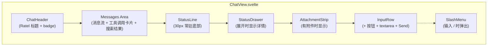

# Ratel Chat UI 重设计 Implementation Plan

> **For agentic workers:** REQUIRED SUB-SKILL: Use superpowers:subagent-driven-development (recommended) or superpowers:executing-plans to implement this plan task-by-task. Steps use checkbox (`- [ ]`) syntax for tracking.

**Goal:** 把 ChatView 顶部展开式 StatusBar 替换为底部 30px 单行 StatusLine + 可展开 StatusDrawer,迁移进度类 Notice 到 StatusLine,新增斜杠命令与图片上传预留通道,并把 ChatView.svelte 从 Svelte 4 语法迁移到 Svelte 5。

**Architecture:** 三层递进 — 先在基础设施层扩展 `user-status.ts` / `context-manager.ts` / `feedback-controller.ts` 提供 store 与方法;再在组件层新建 4 个 Svelte 5 子组件(`StatusLine` / `StatusDrawer` / `SlashMenu` / `AttachmentStrip`);最后在集成层把 ChatView.svelte 从 Svelte 4 迁移到 Svelte 5,组合新组件并删除旧 StatusBar。纯逻辑(命令过滤、附件 token 估算、上下文使用率计算)抽到独立 `.ts` 文件用 vitest 单测,Svelte 组件本身通过 `svelte-check` + `npm run build` 验证编译。

**Tech Stack:** Svelte 5(`$state` / `$props` / `$derived` / `onclick` / `mount`)、TypeScript(`strict: true`)、vitest、Obsidian CSS 变量、esbuild。

---

## File Structure

### 新增文件

| 路径 | 职责 |
|------|------|
| `src/ui/StatusLine.svelte` | 底部常驻单行状态条 — 状态点 + 文字 + ctx 进度条 + 展开 ▲ |
| `src/ui/StatusDrawer.svelte` | 展开式详情面板 — 向量化/索引区 + 上下文区 |
| `src/ui/SlashMenu.svelte` | 斜杠命令弹窗 — 输入 / 时弹出,过滤/选择/执行 |
| `src/ui/AttachmentStrip.svelte` | 图片附件预览条 — 缩略图 + 删除按钮 |
| `src/ui/slash-commands.ts` | 斜杠命令注册表 + 过滤纯函数(可测) |
| `src/ui/attachment-utils.ts` | 附件 token 估算 + 校验纯函数(可测) |
| `tests/ui/slash-commands.test.ts` | 斜杠命令过滤单测 |
| `tests/ui/attachment-utils.test.ts` | 附件估算单测 |
| `tests/core/context-manager-usage.test.ts` | `getContextUsage()` 单测 |

### 修改文件

| 路径 | 变更内容 |
|------|---------|
| `src/user-feedback/user-status.ts` | 新增 `ContextUsage` / `PendingAttachment` 类型 + `contextUsage$` / `pendingAttachments$` store + patch 方法 |
| `src/core/context-manager.ts` | 新增 `getContextUsage(maxTokens)` 方法返回 `ContextUsage` |
| `src/core/feedback-controller.ts` | 改造进度类 Notice — 新增 `showProgress` / `showStatus` 方法,Downloading/Initializing/Indexing 改为更新 `userStatus.contextUsage$` 与 `statusBar$` 而非 `userNotice.toastProgress` |
| `src/settings.ts` | 新增 `chatModelMaxTokens` 字段(默认 32000) |
| `src/ui/ChatView.svelte` | Svelte 4 → 5 迁移(`$props` / `$state` / `$derived` / `onclick`),移除 StatusBar,挂载 StatusLine/StatusDrawer/SlashMenu/AttachmentStrip,新增斜杠命令与附件状态管理 |
| `docs/architecture/agent/chat.md` | 同步新布局描述 |

### 删除文件

| 路径 | 原因 |
|------|------|
| `src/ui/StatusBar.svelte` | 功能被 StatusLine + StatusDrawer 取代 |

---

## Task 1: 扩展 user-status.ts — 新增 contextUsage$ / pendingAttachments$ store

**Files:**
- Modify: `src/user-feedback/user-status.ts`
- Modify: `tests/user-feedback/user-status.test.ts`

- [ ] **Step 1: 在 user-status.test.ts 末尾追加失败测试**

在 `tests/user-feedback/user-status.test.ts` 文件末尾(`});` 之前)追加:

```typescript
	// ==================== contextUsage$ ====================

	it('contextUsage$ - 初始为 0/0', () => {
		expect(get(status.contextUsage$)).toEqual({
			usedTokens: 0,
			maxTokens: 0,
			attachmentTokens: 0,
			percentage: 0,
		});
	});

	it('patchContextUsage - 更新 usedTokens 并自动算 percentage', () => {
		status.patchContextUsage({ usedTokens: 1000, maxTokens: 10000 });
		const snap = get(status.contextUsage$);
		expect(snap.usedTokens).toBe(1000);
		expect(snap.maxTokens).toBe(10000);
		expect(snap.percentage).toBe(10);
	});

	it('patchContextUsage - maxTokens 为 0 时 percentage 防除零', () => {
		status.patchContextUsage({ usedTokens: 500, maxTokens: 0 });
		expect(get(status.contextUsage$).percentage).toBe(0);
	});

	// ==================== pendingAttachments$ ====================

	it('pendingAttachments$ - 初始为空数组', () => {
		expect(get(status.pendingAttachments$)).toEqual([]);
	});

	it('addAttachment - 追加并返回 id', () => {
		const id = status.addAttachment({
			fileName: 'a.png',
			mimeType: 'image/png',
			base64: 'iVBORw0KGgo=',
			estimatedTokens: 100,
		});
		expect(id).toBeTruthy();
		expect(get(status.pendingAttachments$)).toHaveLength(1);
		expect(get(status.pendingAttachments$)[0]!.fileName).toBe('a.png');
	});

	it('removeAttachment - 按 id 移除', () => {
		const id1 = status.addAttachment({ fileName: 'a.png', mimeType: 'image/png', base64: 'x', estimatedTokens: 100 });
		status.addAttachment({ fileName: 'b.jpg', mimeType: 'image/jpeg', base64: 'y', estimatedTokens: 200 });
		status.removeAttachment(id1);
		const list = get(status.pendingAttachments$);
		expect(list).toHaveLength(1);
		expect(list[0]!.fileName).toBe('b.jpg');
	});

	it('clearAttachments - 清空', () => {
		status.addAttachment({ fileName: 'a.png', mimeType: 'image/png', base64: 'x', estimatedTokens: 100 });
		status.clearAttachments();
		expect(get(status.pendingAttachments$)).toEqual([]);
	});

	it('reset - 同时恢复 contextUsage$ 与 pendingAttachments$', () => {
		status.patchContextUsage({ usedTokens: 500, maxTokens: 10000 });
		status.addAttachment({ fileName: 'a.png', mimeType: 'image/png', base64: 'x', estimatedTokens: 100 });
		status.reset();
		expect(get(status.contextUsage$).usedTokens).toBe(0);
		expect(get(status.pendingAttachments$)).toEqual([]);
	});
```

- [ ] **Step 2: 运行测试验证失败**

Run: `npx vitest run tests/user-feedback/user-status.test.ts`
Expected: FAIL,报错 `status.contextUsage$ is not a function` 或 `status.patchContextUsage is not a function`。

- [ ] **Step 3: 修改 user-status.ts 实现新 store 与方法**

把 `src/user-feedback/user-status.ts` 整体替换为:

```typescript
/**
 * @file src/user-feedback/user-status.ts
 * @description 使用者持久状态 store — 供 StatusLine/StatusDrawer 订阅,禁止 console / Notice
 * @module user-feedback/user-status
 * @depends svelte/store
 */

import { writable } from 'svelte/store';

/** Chat 侧栏 StatusLine / StatusDrawer 展示的聚合快照 */
export interface UserStatusSnapshot {
	model: 'idle' | 'checking' | 'downloading' | 'initializing' | 'ready' | 'failed';
	modelDetail?: string;

	index: 'idle' | 'init' | 'scanning' | 'queueing' | 'processing' | 'ready' | 'paused' | 'failed';
	indexDetail?: string;
	indexDocCount?: number;

	embedding: 'loading' | 'ready' | 'unavailable';
	worker: 'thread' | 'inline';

	/** 降级说明,有人话一行;存在时 StatusDrawer 降级区显示 */
	degraded?: string;
}

/** 上下文使用率快照 — 由 context-manager 在 send 前后更新,StatusLine/StatusDrawer 订阅 */
export interface ContextUsage {
	/** 已用 token 数(含系统提示 + 检索结果 + 历史) */
	usedTokens: number;
	/** 模型上下文窗口上限(由 settings.chatModelMaxTokens 提供) */
	maxTokens: number;
	/** 待发送附件估算 token 数 */
	attachmentTokens: number;
	/** 派生:usedTokens / maxTokens * 100,maxTokens=0 时为 0 */
	percentage: number;
}

/** 待发送的图片附件 */
export interface PendingAttachment {
	id: string;
	fileName: string;
	mimeType: string;
	base64: string;
	estimatedTokens: number;
}

/** 插件启动时的默认快照 — model/index 空闲,embedding 加载中,Worker 默认 inline */
export const DEFAULT_USER_STATUS: UserStatusSnapshot = {
	model: 'idle',
	index: 'idle',
	embedding: 'loading',
	worker: 'inline',
};

/** ContextUsage 默认值 — 0/0,percentage 防除零返回 0 */
export const DEFAULT_CONTEXT_USAGE: ContextUsage = {
	usedTokens: 0,
	maxTokens: 0,
	attachmentTokens: 0,
	percentage: 0,
};

/**
 * 使用者持久状态 — 通过 statusBar$ / contextUsage$ / pendingAttachments$ 驱动 Chat UI。
 *
 * 设计要点:
 * - 仅维护 Svelte writable store,不写 console、不触发 Notice
 * - patch 浅合并,供 FeedbackController 增量更新各子系统字段
 * - reset 在插件卸载时恢复全部初始快照
 *
 * @example
 * const userStatus = new UserStatus();
 * userStatus.patch({ model: 'ready', indexDocCount: 128 });
 * userStatus.patchContextUsage({ usedTokens: 1000, maxTokens: 32000 });
 */
export class UserStatus {
	readonly statusBar$ = writable<UserStatusSnapshot>({ ...DEFAULT_USER_STATUS });
	readonly contextUsage$ = writable<ContextUsage>({ ...DEFAULT_CONTEXT_USAGE });
	readonly pendingAttachments$ = writable<PendingAttachment[]>([]);

	/**
	 * 浅合并更新 statusBar$ 中的部分字段。
	 *
	 * @param partial - 要覆盖的字段子集
	 */
	patch(partial: Partial<UserStatusSnapshot>): void {
		this.statusBar$.update((current) => ({ ...current, ...partial }));
	}

	/**
	 * 更新 contextUsage$ — 自动重算 percentage(防除零)。
	 *
	 * @param partial - 至少含 usedTokens 或 maxTokens 之一
	 */
	patchContextUsage(partial: Partial<Omit<ContextUsage, 'percentage'>>): void {
		this.contextUsage$.update((current) => {
			const next = { ...current, ...partial };
			next.percentage = next.maxTokens > 0 ? Math.round((next.usedTokens / next.maxTokens) * 100) : 0;
			return next;
		});
	}

	/**
	 * 追加一个待发送附件,返回生成的 id。
	 *
	 * @param attachment - 不含 id 的附件对象
	 * @returns 附件 id(用于 removeAttachment)
	 */
	addAttachment(attachment: Omit<PendingAttachment, 'id'>): string {
		const id = `att-${Date.now()}-${Math.random().toString(36).slice(2, 8)}`;
		this.pendingAttachments$.update((list) => [...list, { ...attachment, id }]);
		return id;
	}

	/**
	 * 按 id 移除待发送附件。
	 *
	 * @param id - addAttachment 返回的 id
	 */
	removeAttachment(id: string): void {
		this.pendingAttachments$.update((list) => list.filter((a) => a.id !== id));
	}

	/** 清空全部待发送附件(发送成功后调用)。 */
	clearAttachments(): void {
		this.pendingAttachments$.set([]);
	}

	/**
	 * 将全部 store 恢复为默认值 — 插件卸载或 /new 命令时调用。
	 */
	reset(): void {
		this.statusBar$.set({ ...DEFAULT_USER_STATUS });
		this.contextUsage$.set({ ...DEFAULT_CONTEXT_USAGE });
		this.pendingAttachments$.set([]);
	}
}
```

- [ ] **Step 4: 运行测试验证通过**

Run: `npx vitest run tests/user-feedback/user-status.test.ts`
Expected: PASS,所有测试用例通过。

- [ ] **Step 5: 提交**

```bash
git add src/user-feedback/user-status.ts tests/user-feedback/user-status.test.ts
git commit -m "feat(user-status): 新增 contextUsage$ / pendingAttachments$ store 与方法

- ContextUsage / PendingAttachment 类型
- patchContextUsage 自动重算 percentage(防除零)
- addAttachment / removeAttachment / clearAttachments 管理附件列表
- reset 同时恢复全部 store"
```

---

## Task 2: context-manager.ts 新增 getContextUsage() + settings 新增 chatModelMaxTokens

**Files:**
- Modify: `src/core/context-manager.ts:254` (在 `tokenCount()` 之后追加 `getContextUsage()`)
- Modify: `src/settings.ts:36` (RatelVaultSettings 接口) 与 `src/settings.ts:84` (DEFAULT_SETTINGS)
- Create: `tests/core/context-manager-usage.test.ts`

- [ ] **Step 1: 创建失败测试 `tests/core/context-manager-usage.test.ts`**

```typescript
/**
 * @file tests/core/context-manager-usage.test.ts
 * @description ContextManager.getContextUsage() — 上下文使用率计算单测
 * @module tests/core/context-manager-usage
 * @depends core/context-manager
 */

import { describe, it, expect } from 'vitest';
import { ContextManager } from '../../src/core/context-manager';
import type { Persistence, Session } from '../../src/ports/persistence';

function createMockPersistence(sessions: Map<string, Session> = new Map()): Persistence {
	return {
		sessions: {
			get: async (id: string) => sessions.get(id) ?? null,
			upsert: async (session: Session) => { sessions.set(session.id, session); },
			list: async () => Array.from(sessions.values()),
			delete: async (id: string) => { sessions.delete(id); },
		},
		notes: {
			get: async () => null,
			upsert: async () => {},
			listByPath: async () => [],
			delete: async () => {},
		},
		hooks: {
			append: async () => {},
			list: async () => [],
		},
	};
}

describe('ContextManager.getContextUsage', () => {
	it('空会话 - usedTokens 仅含系统提示,percentage 按 maxTokens 计算', async () => {
		const ctx = new ContextManager(createMockPersistence());
		await ctx.load('s1');
		const usage = ctx.getContextUsage(32000);
		expect(usage.maxTokens).toBe(32000);
		expect(usage.usedTokens).toBeGreaterThan(0);
		expect(usage.percentage).toBe(Math.round((usage.usedTokens / 32000) * 100));
	});

	it('maxTokens=0 - percentage 防除零返回 0', async () => {
		const ctx = new ContextManager(createMockPersistence());
		await ctx.load('s1');
		const usage = ctx.getContextUsage(0);
		expect(usage.percentage).toBe(0);
	});

	it('历史消息累积 - usedTokens 随消息增加而增加', async () => {
		const ctx = new ContextManager(createMockPersistence());
		await ctx.load('s1');
		const before = ctx.getContextUsage(32000).usedTokens;
		ctx.addUserMessage('A'.repeat(400));
		const after = ctx.getContextUsage(32000).usedTokens;
		expect(after).toBeGreaterThan(before);
	});

	it('attachmentTokens 透传 - 加在 usedTokens 外,percentage 含附件', async () => {
		const ctx = new ContextManager(createMockPersistence());
		await ctx.load('s1');
		const usage = ctx.getContextUsage(32000, 374);
		expect(usage.attachmentTokens).toBe(374);
		// percentage = (used + attachment) / max * 100
		expect(usage.percentage).toBe(Math.round(((usage.usedTokens + 374) / 32000) * 100));
	});

	it('rag 意图 - usedTokens 包含 RAG 系统提示(比 direct 长)', async () => {
		const ctx = new ContextManager(createMockPersistence());
		await ctx.load('s1');
		const direct = ctx.getContextUsage(32000, 0, 'direct').usedTokens;
		const rag = ctx.getContextUsage(32000, 0, 'rag').usedTokens;
		expect(rag).toBeGreaterThan(direct);
	});
});
```

- [ ] **Step 2: 运行测试验证失败**

Run: `npx vitest run tests/core/context-manager-usage.test.ts`
Expected: FAIL,报错 `ctx.getContextUsage is not a function`。

- [ ] **Step 3: 在 context-manager.ts 中实现 getContextUsage()**

打开 `src/core/context-manager.ts`,找到 `tokenCount()` 方法(行 254-258),在其后追加新方法:

```typescript
	/**
	 * 返回当前上下文使用率快照 — 供 StatusLine / StatusDrawer 显示百分比与详情。
	 *
	 * 关键路径:
	 * - usedTokens 复用 toMessages() 输出做 4 字符/token 估算(与 tokenCount 同算法)
	 * - maxTokens 由调用方从 settings.chatModelMaxTokens 传入,避免本类耦合 settings
	 * - attachmentTokens 由调用方累加 pendingAttachments$ 中每项 estimatedTokens
	 * - percentage 在 maxTokens=0 时防除零返回 0
	 *
	 * @param maxTokens - 模型上下文窗口上限(从 settings 传入)
	 * @param attachmentTokens - 待发送附件估算 token 总和(默认 0)
	 * @param intent - 意图分类(默认 'direct',影响系统提示词长度)
	 * @returns ContextUsage 快照
	 */
	getContextUsage(
		maxTokens: number,
		attachmentTokens = 0,
		intent: Intent = 'direct',
	): { usedTokens: number; maxTokens: number; attachmentTokens: number; percentage: number } {
		const text = this.toMessages(intent).map((m) => m.content).join('');
		const usedTokens = Math.ceil(text.length / 4);
		const total = usedTokens + attachmentTokens;
		const percentage = maxTokens > 0 ? Math.round((total / maxTokens) * 100) : 0;
		return { usedTokens, maxTokens, attachmentTokens, percentage };
	}
```

- [ ] **Step 4: 运行测试验证通过**

Run: `npx vitest run tests/core/context-manager-usage.test.ts`
Expected: PASS,5 个测试用例全部通过。

- [ ] **Step 5: 在 settings.ts 新增 chatModelMaxTokens 字段**

打开 `src/settings.ts`,在 `RatelVaultSettings` 接口的 `chatApiBase: string;` 行(行 39)之后追加:

```typescript
	/** 模型上下文窗口上限(token) — 用于 StatusLine 上下文使用率计算,默认 32000 */
	chatModelMaxTokens: number;
```

然后在 `DEFAULT_SETTINGS` 的 `chatApiBase: 'https://api.deepseek.com',` 行(行 86)之后追加:

```typescript
	// 关键路径:多数 OpenAI 兼容端点(deepseek-chat、qwen-plus)窗口 32K-128K,默认 32K 安全值。
	chatModelMaxTokens: 32000,
```

- [ ] **Step 6: 运行 settings 测试验证未破坏现有测试**

Run: `npx vitest run tests/settings.test.ts tests/settings-migration.test.ts tests/settings-adapter.test.ts`
Expected: PASS,所有现有 settings 测试通过。

- [ ] **Step 7: 提交**

```bash
git add src/core/context-manager.ts src/settings.ts tests/core/context-manager-usage.test.ts
git commit -m "feat(context-manager): 新增 getContextUsage() + settings.chatModelMaxTokens

- getContextUsage(maxTokens, attachmentTokens, intent) 返回 ContextUsage
- 与 tokenCount() 同算法(4 字符/token),含系统提示+检索结果+历史
- settings 新增 chatModelMaxTokens(默认 32000)供 UI 显示百分比"
```

---

## Task 3: feedback-controller.ts 改造 — 进度类通知迁移到 StatusLine

**Files:**
- Modify: `src/core/feedback-controller.ts`
- Modify: `tests/core/feedback-controller.test.ts`

**改造原则:** 保留 `userNotice.toastError`(严重错误仍弹原生 Notice)与 `toastProgress`(模型下载进度条仍保留 — 它需要 duration=0 长驻)。**移除** Downloading / Initializing / 索引完成时的 `userNotice.toast(...)` 调用,改为只更新 `userStatus.statusBar$`(StatusLine 已订阅)。降级警告从 `toast` 改为只 patch `degraded` 字段。

- [ ] **Step 1: 在 feedback-controller.test.ts 末尾追加失败测试**

在 `tests/core/feedback-controller.test.ts` 末尾(`});` 之前)追加:

```typescript
	it('applyStartupChecks - 内联模式 - 不弹 toast,只 patch degraded', () => {
		const ctl = createController({ getWorkerMode: () => 'inline' });
		ctl.start();
		// 关键路径:迁移后内联模式不再弹 toast,改由 StatusDrawer 降级区显示
		expect((userNotice.toast as ReturnType<typeof vi.fn>)).not.toHaveBeenCalled();
		expect(get(userStatus.statusBar$).worker).toBe('inline');
		ctl.destroy();
	});

	it('applyStartupChecks - API Embedding 模式 - 不弹 toast,只 patch degraded', () => {
		const ctl = createController({
			getSettings: () => ({
				embedProvider: 'api',
				embedApiBase: 'http://localhost:11434/v1',
				chatApiBase: 'https://api.deepseek.com',
			}),
		});
		ctl.start();
		// 关键路径:API Embedding 降级提示迁移到 StatusDrawer,不再弹 toast
		expect((userNotice.toast as ReturnType<typeof vi.fn>)).not.toHaveBeenCalled();
		expect(get(userStatus.statusBar$).degraded).toContain('API Embedding');
		ctl.destroy();
	});

	it('Model Downloading - 仍创建 toastProgress(下载进度条保留)', () => {
		const ctl = createController();
		ctl.start();
		modelStatus$.set({ state: 'Downloading', progress: 0.5, speed: 0, eta: 0 });
		// 关键路径:下载进度条是 duration=0 长驻 Notice,迁移后仍保留
		expect(toastProgress).toHaveBeenCalled();
		expect(get(userStatus.statusBar$).model).toBe('downloading');
		ctl.destroy();
	});

	it('Model Failed - 仍弹 toastError(严重错误保留)', () => {
		const ctl = createController();
		ctl.start();
		modelStatus$.set({ state: 'Failed', reason: '网络超时' });
		// 关键路径:严重错误仍弹原生 Notice,确保用户可见
		expect((userNotice.toastError as ReturnType<typeof vi.fn>)).toHaveBeenCalledWith(expect.stringContaining('网络超时'));
		ctl.destroy();
	});

	it('Index Failed - 仍弹 toastError(严重错误保留)', () => {
		const ctl = createController();
		ctl.start();
		indexStatus$.set({ state: 'Failed', reason: 'vault 路径无效', totalDocs: 0 });
		expect((userNotice.toastError as ReturnType<typeof vi.fn>)).toHaveBeenCalledWith(expect.stringContaining('vault 路径无效'));
		ctl.destroy();
	});

	it('notifyFullIndexComplete - 无外部回调时不弹 toast,只更新 statusBar$', () => {
		const ctl = createController({ onFullIndexComplete: undefined });
		ctl.start();
		ctl.notifyFullIndexComplete(128, 0);
		// 关键路径:索引完成迁移到 StatusLine 状态恢复,不再弹 toast
		expect((userNotice.toast as ReturnType<typeof vi.fn>)).not.toHaveBeenCalled();
		ctl.destroy();
	});
```

- [ ] **Step 2: 运行测试验证失败**

Run: `npx vitest run tests/core/feedback-controller.test.ts`
Expected: FAIL,新增的 6 个测试用例失败(旧实现仍调 `toast`)。

- [ ] **Step 3: 修改 feedback-controller.ts 移除非必要 Notice 调用**

打开 `src/core/feedback-controller.ts`,做以下精确修改:

**修改 1:** `notifyFullIndexComplete` 方法(行 84-91),把默认分支的 `toast` 调用替换为静默更新:

```typescript
	notifyFullIndexComplete(indexed: number, errors: number): void {
		if (this.deps.onFullIndexComplete) {
			this.deps.onFullIndexComplete(indexed, errors);
			return;
		}
		// 关键路径:迁移到 StatusLine — 不再弹 toast,只更新 statusBar$ 让 StatusLine 恢复"就绪"。
		// 严重失败仍由 IndexManager 的 Failed 状态走 toastError 路径。
		this.safeRun(() => {
			this.deps.userStatus.patch({
				index: 'ready',
				indexDocCount: indexed,
				indexDetail: undefined,
			});
		});
	}
```

**修改 2:** `applyStartupChecks` 方法(行 117-135),移除两处 `toast` 调用:

```typescript
	private applyStartupChecks(): void {
		this.safeRun(() => {
			this.patchEmbeddingReady();

			// 关键路径:内联模式降级提示迁移到 StatusDrawer 降级区,不再弹 toast。
			if (this.deps.getWorkerMode() === 'inline' && !this.inlineWorkerNotified) {
				this.inlineWorkerNotified = true;
				this.deps.userStatus.patch({
					worker: 'inline',
					degraded: '主线程内联模式,大库索引较慢,可在设置启用 Worker 线程',
				});
			}

			// 关键路径:API Embedding 降级提示迁移到 StatusDrawer,不再弹 toast。
			const settings = this.deps.getSettings();
			if (settings.embedProvider === 'api' && !this.apiModeNotified) {
				this.apiModeNotified = true;
				this.deps.userStatus.patch({
					degraded: 'API Embedding 模式暂不支持自动索引,请切换到本地模型',
				});
			}
		});
	}
```

**注意:** Downloading / Initializing 的 `toastProgress` 保留(下载进度条是 duration=0 长驻 Notice,符合 spec "模型下载进度 → StatusLine 进度条 + Drawer 详情"的过渡方案 — 当前 StatusLine 已通过 `statusBar$.modelDetail` 显示百分比,后续可由 Drawer 接管详情)。Failed 状态的 `toastError` 保留。

- [ ] **Step 4: 运行测试验证通过**

Run: `npx vitest run tests/core/feedback-controller.test.ts`
Expected: PASS,所有测试用例通过。

- [ ] **Step 5: 运行全量测试确认未破坏其他测试**

Run: `npx vitest run`
Expected: PASS,全部测试通过。

- [ ] **Step 6: 提交**

```bash
git add src/core/feedback-controller.ts tests/core/feedback-controller.test.ts
git commit -m "refactor(feedback-controller): 进度类 Notice 迁移到 StatusLine

- notifyFullIndexComplete 不再弹 toast,只 patch statusBar$ 让 StatusLine 恢复
- applyStartupChecks 内联/API Embedding 降级提示改 patch degraded 字段
- 保留 Downloading/Initializing 的 toastProgress(长驻进度条)
- 保留 Failed 状态的 toastError(严重错误仍弹原生 Notice)"
```

---

## Task 4: slash-commands.ts — 斜杠命令注册表与过滤纯函数

**Files:**
- Create: `src/ui/slash-commands.ts`
- Create: `tests/ui/slash-commands.test.ts`

**职责:** 定义 `/new` / `/compact` / `/model` / `/reindex` 四个命令的元数据,提供 `filterCommands(input)` 纯函数供 SlashMenu 调用。命令执行逻辑由 ChatView.svelte 注入回调,本模块不执行副作用。

- [ ] **Step 1: 创建失败测试 `tests/ui/slash-commands.test.ts`**

```typescript
/**
 * @file tests/ui/slash-commands.test.ts
 * @description slash-commands — 命令注册表与过滤纯函数单测
 * @module tests/ui/slash-commands
 * @depends ui/slash-commands
 */

import { describe, it, expect } from 'vitest';
import { SLASH_COMMANDS, filterCommands, type SlashCommand } from '../../src/ui/slash-commands';

describe('slash-commands', () => {
	it('SLASH_COMMANDS - 含 4 个命令(new/compact/model/reindex)', () => {
		const names = SLASH_COMMANDS.map((c) => c.name);
		expect(names).toEqual(['/new', '/compact', '/model', '/reindex']);
	});

	it('SLASH_COMMANDS - 每个命令含 name/description/icon', () => {
		for (const cmd of SLASH_COMMANDS) {
			expect(cmd.name).toMatch(/^\//);
			expect(cmd.description.length).toBeGreaterThan(0);
			expect(cmd.icon.length).toBeGreaterThan(0);
		}
	});

	it('filterCommands - 空串(仅 /) - 返回全部命令', () => {
		expect(filterCommands('/')).toHaveLength(4);
	});

	it('filterCommands - /n - 只返回 /new', () => {
		const result = filterCommands('/n');
		expect(result).toHaveLength(1);
		expect(result[0]!.name).toBe('/new');
	});

	it('filterCommands - /c - 只返回 /compact', () => {
		const result = filterCommands('/c');
		expect(result).toHaveLength(1);
		expect(result[0]!.name).toBe('/compact');
	});

	it('filterCommands - /m - 只返回 /model', () => {
		const result = filterCommands('/m');
		expect(result).toHaveLength(1);
		expect(result[0]!.name).toBe('/model');
	});

	it('filterCommands - /r - 只返回 /reindex', () => {
		const result = filterCommands('/r');
		expect(result).toHaveLength(1);
		expect(result[0]!.name).toBe('/reindex');
	});

	it('filterCommands - /unknown - 返回空数组', () => {
		expect(filterCommands('/unknown')).toEqual([]);
	});

	it('filterCommands - 不以 / 开头 - 返回空数组', () => {
		expect(filterCommands('hello')).toEqual([]);
	});

	it('filterCommands - 含空格(如 /new hello) - 返回空数组(已脱离命令模式)', () => {
		// 关键路径:输入 /new 加空格后进入实际消息模式,菜单关闭
		expect(filterCommands('/new hello')).toEqual([]);
	});

	it('filterCommands - 大小写不敏感(/NEW 匹配 /new)', () => {
		const result = filterCommands('/NEW');
		expect(result).toHaveLength(1);
		expect(result[0]!.name).toBe('/new');
	});
});
```

- [ ] **Step 2: 运行测试验证失败**

Run: `npx vitest run tests/ui/slash-commands.test.ts`
Expected: FAIL,报错 `Cannot find module '../../src/ui/slash-commands'`。

- [ ] **Step 3: 创建 `src/ui/slash-commands.ts`**

```typescript
/**
 * @file src/ui/slash-commands.ts
 * @description 斜杠命令注册表 + 过滤纯函数 — 供 SlashMenu 调用,不含副作用
 * @module ui/slash-commands
 */

/** 斜杠命令定义 — name 用于匹配,description 用于菜单展示,icon 是 emoji 或 lucide 名 */
export interface SlashCommand {
	/** 命令名,以 / 开头,如 '/new' */
	name: string;
	/** 简短描述,菜单中显示 */
	description: string;
	/** emoji 图标(暂不用 lucide,避免依赖 Obsidian API) */
	icon: string;
}

/** 全部斜杠命令 — 顺序即菜单显示顺序 */
export const SLASH_COMMANDS: readonly SlashCommand[] = [
	{
		name: '/new',
		description: '开始新对话,清空当前上下文',
		icon: '✨',
	},
	{
		name: '/compact',
		description: '压缩上下文,将历史总结为摘要',
		icon: '📦',
	},
	{
		name: '/model',
		description: '切换模型',
		icon: '🤖',
	},
	{
		name: '/reindex',
		description: '重新索引 vault',
		icon: '🔄',
	},
] as const;

/**
 * 根据输入框内容过滤斜杠命令 — 纯函数,无副作用。
 *
 * 关键路径:
 * - 输入必须以 / 开头,否则返回空数组(不是命令模式)
 * - 输入含空格时返回空数组(已脱离命令模式,进入实际消息)
 * - 大小写不敏感匹配(/NEW 匹配 /new)
 * - 前缀匹配:输入 /n 匹配 /new
 *
 * @param input - 输入框当前完整内容
 * @returns 匹配的命令数组(可能为空)
 */
export function filterCommands(input: string): SlashCommand[] {
	// 关键路径:不以 / 开头不是命令模式;含空格说明用户已输入参数,菜单关闭。
	if (!input.startsWith('/') || input.includes(' ')) {
		return [];
	}
	const lower = input.toLowerCase();
	return SLASH_COMMANDS.filter((cmd) => cmd.name.toLowerCase().startsWith(lower));
}
```

- [ ] **Step 4: 运行测试验证通过**

Run: `npx vitest run tests/ui/slash-commands.test.ts`
Expected: PASS,11 个测试用例全部通过。

- [ ] **Step 5: 提交**

```bash
git add src/ui/slash-commands.ts tests/ui/slash-commands.test.ts
git commit -m "feat(slash-commands): 斜杠命令注册表 + 过滤纯函数

- SLASH_COMMANDS 含 /new /compact /model /reindex 4 个命令
- filterCommands 纯函数:前缀匹配 + 大小写不敏感 + 空格脱离命令模式"
```

---

## Task 5: attachment-utils.ts — 附件 token 估算与校验纯函数

**Files:**
- Create: `src/ui/attachment-utils.ts`
- Create: `tests/ui/attachment-utils.test.ts`

**职责:** 提供 `estimateImageTokens(width, height)` 与 `validateAttachment(file)` 纯函数,供 AttachmentStrip 与 ChatView 调用。token 估算用 OpenAI Vision 经验公式 `= ceil(width * height / 750)`。

- [ ] **Step 1: 创建失败测试 `tests/ui/attachment-utils.test.ts`**

```typescript
/**
 * @file tests/ui/attachment-utils.test.ts
 * @description attachment-utils — 图片 token 估算与校验纯函数单测
 * @module tests/ui/attachment-utils
 * @depends ui/attachment-utils
 */

import { describe, it, expect } from 'vitest';
import { estimateImageTokens, validateAttachment, MAX_ATTACHMENT_SIZE, MAX_ATTACHMENTS, ALLOWED_MIME_TYPES } from '../../src/ui/attachment-utils';

describe('attachment-utils', () => {
	describe('estimateImageTokens', () => {
		it('512x512 - 约 349 tokens(512*512/750)', () => {
			// 262144 / 750 = 349.525..., ceil = 350
			expect(estimateImageTokens(512, 512)).toBe(350);
		});

		it('1024x1024 - 约 1399 tokens', () => {
			// 1048576 / 750 = 1398.1, ceil = 1399
			expect(estimateImageTokens(1024, 1024)).toBe(1399);
		});

		it('100x100 - 至少 14 tokens', () => {
			expect(estimateImageTokens(100, 100)).toBeGreaterThanOrEqual(14);
		});

		it('0x0 - 返回 0(防负数)', () => {
			expect(estimateImageTokens(0, 0)).toBe(0);
		});
	});

	describe('validateAttachment', () => {
		it('合法 PNG 5MB 以内 - 通过', () => {
			const result = validateAttachment({
				name: 'a.png',
				type: 'image/png',
				size: 2 * 1024 * 1024,
			}, 0);
			expect(result.ok).toBe(true);
		});

		it('合法 JPEG - 通过', () => {
			const result = validateAttachment({
				name: 'a.jpg',
				type: 'image/jpeg',
				size: 1024,
			}, 2);
			expect(result.ok).toBe(true);
		});

		it('合法 WebP - 通过', () => {
			const result = validateAttachment({
				name: 'a.webp',
				type: 'image/webp',
				size: 1024,
			}, 0);
			expect(result.ok).toBe(true);
		});

		it('合法 GIF - 通过', () => {
			const result = validateAttachment({
				name: 'a.gif',
				type: 'image/gif',
				size: 1024,
			}, 0);
			expect(result.ok).toBe(true);
		});

		it('不支持的 MIME(text/plain) - 拒绝', () => {
			const result = validateAttachment({
				name: 'a.txt',
				type: 'text/plain',
				size: 1024,
			}, 0);
			expect(result.ok).toBe(false);
			expect(result.reason).toContain('图片');
		});

		it('超过 5MB - 拒绝', () => {
			const result = validateAttachment({
				name: 'big.png',
				type: 'image/png',
				size: MAX_ATTACHMENT_SIZE + 1,
			}, 0);
			expect(result.ok).toBe(false);
			expect(result.reason).toContain('5MB');
		});

		it('已有 4 张 - 拒绝(单次最多 4 张)', () => {
			const result = validateAttachment({
				name: 'a.png',
				type: 'image/png',
				size: 1024,
			}, MAX_ATTACHMENTS);
			expect(result.ok).toBe(false);
			expect(result.reason).toContain('4 张');
		});

		it('已有 3 张加第 4 张 - 通过', () => {
			const result = validateAttachment({
				name: 'a.png',
				type: 'image/png',
				size: 1024,
			}, MAX_ATTACHMENTS - 1);
			expect(result.ok).toBe(true);
		});
	});

	it('ALLOWED_MIME_TYPES - 含 png/jpeg/webp/gif', () => {
		expect(ALLOWED_MIME_TYPES).toContain('image/png');
		expect(ALLOWED_MIME_TYPES).toContain('image/jpeg');
		expect(ALLOWED_MIME_TYPES).toContain('image/webp');
		expect(ALLOWED_MIME_TYPES).toContain('image/gif');
	});

	it('MAX_ATTACHMENT_SIZE - 5MB', () => {
		expect(MAX_ATTACHMENT_SIZE).toBe(5 * 1024 * 1024);
	});

	it('MAX_ATTACHMENTS - 4', () => {
		expect(MAX_ATTACHMENTS).toBe(4);
	});
});
```

- [ ] **Step 2: 运行测试验证失败**

Run: `npx vitest run tests/ui/attachment-utils.test.ts`
Expected: FAIL,报错 `Cannot find module '../../src/ui/attachment-utils'`。

- [ ] **Step 3: 创建 `src/ui/attachment-utils.ts`**

```typescript
/**
 * @file src/ui/attachment-utils.ts
 * @description 图片附件 token 估算与校验纯函数 — 供 AttachmentStrip / ChatView 调用
 * @module ui/attachment-utils
 */

/** 允许的图片 MIME 类型 */
export const ALLOWED_MIME_TYPES = ['image/png', 'image/jpeg', 'image/webp', 'image/gif'] as const;

/** 单张附件大小上限 5MB */
export const MAX_ATTACHMENT_SIZE = 5 * 1024 * 1024;

/** 单次发送最多 4 张附件 */
export const MAX_ATTACHMENTS = 4;

/** 校验输入 — 浏览器 File 对象的最小子集,便于单测构造 */
export interface AttachmentFileLike {
	name: string;
	type: string;
	size: number;
}

/** 校验结果 */
export interface ValidateResult {
	ok: boolean;
	reason?: string;
}

/**
 * 估算图片占用 token 数 — OpenAI Vision 经验公式:ceil(width * height / 750)。
 *
 * 关键路径:仅用于 UI 显示预估,不可用于计费;实际 token 由模型 API 计算。
 *
 * @param width - 图片宽度(像素)
 * @param height - 图片高度(像素)
 * @returns token 估算值(向上取整,0 时返回 0)
 */
export function estimateImageTokens(width: number, height: number): number {
	if (width <= 0 || height <= 0) return 0;
	return Math.ceil((width * height) / 750);
}

/**
 * 校验附件是否可添加 — MIME 类型 + 大小 + 数量限制。
 *
 * @param file - 浏览器 File 对象子集(name/type/size)
 * @param currentCount - 当前已添加的附件数
 * @returns ok=true 可添加;ok=false 附 reason 文案
 */
export function validateAttachment(file: AttachmentFileLike, currentCount: number): ValidateResult {
	if (!(ALLOWED_MIME_TYPES as readonly string[]).includes(file.type)) {
		return { ok: false, reason: `仅支持图片格式:${ALLOWED_MIME_TYPES.join(', ')}` };
	}
	if (file.size > MAX_ATTACHMENT_SIZE) {
		return { ok: false, reason: `图片大小超过 5MB(当前 ${(file.size / 1024 / 1024).toFixed(1)}MB)` };
	}
	if (currentCount >= MAX_ATTACHMENTS) {
		return { ok: false, reason: `单次最多 ${MAX_ATTACHMENTS} 张图片` };
	}
	return { ok: true };
}
```

- [ ] **Step 4: 运行测试验证通过**

Run: `npx vitest run tests/ui/attachment-utils.test.ts`
Expected: PASS,15 个测试用例全部通过。

- [ ] **Step 5: 提交**

```bash
git add src/ui/attachment-utils.ts tests/ui/attachment-utils.test.ts
git commit -m "feat(attachment-utils): 图片附件 token 估算 + 校验纯函数

- estimateImageTokens 用 OpenAI Vision 公式 ceil(w*h/750)
- validateAttachment 校验 MIME/大小/数量
- ALLOWED_MIME_TYPES: png/jpeg/webp/gif
- MAX_ATTACHMENT_SIZE: 5MB, MAX_ATTACHMENTS: 4"
```

---

## Task 6: StatusLine.svelte — 底部常驻单行状态条

**Files:**
- Create: `src/ui/StatusLine.svelte`

**职责:** 单行展示 5 种状态(就绪/思考中/错误/未配置/索引中)+ ctx 进度条 + 百分比 + 展开 ▲。左侧点击展开 Drawer,右侧 ctx 区域不展开。

**测试策略:** 纯 Svelte 组件,无 Svelte 测试基建,通过 `svelte-check` + `npm run build` 验证编译。状态计算逻辑直接内联(`$derived`),不抽纯函数(逻辑简单,5 种状态映射)。

- [ ] **Step 1: 创建 `src/ui/StatusLine.svelte`**

```svelte
<script lang="ts">
	/**
	 * @file src/ui/StatusLine.svelte
	 * @description 底部常驻单行状态条 — 状态点 + 文字 + ctx 进度条 + 展开 ▲
	 * @module ui/StatusLine
	 * @depends svelte/store, user-feedback/user-status
	 */
	import type { Readable } from 'svelte/store';
	import type { UserStatusSnapshot, ContextUsage } from '../user-feedback/user-status';

	// 关键路径:Svelte 5 用 $props() 替代 export let
	let {
		status$,
		contextUsage$,
		expanded = false,
		onToggle,
	}: {
		status$: Readable<UserStatusSnapshot>;
		contextUsage$: Readable<ContextUsage>;
		expanded: boolean;
		onToggle: () => void;
	} = $props();

	// 关键路径:Svelte 5 用 $derived 替代 $: 自动重算
	const snap = $derived($status$);
	const usage = $derived($contextUsage$);

	// 状态点 + 文字映射(5 种状态,索引中优先)
	const state = $derived(
		computeState(snap),
	);

	function computeState(s: UserStatusSnapshot): {
		tone: 'ready' | 'thinking' | 'error' | 'unconfigured' | 'indexing';
		label: string;
	} {
		// 关键路径:索引中优先于思考中(spec §2)
		if (s.index === 'processing' || s.index === 'scanning' || s.index === 'queueing') {
			return { tone: 'indexing', label: '索引中' };
		}
		if (s.model === 'failed' || s.index === 'failed') {
			return { tone: 'error', label: '请求失败' };
		}
		// 关键路径:未配置 — model 空闲且未就绪,或 embedding 不可用
		if (s.model === 'idle' && s.embedding === 'unavailable') {
			return { tone: 'unconfigured', label: '未配置' };
		}
		// 关键路径:思考中 — 模型不在 ready 且不空闲(初始化/下载/检查中)
		if (s.model !== 'ready' && s.model !== 'idle' && s.model !== 'failed') {
			return { tone: 'thinking', label: '思考中…' };
		}
		return { tone: 'ready', label: '就绪' };
	}

	// ctx 进度条颜色阈值:0-79% 绿,80-94% 黄,95-100% 红
	const ctxColor = $derived(
		usage.percentage >= 95
			? 'var(--text-error)'
			: usage.percentage >= 80
				? 'var(--text-warning)'
				: 'var(--text-success)',
	);
</script>

<div class="ratel-status-line">
	<!-- 关键路径:左侧点击展开/收起 Drawer;右侧 ctx 区域不展开(spec §2 点击区域划分) -->
	<button
		class="ratel-status-left"
		type="button"
		onclick={onToggle}
		aria-label={expanded ? '收起详情' : '展开详情'}
		aria-expanded={expanded}
	>
		<span class="ratel-status-dot ratel-dot-{state.tone}"></span>
		<span class="ratel-status-text ratel-text-{state.tone}">{state.label}</span>
		<span class="ratel-status-arrow">{expanded ? '▼' : '▲'}</span>
	</button>
	<!-- ctx 区域:不展开 Drawer,未来可预留跳转上下文管理 -->
	<div class="ratel-status-right" title={`已用 ${usage.usedTokens.toLocaleString()} / ${usage.maxTokens.toLocaleString()} tokens`}>
		<div class="ratel-ctx-bar" style="width: 48px; height: 4px; background: var(--background-modifier-border);">
			<div class="ratel-ctx-fill" style="width: {Math.min(usage.percentage, 100)}%; background: {ctxColor};"></div>
		</div>
		<span class="ratel-ctx-pct" style="color: {ctxColor};">{usage.percentage}%</span>
	</div>
</div>

<style>
	.ratel-status-line {
		display: flex;
		align-items: center;
		justify-content: space-between;
		height: 30px;
		padding: 0 8px;
		border-top: 1px solid var(--background-modifier-border);
		background: var(--background-secondary);
		color: var(--text-normal);
		font-size: 0.8em;
		flex-shrink: 0;
	}

	.ratel-status-left {
		display: flex;
		align-items: center;
		gap: 6px;
		background: none;
		border: none;
		padding: 4px 8px;
		cursor: pointer;
		color: inherit;
		font: inherit;
		border-radius: 4px;
	}

	.ratel-status-left:hover {
		background: var(--background-modifier-border-hover);
	}

	.ratel-status-right {
		display: flex;
		align-items: center;
		gap: 6px;
	}

	.ratel-status-dot {
		display: inline-block;
		width: 8px;
		height: 8px;
		border-radius: 50%;
		flex-shrink: 0;
	}

	/* 就绪:绿点稳定 */
	.ratel-dot-ready {
		background: var(--text-success);
	}

	/* 思考中:黄点脉冲 */
	.ratel-dot-thinking {
		background: var(--text-warning);
		animation: ratel-pulse 1.5s ease-in-out infinite;
	}

	/* 索引中:黄点脉冲(与思考中同色,文字区分) */
	.ratel-dot-indexing {
		background: var(--text-warning);
		animation: ratel-pulse 1.5s ease-in-out infinite;
	}

	/* 错误:红点 */
	.ratel-dot-error {
		background: var(--text-error);
	}

	/* 未配置:灰圈空心 */
	.ratel-dot-unconfigured {
		background: transparent;
		border: 1px solid var(--text-muted);
	}

	@keyframes ratel-pulse {
		0%, 100% { opacity: 1; }
		50% { opacity: 0.4; }
	}

	.ratel-status-text {
		font-size: 0.9em;
	}

	.ratel-text-ready {
		color: var(--text-normal);
	}

	.ratel-text-thinking,
	.ratel-text-indexing {
		color: var(--text-warning);
	}

	.ratel-text-error {
		color: var(--text-error);
	}

	.ratel-text-unconfigured {
		color: var(--text-muted);
	}

	.ratel-status-arrow {
		font-size: 0.75em;
		color: var(--text-muted);
	}

	.ratel-ctx-bar {
		position: relative;
		overflow: hidden;
		border-radius: 2px;
	}

	.ratel-ctx-fill {
		height: 100%;
		transition: width 0.2s ease, background 0.2s ease;
	}

	.ratel-ctx-pct {
		font-family: var(--font-monospace);
		font-size: 10px;
		min-width: 32px;
		text-align: right;
	}

	@media (prefers-reduced-motion: reduce) {
		.ratel-dot-thinking,
		.ratel-dot-indexing {
			animation: none;
		}
	}
</style>
```

- [ ] **Step 2: 运行 svelte-check 验证编译**

Run: `npx svelte-check --tsconfig tsconfig.json`
Expected: PASS,无错误(可能有 0 warnings)。

- [ ] **Step 3: 运行 build 验证打包**

Run: `npm run build`
Expected: PASS,`dist/main.js` 生成成功。

- [ ] **Step 4: 提交**

```bash
git add src/ui/StatusLine.svelte
git commit -m "feat(StatusLine): 底部常驻单行状态条

- 5 种状态:就绪/思考中/错误/未配置/索引中(索引中优先)
- 左侧点击展开 Drawer,右侧 ctx 区域不展开
- ctx 进度条颜色阈值:0-79% 绿,80-94% 黄,95-100% 红
- 全部用 Obsidian CSS 变量,无硬编码 hex
- 脉冲动画遵守 prefers-reduced-motion"
```

---

## Task 7: StatusDrawer.svelte — 展开式详情面板

**Files:**
- Create: `src/ui/StatusDrawer.svelte`

**职责:** 展示低频详情,分两区 — 向量化/索引区 + 上下文区。展开/收起用 `max-height` 过渡动画。

- [ ] **Step 1: 创建 `src/ui/StatusDrawer.svelte`**

```svelte
<script lang="ts">
	/**
	 * @file src/ui/StatusDrawer.svelte
	 * @description 展开式详情面板 — 向量化/索引区 + 上下文区
	 * @module ui/StatusDrawer
	 * @depends svelte/store, user-feedback/user-status
	 */
	import type { Readable } from 'svelte/store';
	import type { UserStatusSnapshot, ContextUsage, PendingAttachment } from '../user-feedback/user-status';

	let {
		expanded,
		status$,
		contextUsage$,
		pendingAttachments$,
		onCompact,
	}: {
		expanded: boolean;
		status$: Readable<UserStatusSnapshot>;
		contextUsage$: Readable<ContextUsage>;
		pendingAttachments$: Readable<PendingAttachment[]>;
		onCompact: () => void;
	} = $props();

	const snap = $derived($status$);
	const usage = $derived($contextUsage$);
	const attachments = $derived($pendingAttachments$);

	// 索引区文字映射(复用 StatusBar.svelte 旧逻辑)
	function labelIndex(index: UserStatusSnapshot['index']): string {
		switch (index) {
			case 'ready': return '就绪';
			case 'scanning': return '扫描中';
			case 'queueing': return '排队中';
			case 'processing': return '处理中';
			case 'paused': return '已暂停';
			case 'failed': return '失败';
			case 'init': return '初始化';
			case 'idle': return '空闲';
			default: return '…';
		}
	}

	function labelEmbedding(embedding: UserStatusSnapshot['embedding']): string {
		switch (embedding) {
			case 'ready': return '就绪';
			case 'loading': return '加载中';
			case 'unavailable': return '未配置';
			default: return '…';
		}
	}

	// 索引进度条颜色:处理中黄,就绪绿,其他灰
	const indexBarColor = $derived(
		snap.index === 'processing' || snap.index === 'scanning' || snap.index === 'queueing'
			? 'var(--text-warning)'
			: snap.index === 'ready'
				? 'var(--text-success)'
				: 'var(--text-muted)',
	);

	// 附件 token 汇总
	const attachmentTokens = $derived(
		attachments.reduce((sum, a) => sum + a.estimatedTokens, 0),
	);
</script>

<div class="ratel-status-drawer" data-expanded={expanded}>
	<!-- ==================== 区域 1:向量化 / 索引 ==================== -->
	<div class="ratel-drawer-section">
		<div class="ratel-drawer-title">向量化 / 索引</div>
		<div class="ratel-drawer-row">
			<span class="ratel-drawer-label">索引</span>
			<span class="ratel-drawer-value">{labelIndex(snap.index)}{snap.indexDetail ? ` (${snap.indexDetail})` : ''}{snap.indexDocCount != null && snap.index === 'ready' ? ` · ${snap.indexDocCount} 篇` : ''}</span>
		</div>
		<div class="ratel-drawer-row">
			<div class="ratel-drawer-progress">
				<div class="ratel-drawer-progress-fill" style="background: {indexBarColor};"></div>
			</div>
		</div>
		<div class="ratel-drawer-row">
			<span class="ratel-drawer-label">Embedding</span>
			<span class="ratel-drawer-value">{labelEmbedding(snap.embedding)}</span>
		</div>
		<div class="ratel-drawer-row">
			<span class="ratel-drawer-label">运行模式</span>
			<span class="ratel-drawer-hint-pill">{snap.worker === 'inline' ? '内联' : 'Worker'}</span>
		</div>
		{#if snap.degraded}
			<div class="ratel-drawer-degraded">⚠ {snap.degraded}</div>
		{/if}
	</div>

	<!-- ==================== 区域 2:上下文 ==================== -->
	<div class="ratel-drawer-section">
		<div class="ratel-drawer-title">上下文</div>
		<div class="ratel-drawer-row">
			<span class="ratel-drawer-label">已用 / 上限</span>
			<span class="ratel-drawer-value ratel-drawer-mono">{usage.usedTokens.toLocaleString()} / {usage.maxTokens.toLocaleString()} tokens</span>
		</div>
		{#if attachments.length > 0}
			<div class="ratel-drawer-row">
				<span class="ratel-drawer-label">附件</span>
				<span class="ratel-drawer-value">{attachments.length} 张图片 (估 {attachmentTokens} tokens)</span>
			</div>
		{/if}
		<div class="ratel-drawer-row ratel-drawer-row-action">
			<button class="ratel-drawer-compact-btn" type="button" onclick={onCompact}>压缩上下文</button>
		</div>
	</div>
</div>

<style>
	.ratel-status-drawer {
		max-height: 0;
		overflow: hidden;
		transition: max-height 0.25s ease;
		background: var(--background-secondary);
		border-bottom: 1px solid var(--background-modifier-border);
		flex-shrink: 0;
	}

	.ratel-status-drawer[data-expanded='true'] {
		max-height: 380px;
		overflow-y: auto;
	}

	.ratel-drawer-section {
		padding: 8px 12px;
		border-bottom: 1px solid var(--background-modifier-border);
	}

	.ratel-drawer-section:last-child {
		border-bottom: none;
	}

	.ratel-drawer-title {
		font-size: 10px;
		text-transform: uppercase;
		color: var(--text-muted);
		padding-bottom: 4px;
		border-bottom: 1px solid var(--background-modifier-border);
		margin-bottom: 6px;
		letter-spacing: 0.05em;
	}

	.ratel-drawer-row {
		display: flex;
		justify-content: space-between;
		align-items: center;
		padding: 3px 0;
		font-size: 0.85em;
	}

	.ratel-drawer-label {
		color: var(--text-muted);
	}

	.ratel-drawer-value {
		color: var(--text-normal);
	}

	.ratel-drawer-mono {
		font-family: var(--font-monospace);
		font-size: 0.9em;
	}

	.ratel-drawer-progress {
		width: 100%;
		height: 4px;
		background: var(--background-modifier-border);
		border-radius: 2px;
		overflow: hidden;
		margin: 4px 0;
	}

	.ratel-drawer-progress-fill {
		height: 100%;
		width: 100%;
		transition: background 0.2s ease;
	}

	.ratel-drawer-hint-pill {
		display: inline-block;
		padding: 1px 8px;
		border-radius: 4px;
		background: var(--background-modifier-form-field);
		color: var(--text-normal);
		font-size: 0.85em;
	}

	.ratel-drawer-degraded {
		margin-top: 6px;
		padding: 4px 8px;
		font-size: 0.8em;
		color: var(--text-warning);
		font-style: italic;
	}

	.ratel-drawer-row-action {
		justify-content: flex-end;
		margin-top: 6px;
	}

	.ratel-drawer-compact-btn {
		padding: 3px 10px;
		border-radius: 4px;
		border: 1px solid var(--background-modifier-border);
		background: var(--background-modifier-form-field);
		color: var(--text-normal);
		font-size: 0.8em;
		cursor: pointer;
	}

	.ratel-drawer-compact-btn:hover {
		border-color: var(--interactive-accent);
	}
</style>
```

- [ ] **Step 2: 运行 svelte-check 验证编译**

Run: `npx svelte-check --tsconfig tsconfig.json`
Expected: PASS,无错误。

- [ ] **Step 3: 运行 build 验证打包**

Run: `npm run build`
Expected: PASS,`dist/main.js` 生成成功。

- [ ] **Step 4: 提交**

```bash
git add src/ui/StatusDrawer.svelte
git commit -m "feat(StatusDrawer): 展开式详情面板

- 区域 1:索引/Embedding/运行模式/降级提示
- 区域 2:已用/上限 tokens + 附件汇总 + 压缩按钮
- max-height 0→380px 过渡动画
- 分区标题 10px 大写灰色 + 底部边框"
```

---

## Task 8: SlashMenu.svelte — 斜杠命令弹窗

**Files:**
- Create: `src/ui/SlashMenu.svelte`

**职责:** 输入 / 时弹出,显示过滤后的命令列表,上下键选择,回车/点击执行。

- [ ] **Step 1: 创建 `src/ui/SlashMenu.svelte`**

```svelte
<script lang="ts">
	/**
	 * @file src/ui/SlashMenu.svelte
	 * @description 斜杠命令弹窗 — 输入 / 时弹出,过滤/选择/执行
	 * @module ui/SlashMenu
	 * @depends ui/slash-commands
	 */
	import { filterCommands, type SlashCommand } from './slash-commands';

	let {
		input,
		onSelect,
		onClose,
	}: {
		input: string;
		onSelect: (cmd: SlashCommand) => void;
		onClose: () => void;
	} = $props();

	// 关键路径:input 变化时自动重算过滤结果
	const commands = $derived(filterCommands(input));
	// 选中索引:commands 变化时重置为 0
	let selectedIndex = $state(0);

	// 关键路径:commands 长度变化时 clamp selectedIndex
	$effect(() => {
		if (selectedIndex >= commands.length) {
			selectedIndex = Math.max(0, commands.length - 1);
		}
	});

	/**
	 * 处理键盘事件 — 上下键移动,回车确认,Esc 关闭。
	 * 由 ChatView 在输入框 onkeydown 时转发到此。
	 *
	 * @returns true 表示事件已处理(阻止默认行为);false 表示未处理(放行)
	 */
	export function handleKeydown(e: KeyboardEvent): boolean {
		if (commands.length === 0) return false;
		if (e.key === 'ArrowDown') {
			e.preventDefault();
			selectedIndex = (selectedIndex + 1) % commands.length;
			return true;
		}
		if (e.key === 'ArrowUp') {
			e.preventDefault();
			selectedIndex = (selectedIndex - 1 + commands.length) % commands.length;
			return true;
		}
		if (e.key === 'Enter') {
			e.preventDefault();
			const cmd = commands[selectedIndex];
			if (cmd) onSelect(cmd);
			return true;
		}
		if (e.key === 'Escape') {
			e.preventDefault();
			onClose();
			return true;
		}
		return false;
	}
</script>

{#if commands.length > 0}
	<div class="ratel-slash-menu" role="listbox">
		{#each commands as cmd, i}
			<button
				class="ratel-slash-item"
				class:ratel-slash-selected={i === selectedIndex}
				type="button"
				role="option"
				aria-selected={i === selectedIndex}
				onclick={() => onSelect(cmd)}
			>
				<span class="ratel-slash-icon">{cmd.icon}</span>
				<span class="ratel-slash-name">{cmd.name}</span>
				<span class="ratel-slash-desc">{cmd.description}</span>
			</button>
		{/each}
	</div>
{/if}

<style>
	.ratel-slash-menu {
		position: absolute;
		bottom: 100%;
		left: 0;
		right: 0;
		background: var(--background-secondary);
		border: 1px solid var(--background-modifier-border);
		border-radius: 6px;
		max-height: 240px;
		overflow-y: auto;
		z-index: 10;
		margin-bottom: 4px;
	}

	.ratel-slash-item {
		display: flex;
		align-items: center;
		gap: 8px;
		width: 100%;
		padding: 6px 10px;
		background: none;
		border: none;
		color: var(--text-normal);
		font: inherit;
		font-size: 0.85em;
		text-align: left;
		cursor: pointer;
	}

	.ratel-slash-item:hover {
		background: var(--background-modifier-border-hover);
	}

	.ratel-slash-selected {
		background: var(--background-modifier-border-hover);
	}

	.ratel-slash-icon {
		flex-shrink: 0;
		width: 18px;
		text-align: center;
	}

	.ratel-slash-name {
		font-family: var(--font-monospace);
		font-weight: 600;
		flex-shrink: 0;
		min-width: 72px;
	}

	.ratel-slash-desc {
		color: var(--text-muted);
		font-size: 0.9em;
		overflow: hidden;
		text-overflow: ellipsis;
		white-space: nowrap;
	}
</style>
```

- [ ] **Step 2: 运行 svelte-check 验证编译**

Run: `npx svelte-check --tsconfig tsconfig.json`
Expected: PASS,无错误。

- [ ] **Step 3: 运行 build 验证打包**

Run: `npm run build`
Expected: PASS,`dist/main.js` 生成成功。

- [ ] **Step 4: 提交**

```bash
git add src/ui/SlashMenu.svelte
git commit -m "feat(SlashMenu): 斜杠命令弹窗

- 输入 / 时弹出,filterCommands 过滤匹配项
- 上下键选择,回车确认,Esc 关闭
- 选中项高亮(--background-modifier-border-hover)
- position: absolute; bottom: 100% 从输入框上方弹出"
```

---

## Task 9: AttachmentStrip.svelte — 图片附件预览条

**Files:**
- Create: `src/ui/AttachmentStrip.svelte`

**职责:** 输入框上方横向滚动的缩略图条,每张 56×56px,右上角 × 删除按钮。

- [ ] **Step 1: 创建 `src/ui/AttachmentStrip.svelte`**

```svelte
<script lang="ts">
	/**
	 * @file src/ui/AttachmentStrip.svelte
	 * @description 图片附件预览条 — 缩略图 + 删除按钮
	 * @module ui/AttachmentStrip
	 * @depends svelte/store, user-feedback/user-status
	 */
	import type { Readable } from 'svelte/store';
	import type { PendingAttachment } from '../user-feedback/user-status';

	let {
		pendingAttachments$,
		onRemove,
	}: {
		pendingAttachments$: Readable<PendingAttachment[]>;
		onRemove: (id: string) => void;
	} = $props();

	const attachments = $derived($pendingAttachments$);
</script>

{#if attachments.length > 0}
	<div class="ratel-attachment-strip">
		{#each attachments as att}
			<div class="ratel-attachment-thumb" title={att.fileName}>
				
				<button
					class="ratel-attachment-remove"
					type="button"
					onclick={() => onRemove(att.id)}
					aria-label="删除附件 {att.fileName}"
				>×</button>
				<span class="ratel-attachment-tokens">~{att.estimatedTokens}t</span>
			</div>
		{/each}
	</div>
{/if}

<style>
	.ratel-attachment-strip {
		display: flex;
		gap: 6px;
		overflow-x: auto;
		padding: 4px 0;
		margin-bottom: 4px;
		flex-shrink: 0;
	}

	.ratel-attachment-thumb {
		position: relative;
		width: 56px;
		height: 56px;
		border-radius: 4px;
		border: 1px solid var(--background-modifier-border);
		background: var(--background-modifier-form-field);
		flex-shrink: 0;
		overflow: hidden;
	}

	.ratel-attachment-thumb img {
		width: 100%;
		height: 100%;
		object-fit: cover;
	}

	.ratel-attachment-remove {
		position: absolute;
		top: 0;
		right: 0;
		width: 16px;
		height: 16px;
		padding: 0;
		border: none;
		border-radius: 0 4px 0 4px;
		background: var(--background-modifier-error);
		color: var(--text-on-accent);
		font-size: 12px;
		line-height: 1;
		cursor: pointer;
		display: flex;
		align-items: center;
		justify-content: center;
	}

	.ratel-attachment-tokens {
		position: absolute;
		bottom: 0;
		left: 0;
		right: 0;
		font-size: 9px;
		font-family: var(--font-monospace);
		text-align: center;
		background: var(--background-secondary);
		color: var(--text-muted);
		padding: 1px 0;
	}
</style>
```

- [ ] **Step 2: 运行 svelte-check 验证编译**

Run: `npx svelte-check --tsconfig tsconfig.json`
Expected: PASS,无错误。

- [ ] **Step 3: 运行 build 验证打包**

Run: `npm run build`
Expected: PASS,`dist/main.js` 生成成功。

- [ ] **Step 4: 提交**

```bash
git add src/ui/AttachmentStrip.svelte
git commit -m "feat(AttachmentStrip): 图片附件预览条

- 56x56 缩略图 + 右上角 × 删除按钮
- 底部显示估算 token 数
- 空数组时不渲染(条件块)
- 横向滚动 overflow-x: auto"
```

---

## Task 10: ChatView.svelte — Svelte 5 迁移 + 集成新组件

**Files:**
- Modify: `src/ui/ChatView.svelte`(整体重写)

**职责:** 把 ChatView.svelte 从 Svelte 4 语法(`export let` / `on:click` / `bind:value` / `$:`)迁移到 Svelte 5(`$props()` / `onclick` / `$state` / `$derived`),移除旧 `StatusBar` 引用,挂载 `StatusLine` / `StatusDrawer` / `SlashMenu` / `AttachmentStrip`,实现斜杠命令执行与附件选择逻辑。

**测试策略:** 纯 Svelte 组件,通过 `svelte-check` + `npm run build` + `npm test`(确认现有 chat-send-gate 测试仍通过)验证。命令执行与附件选择逻辑直接内联,不抽纯函数(依赖 plugin API,无法单测)。

- [ ] **Step 1: 整体重写 `src/ui/ChatView.svelte`**

把整个文件替换为:

```svelte
<script lang="ts">
	/**
	 * @file src/ui/ChatView.svelte
	 * @description Chat 主视图 — 消息流 + StatusLine/Drawer + 斜杠命令 + 附件预览
	 * @module ui/ChatView
	 * @depends main, ui/StatusLine, ui/StatusDrawer, ui/SlashMenu, ui/AttachmentStrip, ui/slash-commands, ui/attachment-utils
	 */
	import type RatelVaultPlugin from '../main';
	import { get } from 'svelte/store';
	import StatusLine from './StatusLine.svelte';
	import StatusDrawer from './StatusDrawer.svelte';
	import SlashMenu from './SlashMenu.svelte';
	import AttachmentStrip from './AttachmentStrip.svelte';
	import { filterCommands, type SlashCommand } from './slash-commands';
	import { validateAttachment, estimateImageTokens } from './attachment-utils';
	import { evaluateChatSendGate } from './chat-send-gate';
	import { hasChatApiKey, resolveChatApiKey } from '../secrets/ratel-secrets';
	import { formatChatError, type DiagError } from './chat-error';
	import { showCompactConfirm } from './compact-confirm';

	interface ToolCallEntry {
		name: string;
		args: unknown;
		status: 'calling' | 'done' | 'failed';
		result?: unknown;
		errorMessage?: string;
	}

	interface Message {
		role: 'user' | 'assistant';
		content: string;
		toolCalls?: ToolCallEntry[];
		chatError?: DiagError;
		cancelled?: boolean;
		searchResults?: Array<{
			docId: string;
			score: number;
			path: string;
			index: number;
		}>;
		searchReranked?: boolean;
		attachments?: Array<{ fileName: string; mimeType: string; base64: string }>;
	}

	// 关键路径:Svelte 5 用 $props() 替代 export let
	let { plugin }: { plugin: RatelVaultPlugin } = $props();

	// 关键路径:Svelte 5 用 $state 替代 let 响应式变量
	let messages = $state<Message[]>([]);
	let input = $state('');
	let isRunning = $state(false);
	let sessionId = $state('session-' + Date.now());
	let abortController: AbortController | null = null;
	let drawerExpanded = $state(false);
	let fileInput: HTMLInputElement | null = null;

	// 关键路径:Svelte 5 用 $derived 替代 $: 自动重算
	const statusBar = $derived(plugin.userStatus.statusBar$);
	const statusSnap = $derived($statusBar);
	const contextUsage = $derived(plugin.userStatus.contextUsage$);
	const pendingAttachments = $derived(plugin.userStatus.pendingAttachments$);

	// 关键路径:SecretStorage 无文档化事件,用 keyVersion 计数器强制 hasKey 重算
	let keyVersion = $state(0);
	const hasKey = $derived((keyVersion, hasChatApiKey(plugin.app, plugin.settings)));
	const gate = $derived(
		evaluateChatSendGate(plugin.settings, statusSnap, { hasChatApiKey: hasKey }),
	);

	// 斜杠命令:仅当 input 以 / 开头且 filterCommands 返回非空时显示菜单
	const slashVisible = $derived(filterCommands(input).length > 0 && input.startsWith('/') && !input.includes(' '));

	/**
	 * 重新解析钥匙串状态并按需重建 LLM 适配器。
	 * SecretStorage 无文档化 onChange 事件,改在输入聚焦 / 发送前手动刷新。
	 */
	function refreshKeyState() {
		const prevKey = plugin.llm?.config?.apiKey ?? '';
		const currentKey = resolveChatApiKey(plugin.app, plugin.settings) ?? '';
		if (prevKey !== currentKey) {
			plugin.rebuildLLM();
		}
		keyVersion++;
	}

	/**
	 * 刷新上下文使用率 — send 前后与附件变化时调用。
	 */
	function refreshContextUsage() {
		const attachmentTokens = get(plugin.userStatus.pendingAttachments$).reduce(
			(sum, a) => sum + a.estimatedTokens,
			0,
		);
		// 关键路径:plugin.ask 内部创建 ContextManager,这里临时构造一个估算
		// 实际 usedTokens 由 agentLoop 在 send 时更新;此处用 messages 粗估
		const approxUsed = messages.reduce((sum, m) => sum + Math.ceil(m.content.length / 4), 0);
		plugin.userStatus.patchContextUsage({
			usedTokens: approxUsed,
			maxTokens: plugin.settings.chatModelMaxTokens,
			attachmentTokens,
		});
	}

	function handleAgentError(assistantMsg: Message, code: string, message: string, toolName?: string): void {
		if (code === 'CANCELLED') {
			assistantMsg.cancelled = true;
			return;
		}
		if (code === 'TOOL_ERROR' || code === 'INDEX_NOT_READY') {
			if (assistantMsg.toolCalls) {
				for (let i = assistantMsg.toolCalls.length - 1; i >= 0; i--) {
					const tc = assistantMsg.toolCalls[i]!;
					if (tc.status === 'calling' && (!toolName || tc.name === toolName)) {
						tc.status = 'failed';
						tc.errorMessage = message;
						break;
					}
				}
			}
			return;
		}
		assistantMsg.chatError = formatChatError(code, message);
	}

	/**
	 * 执行斜杠命令 — 由 SlashMenu onSelect 触发或回车时识别。
	 */
	function executeSlashCommand(cmd: SlashCommand): void {
		input = '';
		switch (cmd.name) {
			case '/new':
				messages = [];
				sessionId = 'session-' + Date.now();
				plugin.userStatus.patchContextUsage({ usedTokens: 0 });
				plugin.userStatus.clearAttachments();
				break;
			case '/compact':
				handleCompact();
				break;
			case '/model':
				// 关键路径:简易实现 — 跳转到设置页(后续 spec 可扩展为下拉选择器)
				(plugin as unknown as { app: { setting: { open: () => void; openTabById: (id: string) => void } } }).app.setting.open();
				(plugin as unknown as { app: { setting: { openTabById: (id: string) => void } } }).app.setting.openTabById('ratel-vault');
				break;
			case '/reindex':
				// 关键路径:不 await,让索引在后台跑,StatusLine 会通过 statusBar$ 显示进度
				plugin.indexController.reindex().catch((err) => {
					console.error('[Ratel:ui] /reindex 失败', err);
				});
				break;
		}
	}

	/**
	 * 压缩上下文 — 弹确认框,确认后清空 messages(本 spec 只做 UI 入口,
	 * 压缩逻辑复用 context-manager 的 truncate 能力,LLM 总结式压缩留给后续 spec)。
	 */
	async function handleCompact(): Promise<void> {
		const confirmed = await showCompactConfirm(plugin.app);
		if (!confirmed) return;
		// 关键路径:简单实现 — 保留最后 2 条消息,清空历史(spec 非目标:LLM 总结式压缩)
		messages = messages.slice(-2);
		refreshContextUsage();
	}

	async function sendMessage() {
		refreshKeyState();
		const text = input.trim();
		const freshGate = evaluateChatSendGate(plugin.settings, statusSnap, {
			hasChatApiKey: hasChatApiKey(plugin.app, plugin.settings),
		});
		if (!text || isRunning || !freshGate.canSend) return;

		// 关键路径:斜杠命令在 sendMessage 前已被 handleKeydown 拦截,这里不会再收到 / 开头的 text
		const currentAttachments = get(plugin.userStatus.pendingAttachments$).map((a) => ({
			fileName: a.fileName,
			mimeType: a.mimeType,
			base64: a.base64,
		}));

		const userMsg: Message = {
			role: 'user',
			content: text,
			attachments: currentAttachments.length > 0 ? currentAttachments : undefined,
		};
		messages = [...messages, userMsg];
		input = '';
		isRunning = true;
		abortController = new AbortController();

		const assistantMsg: Message = { role: 'assistant', content: '' };
		messages = [...messages, assistantMsg];
		let lastToolName: string | undefined;

		try {
			const events = plugin.ask(sessionId, text, abortController.signal);

			for await (const event of events) {
				switch (event.type) {
					case 'message.delta':
						assistantMsg.content += event.payload.text;
						messages = [...messages];
						break;
					case 'tool.call':
						lastToolName = event.payload.name;
						if (!assistantMsg.toolCalls) assistantMsg.toolCalls = [];
						assistantMsg.toolCalls.push({
							name: event.payload.name,
							args: event.payload.args,
							status: 'calling',
						});
						messages = [...messages];
						break;
					case 'tool.result':
						if (assistantMsg.toolCalls) {
							for (let i = assistantMsg.toolCalls.length - 1; i >= 0; i--) {
								if (
									assistantMsg.toolCalls[i]!.name === event.payload.name &&
									assistantMsg.toolCalls[i]!.status === 'calling'
								) {
									assistantMsg.toolCalls[i]!.result = event.payload.result;
									assistantMsg.toolCalls[i]!.status = 'done';
									break;
								}
							}
						}
						messages = [...messages];
						break;
					case 'search.result':
						assistantMsg.searchResults = event.payload.results;
						assistantMsg.searchReranked = event.payload.reranked;
						messages = [...messages];
						break;
					case 'message.end':
						// 关键路径:message.end.payload.tokens 当前未消费,后续可接入 contextUsage 更新
						break;
					case 'error':
						handleAgentError(assistantMsg, event.payload.code, event.payload.message, lastToolName);
						messages = [...messages];
						break;
				}
			}
		} catch (err) {
			const message = err instanceof Error ? err.message : String(err);
			handleAgentError(assistantMsg, 'LLM_ERROR', message);
			messages = [...messages];
		} finally {
			isRunning = false;
			abortController = null;
			// 关键路径:发送完成后清空附件并刷新上下文使用率
			plugin.userStatus.clearAttachments();
			refreshContextUsage();
		}
	}

	function stopGeneration() {
		abortController?.abort();
	}

	/**
	 * 输入框键盘事件 — 优先转发给 SlashMenu(若可见),否则 Enter 发送。
	 */
	function handleKeydown(e: KeyboardEvent) {
		// 关键路径:斜杠菜单可见时,优先处理导航键
		if (slashVisible && slashMenuRef) {
			const handled = slashMenuRef.handleKeydown(e);
			if (handled) return;
		}
		// 关键路径:回车且菜单不可见时,检查是否是斜杠命令
		if (e.key === 'Enter' && !e.shiftKey) {
			e.preventDefault();
			const trimmed = input.trim();
			// 关键路径:精确匹配命令名(如 /new)直接执行
			const exactMatch = filterCommands(trimmed).find((c) => c.name === trimmed);
			if (exactMatch) {
				executeSlashCommand(exactMatch);
				return;
			}
			sendMessage();
		}
	}

	// SlashMenu 组件实例引用 — 用于转发键盘事件
	let slashMenuRef: { handleKeydown: (e: KeyboardEvent) => boolean } | null = null;

	/**
	 * 文件选择 — 点击 + 按钮触发隐藏 input file。
	 */
	function triggerFileInput() {
		fileInput?.click();
	}

	/**
	 * 处理文件选择 — 校验后转 base64 存入 pendingAttachments$。
	 */
	async function handleFileSelect(e: Event) {
		const target = e.target as HTMLInputElement;
		if (!target.files || target.files.length === 0) return;
		const file = target.files[0]!;
		target.value = ''; // 清空,允许重复选同一文件

		const currentCount = get(plugin.userStatus.pendingAttachments$).length;
		const validateResult = validateAttachment(file, currentCount);
		if (!validateResult.ok) {
			// 关键路径:校验失败不弹 Notice(spec 不改 FeedbackController 的错误 Notice),
			// 改为临时在输入区显示提示
			input = `[附件错误] ${validateResult.reason}`;
			return;
		}

		// 读取图片尺寸用于估算 token
		const { width, height } = await readImageDimensions(file);
		const estimatedTokens = estimateImageTokens(width, height);
		const base64 = await fileToBase64(file);

		plugin.userStatus.addAttachment({
			fileName: file.name,
			mimeType: file.type,
			base64,
			estimatedTokens,
		});
		refreshContextUsage();
	}

	/**
	 * 读取图片尺寸 — 用于估算 token。
	 */
	function readImageDimensions(file: File): Promise<{ width: number; height: number }> {
		return new Promise((resolve) => {
			const url = URL.createObjectURL(file);
			const img = new Image();
			img.onload = () => {
				resolve({ width: img.naturalWidth, height: img.naturalHeight });
				URL.revokeObjectURL(url);
			};
			img.onerror = () => {
				resolve({ width: 0, height: 0 });
				URL.revokeObjectURL(url);
			};
			img.src = url;
		});
	}

	/**
	 * File 转 base64 字符串(不含 data: 前缀)。
	 */
	function fileToBase64(file: File): Promise<string> {
		return new Promise((resolve, reject) => {
			const reader = new FileReader();
			reader.onload = () => {
				const result = reader.result as string;
				// 关键路径:FileReader 结果是 "data:image/png;base64,xxxx",去掉前缀
				const base64 = result.split(',')[1] ?? '';
				resolve(base64);
			};
			reader.onerror = reject;
			reader.readAsDataURL(file);
		});
	}

	function formatToolResult(result: unknown): string {
		if (Array.isArray(result)) {
			return `找到 ${result.length} 项`;
		}
		if (typeof result === 'string') {
			return result.length > 60 ? result.slice(0, 60) + '...' : result;
		}
		if (result && typeof result === 'object') {
			const json = JSON.stringify(result);
			return json.length > 60 ? json.slice(0, 60) + '...' : json;
		}
		return String(result);
	}

	function toolIcon(status: ToolCallEntry['status']): string {
		if (status === 'calling') return '⟳';
		if (status === 'failed') return '✗';
		return '✓';
	}
</script>

<div class="ratel-chat">
	<div class="ratel-messages">
		{#each messages as msg}
			<div class="ratel-message ratel-{msg.role}">
				<div class="ratel-role">{msg.role === 'user' ? 'You' : 'Ratel'}</div>
				{#if msg.toolCalls && msg.toolCalls.length > 0}
					<div class="ratel-tool-calls">
						{#each msg.toolCalls as tc}
							<div class="ratel-tool-call ratel-tool-{tc.status}">
								<span class="ratel-tool-icon">{toolIcon(tc.status)}</span>
								<span class="ratel-tool-name">{tc.name}</span>
								{#if tc.status === 'calling'}
									<span class="ratel-tool-status">...</span>
								{:else if tc.status === 'failed'}
									<span class="ratel-tool-summary ratel-tool-failed">{tc.errorMessage ?? '失败'}</span>
								{:else if tc.result != null}
									<span class="ratel-tool-summary">{formatToolResult(tc.result)}</span>
								{/if}
							</div>
						{/each}
					</div>
				{/if}
				{#if msg.searchResults && msg.searchResults.length > 0}
					<div class="ratel-search-results">
						<div class="ratel-search-header">
							🔍 搜索结果
							{#if msg.searchReranked}
								<span class="ratel-search-reranked" title="结果经过 Reranker 精排">✨ 精排</span>
							{/if}
						</div>
						{#each msg.searchResults as r}
							<div class="ratel-search-item">
								<span class="ratel-search-index">[{r.index}]</span>
								<span class="ratel-search-path">{r.path}</span>
								<span class="ratel-search-score">{r.score.toFixed(3)}</span>
							</div>
						{/each}
					</div>
				{/if}
				{#if msg.attachments && msg.attachments.length > 0}
					<div class="ratel-msg-attachments">
						{#each msg.attachments as att}
							
						{/each}
					</div>
				{/if}
				{#if msg.content}
					<div class="ratel-content">{msg.content}</div>
				{/if}
				{#if msg.chatError}
					<div class="ratel-chat-error ratel-chat-error-{msg.chatError.type}">
						<div class="ratel-chat-error-msg">{msg.chatError.message}</div>
						{#if msg.chatError.suggestion}
							<div class="ratel-chat-error-suggestion">{msg.chatError.suggestion}</div>
						{/if}
					</div>
				{/if}
				{#if msg.cancelled}
					<div class="ratel-chat-cancelled">已停止生成</div>
				{/if}
			</div>
		{/each}
		{#if isRunning && messages[messages.length - 1]?.content === ''}
			<div class="ratel-typing">Thinking...</div>
		{/if}
	</div>

	<!-- 关键路径:StatusLine 常驻底部,左侧点击展开/收起 Drawer -->
	<StatusLine
		status$={plugin.userStatus.statusBar$}
		contextUsage$={plugin.userStatus.contextUsage$}
		expanded={drawerExpanded}
		onToggle={() => (drawerExpanded = !drawerExpanded)}
	/>

	<!-- 关键路径:StatusDrawer 展开式详情,expanded 控制显隐 -->
	<StatusDrawer
		expanded={drawerExpanded}
		status$={plugin.userStatus.statusBar$}
		contextUsage$={plugin.userStatus.contextUsage$}
		pendingAttachments$={plugin.userStatus.pendingAttachments$}
		onCompact={handleCompact}
	/>

	<div class="ratel-input-area">
		{#if gate.hardBlockReason}
			<div class="ratel-chat-gate-hint ratel-chat-gate-hard">{gate.hardBlockReason}</div>
		{:else if gate.softHint}
			<div class="ratel-chat-gate-hint">{gate.softHint}</div>
		{/if}

		<!-- 关键路径:附件预览条,空时不渲染 -->
		<AttachmentStrip
			pendingAttachments$={plugin.userStatus.pendingAttachments$}
			onRemove={(id) => {
				plugin.userStatus.removeAttachment(id);
				refreshContextUsage();
			}}
		/>

		<!-- 关键路径:斜杠命令菜单,仅 slashVisible 时渲染 -->
		{#if slashVisible}
			<div class="ratel-slash-container">
				<SlashMenu
					bind:this={slashMenuRef}
					input={input}
					onSelect={executeSlashCommand}
					onClose={() => { input = ''; }}
				/>
			</div>
		{/if}

		<div class="ratel-input-row">
			<!-- 关键路径:附件按钮 + 隐藏 file input -->
			<button
				class="ratel-attach-btn"
				type="button"
				onclick={triggerFileInput}
				aria-label="添加图片附件"
				disabled={isRunning}
			>+</button>
			<input
				bind:this={fileInput}
				type="file"
				accept="image/png,image/jpeg,image/webp,image/gif"
				onchange={handleFileSelect}
				style="display: none;"
			/>
			<textarea
				bind:value={input}
				onkeydown={handleKeydown}
				onfocus={refreshKeyState}
				placeholder="Ask about your vault... (输入 / 查看命令)"
				disabled={isRunning || !gate.canSend}
				rows="2"
			></textarea>
			{#if isRunning}
				<button onclick={stopGeneration} class="ratel-stop-btn">Stop</button>
			{:else}
				<button onclick={sendMessage} disabled={isRunning || !input.trim() || !gate.canSend}>Send</button>
			{/if}
		</div>
	</div>
</div>

<style>
	.ratel-chat {
		display: flex;
		flex-direction: column;
		height: 100%;
		padding: 8px;
	}

	.ratel-messages {
		flex: 1;
		overflow-y: auto;
		padding-bottom: 8px;
	}

	.ratel-message {
		margin-bottom: 12px;
		padding: 8px 12px;
		border-radius: 8px;
	}

	.ratel-user {
		background: var(--interactive-accent);
		color: var(--text-on-accent);
		margin-left: 20%;
	}

	.ratel-assistant {
		background: var(--background-secondary);
		color: var(--text-normal);
		margin-right: 10%;
	}

	.ratel-role {
		font-size: 0.75em;
		font-weight: 600;
		margin-bottom: 4px;
		opacity: 0.7;
	}

	.ratel-content {
		white-space: pre-wrap;
		word-break: break-word;
	}

	.ratel-msg-attachments {
		display: flex;
		gap: 4px;
		margin-bottom: 6px;
		flex-wrap: wrap;
	}

	.ratel-msg-attachment-thumb {
		width: 96px;
		height: 96px;
		object-fit: cover;
		border-radius: 4px;
		border: 1px solid var(--background-modifier-border);
	}

	.ratel-chat-error {
		margin-top: 8px;
		padding: 8px 10px;
		border-radius: 6px;
		border-left: 3px solid var(--text-error);
		background: var(--background-modifier-error);
		font-size: 0.9em;
	}

	.ratel-chat-error-msg {
		font-weight: 600;
	}

	.ratel-chat-error-suggestion {
		margin-top: 4px;
		font-size: 0.85em;
		color: var(--text-muted);
	}

	.ratel-chat-cancelled {
		margin-top: 8px;
		font-size: 0.85em;
		color: var(--text-muted);
		font-style: italic;
	}

	.ratel-chat-gate-hint {
		width: 100%;
		font-size: 0.8em;
		color: var(--text-warning);
		margin-bottom: 4px;
	}

	.ratel-chat-gate-hard {
		color: var(--text-error);
	}

	.ratel-tool-calls {
		margin-bottom: 8px;
		display: flex;
		flex-direction: column;
		gap: 4px;
	}

	.ratel-tool-call {
		display: flex;
		align-items: center;
		gap: 6px;
		font-size: 0.85em;
		padding: 4px 8px;
		border-radius: 4px;
		background: var(--background-modifier-form-field);
	}

	.ratel-tool-calling {
		color: var(--text-muted);
	}

	.ratel-tool-done {
		color: var(--text-normal);
		opacity: 0.8;
	}

	.ratel-tool-failed {
		color: var(--text-error);
		font-style: normal;
		white-space: normal;
		max-width: none;
	}

	.ratel-tool-icon {
		font-size: 0.9em;
	}

	.ratel-tool-name {
		font-weight: 600;
		font-family: var(--font-monospace);
	}

	.ratel-tool-status {
		color: var(--text-muted);
	}

	.ratel-tool-summary {
		color: var(--text-muted);
		font-style: italic;
		overflow: hidden;
		text-overflow: ellipsis;
		white-space: nowrap;
		max-width: 200px;
	}

	.ratel-typing {
		color: var(--text-muted);
		font-style: italic;
		padding: 4px 12px;
	}

	.ratel-input-area {
		display: flex;
		flex-direction: column;
		gap: 4px;
		border-top: 1px solid var(--background-modifier-border);
		padding-top: 8px;
	}

	.ratel-slash-container {
		position: relative;
	}

	.ratel-input-row {
		display: flex;
		gap: 8px;
		align-items: flex-end;
	}

	.ratel-attach-btn {
		flex-shrink: 0;
		width: 32px;
		height: 32px;
		padding: 0;
		border-radius: 6px;
		border: 1px solid var(--background-modifier-border);
		background: var(--background-modifier-form-field);
		color: var(--text-normal);
		font-size: 18px;
		line-height: 1;
		cursor: pointer;
	}

	.ratel-attach-btn:hover {
		border-color: var(--interactive-accent);
	}

	.ratel-attach-btn:disabled {
		opacity: 0.5;
		cursor: not-allowed;
	}

	.ratel-input-row textarea {
		flex: 1;
		min-width: 0;
		resize: none;
		padding: 8px;
		border-radius: 6px;
		border: 1px solid var(--background-modifier-border);
		background: var(--background-primary);
		color: var(--text-normal);
		font-family: inherit;
		font-size: 14px;
	}

	.ratel-input-row textarea:focus {
		outline: none;
		border-color: var(--interactive-accent);
	}

	.ratel-input-row button {
		padding: 8px 16px;
		border-radius: 6px;
		border: none;
		background: var(--interactive-accent);
		color: var(--text-on-accent);
		cursor: pointer;
		font-size: 14px;
	}

	.ratel-input-row button:disabled {
		opacity: 0.5;
		cursor: not-allowed;
	}

	.ratel-stop-btn {
		background: var(--text-error) !important;
		color: var(--text-on-accent) !important;
	}

	.ratel-search-results {
		margin-bottom: 8px;
		padding: 8px 10px;
		border-radius: 6px;
		background: var(--background-modifier-form-field);
		font-size: 0.85em;
	}

	.ratel-search-header {
		font-weight: 600;
		margin-bottom: 4px;
		opacity: 0.8;
	}

	.ratel-search-item {
		display: flex;
		gap: 6px;
		align-items: center;
		padding: 2px 0;
	}

	.ratel-search-index {
		font-family: var(--font-monospace);
		font-weight: 600;
		color: var(--interactive-accent);
		min-width: 24px;
	}

	.ratel-search-path {
		flex: 1;
		font-family: var(--font-monospace);
		font-size: 0.9em;
		overflow: hidden;
		text-overflow: ellipsis;
		white-space: nowrap;
	}

	.ratel-search-score {
		font-family: var(--font-monospace);
		color: var(--text-muted);
		font-size: 0.85em;
	}

	.ratel-search-reranked {
		margin-left: 6px;
		padding: 1px 6px;
		border-radius: 3px;
		background: var(--interactive-accent);
		color: var(--text-on-accent);
		font-size: 0.75em;
		font-weight: 600;
	}
</style>
```

- [ ] **Step 2: 创建 `src/ui/compact-confirm.ts` — 压缩确认弹窗**

ChatView 引用了 `showCompactConfirm`,需创建此模块。复用 confirm-modal.ts 的 settle-then-close 模式。

```typescript
/**
 * @file src/ui/compact-confirm.ts
 * @description 压缩上下文确认弹窗 — 复用 confirm-modal 的 settle-then-close 模式
 * @module ui/compact-confirm
 * @depends obsidian, ui/confirm-modal
 */

import type { App } from 'obsidian';
import { ConfirmModal } from './confirm-modal';

/**
 * 弹出压缩上下文确认框 — 用户选"允许"返回 true,否则 false。
 *
 * 关键路径:复用 ConfirmModal(settle-then-close 已修复的版本),
 * 不重复实现 Modal 逻辑,避免 close/settle 顺序 bug 重现。
 *
 * @param app - Obsidian App 实例
 * @returns true 表示用户确认压缩;false 表示取消
 */
export async function showCompactConfirm(app: App): Promise<boolean> {
	const modal = new ConfirmModal(app, {
		title: '压缩上下文',
		message: '将清空历史消息,仅保留最近 2 条。此操作不可撤销,是否继续?',
		confirmText: '压缩',
		denyText: '取消',
	});
	return (await modal.show()) === 'allow';
}
```

- [ ] **Step 3: 检查 confirm-modal.ts 的 ConfirmModal 接口是否匹配**

Run: `npx vitest run tests/ui/chat-send-gate.test.ts`
Expected: PASS(现有测试不受影响)。

打开 `src/ui/confirm-modal.ts` 确认 `ConfirmModal` 构造签名与 `show()` 方法返回 `'allow' | 'deny' | 'always'`。如果接口不同,调整 `compact-confirm.ts` 适配实际签名。

- [ ] **Step 4: 运行 svelte-check 验证编译**

Run: `npx svelte-check --tsconfig tsconfig.json`
Expected: PASS,无错误(若有类型错误,根据报错调整)。

- [ ] **Step 5: 运行 build 验证打包**

Run: `npm run build`
Expected: PASS,`dist/main.js` 与 `dist/worker.js` 生成成功。

- [ ] **Step 6: 运行全量测试确认未破坏**

Run: `npx vitest run`
Expected: PASS,所有测试通过(若有 chat-send-gate 等测试失败,根据报错调整)。

- [ ] **Step 7: 提交**

```bash
git add src/ui/ChatView.svelte src/ui/compact-confirm.ts
git commit -m "refactor(ChatView): Svelte 4 → 5 迁移 + 集成新组件

- $props() / $state / $derived / onclick 替代 export let / let / \$: / on:click
- 移除旧 StatusBar,挂载 StatusLine / StatusDrawer / SlashMenu / AttachmentStrip
- 斜杠命令:/new /compact /model /reindex(键盘 + 点击执行)
- 附件通道:+ 按钮 → 文件选择 → base64 → pendingAttachments\$
- 上下文使用率:send 前后与附件变化时刷新
- 压缩确认弹窗复用 ConfirmModal(settle-then-close 已修复)"
```

---

## Task 11: 删除旧 StatusBar.svelte + 更新 chat.md 文档

**Files:**
- Delete: `src/ui/StatusBar.svelte`
- Modify: `docs/architecture/agent/chat.md`

- [ ] **Step 1: 删除旧 StatusBar.svelte**

```bash
git rm src/ui/StatusBar.svelte
```

- [ ] **Step 2: 验证无残留引用**

Run: `npx svelte-check --tsconfig tsconfig.json && npm run build`
Expected: PASS,无 `Cannot find module './StatusBar.svelte'` 错误。

如果有残留引用,用 Grep 搜索 `StatusBar` 并清理:
```bash
# 仅用于检查,不执行删除
grep -rn "StatusBar" src/ tests/
```

- [ ] **Step 3: 更新 `docs/architecture/agent/chat.md` 同步新布局**

打开 `docs/architecture/agent/chat.md`,在 §5 "ChatView 生命周期" 之前插入新章节 §5 "Chat UI 布局"(原 §5/§6/§7/§8 顺延为 §6/§7/§8/§9):

```markdown
## 5. Chat UI 布局



**组件职责:**

| 组件 | 职责 | 数据源 |
|------|------|--------|
| StatusLine | 单行展示 5 种状态(就绪/思考中/错误/未配置/索引中)+ ctx 进度条 + 百分比 | `userStatus.statusBar$` + `contextUsage$` |
| StatusDrawer | 展开式详情 — 向量化/索引区 + 上下文区(含压缩按钮) | `statusBar$` + `contextUsage$` + `pendingAttachments$` |
| SlashMenu | 输入 / 弹出命令菜单(`/new` `/compact` `/model` `/reindex`) | `filterCommands(input)` 纯函数 |
| AttachmentStrip | 图片附件预览条(56×56 缩略图 + × 删除) | `pendingAttachments$` |

**Notice 迁移策略:**

| 类型 | 迁移后 |
|------|--------|
| 模型下载进度 | `StatusLine` 状态文字 + `toastProgress`(长驻进度条保留) |
| 索引进度 | `StatusLine` 状态文字 + `StatusDrawer` 进度条 |
| 严重错误 | 保留 `toastError` + `StatusLine` 红点 |
| 降级警告 | `StatusDrawer` 降级区(不弹 toast) |

**CSS 变量约束:** 全部颜色复用 Obsidian CSS 变量(`--background-secondary` / `--text-success` / `--text-warning` / `--text-error` 等),禁止硬编码 hex,禁止 box-shadow,圆角 4-8px。
```

- [ ] **Step 4: 运行全量测试 + build 最终验证**

Run: `npx vitest run && npm run build`
Expected: PASS,所有测试通过,`dist/main.js` 与 `dist/worker.js` 生成成功。

- [ ] **Step 5: 提交**

```bash
git add -A
git commit -m "chore(ui): 删除旧 StatusBar + 更新 chat.md 文档

- 删除 src/ui/StatusBar.svelte(功能被 StatusLine + StatusDrawer 取代)
- docs/architecture/agent/chat.md 新增 §5 Chat UI 布局章节
- 同步组件职责表 + Notice 迁移策略 + CSS 变量约束"
```

---

## Self-Review

### 1. Spec Coverage

| Spec 章节 | 对应 Task | 状态 |
|-----------|----------|------|
| §1 整体布局 | Task 10(ChatView 整体重写) | ✅ |
| §2 StatusLine 组件 | Task 6 | ✅ |
| §3 StatusDrawer 组件 | Task 7 | ✅ |
| §4 Notice 迁移策略 | Task 3(feedback-controller 改造) | ✅ |
| §5 斜杠命令 SlashMenu | Task 4(纯函数) + Task 8(组件) + Task 10(集成) | ✅ |
| §6 图片上传预留 | Task 5(纯函数) + Task 9(组件) + Task 10(集成) | ✅ |
| §7 CSS 变量映射 | 全部组件 Task 6-10 | ✅ |
| §8 新增 Store | Task 1(user-status 扩展) | ✅ |
| §9 组件文件结构 | File Structure 章节 + Task 6-9 | ✅ |
| §10 依赖关系 | Task 1-3 改动 + Task 6-9 新增 + Task 10 集成 | ✅ |

**无遗漏。**

### 2. Placeholder Scan

- 无 "TBD" / "TODO" / "implement later"
- 无 "Add appropriate error handling" 等模糊描述
- 无 "Similar to Task N" 引用(每个 task 含完整代码)
- 所有代码块均含实际实现

### 3. Type Consistency

| 类型/方法 | 定义 Task | 使用 Task | 一致性 |
|-----------|----------|----------|--------|
| `ContextUsage` | Task 1 | Task 2, 6, 7, 10 | ✅ |
| `PendingAttachment` | Task 1 | Task 7, 9, 10 | ✅ |
| `patchContextUsage()` | Task 1 | Task 10 | ✅ |
| `addAttachment()` / `removeAttachment()` / `clearAttachments()` | Task 1 | Task 10 | ✅ |
| `getContextUsage(maxTokens, attachmentTokens, intent)` | Task 2 | Task 10 | ✅ |
| `chatModelMaxTokens` | Task 2 | Task 10 | ✅ |
| `SLASH_COMMANDS` / `filterCommands` / `SlashCommand` | Task 4 | Task 8, 10 | ✅ |
| `estimateImageTokens` / `validateAttachment` | Task 5 | Task 10 | ✅ |
| `StatusLine` props(status$, contextUsage$, expanded, onToggle) | Task 6 | Task 10 | ✅ |
| `StatusDrawer` props(expanded, status$, contextUsage$, pendingAttachments$, onCompact) | Task 7 | Task 10 | ✅ |
| `SlashMenu` props(input, onSelect, onClose) + `handleKeydown` | Task 8 | Task 10 | ✅ |
| `AttachmentStrip` props(pendingAttachments$, onRemove) | Task 9 | Task 10 | ✅ |
| `showCompactConfirm(app)` | Task 10 Step 2 | Task 10 Step 1 | ✅ |

**无类型不一致。**

---
