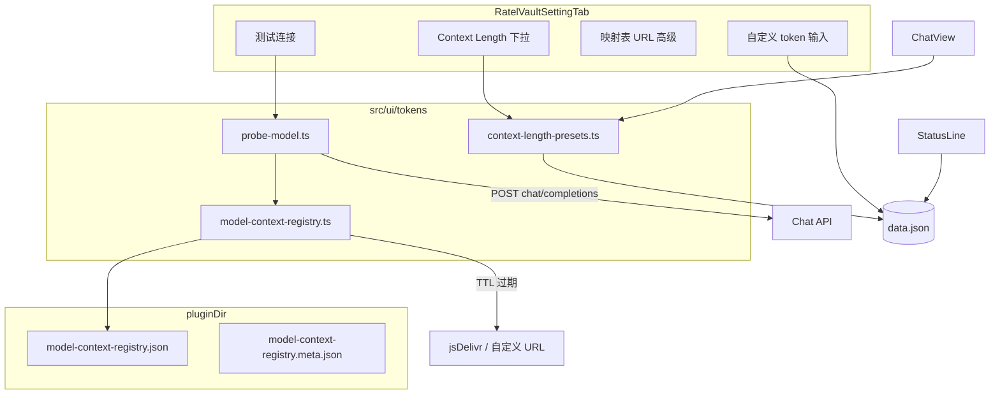

# S-CONTEXT-WINDOW — 模型 Context Window 配置(LiteLLM 映射表 + 预设下拉)

- **Spec ID:** S-CONTEXT-WINDOW
- **状态:** Active
- **创建日期:** 2026-06-28
- **作者:** Ratel Vault 团队
- **关联 ADR:** [ADR-007](../../adr/2026-06-28-model-context-window-registry.md)
- **取代:** S-MSG-STREAM §5.6(模型 context length 动态探测)、`probe-model.ts` 内置 `MODEL_CONTEXT_MAP`、`chatModelMaxTokens` 默认 `0` 产品路径

---

## 背景

StatusLine / StatusDrawer 用 `settings.chatModelMaxTokens` 展示 `used / max` 与百分比。S-MSG-STREAM 落地的「测试连接 + 内置 10 条映射表」存在三类问题(详见 ADR-007):

1. 设置面板探测传空 `apiKey`,云端 API 401
2. 文案写「自动推断」,实际并非 API 返回
3. 默认 `0` + `getEffectiveChatModelMaxTokens` 静默回退 32k,与真实模型窗口偏差大

ADR-007 已决策:**LiteLLM 公开 JSON + 预设下拉(默认 256k) + 自定义 + 可配置映射表 URL**。本 spec 将其拆解为可执行任务与接口契约。

## 目标

1. **远程映射表** — 默认从 jsDelivr 拉 LiteLLM `model_prices_and_context_window.json`,缓存到 `pluginDir`,TTL 7 天
2. **预设下拉 UI** — `128k / 200k / 256k(默认) / 1M / 自定义`;选自定义时显示数字输入
3. **测试连接重新定义** — 验 Key + 模型;成功后可**推荐** context(映射表),不声称 API 推断
4. **设置迁移** — `chatModelMaxTokens === 0` → `256k`;已有正整数映射到预设或 `custom`
5. **删除错误回退** — 移除 `0 → 32000` 静默回退;`getEffectiveChatModelMaxTokens` 直接读 settings

## 非目标

- **不**将 1.5MB 映射表 bundle 进 `main.js`
- **不**实现 Ollama `/api/show` 本地探测(P2,见 ADR-007 §5)
- **不**实现「最接近预设」模糊匹配 — 仅**精确等于**预设 token 才选预设,否则 `custom`
- **不**在 `onload` 阻塞拉取映射表
- **不**改 StatusLine「未配置」语义 — 该状态指 embedding 不可用,与 chat context 无关

---

## 架构总览



**模块职责:**

| 模块 | 职责 |
|------|------|
| `context-length-presets.ts` | 预设枚举、token 数值、双向转换、`applyRecommendation` |
| `model-context-registry.ts` | 拉取/缓存/解析 LiteLLM JSON、`lookupContextLength` |
| `probe-model.ts` | 连接测试 HTTP;组合 registry 返回推荐结果 |
| `context-window.ts` | 薄封装:返回 `chatModelMaxTokens`(可加下限校验) |
| `settings.ts` | 新字段、UI、迁移、`normalizeContextLengthSettings` |

---

## 第 1 节:设置 Schema 与迁移

### 1.1 新增 / 变更字段

```typescript
/** Context Length 预设 ID */
export type ContextLengthPresetId = '128k' | '200k' | '256k' | '1M' | 'custom';

export interface RatelVaultSettings {
  // ... 既有字段 ...

  /** 下拉选中项;custom 时以 chatModelMaxTokens 为准 */
  contextLengthPreset: ContextLengthPresetId;

  /** 模型上下文窗口上限(token) — StatusLine / context-manager 唯一数据源 */
  chatModelMaxTokens: number;

  /** 空字符串 = 使用 DEFAULT_MODEL_REGISTRY_URL */
  modelRegistryUrl: string;
}
```

### 1.2 默认值

```typescript
contextLengthPreset: '256k',
chatModelMaxTokens: 256_000,
modelRegistryUrl: '',
```

### 1.3 迁移函数 `normalizeContextLengthSettings(settings)`

在 `loadSettings()` 合并 `DEFAULT_SETTINGS` 之后调用(与 `toolPermissions` 深合并同级)。

| 输入条件 | 动作 |
|----------|------|
| 无 `contextLengthPreset` 字段(旧 data.json) | 按 `chatModelMaxTokens` 推断 preset |
| `chatModelMaxTokens === 0` 或缺失 | `256k` + `256000` |
| `chatModelMaxTokens` 等于某预设 token | 设对应 preset |
| 其他正整数 | `custom` + 保留原值 |
| `modelRegistryUrl` 缺失 | `''` |

**不**引入独立 `migrationVersion` 字段 — 与项目惯例一致(`Object.assign` + 规范化函数)。

### 1.4 预设 ↔ token 常量

`src/ui/tokens/context-length-presets.ts`:

```typescript
export const CONTEXT_LENGTH_PRESETS = {
  '128k': 128_000,
  '200k': 200_000,
  '256k': 256_000,
  '1M': 1_048_576,
} as const;

export const DEFAULT_CONTEXT_LENGTH_PRESET: ContextLengthPresetId = '256k';

export const CUSTOM_TOKEN_MIN = 4_096;
export const CUSTOM_TOKEN_MAX = 10_485_760; // 10M 上限,防误输入

export function presetToTokens(id: Exclude<ContextLengthPresetId, 'custom'>): number;
export function tokensToPreset(tokens: number): ContextLengthPresetId;
export function applyContextRecommendation(
  tokens: number,
): { preset: ContextLengthPresetId; chatModelMaxTokens: number };
```

`tokensToPreset`: 仅当 `tokens` **严格等于** `CONTEXT_LENGTH_PRESETS` 中某值时返回该预设,否则 `'custom'`。

`applyContextRecommendation(recommended)`: 封装测试连接成功后的写入逻辑。

---

## 第 2 节:LiteLLM 映射表(`model-context-registry.ts`)

### 2.1 URL 常量

```typescript
/** 人工查阅 */
export const MODEL_REGISTRY_DOC_URL =
  'https://github.com/BerriAI/litellm/blob/main/model_prices_and_context_window.json';

/** 默认拉取(CORS 友好) */
export const DEFAULT_MODEL_REGISTRY_URL =
  'https://cdn.jsdelivr.net/gh/BerriAI/litellm@main/model_prices_and_context_window.json';

/** 主 URL 失败时的 pin 版本回退(与 LiteLLM 已发布 tag 对齐,实现时 verify 200) */
export const FALLBACK_MODEL_REGISTRY_URL =
  'https://cdn.jsdelivr.net/gh/BerriAI/litellm@v1.65.4-stable/model_prices_and_context_window.json';
```

用户 `modelRegistryUrl` 非空时:**仅尝试用户 URL**,不自动 fallback 到默认(避免企业镜像场景误连公网)。

### 2.2 缓存文件

| 文件 | 内容 |
|------|------|
| `{pluginDir}/model-context-registry.json` | 解析后的 LiteLLM 对象(或原始 JSON 字符串,实现自选;推荐存原始 JSON 字符串减少内存) |
| `{pluginDir}/model-context-registry.meta.json` | `{ fetchedAt: number, sourceUrl: string, modelCount: number }` |

`.gitignore` 写入规则(复用 `ensurePluginGitignore` 或追加条目):忽略 `model-context-registry*.json`。

**TTL:** `7 * 24 * 60 * 60 * 1000` ms。未过期时 `ensureRegistry()` 直接读缓存,不发起网络请求。

### 2.3 `ModelContextRegistry` 类

```typescript
export class ModelContextRegistry {
  constructor(
    private pluginDir: string,
    private fetchFn: typeof requestUrl = requestUrl,
  ) {}

  /** 返回可用 registry;失败返回 null(不抛,调用方降级) */
  async ensureRegistry(sourceUrl: string): Promise<LiteLLMModelMap | null>;

  /** 同步查找 — 需先 ensureRegistry */
  lookupContextLength(model: string, registry: LiteLLMModelMap): number | undefined;
}
```

**拉取顺序(`ensureRegistry`):**

1. 读 meta + 缓存,未过期 → 解析返回
2. `requestUrl` GET `sourceUrl`(用户 URL 或 default)
3. 失败且用的是 default → 再试 `FALLBACK_MODEL_REGISTRY_URL`
4. JSON.parse;校验为 object;**跳过** key `sample_spec`
5. 原子写入:先 `*.tmp` 再 `rename`
6. 更新 meta

**体积防护:** 响应 `Content-Length` 或 body 超过 **3MB** 视为异常,丢弃不用。

### 2.4 查找算法 `lookupContextLength(model, registry)`

输入 `model` = `settings.chatModel`(用户填写,如 `deepseek-chat`)。

1. `key = model.trim()`;空 → `undefined`
2. 精确:`registry[key]`、`registry[key.toLowerCase()]`
3. 后缀:遍历 registry,`key.endsWith('/' + lower)` 或 `key === lower`
4. 前缀:`lower.startsWith(registryKey)` 且 registryKey 含 `/` 时取最长匹配(避免 `gpt` 误命中)
5. 读 `entry.max_input_tokens`;若缺失尝试 `entry.max_tokens`(部分旧条目);仍缺失 → `undefined`
6. 返回正整数

### 2.5 依赖注入

`main.ts` 构造 `ModelContextRegistry` 与 `OrtRuntimeAssets` 同级,挂到 `RatelVaultPlugin`:

```typescript
modelContextRegistry: ModelContextRegistry;
```

设置面板与 `probe-model` 通过 `plugin.modelContextRegistry` 访问。

---

## 第 3 节:连接测试(`probe-model.ts` 重构)

### 3.1 新签名

```typescript
export type ProbeModelResult =
  | { ok: true; recommendedTokens?: number; registryHit: boolean }
  | { ok: false; error: string };

export async function probeChatConnection(deps: {
  apiBase: string;
  apiKey: string;
  model: string;
  registry: ModelContextRegistry;
  registryUrl: string; // 已 resolve 的有效 URL
}): Promise<ProbeModelResult>;
```

**删除:** `MODEL_CONTEXT_MAP`、`lookupModelContext`、旧 `probeModelContextLength` 导出名(测试一并改名)。

### 3.2 连接测试 HTTP

与现实现一致:

- `POST {apiBase}/chat/completions`
- body: `{ model, messages: [{ role: 'user', content: 'hi' }], max_tokens: 1, stream: false }`
- `apiKey` 非空时 `Authorization: Bearer …`
- `status` 非 2xx → `{ ok: false, error: 'API 返回 …' }`

### 3.3 推荐逻辑(连接成功后)

```
registry = await deps.registry.ensureRegistry(deps.registryUrl)
recommended = registry ? lookup(model) : undefined
return { ok: true, recommendedTokens: recommended, registryHit: recommended != null }
```

**不**在 probe 内写 settings — 由 settings UI 调用 `applyContextRecommendation` 后 `saveSettings`。

---

## 第 4 节:设置面板 UI

### 4.1 Context Length 行

替换现有「自由文本 + 测试连接」块(`settings.ts` ~L237)。

```
Setting: Context Length
  Desc: 模型上下文窗口上限。测试连接可验证配置并根据公开模型库推荐数值。
  addDropdown(preset options) + addButton(测试连接)
```

**下拉 onChange:**

- 选 `128k|200k|256k|1M` → `chatModelMaxTokens = presetToTokens(id)`,`contextLengthPreset = id`,save
- 选 `custom` → 仅改 preset;若当前 tokens 恰为某预设值则保留,否则保持 `chatModelMaxTokens` 不变;显示自定义输入行

**自定义输入行(条件渲染):**

- 仅 `contextLengthPreset === 'custom'` 时 `display()` 内追加 Setting
- `parseInt`;clamp `[CUSTOM_TOKEN_MIN, CUSTOM_TOKEN_MAX]`;非法则 Notice 不保存

### 4.2 测试连接 onClick

```
1. requiresChatApiKey && !hasChatApiKey → Notice「请先在钥匙串配置 Chat API 密钥」;return
2. apiKey = resolveChatApiKey(app, settings) ?? ''
3. registryUrl = settings.modelRegistryUrl || DEFAULT_MODEL_REGISTRY_URL
4. result = await probeChatConnection({ ..., apiKey, registryUrl })
5. 失败 → Notice ✗
6. 成功:
   - 若 result.recommendedTokens → applyContextRecommendation → 写 settings → Notice「连接成功 · 已根据模型库推荐:{n} tokens」
   - 否则 → Notice「连接成功 · 请确认 Context Length 是否与模型文档一致」(不改下拉)
7. saveSettings(); display()
```

### 4.3 高级:映射表 URL

放在 Chat Model 区末尾,`Setting` + 折叠说明(或 `h3`「高级」):

- 名称:`模型映射表 URL`
- Desc: 留空使用 LiteLLM 默认源;可填企业镜像或 pin 版本地址
- Placeholder: `DEFAULT_MODEL_REGISTRY_URL`
- 按钮「恢复默认」→ `modelRegistryUrl = ''`

### 4.4 懒预热(可选,推荐)

`renderSettings` 进入 Chat 区时:

```typescript
void plugin.modelContextRegistry.ensureRegistry(
  plugin.settings.modelRegistryUrl || DEFAULT_MODEL_REGISTRY_URL,
);
```

不 await,不阻塞 UI。

---

## 第 5 节:消费方变更

### 5.1 `context-window.ts`

```typescript
export function getEffectiveChatModelMaxTokens(
  settings: Pick<RatelVaultSettings, 'chatModelMaxTokens'>,
): number {
  const n = settings.chatModelMaxTokens;
  if (n >= CUSTOM_TOKEN_MIN) return n;
  return presetToTokens(DEFAULT_CONTEXT_LENGTH_PRESET);
}
```

删除 `DEFAULT_CHAT_MODEL_MAX_TOKENS = 32_000` 及 `> 0` 分支语义。

**说明:** 迁移后正常不应出现 `< 4096`;兜底返回 256k 防脏数据。

### 5.2 `ChatView.svelte`

无需改逻辑 — 继续 `getEffectiveChatModelMaxTokens(plugin.settings)`;更新注释去掉「0 / 32K」表述。

### 5.3 `StatusLine.svelte`

**不改** — `未配置` 仍指 `embedding === 'unavailable'`,与 context length 无关。

### 5.4 文档

| 文件 | 变更 |
|------|------|
| `docs/architecture/agent/chat.md` §5.6 | 重写为 ADR-007 表述 |
| `docs/user-guide.md` | Context Length 改为下拉 + 测试连接推荐 |
| S-MSG-STREAM spec | 文首加「§5.6 已由 S-CONTEXT-WINDOW 取代」注记(可选) |

---

## 第 6 节:错误处理

| 场景 | 行为 |
|------|------|
| 映射表 CDN 超时/4xx | `ensureRegistry` 返回 null;有旧缓存则用旧缓存 |
| JSON 损坏 | 不覆盖旧缓存;log `devLogger.warn` |
| 测试连接 401 | Notice 明确 Key/模型问题 |
| 自定义 token < 4096 | 输入框 onChange 拒绝保存 + Notice |
| Obsidian 离线 | 预设/自定义仍可用;无推荐 |

---

## 第 7 节:测试计划

### 7.1 单元测试

| 文件 | 用例 |
|------|------|
| `tests/ui/tokens/context-length-presets.test.ts` | preset↔token、`applyContextRecommendation`(131072→custom) |
| `tests/ui/tokens/model-context-registry.test.ts` | lookup 精确/后缀/前缀;跳过 `sample_spec`;TTL 读缓存(mock fs) |
| `tests/ui/tokens/probe-model.test.ts` | 401 失败;成功+registry 命中;成功+未命中;apiKey 传入 header |
| `tests/settings-migration.test.ts` | `0→256k`;64000→custom;128000→128k |

### 7.2 手工验证

1. DeepSeek + 钥匙串 Key → 测试连接 → 推荐 131072 → 下拉显示「自定义」+ 输入 131072
2. 断网 → 测试连接仅验本地 Ollama(若配置)
3. 改映射表 URL 为无效 → 连接成功但不改下拉
4. StatusLine 百分比随预设切换即时变化(重开 chat 或 patch context)

---

## 第 8 节:实现任务预览(供 writing-plans)

| Task | 内容 | 依赖 |
|------|------|------|
| T1 | `context-length-presets.ts` + 测试 | — |
| T2 | `model-context-registry.ts` + 测试 | — |
| T3 | `probe-model.ts` 重构 + 测试 | T2 |
| T4 | `settings` schema / 迁移 / `main` 挂载 Registry | T1 |
| T5 | 设置面板 UI(下拉/自定义/URL/测试连接) | T1,T3,T4 |
| T6 | `context-window.ts` 简化 + ChatView 注释 | T4 |
| T7 | 文档 `chat.md` + `user-guide.md` | T5 |

预估 **7 个 Task**,可单分支 `feat/s-context-window` 交付。

---

## 参考

- [ADR-007](../../adr/2026-06-28-model-context-window-registry.md)
- [LiteLLM model_prices_and_context_window.json](https://github.com/BerriAI/litellm/blob/main/model_prices_and_context_window.json)
- `src/core/ort-runtime-assets.ts`(pluginDir 缓存先例, ADR-006)
- `src/ui/tokens/probe-model.ts`(待重构)
- S-MSG-STREAM `docs/superpowers/specs/2026-06-28-chat-message-stream-redesign-design.md` §5.6(被取代)
